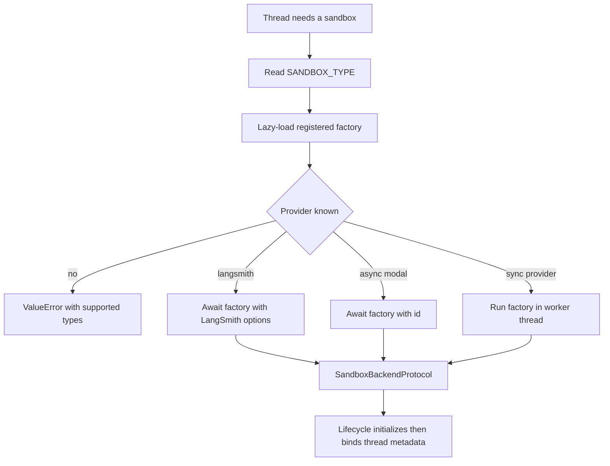

# Sandbox Provider Integration

Open SWE runs repository work through a `SandboxBackendProtocol`. Provider selection is operational configuration rather than an agent-graph change: `create_sandbox()` resolves the active provider, while the sandbox lifecycle owns the thread binding, safe reconnection, and replacement policy. See [sandbox lifecycle](../architecture/sandbox-lifecycle.md) for the broader thread lifecycle and [configuration](../operations/configuration.md) for environment variables.

## Registry and startup validation

`SANDBOX_TYPE` defaults to `langsmith`. The registry supports `langsmith`, `daytona`, `modal`, `runloop`, `e2b`, and `local`, mapping each name to a module and factory name. The selected module is imported lazily, so unselected provider SDKs are not loaded. An unrecognized value raises `ValueError` and lists the supported types.

Every factory accepts `sandbox_id: str | None`: a supplied id reconnects and an omitted id creates. `create_sandbox()` passes snapshot, CPU, memory, filesystem, and arbitrary create-body options only to LangSmith; other providers receive only the id. LangSmith and Modal factories run natively async. Synchronous provider wrappers—Daytona, E2B, Runloop, and Local—run through `asyncio.to_thread`, keeping blocking SDK or filesystem setup off the event loop.

Provider resolution and the point at which a successfully initialized backend becomes eligible for thread binding.

The FastAPI lifespan hook calls `validate_sandbox_startup_config()` before serving. Validation is currently provider-specific only for LangSmith: configured resource and TTL values must be integers, the TTLs must be non-negative, and `SANDBOX_CREATE_EXTRA_JSON` must parse as a JSON object. Other provider credentials are checked when their factory is invoked.

## Thread binding and failure semantics

`ensure_sandbox_for_thread()` first consults the in-memory backend proxy and thread metadata. It either reuses the cached backend, reconnects to the saved id, or creates one from the selected environment's ready snapshot and resource/create settings (falling back to the administrator base snapshot). It configures the bot Git identity on each use.

A missing LangSmith box is deliberately distinct from an unreachable box. `ResourceNotFoundError` becomes `SandboxGoneError`, so the lifecycle recreates the deleted box. Other reconnection failures become `SandboxUnreachableError` and normally stop the run rather than silently replacing the working tree with an empty sandbox. `allow_replacement=True` permits that trade-off for reviewer threads because their checkout is regenerated on every review run.

Initialization precedes persistence: the lifecycle updates thread metadata with `sandbox_id` only after creation, identity setup, and proxy work finish. It publishes the backend proxy last. Reset and recreate similarly require a distinct new id and retain the old binding until metadata persistence succeeds. This ordering prevents later work from adopting an incompletely initialized or unpersisted sandbox.

The provider interface intentionally has no delete operation. A sandbox can contain the agent's only working tree, and failed metadata reads can look like no sandbox; cleanup is instead a platform responsibility controlled by creation-time idle and delete-after-stop TTLs.

## Provider capabilities

| Provider | Create or reconnect behavior | Credentials and configuration | Important limitation |
|---|---|---|---|
| `langsmith` | Async client creates or gets a box, then wraps its synchronous form | Sandbox-specific LangSmith key and endpoint; snapshots, resources, TTLs, extra create fields | The only selector-level snapshot/resource provider; reset and environment snapshot capture are LangSmith-only |
| `daytona` | Gets an id or creates from a snapshot | `DAYTONA_API_KEY`; `DAYTONA_SANDBOX_SNAPSHOT` defaults to `daytonaio/sandbox:0.6.0` | Uses a synchronous SDK wrapper |
| `modal` | Reattaches by id or creates in the configured app | Modal credentials; `MODAL_APP_NAME` defaults to `open-swe` | No selector-level resource or snapshot forwarding |
| `runloop` | Retrieves an id or creates a devbox | `RUNLOOP_API_KEY` | Uses a synchronous SDK wrapper |
| `e2b` | Connects by id or creates a sandbox | `E2B_API_KEY`; optional `E2B_TEMPLATE`; one-hour timeout | Uses a synchronous SDK wrapper |
| `local` | Creates a host-backed `LocalShellBackend`; ignores ids | Optional `LOCAL_SANDBOX_ROOT_DIR`, defaulting to the current directory | No isolation; development only |

### LangSmith provisioning, resources, and create fields

Sandbox operations resolve credentials from `SANDBOX_LANGSMITH_API_KEY` and then `LANGSMITH_API_KEY`; the endpoint resolves from `SANDBOX_LANGSMITH_ENDPOINT`, then `LANGSMITH_ENDPOINT`, then `https://api.smith.langchain.com`. The integration normalizes the SDK endpoint to `/v2/sandboxes`, allowing sandbox operations to point to a distinct LangSmith workspace.

New boxes use `DEFAULT_SANDBOX_SNAPSHOT_ID` when set; when it is absent, the create request omits `snapshot_id` so the platform's root snapshot is used. Defaults are 4 vCPUs, 16 GiB memory, 128 GiB filesystem capacity, a two-hour idle TTL, and a 30-day delete-after-stop TTL. Setting either CPU or memory per call leaves the other as `None`, rather than mixing a partial override with the deployment default. Zero disables either TTL.

`SANDBOX_CREATE_EXTRA_JSON` supplies deployment-level JSON object fields, and per-environment or per-call `create_params` override conflicting fields. The implementation sends recognized SDK fields normally and wraps the SDK HTTP `POST /boxes` call to inject unsupported fields into that create request only. Normal LangSmith creation retries up to three times for retryable statuses and transient creation error classes.

Environment snapshot capture and `reset_sandbox_for_thread()` require `SANDBOX_TYPE=langsmith`. Reset creates from an unfiltered create-body object, accepts SDK-supported and injected fields, reconfigures credentials and Git identity, and atomically hands the thread to the new id only after metadata persists.

### LangSmith execution and egress credentials

`TimeoutLangSmithSandbox` adapts the synchronous LangSmith object to the async agent use case. With an effective command timeout, it starts a non-blocking command, waits for the command timeout plus `SANDBOX_EXECUTE_CLIENT_GRACE_SECONDS` (30 seconds by default), and converts the result to `ExecuteResponse`. A server `CommandTimeoutError` returns exit code 124 without a kill; expiry of the client deadline triggers a best-effort kill and returns exit code 124. WebSocket setup or supported midstream failures fall back to the base HTTP-capable `aexecute()` path. With no effective timeout, it delegates directly to that base path.

Only `SandboxRetryableConnectionError` is retried for command execution: it denotes a rejected WebSocket upgrade before the execute frame was sent, making a retry safe from double execution. Retries are capped at four attempts with jittered exponential backoff.

For LangSmith thread creation and reuse, the lifecycle mints a GitHub App installation token at runtime and configures proxy rules. The proxy injects Basic authentication for `github.com` and `*.github.com`, and Bearer authentication plus a placeholder `GH_TOKEN` for `api.github.com`; the real token is not written into the sandbox. A not-ready proxy update starts the box best-effort and retries. Proxy configuration also preserves caller-provided rules, can inject connected user LangSmith credentials for HTTPS endpoints, and can add a supported Stagehand model rule. Non-LangSmith providers skip this integration.

### Local and desktop exceptions

`local` executes directly on the host and must be used only for local development with human oversight. It creates the root directory, constructs an environment without selected model, LangSmith, and OAuth broker secrets, and uses `inherit_env=False`. Unless the operator explicitly provides `GIT_CONFIG_GLOBAL`, it writes a root-local `.gitconfig-sandbox` that includes the host configuration; this preserves aliases and helpers while preventing bot identity writes from overwriting the developer's `~/.gitconfig`.

Desktop is not a sandbox provider selection. In desktop runs, the main backend is the user project and the server composes read-only routes for bundled skills and state-backed user skills, with separate desktop artifact routes so agent scratch files do not land in the project. `ReadOnlyBackend` delegates async listing, read, grep, glob, and download operations while rejecting synchronous calls and exposes no mutation operations.

## Reviewer repository preparation

Reviewer sandboxes are reusable but their repository content is deliberately re-derived. Before the first model call, `prepare_review_repo()` clones or fetches the target repository, fetches the base and PR head (including the pull ref for fork PRs), force-checks out the expected head SHA, and verifies `HEAD`. It has a 240-second command timeout and returns `False` rather than failing the review when preparation cannot complete; the reviewer can still use fetched diff context.

When preparation succeeds, `materialize_trusted_skills()` copies `.agents/skills` and `.claude/skills` from the PR base SHA—not the PR head—into a sibling `.review-skills` directory. This prevents a PR author from injecting new reviewer instructions through a changed `SKILL.md`.

## Adding a provider

Add a provider as a registry extension:

1. Implement `agent/sandboxes/providers/<name>.py` with `create_<name>_sandbox(sandbox_id: str | None = None)`. It must reconnect when given an id, create otherwise, and return a `SandboxBackendProtocol`. A factory may be synchronous or `async def`.
2. Add `"<name>": ("agent.sandboxes.providers.<name>", "create_<name>_sandbox")` to `SANDBOX_FACTORIES` in `agent/sandboxes/providers/registry.py`.
3. Define credential validation and failure classification. In particular, do not mask a reconnect failure by returning an empty replacement: persistent working trees make unreachable and deleted states materially different.
4. Test factory creation/reconnection and registry dispatch. Decide explicitly whether provider-specific capabilities such as reset, snapshots, resource overrides, proxy credential refresh, and browser tooling are unsupported or need an equivalent implementation.

A custom backend can extend `deepagents.backends.sandbox.BaseSandbox`, whose file operations delegate to execution; the provider then supplies an `id` and shell execution implementation. Ensure the actual backend supports the async operations used by the agent lifecycle.

## Focused verification

`tests/sandbox/test_langsmith_sandbox_config.py` exercises endpoint and create-body behavior, default-root snapshot omission, validation, retry, and missing-box classification. `test_langsmith_sandbox_timeout.py` covers deadline, kill, server timeout, response conversion, fallback, and retry behavior. Provider-focused tests cover Daytona and E2B defaults plus Local root, environment, and Git-config isolation. Lifecycle tests cover safe recovery, reset/recreate handoff ordering, and reviewer replacement policy.
