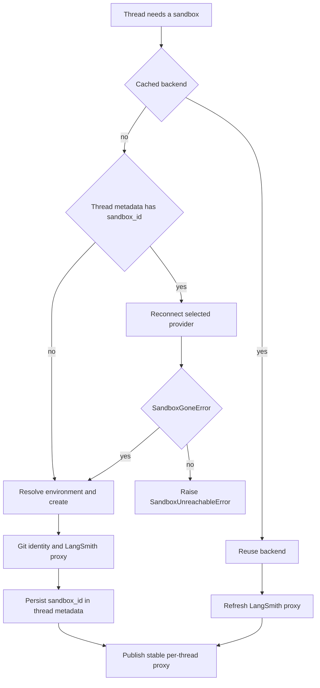

# Sandbox Provider Integrations

Open SWE runs repository work through a `SandboxBackendProtocol` implementation. The registered backend is selected at runtime rather than by changing the agent graph: `SANDBOX_TYPE` defaults to `langsmith`, and the registry also supports `daytona`, `modal`, `runloop`, `e2b`, and `local`. This page focuses on the provider boundary; see [sandbox lifecycle](../architecture/sandbox-lifecycle.md) for the broader thread lifecycle and [auth and security](../concepts/auth-and-security.md) for credential ownership.

## Selection and provider contract

`create_sandbox()` resolves a `(module, factory)` pair from `SANDBOX_FACTORIES` and imports that module only when selected. Consequently, a deployment need not import the SDK dependencies of unselected providers. An invalid type raises `ValueError` listing the supported names.

Each factory accepts an optional `sandbox_id`. Built-in remote providers interpret an id as reconnecting to the existing resource and no id as creation; Local accepts but ignores it. Factories return an object compatible with `SandboxBackendProtocol`. The selector awaits native async factories—currently LangSmith and Modal—and calls synchronous factories in `asyncio.to_thread`; that prevents synchronous SDK binding or Local filesystem setup from blocking the event loop.

Only the LangSmith factory receives selector-level `snapshot_id`, `mem_bytes`, `vcpus`, `fs_capacity_bytes`, and `create_params`; `None` values are omitted. The other factories are called with the id alone. Thus environment resource settings and dashboard environment creation parameters are LangSmith-specific capabilities, not portable provider options.

Thread-level acquisition distinguishes a deleted sandbox from an unreachable one, and publishes the backend only after initialization and binding succeed.

## Thread binding, recovery, and persistence

`ensure_sandbox_for_thread()` first uses the process-local per-thread backend proxy, then falls back to `sandbox_id` in LangGraph thread metadata, and creates a sandbox if neither exists. Creation resolves a dashboard environment: its ready snapshot and resource/create parameters take precedence where available, otherwise the admin base snapshot is used. After new creation or replacement, the lifecycle persists the new `sandbox_id`; it publishes or replaces the stable `SandboxBackendProxy` only after setup and metadata update complete. Existing holders of that proxy therefore see a replacement without receiving a new handle.

A `SandboxGoneError` means LangSmith reported `ResourceNotFoundError`: the old sandbox has been deleted and has no working tree, so the lifecycle automatically creates and binds a replacement. Other connection or proxy-refresh failures become `SandboxUnreachableError` and fail a coding-agent run by default. Replacing an unreachable coding sandbox would silently substitute an empty filesystem for potentially uncommitted work. Callers may set `allow_replacement=True` only when the checkout is re-derivable; the reviewer does this.

The generic provider interface deliberately exposes no sandbox deletion. Platform retention controls at LangSmith creation time handle reclamation, avoiding application-side deletion based on metadata that can fail open. Reused and new sandboxes receive the Open SWE git identity. For LangSmith, proxy credentials are also refreshed on reuse; failure to refresh is treated as unreachable.

At FastAPI startup, `validate_sandbox_startup_config()` runs from the lifespan hook. It validates only an active LangSmith configuration; the other providers validate required credentials when their factory runs. LangSmith validates configured integer resource and lifetime values, requires non-negative TTLs, and parses `SANDBOX_CREATE_EXTRA_JSON`; an unset default snapshot is valid because LangSmith can use its root snapshot.

## Provider comparison

| `SANDBOX_TYPE` | Create | Reconnect | Required configuration | Provider-specific constraints |
|---|---|---|---|---|
| `langsmith` (default) | Async API create from a configured snapshot or root snapshot | Gets the named sandbox; a missing resource becomes `SandboxGoneError` | A sandbox API key | Supports snapshot/resources, retention TTLs, arbitrary create fields, GitHub proxy, and reset |
| `daytona` | Creates from a Daytona snapshot | `daytona.get(id)` | `DAYTONA_API_KEY` | `DAYTONA_SANDBOX_SNAPSHOT` defaults to `daytonaio/sandbox:0.6.0` and cannot be blank |
| `modal` | Looks up an app and creates a sandbox | `modal.Sandbox.from_id.aio(id)` | Modal SDK credentials | `MODAL_APP_NAME` is read at module import and defaults to `open-swe` |
| `runloop` | Creates a devbox | Retrieves a devbox | `RUNLOOP_API_KEY` | No Open SWE provider-specific creation options |
| `e2b` | Creates an E2B sandbox, optionally from a template | `Sandbox.connect(id)` | `E2B_API_KEY` | `E2B_TEMPLATE`, when set, cannot be blank; the factory uses a one-hour timeout |
| `local` | Creates a host-backed `LocalShellBackend` | Not applicable; id is ignored | None | No isolation; development with human oversight only |

### LangSmith configuration and creation

Sandbox credentials are resolved separately from tracing credentials: `SANDBOX_LANGSMITH_API_KEY` takes precedence, then `LANGSMITH_API_KEY`, then `LANGSMITH_API_KEY_PROD`. `SANDBOX_LANGSMITH_ENDPOINT` similarly takes precedence over `LANGSMITH_ENDPOINT`, with `https://api.smith.langchain.com` as the default. The SDK endpoint is normalized to include `/v2/sandboxes`, allowing sandbox work to target a different LangSmith workspace.

The normal factory reads `DEFAULT_SANDBOX_SNAPSHOT_ID`, with defaults of 4 vCPUs, 16 GiB memory, 128 GiB filesystem capacity, a two-hour idle TTL, and a 30-day delete-after-stop period. `DEFAULT_SANDBOX_IDLE_TTL_SECONDS=0` and `DEFAULT_SANDBOX_DELETE_AFTER_STOP_SECONDS=0` disable those retention limits. If neither a supplied nor default snapshot is present, creation omits `snapshot_id` so the API chooses its root snapshot. A partial vCPU or memory override intentionally leaves the other resource value unset instead of combining it with a default.

`SANDBOX_CREATE_EXTRA_JSON` must be a JSON object. It is merged with per-call `create_params`, which win on conflicts. Public SDK create keys are passed directly; unsupported extra fields are injected only into the SDK client's `POST .../boxes` payload. Standard creation retries up to three attempts for selected retryable HTTP statuses and transient SDK error classes, using delays of one and three seconds.

`AsyncSandboxClient` provisions or reconnects asynchronously; the returned sandbox is converted with `to_sync()` and wrapped in `TimeoutLangSmithSandbox`, which provides the backend API used by agent tools. The separate `create_langsmith_sandbox_from_params()` path accepts an unfiltered create-body object and is used by the LangSmith-only reset flow. Reset creates a distinct sandbox, configures its proxy and identity, then rebinds the thread; attempting reset with another provider is rejected.

### LangSmith execution and proxy credentials

`TimeoutLangSmithSandbox` is async-only: `execute()` raises `NotImplementedError`, while `aexecute()` runs commands. With a nonzero effective timeout it starts a non-blocking WebSocket command and waits for its result for the command timeout plus `SANDBOX_EXECUTE_CLIENT_GRACE_SECONDS` (30 seconds by default). A normal result becomes `ExecuteResponse`; a server-side `CommandTimeoutError` returns exit code 124 without a kill; a client deadline attempts a best-effort kill and returns exit 124. WebSocket setup or supported stream failures fall back to the base `LangSmithSandbox.aexecute()` path. Commands are retried only for `SandboxRetryableConnectionError`, which the SDK defines as a rejected WebSocket upgrade before the command starts; retry is bounded to four attempts with jittered exponential backoff.

The lifecycle obtains a GitHub App installation token at runtime when creating or reusing a LangSmith sandbox. `_configure_github_proxy()` preserves user-supplied base rules but replaces managed rules, injecting Basic authentication for `github.com` and `*.github.com`, and Bearer authentication plus a placeholder `GH_TOKEN` for `api.github.com`. Git and `gh` can authenticate without the real GitHub token being written to the sandbox. It can also inject a connected user's LangSmith API key and endpoint through a validated HTTPS proxy rule, and conditionally injects Stagehand model credentials for supported model providers. A proxy update rejected because the sandbox is not ready triggers a best-effort start before retrying. Non-LangSmith providers receive neither this proxy setup nor proxy refresh.

### Local safety boundary

`local` runs commands on the host at `LOCAL_SANDBOX_ROOT_DIR`, or the current working directory, creating that directory if necessary. It constructs the command environment with `inherit_env=False` after excluding model-provider, LangSmith, and Open SWE OAuth broker secrets. Unless `GIT_CONFIG_GLOBAL` is already supplied, it points global git configuration at `<root>/.gitconfig-sandbox`; that file includes the host configuration when present, preserving credential helpers and aliases while preventing bot identity writes from overwriting the developer's `~/.gitconfig`. This reduces accidental credential exposure and configuration damage, but it is not sandboxing.

## Adding a provider

A provider extension is a registry change plus a backend implementation:

1. Add `agent/sandboxes/providers/<name>.py` with `create_<name>_sandbox(sandbox_id: str | None = None)`. Reconnect when the id is present and create otherwise; return a `SandboxBackendProtocol`. The factory may be synchronous or async.
2. Add `"<name>": ("agent.sandboxes.providers.<name>", "create_<name>_sandbox")` to `SANDBOX_FACTORIES` in `agent/sandboxes/providers/registry.py`.

Extending `deepagents.backends.sandbox.BaseSandbox`, as the stable per-thread proxy does, is a practical implementation route for custom backends. Before registering, decide and test the semantics of a missing versus unreachable resource, blocking SDK calls, and secret delivery. Do not assume LangSmith-only resource arguments, reset support, root-snapshot fallback, or proxy-based GitHub authentication apply to the new provider.

## Focused verification

- `tests/sandbox/test_langsmith_sandbox_config.py` covers endpoint normalization, defaults, root-snapshot omission, create-field injection, retry behavior, configuration validation, and missing-sandbox classification.
- `tests/sandbox/test_langsmith_sandbox_timeout.py` and `tests/sandbox/test_sandbox_retry.py` cover deadlines, kill behavior, WebSocket fallback, and the safe pre-start retry boundary.
- `tests/sandbox/test_sandbox_recovery.py`, `test_reviewer_sandbox_recovery.py`, and `test_sandbox_publish_ordering.py` exercise the no-unsafe-replacement rule, reviewer opt-in replacement, metadata rebinding, and publish-last invariant.
- `tests/sandbox/test_daytona_integration.py`, `test_e2b_integration.py`, and `test_local_integration.py` exercise provider validation and Local root, secret-filtering, and git-config behavior.
