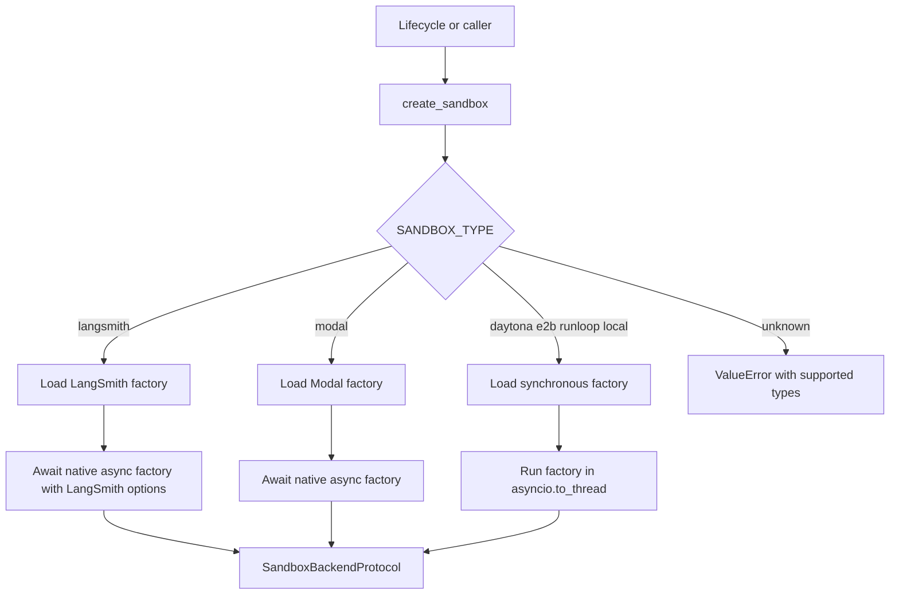

# Sandbox provider abstraction

Open SWE gives the agent a `SandboxBackendProtocol`: a stable `id`, shell execution, and file operations. The provider registry creates that backend; the thread lifecycle owns binding its id to thread metadata, applying bot Git identity, and deciding whether a failed reconnect is safe to replace. The working tree is in the sandbox, so provider failures are treated as possible data-loss events rather than an opportunity to silently substitute an empty machine. For the state and rebind lifecycle, see [sandbox lifecycle](../architecture/sandbox-lifecycle.md); for deployment variables, see [configuration](../operations/configuration.md).

## Selection and async boundary

`create_sandbox()` in `agent/sandboxes/providers/registry.py` reads `ENV.SANDBOX_TYPE`, whose default is `langsmith`. `SANDBOX_FACTORIES` maps the supported names—`langsmith`, `daytona`, `modal`, `runloop`, `e2b`, and `local`—to module and factory names. The selected module is imported only when used, which avoids loading another provider's SDK. An unknown type raises `ValueError` with the supported values.

Provider selection preserves an async common interface while adapting synchronous SDK-backed implementations off the event loop.

All factories accept `sandbox_id: str | None`: an id reconnects and no id creates. The registry forwards `snapshot_id`, `mem_bytes`, `vcpus`, `fs_capacity_bytes`, and `create_params`, after dropping `None` values, **only** to LangSmith. LangSmith is explicitly awaited; Modal is detected as a coroutine function and awaited; Daytona, E2B, Runloop, and Local run through `asyncio.to_thread`. This is an important extension constraint: a provider factory may be synchronous or `async def`, but must preserve the awaitable behavior of the common `create_sandbox()` entrypoint.

FastAPI calls `validate_sandbox_startup_config()` during its lifespan startup. The registry currently delegates validation only when LangSmith is active; credentials for the other providers therefore fail when their factory is first invoked.

## Thread ownership, reconnecting, and replacement

`ensure_sandbox_for_thread()` first uses an in-memory backend when available, otherwise reads `sandbox_id` from thread metadata and reconnects through the registry. A newly created sandbox is initialized with git identity and, for LangSmith, proxy credentials before the lifecycle stores its id in metadata and publishes it to the in-memory proxy. Publishing last prevents the rest of a run from observing a backend whose initialization failed.

A deleted LangSmith box is distinguishable from an unreachable one: `ResourceNotFoundError` becomes `SandboxGoneError`, while other reconnect failures are reported as `SandboxUnreachableError`. A gone sandbox is recreated because it has no remaining working tree. An unreachable sandbox is not replaced by default, because the replacement is empty and could discard uncommitted work; callers can opt in with `allow_replacement` only where the checkout is re-derivable. Reset is LangSmith-only and binds a distinct freshly created sandbox; recreation preserves the previous sandbox while rebinding the thread.

The abstract `SandboxProvider` intentionally has no delete operation. The application must not infer that it can delete a box merely because metadata is missing: the sandbox can contain the only copy of the agent's work. LangSmith platform reclamation is instead configured at create time with idle and delete-after-stop TTLs.

## Built-in providers

| `SANDBOX_TYPE` | Create or reconnect behavior | Required configuration | Capabilities and limits |
|---|---|---|---|
| `langsmith` (default) | Native async create or lookup, then wraps the SDK backend | A sandbox or standard LangSmith API key | Snapshot and resource controls, create-body extensions, platform TTLs, GitHub proxy, reset, and environment snapshots are LangSmith-specific. |
| `daytona` | Gets an id or creates from a snapshot | `DAYTONA_API_KEY` | Uses `DAYTONA_SANDBOX_SNAPSHOT`; selector-level resource options are ignored. |
| `modal` | Native async reattach or create in an app | Modal SDK credentials | App is selected by `MODAL_APP_NAME`; no LangSmith proxy or reset. |
| `runloop` | Retrieves an id or creates a devbox | `RUNLOOP_API_KEY` | Synchronous SDK wrapper, so creation is thread-wrapped. |
| `e2b` | Connects by id or creates a sandbox | `E2B_API_KEY` | Optional `E2B_TEMPLATE`; a one-hour timeout is supplied for connect and create. |
| `local` | Creates a host shell backend and ignores the id | None | No isolation; development only. It must never be treated as a persistent remote sandbox. |

### LangSmith: snapshots, provisioning, and execution

Sandbox operations resolve credentials from `SANDBOX_LANGSMITH_API_KEY`, falling back to `LANGSMITH_API_KEY` (which also recognizes `LANGSMITH_API_KEY_PROD`). The endpoint resolves from `SANDBOX_LANGSMITH_ENDPOINT`, then `LANGSMITH_ENDPOINT`, and is normalized to the `/v2/sandboxes` SDK base. This permits sandbox operations to use a different LangSmith workspace from tracing; snapshots must exist in that sandbox workspace.

A normal create uses `DEFAULT_SANDBOX_SNAPSHOT_ID` if supplied; otherwise it deliberately omits `snapshot_id` so the LangSmith API boots its root snapshot. Defaults are 4 vCPUs, 16 GiB memory, 128 GiB filesystem capacity, a two-hour idle TTL, and a 30-day delete-after-stop TTL. The `DEFAULT_SANDBOX_*` variables override these values and zero disables either TTL. When either CPU or memory is passed per call, the other is left unset rather than combining one override with a default.

`SANDBOX_CREATE_EXTRA_JSON` must be a JSON object. Its fields are merged before per-call `create_params`, so per-call values win. Recognized SDK create fields are passed normally; unrecognized fields are injected by wrapping the SDK client's `POST .../boxes` payload. LangSmith create retries transient SDK failures and retryable HTTP statuses at most three times with configured delays. Startup validation checks integer resource/TTL values, rejects negative TTLs, and parses the extra JSON early.

Provisioning uses `AsyncSandboxClient`; the resulting async SDK sandbox is converted by `to_sync()` and wrapped in `TimeoutLangSmithSandbox`. The wrapper remains async at the agent boundary: `execute()` raises `NotImplementedError` and callers use `aexecute()`.

For a nonzero effective command timeout, `TimeoutLangSmithSandbox` starts a non-blocking WebSocket command and waits for its result for the command timeout plus `SANDBOX_EXECUTE_CLIENT_GRACE_SECONDS` (30 seconds by default). A normal result combines stdout and stderr and retains the exit code. A server `CommandTimeoutError` returns exit code 124 without a kill; a client deadline attempts a best-effort kill and also returns 124. WebSocket setup failures and supported stream failures fall back to the base `LangSmithSandbox.aexecute()` path, which provides HTTP execution. Only `SandboxRetryableConnectionError` is retried, up to four attempts with jittered exponential backoff: it denotes a rejected WebSocket upgrade before the command was sent, so retrying cannot double-run work.

### LangSmith proxy authentication

The thread lifecycle configures proxy credentials only for `SANDBOX_TYPE=langsmith`, both after fresh creation and when a reused sandbox is refreshed. It obtains a GitHub App installation token at runtime, configures the proxy, and records expiry metadata; it does not rely on a deployment GitHub access token. The proxy injects Basic authentication for `github.com` and `*.github.com` git traffic, and Bearer authentication for `api.github.com`; `GH_TOKEN` is merely a placeholder required by `gh`, so the real token is not written into the sandbox filesystem.

A supplied `proxy_config` is preserved except for Open SWE-managed rules, which are regenerated. When a user has connected LangSmith credentials, an additional validated HTTPS LangSmith rule injects that API key and exports a placeholder key plus normalized endpoint. Optional Stagehand model rules are added only for supported providers with a configured key. If a proxy update is rejected because the sandbox is not ready, Open SWE starts it best-effort and retries the update. None of Daytona, Modal, Runloop, E2B, or Local implements this proxy behavior.

### Other provider details

- **Daytona:** `DAYTONA_API_KEY` is required. New sandboxes use the value of `DAYTONA_SANDBOX_SNAPSHOT` to build `CreateSandboxFromSnapshotParams`.
- **Modal:** reconnects with `modal.Sandbox.from_id.aio()`; a new sandbox is created in the app looked up from `MODAL_APP_NAME`.
- **Runloop:** creates a `Client` with the bearer key, then calls `devboxes.retrieve()` or `devboxes.create()` and adapts it as `RunloopSandbox`.
- **E2B:** uses `Sandbox.connect()` for an id and `Sandbox.create()` otherwise. A nonempty `E2B_TEMPLATE` selects the template; empty values are treated as unset by the environment registry.
- **Local:** roots `LocalShellBackend` at `LOCAL_SANDBOX_ROOT_DIR` or the current directory and creates that directory if needed. It passes a constructed environment with `inherit_env=False`, excluding listed model, LangSmith, and OAuth broker credentials. Unless `GIT_CONFIG_GLOBAL` is already configured, global git writes go to `<root>/.gitconfig-sandbox`, which includes the host config so bot identity updates do not overwrite the developer's `~/.gitconfig`.

## Adding a provider safely

A provider is a deliberate registry extension:

1. Implement `agent/sandboxes/providers/<name>.py` with `create_<name>_sandbox(sandbox_id: str | None = None)`. Reconnect when supplied an id and create otherwise; return `SandboxBackendProtocol`.
2. Add `"<name>": ("agent.sandboxes.providers.<name>", "create_<name>_sandbox")` to `SANDBOX_FACTORIES` in `agent/sandboxes/providers/registry.py`.
3. Keep the interface async-compatible: an `async def` factory is awaited natively; a synchronous factory will run in `asyncio.to_thread`. Do not block the event loop from an async implementation.

Account for the lifecycle contract before registration: reconnect failures must not be converted to an empty replacement; only LangSmith receives selector-level snapshot/resources/create parameters and participates in proxy, reset, and snapshot features.

## Focused verification

The high-value tests are `tests/sandbox/test_langsmith_sandbox_config.py` for endpoint normalization, root-snapshot behavior, create-body injection, retry, deleted-box classification, and no-delete policy; `tests/sandbox/test_langsmith_sandbox_timeout.py` for deadline, kill, server-timeout, fallback, and retry behavior; and the lifecycle recovery, recreation, reset, and publish-ordering tests in `tests/sandbox/` for safe thread binding and replacement decisions.
