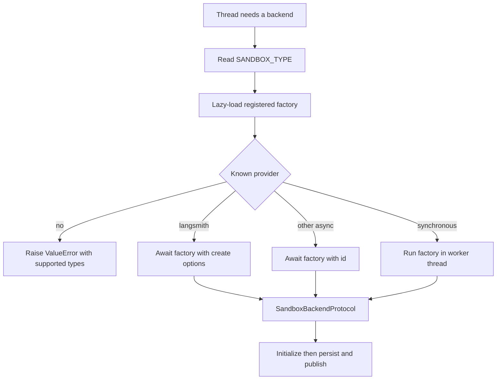
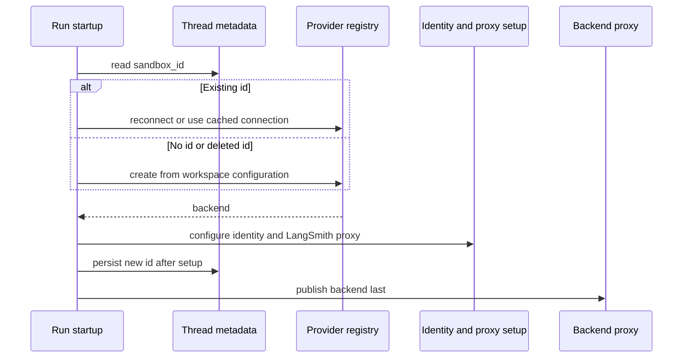

# Sandbox Provider Integration Contract

Open SWE accesses isolated execution through `SandboxBackendProtocol`. The provider registry chooses and constructs a backend, while the lifecycle binds that backend to a thread and preserves its working-tree safety guarantees. A provider switch is configuration, not an agent-graph change. For the broader thread lifecycle, see [Sandbox lifecycle](../architecture/sandbox-lifecycle.md); for deployment settings, see [Configuration](../operations/configuration.md).

## Selection, dispatch, and startup checks

`SANDBOX_TYPE` defaults to `langsmith`. The registry recognizes `langsmith`, `daytona`, `modal`, `runloop`, `e2b`, and `local`, and maps each selector to a module and factory name. It imports only the chosen module at call time, avoiding imports of unselected SDKs; an invalid selector raises `ValueError` with the supported values.

All factories accept `sandbox_id: str | None`: an id means reconnect, while `None` means create. `create_sandbox()` forwards `snapshot_id`, VM sizing, and `create_params` only for LangSmith. Native async factories are awaited; synchronous factories run in `asyncio.to_thread`, so blocking SDK setup and local filesystem setup do not block the event loop.

Provider selection and the safe point at which the lifecycle may bind a backend to a thread.

The FastAPI lifespan invokes `validate_sandbox_startup_config()` before it starts serving. This startup validation currently has LangSmith-specific checks only: configured resource and TTL values must be integers, TTLs cannot be negative, and `SANDBOX_CREATE_EXTRA_JSON` must be a JSON object. Other provider credentials are validated when their factory is called.

## Thread binding is deliberately conservative

`ensure_sandbox_for_thread()` reads thread metadata, then either reuses an in-process connection, reconnects to the stored id, or creates a new backend from the resolved workspace configuration. It reapplies the bot Git identity on creation and reuse. A new backend is initialized first, its id and any base proxy configuration are persisted to thread metadata second, and it is published to the in-memory proxy last. Therefore a failure during setup or metadata persistence does not leave later callers with a usable-looking, half-initialized backend.

The ordering used for a newly created or replacement backend; reconnect failures do not silently create a replacement unless the caller opts in.

The lifecycle distinguishes a deleted LangSmith sandbox from one that cannot be reached. LangSmith maps `ResourceNotFoundError` during reconnect to `SandboxGoneError`; the lifecycle recreates it because the deleted sandbox has no remaining working tree. Other reconnect and proxy-refresh failures become `SandboxUnreachableError` and normally stop the run rather than silently replacing potentially uncommitted work with an empty filesystem. Callers may request `allow_replacement=True` when their contents are re-derivable; reviewer runs do so because review preparation re-creates the checkout.

Providers deliberately have no delete operation. Thread metadata reads can fail open as “no sandbox,” and a sandbox may contain the only copy of uncommitted work. LangSmith reclamation is instead configured at creation time through idle-stop and delete-after-stop TTLs; workspace builders are stopped after capture and reclaimed by that platform policy.

## Provider capability matrix

| Provider | Reconnect or creation behavior | Required or relevant configuration | Operational boundary |
|---|---|---|---|
| `langsmith` | Async get-by-id or create, returned as `TimeoutLangSmithSandbox` | `LANGSMITH_API_KEY`; optional `LANGSMITH_ENDPOINT`; snapshots, resources, TTLs, and create fields | The only provider that receives registry-level snapshot/resource/create options and implements workspace snapshot capture and managed proxy rules. |
| `daytona` | Gets the supplied id or creates from a Daytona snapshot | `DAYTONA_API_KEY`; `DAYTONA_SANDBOX_SNAPSHOT` defaults to `daytonaio/sandbox:0.6.0` | Synchronous SDK wrapper. |
| `modal` | Attaches by id or creates in a looked-up Modal app | Modal credentials; `MODAL_APP_NAME` defaults to `open-swe` | Async factory; no registry-level snapshot or sizing forwarding. |
| `runloop` | Retrieves an existing devbox or creates one | `RUNLOOP_API_KEY` | Synchronous SDK wrapper. |
| `e2b` | Connects by id or creates a sandbox, optionally from a template | `E2B_API_KEY`; optional `E2B_TEMPLATE` | Uses a one-hour timeout and a synchronous SDK wrapper. |
| `local` | Creates `LocalShellBackend`; accepts but ignores ids | optional `LOCAL_SANDBOX_ROOT_DIR` | Runs directly on the host and is only for supervised local development. |

## LangSmith provisioning and execution

LangSmith sandbox operations use the deployment-wide `LANGSMITH_API_KEY` and `LANGSMITH_ENDPOINT`; the retired `SANDBOX_LANGSMITH_API_KEY` and `SANDBOX_LANGSMITH_ENDPOINT` overrides do not select a separate sandbox workspace. The provider normalizes the SDK endpoint to `/v2/sandboxes`, whether or not that suffix was supplied in `LANGSMITH_ENDPOINT`.

For new sandboxes, an absent `snapshot_id` is deliberately omitted from the create body so the platform selects its root snapshot; an empty `snapshot_id` would be rejected. Defaults are 4 vCPUs, 16 GiB memory, 128 GiB filesystem capacity, a two-hour idle TTL, and a 30-day delete-after-stop TTL. The `DEFAULT_SANDBOX_*` environment variables override those values; setting either CPU or memory as a call-specific override leaves the other unset rather than combining it with the deployment default. A zero TTL disables that TTL.

`SANDBOX_CREATE_EXTRA_JSON` supplies deployment-wide create fields. Workspace or call-specific `create_params` override conflicting fields. Since the SDK lacks arbitrary create-field passthrough, the provider temporarily wraps its HTTP client to inject those fields only into `POST /boxes`, not subsequent requests. Normal creation makes at most three attempts for selected retryable statuses and transient create errors.

`TimeoutLangSmithSandbox` gives command execution a client-side deadline around the LangSmith nonblocking command handle. On a server-side command timeout it returns an exit-124 response; on client-deadline expiry it best-effort kills the command and returns exit 124. WebSocket setup and supported stream failures fall back to the base execution path. Retrying is narrower still: only `SandboxRetryableConnectionError`—a rejected WebSocket upgrade before the execution frame was sent—is retried, at most four times with jittered exponential backoff, to avoid double-running commands.

### GitHub proxy authentication

For LangSmith only, creation and reuse mint a GitHub App installation token at runtime and configure the sandbox proxy rather than storing that real token in the sandbox. The proxy supplies Basic authentication for `github.com` and `*.github.com`, Bearer authentication for `api.github.com`, and a non-secret placeholder `GH_TOKEN` for the GitHub CLI. Existing custom proxy rules are preserved except retired managed rules. If a proxy update is rejected because a sandbox is not ready, the provider starts it best-effort and retries the update.

## Workspace snapshot configuration

A `SandboxCreateConfig` resolves the selected workspace before a new backend is booted. It carries the workspace’s `ready_snapshot_id`, positive resource overrides, and validated create parameters; without a workspace or ready snapshot, creation falls back to the provider base/root snapshot. During a capture, the prior ready snapshot remains usable until the replacement capture succeeds, so runs started during refresh do not fall back to a bare image.

Workspace refresh is a LangSmith capability. A full refresh creates a throwaway builder from the workspace base snapshot, runs `setup_script` and then `update_script`, and captures only if every script succeeds. An update refresh starts from the current workspace snapshot and runs only the update script. Captures publish a tagged snapshot; run creation uses the immutable recorded snapshot id, so a refresh cannot change a running or reconnecting thread’s image. Failed refreshes retain the previous snapshot. After a successful or failed attempt, the builder is stopped rather than deleted.

When a workspace snapshot is stale, a newly created run sandbox executes its update script before the first model call. The same creation also triggers a background snapshot update best-effort, so later creations can boot from a fresh capture. An update-script failure is logged but does not fail the run because the existing snapshot is still usable.

## Local-provider safety

The Local provider creates its root if needed and uses `inherit_env=False` with an explicit environment that excludes selected model, LangSmith, and OAuth broker secrets. Unless `GIT_CONFIG_GLOBAL` is explicitly configured, it writes a root-local `.gitconfig-sandbox` that includes the host configuration. This keeps host credential helpers and aliases available while preventing lifecycle Git identity writes from overwriting the developer’s `~/.gitconfig`. It does not provide isolation: commands run on the host.

## Adding or changing a provider

A provider is an integration boundary, not just a new registry string:

1. Implement `agent/sandboxes/providers/<name>.py` with `create_<name>_sandbox(sandbox_id: str | None = None)`. Given an id, reconnect; otherwise create a new backend. Return a `SandboxBackendProtocol`. The factory may be synchronous or asynchronous.
2. Add `"<name>": ("agent.sandboxes.providers.<name>", "create_<name>_sandbox")` to `SANDBOX_FACTORIES`. The dispatch code handles async factories and offloads synchronous ones.
3. Make credential failures explicit and preserve the deleted-versus-unreachable distinction. Do not convert a failed reconnect into an empty replacement unless the caller has a sound content-recovery policy.
4. Declare capability gaps. Registry create options, workspace capture/refresh, reset/recreation semantics, managed proxy refresh, and timeout/retry behavior are LangSmith-specific today; a new provider must either implement an equivalent safely or remain unsupported for that path.
5. Add focused tests for factory creation and reconnection, dispatch mode, credentials, and any provider-specific isolation or persistence property. Changes to lifecycle ordering, proxy credential handling, or LangSmith request shaping require regression tests because they protect working trees and secrets.

A custom backend can extend `deepagents.backends.sandbox.BaseSandbox`, which provides file operations through command execution. It must still expose a stable backend `id` and implement the asynchronous operations used by the lifecycle and agent tools.

## Focused verification

`tests/sandbox/test_langsmith_sandbox_config.py` covers endpoint normalization, root-snapshot omission, defaults and overrides, startup validation, extra create fields, creation retry, and the no-delete invariant. `tests/sandbox/test_langsmith_sandbox_timeout.py` and `tests/sandbox/test_sandbox_retry.py` cover deadline, kill, fallback, and safe retry behavior. Lifecycle recovery and publish-ordering tests cover replacement policy and the persist-before-publish invariant; `tests/sandbox/test_proxy_auth.py` checks proxy payload and secret handling. Daytona, E2B, and Local tests exercise provider-specific defaults and Local environment/Git isolation.
