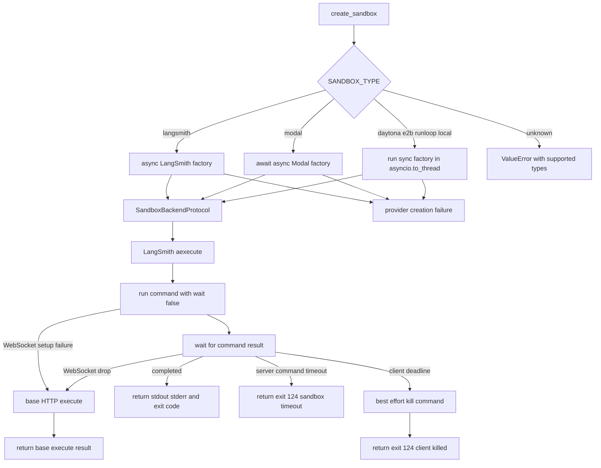

# Sandbox Provider Integrations

Open SWE executes an agent's repository work in a backend implementing `SandboxBackendProtocol`. The backend supplies shell execution, file operations, and a stable `id`; the working tree lives in that sandbox. Provider choice is runtime configuration, not a graph change. For thread binding, recovery, and platform reclamation, see [sandbox lifecycle](../architecture/sandbox-lifecycle.md). For the broader environment-variable reference, see [configuration](../operations/configuration.md).

## Selection, creation, and reconnecting

`agent/utils/sandbox.py:create_sandbox()` reads `SANDBOX_TYPE`, defaulting to `langsmith`, and resolves it through the lazily imported `SANDBOX_FACTORIES` registry. The supported names are `langsmith`, `daytona`, `modal`, `runloop`, `e2b`, and `local`. An unsupported name raises `ValueError` and includes the supported names. Lazy loading means a deployment imports only the selected provider module and its SDK dependencies.

Every built-in factory accepts an optional `sandbox_id`: an id means reconnect; no id means create. Provider-level connection or creation errors propagate rather than being silently converted to a different provider or an empty replacement.

Provider selection and the LangSmith execution result paths; creation failures, WebSocket fallback, server timeout, and client deadline are distinct outcomes.

`create_sandbox()` forwards `snapshot_id`, `mem_bytes`, `vcpus`, `fs_capacity_bytes`, and `create_params` only to LangSmith, omitting values that are `None`. LangSmith and Modal are awaited directly; Daytona, E2B, Runloop, and Local use `asyncio.to_thread` because their wrappers or setup work are synchronous.

At FastAPI startup, the lifespan hook calls `validate_sandbox_startup_config()`. It delegates validation only for the active `langsmith` provider; other provider credentials are checked when their factory is used. LangSmith validation warns—not fails—when no default snapshot is configured, validates configured integer resource values and non-negative TTLs, and parses `SANDBOX_CREATE_EXTRA_JSON` early.

### Missing is different from unreachable

A LangSmith reconnect maps `ResourceNotFoundError` to `SandboxGoneError`. That means the persisted id identifies a deleted sandbox and its working tree is gone; other reconnect errors remain ordinary runtime failures. This distinction lets lifecycle code decide whether recreation is safe rather than treating every failed connection as data loss.

The provider abstraction intentionally has no delete operation. Since a sandbox may contain the only working copy and metadata reads can fail open to no sandbox, application-side deletion could destroy live work. The platform reclaims boxes using the idle TTL and delete-after-stop settings applied at creation.

## Provider reference

| `SANDBOX_TYPE` | Factory behavior | Required configuration | Selected options |
|---|---|---|---|
| `langsmith` (default) | Async create or reconnect, then adapt to the agent backend | `LANGSMITH_API_KEY` or `LANGSMITH_API_KEY_PROD` unless `SANDBOX_LANGSMITH_API_KEY` is set | Snapshot, resources, lifetime, create-body fields, proxy |
| `daytona` | Get by id or create from snapshot | `DAYTONA_API_KEY` | `DAYTONA_SANDBOX_SNAPSHOT` |
| `modal` | Reattach by id or create in an app | Modal SDK credentials | `MODAL_APP_NAME` |
| `runloop` | Retrieve or create a devbox | `RUNLOOP_API_KEY` | — |
| `e2b` | Connect or create an E2B sandbox | `E2B_API_KEY` | `E2B_TEMPLATE` |
| `local` | Run on the host, ignoring the id | none | `LOCAL_SANDBOX_ROOT_DIR` |

### LangSmith

Sandbox credentials resolve in this order: `SANDBOX_LANGSMITH_API_KEY`, then `LANGSMITH_API_KEY`, then `LANGSMITH_API_KEY_PROD`. The endpoint similarly resolves from `SANDBOX_LANGSMITH_ENDPOINT`, then `LANGSMITH_ENDPOINT`, with `https://api.smith.langchain.com` as the root default. The SDK endpoint is normalized to the `/v2/sandboxes` base, allowing sandbox operations to use a workspace distinct from tracing.

For normal creation, `create_langsmith_sandbox()` applies `DEFAULT_SANDBOX_SNAPSHOT_ID` and defaults of 4 vCPUs, 16 GiB memory, and 128 GiB filesystem capacity. `DEFAULT_SANDBOX_IDLE_TTL_SECONDS` defaults to two hours and `DEFAULT_SANDBOX_DELETE_AFTER_STOP_SECONDS` to 30 days; zero is accepted. A per-call CPU or memory override intentionally leaves the other value as `None` rather than mixing it with the default. If no effective snapshot exists, creation fails with `ValueError`.

`SANDBOX_CREATE_EXTRA_JSON` must be a JSON object. Its fields are merged first and per-call `create_params` win on key conflict. Public SDK create keys are passed normally; other fields are injected by wrapping the SDK HTTP client's `POST /boxes` request, the SDK extension point necessary for fields outside its fixed payload. Creation retries up to `SANDBOX_CREATE_MAX_ATTEMPTS` on configured retryable statuses and transient SDK error classes.

Provisioning uses `AsyncSandboxClient`. The resulting `AsyncSandbox` is converted with `to_sync()` and wrapped in `TimeoutLangSmithSandbox`, which presents the backend protocol expected by agent tools.

#### Execution deadline and WebSocket fallback

`TimeoutLangSmithSandbox` is intentionally async-only: calling `execute()` raises `NotImplementedError`; callers use `aexecute()`. For a nonzero effective timeout, it opens a non-blocking command with `run(..., wait=False)` and waits for its result for the command timeout plus `SANDBOX_EXECUTE_CLIENT_GRACE_SECONDS` (30 seconds by default).

The outcomes are deliberately separate:

- A normal result is converted to `ExecuteResponse`: stdout and stderr are joined with a newline when both exist, preserving the command exit code.
- `CommandTimeoutError` indicates the **server** enforced the command timeout. It returns an exit-124 response saying the timeout occurred on the sandbox and does not issue a kill.
- If the client grace deadline expires without a result, it attempts `handle.kill()` and returns exit 124 saying the command was killed by the client. Kill failure is logged but does not change that timeout response.
- WebSocket setup failures—including connection, reload, not-ready, OS, type, import, and connection-timeout failures—and supported failures while draining the result use the base `LangSmithSandbox.aexecute()` path. That path provides the HTTP fallback rather than reporting a client timeout.
- If no effective timeout is set, the wrapper delegates directly to the base async execution path.

The wrapper also retries only `SandboxRetryableConnectionError`, at most four attempts with jittered exponential backoff. The SDK class represents a rejected WebSocket upgrade before the command frame was sent, so retrying cannot double-run a started command; terminal sandbox errors are not retried.

### GitHub proxy for LangSmith

The server, rather than the generic selector, owns GitHub proxy setup for normal new-sandbox and reset flows. For `SANDBOX_TYPE=langsmith`, it mints a GitHub App installation token at runtime, configures the box, and records token expiry metadata. It does not store a GitHub access token as a deployment environment variable. `create_langsmith_sandbox()` also supports proxy setup when it is explicitly passed a token, but skips it on reconnect.

`_configure_github_proxy()` appends rules to a supplied `proxy_config`: Basic authentication for `github.com` and `*.github.com`, plus Bearer authentication and placeholder `GH_TOKEN` for `api.github.com`. Thus git and `gh` authenticate at the proxy without writing the real token into the sandbox. Stagehand model rules are appended only when a supported model-provider key is configured. If the proxy API rejects the update because the box is not ready, Open SWE starts it best-effort and retries the update. Daytona, Modal, Runloop, E2B, and Local do not perform this proxy step.

### Other built-in providers

- **Daytona:** `DAYTONA_API_KEY` is required. New boxes use `DAYTONA_SANDBOX_SNAPSHOT`, defaulting to `daytonaio/sandbox:0.6.0`; a present but blank value is rejected.
- **Modal:** the async factory uses `modal.Sandbox.from_id.aio()` to reconnect, or looks up `MODAL_APP_NAME` (default `open-swe`) and creates a sandbox in that app.
- **Runloop:** `RUNLOOP_API_KEY` is required; the factory retrieves the requested devbox or creates one.
- **E2B:** `E2B_API_KEY` is required. It connects by id or creates a box, optionally from a nonblank `E2B_TEMPLATE`, with a one-hour timeout.
- **Local:** this is development-only and has no isolation. It creates the root if needed, runs `LocalShellBackend` on the host, and ignores `sandbox_id`. Its environment is explicitly constructed with `inherit_env=False` after removing listed model, LangSmith, and OAuth-broker credentials. Unless `GIT_CONFIG_GLOBAL` is already set, it directs global git config to `<root>/.gitconfig-sandbox`, which includes the host config so bot identity writes do not overwrite the developer configuration.

## Adding a provider

A new provider is a registry extension, not a change to the agent graph:

1. Add `agent/integrations/<name>.py` with `create_<name>_sandbox(sandbox_id: str | None = None)`. Reconnect when an id is supplied and create otherwise; return a `SandboxBackendProtocol`. The factory can be sync or `async def`, because the selector detects coroutine factories.
2. Register `"<name>": ("agent.integrations.<name>", "create_<name>_sandbox")` in `SANDBOX_FACTORIES`.

For a custom backend, extending `deepagents.backends.sandbox.BaseSandbox` is the narrowest implementation route: its file operations delegate to shell execution, leaving an `id` property and execution implementation as the provider-specific responsibilities. Account for lifecycle semantics before registering: a reconnect failure must not be hidden by an unsafe empty replacement, and non-LangSmith providers receive neither selector-level snapshot/resource arguments nor GitHub proxy configuration.

## Focused verification

The sandbox tests make the important contracts executable:

- `tests/sandbox/test_langsmith_sandbox_timeout.py` covers kill-on-client-deadline, server timeout without kill, stream-to-response conversion, WebSocket setup and midstream fallback, async-only execution, and transient pre-start retry.
- `tests/sandbox/test_langsmith_sandbox_config.py` covers endpoint normalization, configuration parsing, create retries and extra-field injection, missing-sandbox classification, and the no-delete invariant.
- `tests/sandbox/test_daytona_integration.py`, `test_e2b_integration.py`, and `test_local_integration.py` cover provider defaults and validation, reconnect/create behavior, and host-environment and git-config isolation for Local.
