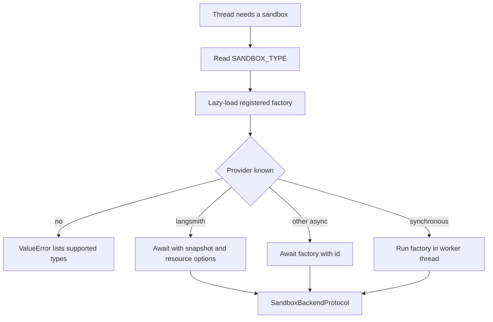
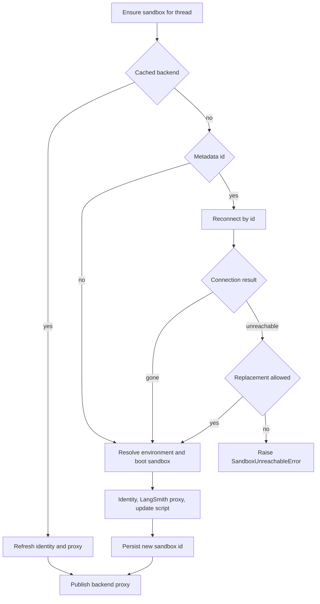

# Sandbox Provider Integration

Open SWE performs repository work through `SandboxBackendProtocol`. Provider selection is deployment configuration, while the sandbox lifecycle owns the durable thread binding, reconnection policy, initialization, and publication ordering. See [sandbox lifecycle](../architecture/sandbox-lifecycle.md) for the broader thread lifecycle and [configuration](../operations/configuration.md) for deployment variables.

## Provider selection and startup checks

`SANDBOX_TYPE` defaults to `langsmith`. The registry lazily imports the selected registered factory—`langsmith`, `daytona`, `modal`, `runloop`, `e2b`, or `local`—so unused provider SDKs need not load. An unknown value raises `ValueError` and reports the supported types.

Each factory accepts `sandbox_id: str | None`: an id means reconnect and no id means create. `create_sandbox()` forwards snapshot, resource, and create-body options only to LangSmith. Native async factories are awaited; synchronous factories run in `asyncio.to_thread`, keeping their blocking SDK or filesystem setup off the event loop.

Provider selection and dispatch; only LangSmith receives selector-level creation options.

The FastAPI lifespan calls `validate_sandbox_startup_config()` before serving. Validation currently delegates only to LangSmith: configured resource and TTL settings must parse as integers, idle and delete-after-stop TTLs cannot be negative, and `SANDBOX_CREATE_EXTRA_JSON` must be a JSON object. Other providers validate required credentials when their factories run.

## Thread binding, initialization, and recovery

`ensure_sandbox_for_thread()` first finds an in-memory backend or the saved thread metadata id; otherwise it creates a box from the selected environment's ready snapshot and settings, falling back to the administrator base snapshot. It applies the bot Git identity on creation and reuse. A stale environment snapshot can also run its update script in the newly created sandbox before the first model call; script errors are logged but do not prevent use of the already-bootable image.

Provisioning and recovery preserve a working tree by distinguishing deletion from unreachability and publishing only an initialized backend.

A LangSmith `ResourceNotFoundError` becomes `SandboxGoneError`, which is recreated because it has no surviving working tree. Other reconnect failures become `SandboxUnreachableError` and normally stop the run rather than replacing potentially uncommitted work with an empty sandbox. `allow_replacement=True` makes that trade-off for review threads, whose checkout is re-derived for every review.

Creation is bound safely: the lifecycle persists a new `sandbox_id` only after initialization completes, then publishes the in-memory backend last. Reset and recreate require a distinct new id and likewise persist the handoff before replacing the cached backend. This avoids later work adopting a partly initialized backend.

The provider abstraction intentionally has no sandbox-delete operation. Because a sandbox can contain the agent's only working tree and metadata lookup can fail open to no sandbox, reclamation is delegated to platform idle and delete-after-stop TTLs.

## Providers and operational configuration

| Provider | Create or reconnect behavior | Required or notable configuration |
|---|---|---|
| `langsmith` | Async client gets an id or creates a box, wrapped as `TimeoutLangSmithSandbox` | `LANGSMITH_API_KEY`; `LANGSMITH_ENDPOINT`; snapshots, resources, TTLs, and extra create fields |
| `daytona` | Gets an id or creates from a snapshot | `DAYTONA_API_KEY`; `DAYTONA_SANDBOX_SNAPSHOT` defaults to `daytonaio/sandbox:0.6.0` |
| `modal` | Reattaches by id or creates in an app | Modal credentials; `MODAL_APP_NAME` defaults to `open-swe` |
| `runloop` | Retrieves an id or creates a devbox | `RUNLOOP_API_KEY` |
| `e2b` | Connects by id or creates a sandbox | `E2B_API_KEY`; optional `E2B_TEMPLATE`; one-hour timeout |
| `local` | Creates a host-backed `LocalShellBackend`; ignores ids | Optional `LOCAL_SANDBOX_ROOT_DIR`; no isolation |

### LangSmith provisioning and proxy service

LangSmith sandbox provisioning, connection, proxy configuration, and environment capture use the deployment's `LANGSMITH_API_KEY` and `LANGSMITH_ENDPOINT`. The SDK endpoint is normalized to `/v2/sandboxes`; the retired `SANDBOX_LANGSMITH_API_KEY` and `SANDBOX_LANGSMITH_ENDPOINT` overrides are not used.

When a snapshot is configured, new boxes boot from it; otherwise the create request omits `snapshot_id` so the platform selects its root snapshot. Default sizing is 4 vCPUs, 16 GiB memory, and 128 GiB filesystem capacity. Default idle and delete-after-stop TTLs are two hours and 30 days, respectively; zero disables either TTL. If only CPU or memory is overridden, the other is intentionally left unset rather than combined with its deployment default.

`SANDBOX_CREATE_EXTRA_JSON` contributes deployment-wide create fields, and call-specific `create_params` win on conflicts. Unsupported fields are injected only into the SDK `POST /boxes` request. Retryable creation failures get at most three attempts.

On LangSmith creation and reuse, the lifecycle mints a GitHub App installation token and configures proxy rules rather than writing the real token into the sandbox. The proxy applies Basic authentication for `github.com` and `*.github.com`, and Bearer authentication plus a placeholder `GH_TOKEN` for `api.github.com`. Caller-provided base rules are preserved; a not-ready proxy update starts the box best-effort and retries. Proxy refresh failures make the sandbox unreachable.

`TimeoutLangSmithSandbox` gives async command execution a client-side deadline around a nonblocking command. Server command timeout and client deadline exhaustion both return exit code 124; client expiration best-effort kills the command. Supported WebSocket setup and stream failures fall back to base execution. Command retry is deliberately restricted to `SandboxRetryableConnectionError`, which means the WebSocket upgrade failed before the execute frame was sent, and uses at most four jittered exponential-backoff attempts.

### Environment snapshots and reset

The environment system is LangSmith-specific. An environment record selects a ready snapshot plus resource and create settings; without a ready snapshot, creation falls back to the administrator base snapshot, then `DEFAULT_SANDBOX_SNAPSHOT_ID`. The administrator setting is store-backed so a base image can change without redeployment, and its lookup fails soft to the environment default.

Refresh uses a throwaway builder: a full refresh starts from the base snapshot and runs setup then update, while an update refresh starts from the current environment snapshot and runs only the update script. A successful capture publishes a mutable `name:latest` tag and records the immutable snapshot id used by new runs, so a mid-run refresh cannot change a reconnecting sandbox. Failed refreshes retain the last working snapshot; builders are stopped for TTL-based reclamation.

`sandbox_reset` is supported only for LangSmith. It creates a distinct replacement from raw create parameters, configures proxy and Git identity, then updates metadata before swapping the cached backend. Generic recreation uses the environment-derived configuration and preserves the prior sandbox until the same handoff succeeds.

### Local and desktop execution

`local` executes directly on the host and is for local development with human oversight, not isolation. It creates its root directory, passes a filtered environment with `inherit_env=False`, and excludes selected model, LangSmith, and OAuth secrets. Unless `GIT_CONFIG_GLOBAL` is explicitly set, it directs global Git writes to root-local `.gitconfig-sandbox`, which includes the host configuration and protects the developer's `~/.gitconfig` identity.

Desktop execution is not a provider selection. Its primary backend is the user project; it composes read-only bundled and state-backed user-skill routes plus separate artifact routes so agent scratch files do not enter the project. `ReadOnlyBackend` delegates only asynchronous reads, listing, grep, glob, and downloads, while synchronous calls are rejected.

## Reviewer preparation

Reviewer sandboxes are reusable but repo content is re-derived. Before the first model call, `prepare_review_repo()` clone-or-fetches the repository, fetches base and head—including the pull ref for forks—force-checks out the expected head SHA, and verifies `HEAD`. It uses a 240-second timeout and returns `False` on preparation failure, allowing review to continue from fetched diff context.

Trusted skills receive stricter treatment: `.agents/skills` and `.claude/skills` are extracted from the PR base SHA, not the author-controlled head, into sibling `.review-skills` paths. This prevents a pull request from injecting reviewer instructions through a changed `SKILL.md`.

## Adding a provider

1. Implement `agent/sandboxes/providers/<name>.py` with `create_<name>_sandbox(sandbox_id: str | None = None)`. Reconnect when passed an id, create otherwise, and return `SandboxBackendProtocol`. Factories may be synchronous or `async def`.
2. Add the corresponding `(module, function)` entry to `SANDBOX_FACTORIES`.
3. Define credentials and reconnect failure semantics. Do not silently replace an unreachable persistent working tree.
4. Test creation/reconnection and registry dispatch, and explicitly decide whether snapshots, reset, resource overrides, proxy refresh, and other LangSmith-specific capabilities are unsupported or need equivalents.

A custom backend can extend `deepagents.backends.sandbox.BaseSandbox`, delegating file operations to shell execution, but it must support the asynchronous operations used by the lifecycle.

## Focused verification

`tests/sandbox/test_langsmith_sandbox_config.py` covers endpoint construction, snapshot omission, defaults, validation, create-field injection, retries, and missing-box classification. `test_langsmith_sandbox_timeout.py` covers deadlines, kill behavior, response conversion, fallback, and command retry. Lifecycle tests cover recovery, reset/recreate handoff ordering, proxy behavior, environment update scripts, and reviewer replacement policy; Local tests cover root, filtered environment, and Git-config isolation.
