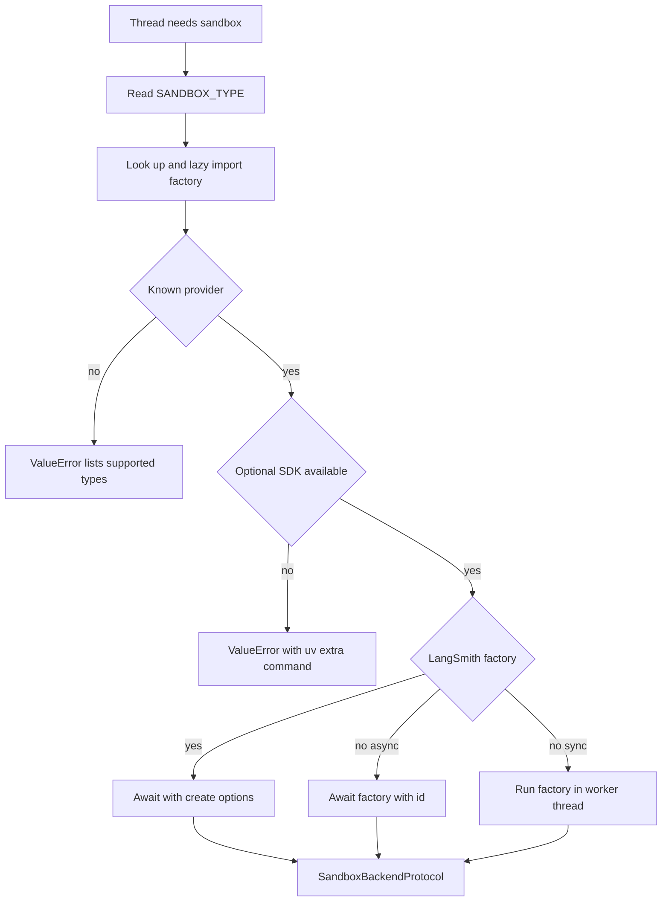

# Sandbox Provider Integration

Open SWE performs repository work through `SandboxBackendProtocol`. Provider choice is deployment configuration, while the sandbox lifecycle owns the durable thread binding, reconnection, initialization, and replacement policy. See [sandbox lifecycle](../architecture/sandbox-lifecycle.md) for the broader lifecycle and [configuration](../operations/configuration.md) for environment-variable reference.

## Selection, packages, and startup checks

`SANDBOX_TYPE` defaults to `langsmith`. The registry maps `langsmith`, `daytona`, `modal`, `runloop`, `e2b`, and `local` to a module and factory, importing the selected module lazily. An unknown type raises `ValueError` with the supported values.

The third-party `daytona`, `modal`, `runloop`, and `e2b` integrations are optional extras. A base install contains the default LangSmith and Local integrations. Select a third-party provider only after installing its group, for example `uv sync --extra sandbox-e2b`, or all groups with `uv sync --extra sandbox-providers`. If the provider's own SDK import is missing, the registry turns that error into an install hint; unrelated import failures propagate rather than being mislabeled.

Provider selection and dispatch performed by `create_sandbox()`.

All factories accept a `sandbox_id` for reconnection or `None` for creation. `create_sandbox()` forwards snapshot, CPU, memory, filesystem, and arbitrary create-body settings exclusively to LangSmith. LangSmith is asynchronous; Modal is also awaited as a native async factory. Daytona, E2B, Runloop, and Local are invoked through `asyncio.to_thread` so synchronous SDK or filesystem work does not block the event loop.

The FastAPI lifespan runs `validate_sandbox_startup_config()` before serving. It eagerly loads a selected optional provider so a missing extra fails at boot. For LangSmith it additionally checks numeric resource and TTL settings, rejects negative TTLs, and parses `SANDBOX_CREATE_EXTRA_JSON` as an object. Credentials for other providers are checked when their factories run.

## Thread binding and recovery

`ensure_sandbox_for_thread()` reads thread metadata and either uses an in-memory connection, reconnects the recorded id, or creates a box from the workspace's ready snapshot and resource/create parameters. It reapplies the bot Git identity. A newly created backend is initialized—including LangSmith proxy configuration—before its id is written to thread metadata, and the backend is published only after that persistence and tool URL provisioning. This prevents another caller from adopting an unfinished backend.

A LangSmith `ResourceNotFoundError` becomes `SandboxGoneError`: the box is deleted and can safely be recreated. Other reconnection or proxy-refresh failures become `SandboxUnreachableError`; normally the lifecycle preserves the binding rather than replacing a box that may contain uncommitted work. Reviewer threads opt into replacement because their checkout is re-derived for each review.

The provider abstraction deliberately has no sandbox delete operation. Since a sandbox may contain the only working tree and metadata reads can fail open to no sandbox, reclamation is delegated to provider/platform TTLs configured at creation time.

## Built-in providers

| Provider | Reconnect or create | Required configuration | Notes |
|---|---|---|---|
| `langsmith` | Gets an existing box or creates one asynchronously, then wraps it for the agent backend | `LANGSMITH_API_KEY`; optional `LANGSMITH_ENDPOINT` | Only provider receiving registry-level snapshot, resources, and `create_params` |
| `daytona` | Gets an id or creates from a snapshot | `DAYTONA_API_KEY`, `DAYTONA_SANDBOX_SNAPSHOT` | Optional extra; synchronous wrapper |
| `modal` | Reattaches by id or creates in `MODAL_APP_NAME` | Modal credentials | Optional extra; native async wrapper |
| `runloop` | Retrieves an id or creates a devbox | `RUNLOOP_API_KEY` | Optional extra; synchronous wrapper |
| `e2b` | Connects by id or creates a sandbox | `E2B_API_KEY`; optional `E2B_TEMPLATE` | Optional extra; one-hour timeout |
| `local` | Creates a host `LocalShellBackend`; ignores ids | Optional `LOCAL_SANDBOX_ROOT_DIR` | No isolation; development only |

### LangSmith provisioning and execution

LangSmith sandbox operations use the deployment's `LANGSMITH_API_KEY` and `LANGSMITH_ENDPOINT`; the SDK endpoint is normalized to end in `/v2/sandboxes`. New boxes use a requested snapshot, or omit `snapshot_id` so the platform uses its root snapshot. Defaults are 4 vCPUs, 16 GiB memory, 128 GiB filesystem capacity, a two-hour idle TTL, and a 30-day delete-after-stop TTL. A partial CPU or memory override leaves the other field unset; zero disables either TTL.

`SANDBOX_CREATE_EXTRA_JSON` provides deployment-level create fields, and call-specific `create_params` win on conflicts. Unsupported fields are injected only into the SDK's create `POST /boxes` request. Retriable creation failures receive at most three attempts.

`TimeoutLangSmithSandbox` protects asynchronous command execution from a stalled WebSocket command result. It starts a nonblocking command, waits for the command timeout plus `SANDBOX_EXECUTE_CLIENT_GRACE_SECONDS` (30 seconds by default), and returns an exit-124 response for either a server timeout or a client deadline; the latter best-effort kills the command. Supported WebSocket setup or stream failures fall back to the base execution path. Only `SandboxRetryableConnectionError` is retried, because it means the WebSocket upgrade was rejected before the execute frame was sent; retries use jittered exponential backoff and are capped at four attempts.

### LangSmith proxy behavior

For LangSmith creation and reuse, lifecycle code mints a GitHub App installation token at runtime and updates the sandbox proxy rather than writing the real token into the box. The proxy supplies Basic authentication for `github.com` and `*.github.com`, and Bearer authentication plus a placeholder `GH_TOKEN` for `api.github.com`. It preserves user-provided proxy rules while replacing managed rules and can add a thread tool rule. A not-ready proxy update starts the box best-effort and retries the update. Non-LangSmith providers do not receive this proxy integration.

### Local and desktop variants

`local` executes directly on the host and is appropriate only for supervised local development. It creates its root directory, passes a filtered environment with `inherit_env=False`, and excludes selected model, LangSmith, and OAuth broker credentials. Unless `GIT_CONFIG_GLOBAL` is explicitly set, it creates a root-local `.gitconfig-sandbox` that includes the host Git config, preserving helpers while keeping bot identity writes out of the developer's `~/.gitconfig`.

Desktop execution is separate from `SANDBOX_TYPE`: it builds a `LocalShellBackend` for an allowlisted project or desktop worktree. The agent composes read-only bundled skills and state-backed user skills around that project backend, then routes artifact and conversation-history files outside the repository. `ReadOnlyBackend` delegates asynchronous read/list/search/download operations and rejects its synchronous counterparts.

## Reviewer preparation

Reviewer sandboxes are reusable but their checkout is intentionally regenerated. Before model work, `prepare_review_repo()` clones or fetches the repository, fetches the base and PR head (including a pull ref for a fork), force-checks out the expected head, and verifies `HEAD`. It uses a 240-second command timeout and returns `False` on failure, allowing a review to continue from diff context.

When preparation succeeds, `materialize_trusted_skills()` extracts `.agents/skills` and `.claude/skills` from the PR base SHA into a sibling `.review-skills` directory, not from the author-controlled PR head. This prevents a pull request from injecting reviewer instructions.

## Adding a provider

1. Implement `agent/sandboxes/providers/<name>.py` with `create_<name>_sandbox(sandbox_id: str | None = None)`. It must reconnect when given an id, create otherwise, and return `SandboxBackendProtocol`. The factory may be synchronous or `async def`.
2. Register `"<name>": ("agent.sandboxes.providers.<name>", "create_<name>_sandbox")` in `SANDBOX_FACTORIES`.
3. If its SDK is optional, add a dependency extra and registry handling that produces a useful missing-extra error. Define reconnect failures carefully: do not silently replace an unreachable working tree.
4. Test factory creation/reconnection and registry dispatch, and decide explicitly whether snapshots, resource overrides, reset, proxy refresh, and browser/tool features are unsupported or need equivalents.

A custom backend can extend `deepagents.backends.sandbox.BaseSandbox`, whose file operations delegate to command execution; it still must provide a stable `id` and the asynchronous operations consumed by the agent lifecycle.

## Focused verification

`tests/sandbox/test_optional_provider_extras.py` checks missing-extra boot and load behavior. `test_langsmith_sandbox_config.py` covers endpoint normalization, root-snapshot omission, create fields, defaults, validation, retry, and missing-box classification; `test_langsmith_sandbox_timeout.py` covers deadline, kill, fallback, response conversion, and safe retry. Local tests cover root creation, credential filtering, and Git configuration isolation; lifecycle and reviewer tests cover safe binding, recovery, and replacement policy.
