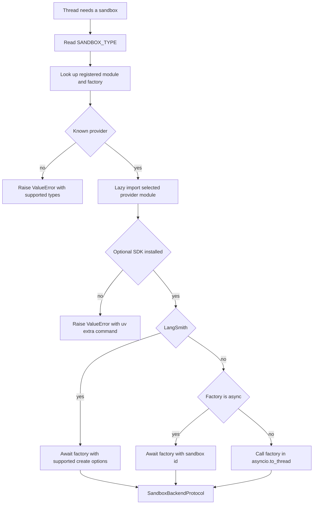

# Sandbox Provider Integrations

Open SWE resolves a `SandboxBackendProtocol` from operational configuration rather than from the agent graph. The registry selects and loads a provider; the sandbox lifecycle binds the resulting backend to a thread and owns reconnection and replacement policy. This page distinguishes the common selection contract from LangSmith-only facilities such as workspace snapshots, resource sizing, proxy credentials, and timeout handling. For the thread state machine, see [sandbox lifecycle](../architecture/sandbox-lifecycle.md); for the wider environment-variable reference, see [configuration](../operations/configuration.md).

## Selection, lazy loading, and optional installs

`SANDBOX_TYPE` defaults to `langsmith`. The registry knows six names: `langsmith`, `daytona`, `modal`, `runloop`, `e2b`, and `local`. It maps a name to a module and factory attribute, imports the selected module only when needed, and raises `ValueError` listing supported names for an unknown type.

The third-party providers `daytona`, `modal`, `runloop`, and `e2b` are deliberately optional. A base installation includes the default LangSmith and Local paths; install an individual selected provider with, for example:

```bash
uv sync --extra sandbox-e2b
```

or install all third-party integrations with `uv sync --extra sandbox-providers`. If lazy import finds that the provider's SDK module is missing, it raises an actionable `ValueError` naming the corresponding extra. Startup validation eagerly performs that import for an optional selected provider, so this installation error appears at boot rather than at the first sandbox request.


Provider selection in `create_sandbox()`: only LangSmith receives registry-level snapshot, resource, and create-body options; the other factories receive the optional existing id.

Every factory follows the practical contract `create_<name>_sandbox(sandbox_id: str | None = None)`: an id means reconnect and no id means create. `create_sandbox()` awaits native async factories (currently LangSmith and Modal) and dispatches synchronous factories in `asyncio.to_thread`, keeping their blocking SDK or filesystem work out of the event loop. The selector forwards `snapshot_id`, CPU, memory, filesystem capacity, and `create_params` only to LangSmith—do not infer that another provider accepts or implements them.

## Startup checks and thread binding

FastAPI calls `validate_sandbox_startup_config()` during its lifespan before serving. For an optional selected provider that establishes that the extra is installed. For LangSmith it additionally verifies that configured resource and TTL values are integers, rejects negative TTLs, and parses `SANDBOX_CREATE_EXTRA_JSON` as an object. Provider API credentials are otherwise checked by their factories when a backend is created or reconnected.

`ensure_sandbox_for_thread()` obtains a cached connection when available, otherwise reconnects using the thread metadata id, or creates a new backend using the selected workspace's ready snapshot, resource settings, and create parameters. It initializes Git identity and LangSmith proxy access before binding a newly created backend. It writes the new `sandbox_id` to thread metadata only after initialization succeeds, then provisions the tool URL and publishes the backend last. Consequently, a failed initialization leaves no half-built backend available for later work.

A deleted LangSmith box and an unreachable backend are intentionally different failures. LangSmith converts a missing-box response into `SandboxGoneError`, which the lifecycle recreates. Other reconnection or proxy-refresh failures become `SandboxUnreachableError` and normally are not replaced, because a replacement loses uncommitted working-tree state. A caller may set `allow_replacement=True` only when its checkout is re-derivable, as the reviewer does.

The provider abstraction has no delete operation. A sandbox may contain the only copy of an agent working tree, and a metadata read can fail open to no id; deletion based on that state is unsafe. Platform lifecycle settings reclaim LangSmith boxes through idle and delete-after-stop TTLs instead.

## Built-in provider boundaries

| Provider | Reconnect or create | Required or relevant configuration | Boundary |
|---|---|---|---|
| `langsmith` | Async client gets a box by id or provisions a box and wraps it for the agent backend | `LANGSMITH_API_KEY`; `LANGSMITH_ENDPOINT`; LangSmith resource/TTL/create settings | Only built-in provider receiving selector-level snapshot, resources, and arbitrary create fields; snapshot capture and managed proxy behavior are LangSmith-specific. |
| `daytona` | Gets an id or creates from a Daytona snapshot | `DAYTONA_API_KEY`; `DAYTONA_SANDBOX_SNAPSHOT` defaults to `daytonaio/sandbox:0.6.0` | Synchronous SDK wrapper; install `sandbox-daytona`. |
| `modal` | Attaches by id or creates in an app looked up by name | Modal credentials; `MODAL_APP_NAME` defaults to `open-swe` | Native async factory; install `sandbox-modal`. |
| `runloop` | Retrieves a devbox by id or creates one | `RUNLOOP_API_KEY` | Synchronous SDK wrapper; install `sandbox-runloop`. |
| `e2b` | Connects by id or creates a sandbox | `E2B_API_KEY`; optional `E2B_TEMPLATE` | One-hour timeout; synchronous SDK wrapper; install `sandbox-e2b`. |
| `local` | Creates a host-backed backend and ignores ids | Optional `LOCAL_SANDBOX_ROOT_DIR`, defaulting to the current directory | No isolation: local development with human oversight only. |

## LangSmith provisioning and snapshots

LangSmith sandbox operations use the deployment's `LANGSMITH_API_KEY` and `LANGSMITH_ENDPOINT`. The SDK client endpoint is normalized to `/v2/sandboxes`; a supplied endpoint already ending in that suffix is not doubled. The former `SANDBOX_LANGSMITH_API_KEY` and `SANDBOX_LANGSMITH_ENDPOINT` overrides are not used.

For a new box, an omitted snapshot is sent as no `snapshot_id` field so the platform can boot its root snapshot. Defaults are 4 vCPUs, 16 GiB memory, 128 GiB filesystem capacity, a two-hour idle TTL, and a 30-day delete-after-stop TTL. Workspace resolution can supply a ready snapshot and resource/create settings, but registry forwarding does not make those options portable to other providers. When either CPU or memory is explicitly overridden, the other remains `None` rather than being mixed with the deployment default. A TTL of zero disables that expiration behavior.

`SANDBOX_CREATE_EXTRA_JSON` contributes deployment-level object fields; call-specific `create_params` win on key conflicts. Since the SDK lacks arbitrary create-payload support, the integration temporarily wraps its HTTP `POST /boxes` transport to merge extra fields only into that request. Creation retries retryable HTTP statuses and transient creation error classes, for at most three attempts.

Snapshot capture is also LangSmith-specific. `capture_snapshot_with_tag()` temporarily injects a tag into the SDK snapshot request because the SDK has no public tag parameter; it restores the original transport afterward. Snapshot names use Docker-style mutable `name:tag` pointers to immutable content, so recapturing a tag moves the pointer.

## LangSmith execution and proxy credentials

`TimeoutLangSmithSandbox` is the LangSmith adapter used by agent tools. When a command has an effective timeout, it starts a nonblocking command, waits for the command timeout plus `SANDBOX_EXECUTE_CLIENT_GRACE_SECONDS` (default 30 seconds), and turns results into `ExecuteResponse`. A server `CommandTimeoutError` returns exit 124; a client deadline expiry best-effort kills the command and also returns exit 124. WebSocket setup or supported stream failures fall back to the base execution path. Without an effective timeout it delegates directly to that base path.

Execution retries are deliberately narrow: only `SandboxRetryableConnectionError` is retried, because it represents a rejected WebSocket upgrade before the execute frame was sent. There are at most four jittered exponential-backoff attempts, avoiding a retry after a command might have run.

For LangSmith creation and reuse, the lifecycle obtains a GitHub App workspace token and configures it at the box proxy rather than writing it into the sandbox filesystem. Proxy rules inject Bearer auth for `api.github.com` and Basic auth for `github.com` and `*.github.com`; `GH_TOKEN` is only the placeholder `proxy-injected` for clients that require an environment value. The configuration preserves non-managed caller rules while replacing obsolete managed rules. If a proxy update is rejected because the box is not ready, the integration attempts to start it, then retries the update. Non-LangSmith providers skip this proxy-token lifecycle.

## Local provider safety

`local` uses `LocalShellBackend` to run directly on the host. It creates the root directory, builds an explicit environment with selected model, LangSmith, and OAuth-broker secrets excluded, and passes `inherit_env=False`. Unless `GIT_CONFIG_GLOBAL` is already configured, it creates `<root>/.gitconfig-sandbox`, including the host configuration when present, then directs global Git configuration there. This allows aliases and helpers to remain available while preventing automated bot identity writes from changing the developer's `~/.gitconfig`.

## Extending the registry

To add a built-in provider:

1. Implement `agent/sandboxes/providers/<name>.py` with `create_<name>_sandbox(sandbox_id: str | None = None)` returning `SandboxBackendProtocol`. It may be synchronous or `async def`, and must reconnect when it receives an id.
2. Add the provider's `(module, function)` mapping to `SANDBOX_FACTORIES` in `agent/sandboxes/providers/registry.py`.
3. If its SDK is optional, add its dependency extra and its SDK import names to the registry's optional-provider metadata so missing installation produces the actionable boot-time error.
4. Decide and document each nonportable capability explicitly. In particular, do not silently claim support for LangSmith snapshots, resources, create-body passthrough, proxy refresh, or timeout behavior.
5. Test dispatch, missing-extra behavior where relevant, creation, reconnection, credential errors, and failure classification. Do not replace an unreachable persistent working tree with an empty backend unless the caller explicitly accepts that data-loss trade-off.

A custom backend can extend `deepagents.backends.sandbox.BaseSandbox`, which implements file operations by delegating to command execution. It still needs a stable `id` and the asynchronous operations used by the lifecycle.

## Focused verification

`tests/sandbox/test_optional_provider_extras.py` covers actionable missing-extra errors and startup validation. `tests/sandbox/test_langsmith_sandbox_config.py` covers endpoint normalization, root-snapshot omission, create-body merging, validation, and provisioning retry; `test_langsmith_sandbox_timeout.py` covers deadlines, kills, fallback, conversion, and execution retry. Lifecycle recovery, publish ordering, and recreation tests cover the bind-after-initialization invariant. `tests/sandbox/test_local_integration.py` exercises Local root, environment filtering, and Git-config isolation.
