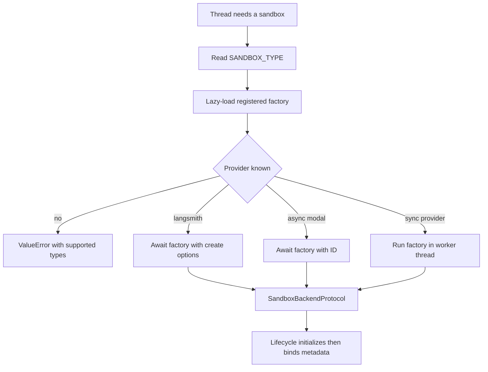
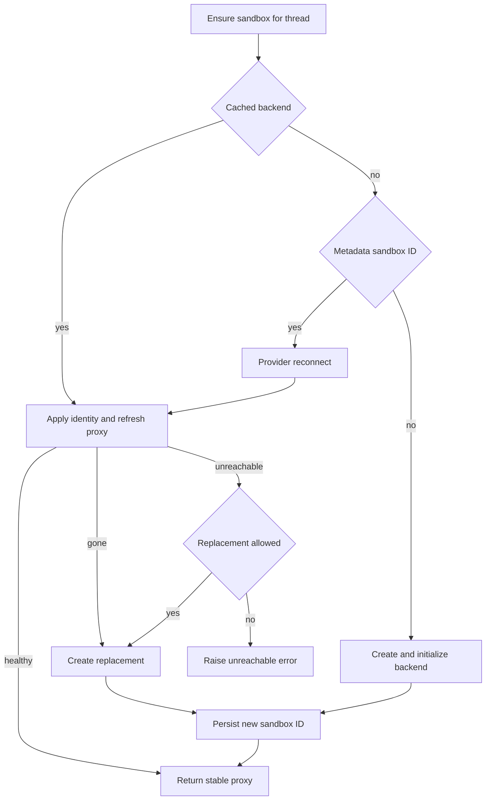

# Sandbox Provider Integration

Open SWE runs repository work through `SandboxBackendProtocol`. Provider selection is deployment configuration, while the lifecycle owns the durable thread binding, reconnection, initialization, and replacement decision. This is therefore more than a factory switch: a provider must preserve the thread’s working-tree safety model. See [sandbox lifecycle](../architecture/sandbox-lifecycle.md) for the broader thread lifecycle and [configuration](../operations/configuration.md) for deployment settings.

## Selection and startup validation

`SANDBOX_TYPE` defaults to `langsmith`. The registry maps `langsmith`, `daytona`, `modal`, `runloop`, `e2b`, and `local` to module/factory pairs and imports the selected module only when needed. An invalid name raises `ValueError` with the sorted supported names.

Every factory accepts `sandbox_id: str | None`: an ID requests reconnection and its absence requests creation. `create_sandbox()` forwards `snapshot_id`, resource overrides, and `create_params` only to LangSmith. Native async factories are awaited (currently LangSmith and Modal); synchronous factory wrappers run in `asyncio.to_thread`, so blocking SDK and host filesystem setup do not block the event loop.

*Provider resolution returns a backend; lifecycle, rather than the registry, decides when it is safe to publish it to a thread.*

The FastAPI lifespan invokes `validate_sandbox_startup_config()` before it yields to serve requests. At present this is LangSmith-only validation: configured filesystem, CPU, memory, and TTL values must be integers; retention TTLs cannot be negative; and `SANDBOX_CREATE_EXTRA_JSON` must be a JSON object. Missing credentials for other providers fail when the selected factory is called, rather than at startup.

## Binding, reconnection, and work preservation

`ensure_sandbox_for_thread()` reads both the worker-local `SANDBOX_BACKENDS` proxy and `thread.metadata["sandbox_id"]`. It reuses a cached backend when available, reconnects a durable ID after a worker restart, or creates a new backend using the resolved environment snapshot/resources/create parameters. It re-applies bot Git identity on each use; LangSmith use also refreshes proxy credentials.

*The normal flow distinguishes a deleted sandbox from one that may still recover, and publishes only after a new binding persists.*

A LangSmith `ResourceNotFoundError` is converted to `SandboxGoneError`, which permits recreation because the backend is affirmatively absent. Other connection/reconfiguration failures become `SandboxUnreachableError` and normally stop the run: an unreachable sandbox can recover and may hold the only uncommitted working tree. Callers can pass `allow_replacement=True` only when their checkout is re-derivable; the reviewer does so because it prepares the repository for every review run. A failed replacement remains typed as unreachable.

For a new or replacement backend, creation, proxy configuration, Git identity, and any environment update work occur before lifecycle persists `sandbox_id`; it then publishes the stable proxy last. Thus a failure cannot expose a half-initialized backend or persist an ID that points to one. Reset and explicit recreation likewise require a new ID and retain the old binding if metadata persistence fails. The provider abstraction deliberately has no delete operation: automatic idle stop and delete-after-stop retention reclaim working-tree-bearing sandboxes instead.

## Built-in providers

| Provider | Create or reconnect behavior | Credentials and configuration | Operational boundary |
|---|---|---|---|
| `langsmith` | Async get-by-ID or creation, returned as `TimeoutLangSmithSandbox` | `LANGSMITH_API_KEY`; `LANGSMITH_ENDPOINT`; snapshots, sizing, TTLs, and extra create fields | Only provider receiving registry snapshot/resource/create options and supporting reset/snapshot features |
| `daytona` | Gets an ID or creates from a snapshot | `DAYTONA_API_KEY`; `DAYTONA_SANDBOX_SNAPSHOT` defaults to `daytonaio/sandbox:0.6.0` | Synchronous wrapper |
| `modal` | Reattaches by ID or creates in the selected app | Modal credentials; `MODAL_APP_NAME` defaults to `open-swe` | Async factory; no registry-level resource forwarding |
| `runloop` | Retrieves an ID or creates a devbox | `RUNLOOP_API_KEY` | Synchronous wrapper |
| `e2b` | Connects by ID or creates a sandbox | `E2B_API_KEY`; optional `E2B_TEMPLATE`; one-hour timeout | Synchronous wrapper |
| `local` | Creates a host-backed `LocalShellBackend`; ignores IDs | Optional `LOCAL_SANDBOX_ROOT_DIR`, default current directory | No isolation; development only |

### LangSmith endpoint, provisioning, and snapshots

LangSmith sandbox operations—including proxy configuration and environment snapshot work—use the deployment’s `LANGSMITH_API_KEY` and `LANGSMITH_ENDPOINT`. The SDK client endpoint is normalized to `<root>/v2/sandboxes`; if the supplied root already has that suffix, it is not appended again. A selected `DEFAULT_SANDBOX_SNAPSHOT_ID` must consequently exist in that same workspace.

New boxes use a configured snapshot or omit `snapshot_id` to let the platform boot its root snapshot. Defaults are 4 vCPUs, 16 GiB memory, 128 GiB filesystem capacity, a two-hour idle TTL, and 30-day delete-after-stop TTL; `0` disables either expiration behavior. If either CPU or memory is explicitly supplied, the other is left `None` instead of mixing a partial override with defaults.

`SANDBOX_CREATE_EXTRA_JSON` supplies deployment-level create-body fields. Per-call `create_params` override colliding fields. Recognized fields go through the SDK signature; unsupported fields are injected only into the SDK transport’s `POST /boxes` request. Normal creation retries retryable statuses and transient creation classes for at most three attempts. Raw reset parameters follow a related path that separates SDK-recognized from injected fields.

### LangSmith execution and credential proxy

`TimeoutLangSmithSandbox` is async-only. For an effective command timeout it opens a nonblocking command, waits for the timeout plus `SANDBOX_EXECUTE_CLIENT_GRACE_SECONDS` (default 30 seconds), and translates its result to `ExecuteResponse`. A server-side `CommandTimeoutError` yields exit code 124; client deadline expiry best-effort kills the command and also yields exit 124. Supported WebSocket setup or stream failures fall back to the base execute path. If there is no effective timeout, it delegates directly to that base path.

Command retry is intentionally narrow: only `SandboxRetryableConnectionError`, which represents a rejected WebSocket upgrade before the execute frame was sent, is retryable. It uses no more than four jittered exponential-backoff attempts, avoiding a retry that might double-run a command.

For LangSmith creation and reuse, lifecycle mints a GitHub App installation token at runtime and configures the sandbox proxy rather than writing the token into the filesystem. `github.com` and `*.github.com` receive Basic authentication; `api.github.com` receives Bearer authentication and a placeholder `GH_TOKEN` so `gh` can run without seeing the real token. Existing caller-defined proxy rules are retained except for retired legacy managed rules, while managed GitHub and supported Stagehand model rules are added. A proxy update rejected because the sandbox is not ready triggers a best-effort start, then a retry; a stopped box is not assumed deleted because its filesystem can still be recovered.

### Local provider safety

`local` runs commands directly on the host and is suitable only for supervised development. It creates its root directory and passes an explicit environment with selected model, LangSmith, and OAuth-broker secrets removed (`inherit_env=False`). Unless `GIT_CONFIG_GLOBAL` is explicitly set, it creates `<root>/.gitconfig-sandbox`, including the host configuration when present, so bot `git config --global` updates do not overwrite the developer’s `~/.gitconfig`.

## Reviewer checkout behavior

Reviewer backends may be replaced because their content is deliberately rebuilt. Before model work, `prepare_review_repo()` clone-or-fetches the target repository, fetches base and head (and the pull ref for a fork), force-checks out the expected head, and verifies `HEAD`; it has a 240-second command timeout. Failure returns `False` rather than preventing a diff-context review. Trusted skill directories are extracted from the base SHA into sibling `.review-skills`, never from author-controlled PR-head content.

## Adding a provider

1. Implement `agent/sandboxes/providers/<name>.py` with `create_<name>_sandbox(sandbox_id: str | None = None)`. It must reconnect with an ID, create without one, and return `SandboxBackendProtocol`. The factory may be synchronous or `async def`.
2. Add `"<name>": ("agent.sandboxes.providers.<name>", "create_<name>_sandbox")` to `SANDBOX_FACTORIES` in `agent/sandboxes/providers/registry.py`.
3. Define credential validation and classify reconnect failures conservatively. Do not hide a failed reconnect by creating an empty replacement: lifecycle relies on the distinction between deleted and unreachable working trees.
4. Explicitly decide which LangSmith-specific capabilities are unsupported or need equivalents: snapshots, resource/create overrides, reset, credential proxy refresh, and browser-oriented proxy rules. Test creation, reconnection, registry dispatch, and failure classification.

A custom backend can extend `deepagents.backends.sandbox.BaseSandbox`, whose file operations are implemented through execution, but it must expose a stable `id` and the async operations used by lifecycle and agent tools.

## Focused verification

`tests/sandbox/test_langsmith_sandbox_config.py` covers endpoint normalization, create-body merging/injection, default-root snapshot behavior, validation, retries, and missing-box classification. `test_langsmith_sandbox_timeout.py` and `test_sandbox_retry.py` cover deadlines, fallback, kill behavior, response conversion, and safe retry. `test_sandbox_recovery.py`, `test_sandbox_publish_ordering.py`, `test_sandbox_recreation.py`, and `test_sandbox_reset.py` exercise recovery and handoff ordering. Provider changes should additionally test their factory’s ID path and create path; local changes should cover secret filtering and Git-config isolation.
