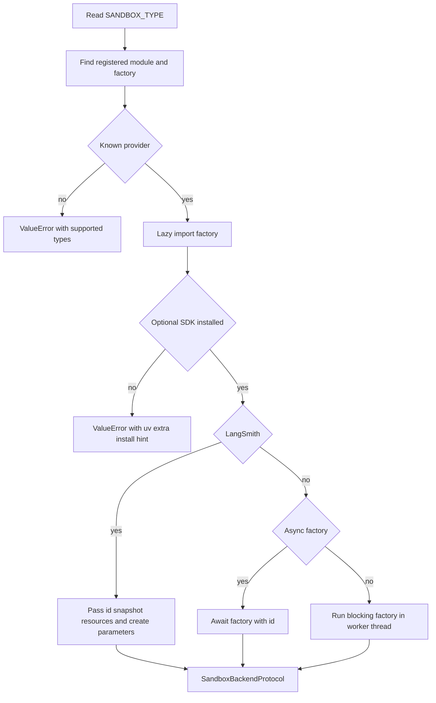
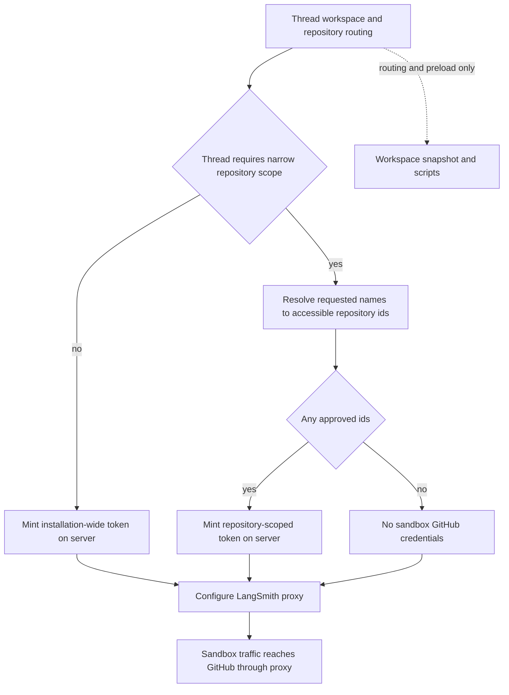

# Sandbox Providers, Snapshots, and GitHub Access

Sandbox providers supply the `SandboxBackendProtocol` on which repository work runs. The provider registry decides *how* to obtain a backend; the lifecycle decides which workspace image to boot, safely binds it to a thread, and—for LangSmith—configures GitHub egress. This separation is important: workspace repository bindings route work and preload images, while credentials are a separate, deliberately narrower capability. See [sandbox lifecycle](../architecture/sandbox-lifecycle.md), [authentication and security](../concepts/auth-and-security.md), and [PR creation](../workflows/pr-creation.md) for adjacent concerns.

## Provider selection and optional dependencies

`SANDBOX_TYPE` defaults to `langsmith`. The registry lazily imports factories for `langsmith`, `daytona`, `modal`, `runloop`, `e2b`, and `local`; an invalid name raises `ValueError` listing the supported choices. Lazy loading keeps SDKs for unselected providers out of the normal process.

Daytona, Modal, Runloop, and E2B are optional dependency groups. Selecting one at startup imports it eagerly so a missing provider SDK fails before serving with an install hint such as `uv sync --extra sandbox-daytona`; `sandbox-providers` installs all third-party groups. An unrelated `ModuleNotFoundError` is allowed to propagate rather than being misreported as a missing extra.

```mermaid
flowchart TD
    A["Read SANDBOX_TYPE"] --> B["Find registered module and factory"]
    B --> C{"Known provider"}
    C -->|"no"| D["ValueError with supported types"]
    C -->|"yes"| E["Lazy import factory"]
    E --> F{"Optional SDK installed"}
    F -->|"no"| G["ValueError with uv extra install hint"]
    F -->|"yes"| H{"LangSmith"}
    H -->|"yes"| I["Pass id snapshot resources and create parameters"]
    H -->|"no"| J{"Async factory"}
    J -->|"yes"| K["Await factory with id"]
    J -->|"no"| L["Run blocking factory in worker thread"]
    I --> M["SandboxBackendProtocol"]
    K --> M
    L --> M
```
Provider selection keeps installation failures separate from runtime backend creation.

All factories accept an optional `sandbox_id`: it reconnects when supplied and creates when absent. Registry-level snapshot, VM-resource, and `create_params` arguments are intentionally forwarded only to LangSmith. Native asynchronous LangSmith and Modal factories are awaited; Daytona, E2B, Runloop, and Local factories run in `asyncio.to_thread` because their wrappers or setup are synchronous.

| Provider | Create or reconnect behavior | Required or notable configuration |
|---|---|---|
| `langsmith` | Async get-or-create box, with snapshot/resource/create-body support | `LANGSMITH_API_KEY`, `LANGSMITH_ENDPOINT`; supports workspace snapshots and proxy configuration |
| `daytona` | Gets an id or creates from a snapshot | `DAYTONA_API_KEY`; `DAYTONA_SANDBOX_SNAPSHOT` defaults to `daytonaio/sandbox:0.6.0` |
| `modal` | Reattaches by id or creates in a Modal app | Modal credentials; `MODAL_APP_NAME` defaults to `open-swe` |
| `runloop` | Retrieves an id or creates a devbox | `RUNLOOP_API_KEY` |
| `e2b` | Connects by id or creates a sandbox | `E2B_API_KEY`, optional `E2B_TEMPLATE`, one-hour timeout |
| `local` | Runs a `LocalShellBackend` and ignores ids | Optional `LOCAL_SANDBOX_ROOT_DIR`; no isolation |

Startup validates LangSmith numeric resource and TTL settings, rejects negative TTLs, and requires `SANDBOX_CREATE_EXTRA_JSON` to be a JSON object. It also eagerly checks the selected optional provider extra. Other provider API keys are validated by their factories when a sandbox is requested.

## LangSmith provisioning and workspace snapshots

LangSmith sandbox operations use the normal `LANGSMITH_API_KEY` and `LANGSMITH_ENDPOINT`. The endpoint is normalized to the SDK sandbox base, `/v2/sandboxes`; consequently an endpoint already ending in that suffix is not doubled. A missing API key prevents construction of the LangSmith provider.

A new box uses the supplied snapshot id, or omits it to let LangSmith choose its root snapshot. Defaults are 4 vCPUs, 16 GiB memory, 128 GiB filesystem capacity, two-hour idle TTL, and 30-day delete-after-stop TTL. If either CPU or memory is explicitly overridden, the other is sent as `None` rather than silently mixing a partial override with defaults. Zero TTL disables that expiration behavior. The abstraction intentionally has no delete operation: a thread's sandbox can hold its only uncommitted working tree, so platform TTL reclamation is safer than application deletion keyed by fallible metadata.

`SANDBOX_CREATE_EXTRA_JSON` is deployment-wide create-body input. It is merged first, then workspace/call-specific `create_params` win conflicts. The provider temporarily intercepts the SDK create `POST /boxes` request to inject fields the SDK does not model, limiting those extras to creation. Retryable creation failures receive at most three attempts.

A workspace may hold a ready immutable snapshot id plus resource and safe create-parameter overrides. `SandboxCreateConfig` resolves those values before boot; a workspace inheriting the default sandbox uses the default workspace's image/configuration while retaining its own identity. Without a ready workspace snapshot, the configured provider base snapshot is used. The new sandbox triggers a background update if its workspace image is stale; it does not wait for that update.

```mermaid
sequenceDiagram
    participant Run as Thread run
    participant Life as Sandbox lifecycle
    participant Store as Workspace store
    participant Box as Builder sandbox
    participant LS as LangSmith
    Run->>Life: request sandbox
    Life->>Store: resolve ready snapshot resources and create parameters
    Life->>LS: boot run sandbox from immutable snapshot id
    Life-->>Run: backend starts immediately
    Life->>Life: enqueue update when snapshot is stale
    Life->>Store: load workspace for refresh
    Store-->>Life: base or current snapshot
    Life->>Box: boot throwaway builder
    Box->>Box: run setup and update scripts
    Box->>LS: capture only after successful scripts
    LS-->>Store: record new ready snapshot id
    Box->>LS: stop builder
```
Workspace refresh creates an image for future sandboxes, not a blocking mutation of a running sandbox.

Refresh has two forms. A **full** refresh boots the base snapshot, runs `setup_script` then `update_script`, and captures; it is scheduled daily per workspace and can be requested on demand. An **update** boots the current workspace snapshot, runs only `update_script`, and captures; sandbox creation starts it in the background when the image has aged past the hourly interval. A failed or cancelled refresh retains the prior ready snapshot. Refresh state, step results, and a capped log are recorded for reporting; the builder is stopped after capture or failure and platform reclamation deletes it after a short delete-after-stop TTL.

Only capture-capable LangSmith infrastructure can build these images. Snapshot names publish through a mutable `:latest` tag, but runs boot the persisted immutable snapshot id, so a concurrent refresh cannot change a running or reconnecting thread's filesystem.

## GitHub access: routing metadata is not credentials

Workspace repositories serve two different purposes which must not be conflated:

- **Routing and image metadata:** a repository belongs to one workspace, which determines where events route and what setup/update scripts preload. This binding does **not** by itself limit sandbox GitHub access.
- **Credential scope:** `workspace_token()` normally mints an installation-wide GitHub App token. Callers that supply `repositories` request a repository-scoped token instead; reviewers and threads initiated by events on public repositories use this narrow path.

For a narrowed token, `repository_token()` resolves only requested full names that the installation can actually reach. Stored repository ids avoid a discovery call when current; otherwise the server uses an installation-wide discovery token to list accessible repositories, records the result, then mints a token for the approved ids. The discovery token never reaches a sandbox. No match returns no credentials, allowing public repositories to remain anonymously readable; a token-mint failure after approved ids are found is an error, not an accidental broad grant.

```mermaid
flowchart TD
    A["Thread workspace and repository routing"] --> B{"Thread requires narrow repository scope"}
    B -->|"no"| C["Mint installation-wide token on server"]
    B -->|"yes"| D["Resolve requested names to accessible repository ids"]
    D --> E{"Any approved ids"}
    E -->|"no"| F["No sandbox GitHub credentials"]
    E -->|"yes"| G["Mint repository-scoped token on server"]
    C --> H["Configure LangSmith proxy"]
    G --> H
    F --> H
    H --> I["Sandbox traffic reaches GitHub through proxy"]
    A -. "routing and preload only" .-> J["Workspace snapshot and scripts"]
```
Repository routing information and GitHub authorization scope follow separate paths.

Before provisioning or reconnecting a thread sandbox, lifecycle intersects a caller-provided repository scope with the thread's recorded scope. It fails closed if that scope cannot be read. This prevents a caller or a later token refresh from widening a public-event thread. Task workers may only attach to the coordinator sandbox after ownership, workspace, visibility, task membership, and repository-scope checks establish that the shared sandbox is no broader than the worker permits.

## LangSmith proxy configuration and refresh

GitHub credentials are applied only for `SANDBOX_TYPE=langsmith`. The lifecycle mints an appropriate GitHub App token server-side, configures the sandbox proxy, records its expiry/scope/base proxy configuration, and re-applies it on reconnection. The proxy supplies:

- `Bearer` authorization to `api.github.com` and placeholder `GH_TOKEN=proxy-injected` so `gh` will run;
- Basic `x-access-token` authorization to `github.com` and `*.github.com` for Git traffic.

The real token is in opaque proxy headers, not written into the sandbox environment. Custom proxy configuration is preserved, while stale managed GitHub and tool rules are replaced. A stopped/not-ready sandbox can reject proxy configuration with HTTP 400; Open SWE starts it best-effort and retries the patch. Transient proxy HTTP/transport failures have bounded retries, while other failures propagate; on reuse, an inability to refresh proxy access marks the sandbox unreachable rather than replacing a potentially work-bearing filesystem.

GitHub App tokens expire in about an hour. Per-thread proxy records preserve the token expiry, repository scope, permissions, workspace, and base proxy configuration. Middleware refreshes within five minutes of known expiry, or after 50 minutes when expiry is unknown. A requested scope during refresh is intersected with the recorded scope, preserving least privilege.

## Local provider and operational cautions

`local` executes commands directly on the host and is for supervised local development only. It creates its root directory, defaults it to the current directory, and constructs a non-inheriting backend environment after excluding selected model-provider, LangSmith, and OAuth-broker secrets. Unless `GIT_CONFIG_GLOBAL` is explicitly set, it creates `<root>/.gitconfig-sandbox` which includes the host config. This retains aliases and credential helpers while keeping the bot's `git config --global` identity writes out of the developer's `~/.gitconfig`.

Adding a provider requires a `create_<name>_sandbox(sandbox_id: str | None = None)` factory that returns `SandboxBackendProtocol`, plus a `(module, function)` entry in `SANDBOX_FACTORIES`. The factory can be sync or async, but must make reconnect-versus-create behavior explicit. Add an optional extra and SDK-module mapping if it is not a base dependency, and decide explicitly which LangSmith-specific features—workspace snapshots, resource overrides, proxy credentials, or capture—are unsupported or have an equivalent.

## Focused tests

- `tests/sandbox/test_optional_provider_extras.py` verifies missing-extra guidance and that unrelated import errors are not hidden.
- `tests/sandbox/test_langsmith_sandbox_config.py` and `test_langsmith_sandbox_timeout.py` cover configuration parsing, create behavior, retry and execution deadlines.
- `tests/sandbox/test_sandbox_create_config.py` verifies inherited workspace sandbox configuration.
- `tests/sandbox/test_workspace_github_access.py` exercises the routing-versus-credential boundary, narrowing, failed-closed scope lookup, and proxy token refresh.
- `tests/sandbox/test_proxy_auth.py` covers proxy rule preservation, retries, stopped-sandbox recovery, and no replacement after proxy-refresh failure.
