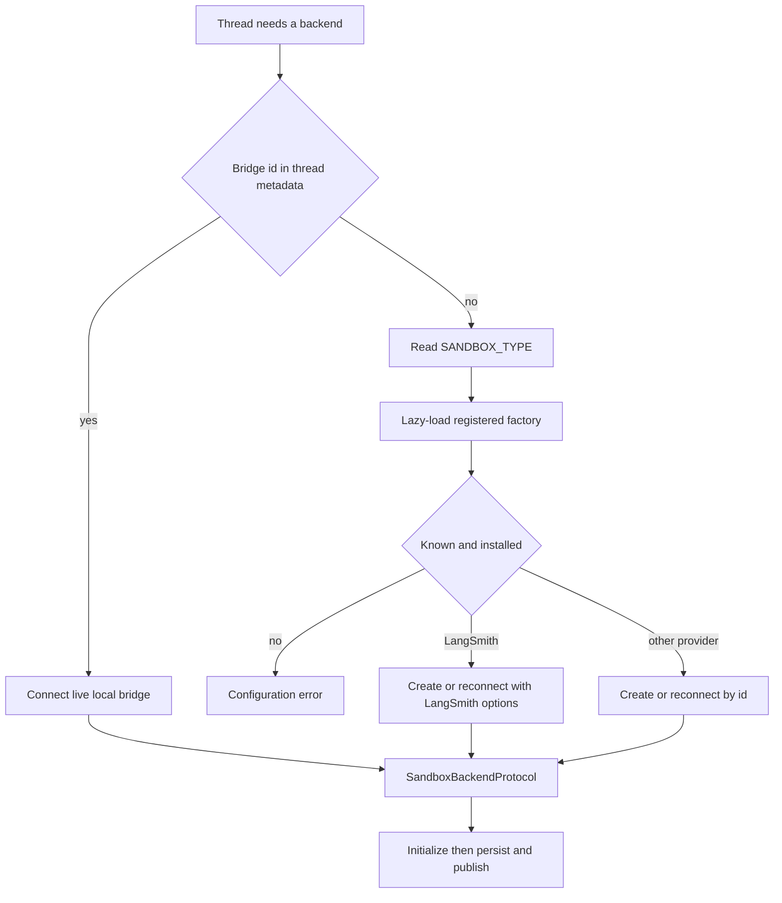

# Sandbox Providers and Local Bridges

Open SWE exposes repository execution through `SandboxBackendProtocol`. A configured provider creates or reconnects a managed backend; separately, a thread already bound to a bridge uses the user's local machine instead. The lifecycle, not the registry, owns binding a backend to thread metadata and deciding whether it is safe to replace it. See [sandbox lifecycle](../architecture/sandbox-lifecycle.md) for the broader thread flow and [configuration](../operations/configuration.md) for deployment-wide settings.

## Provider selection and installation

`SANDBOX_TYPE` defaults to `langsmith`. The registry lazily resolves `langsmith`, `daytona`, `modal`, `runloop`, `e2b`, or `local`, so an unselected provider module and SDK are not imported. An unknown selector raises `ValueError` with the supported values.

LangSmith and Local are part of the base installation. Daytona, Modal, Runloop, and E2B are optional: install the selected `sandbox-<name>` extra, or all of them with `sandbox-providers`. The registry recognizes a missing provider SDK during import and turns it into an actionable `ValueError`; startup eagerly performs this check for an optional selected provider, rather than deferring it to the first sandbox request.

Every factory receives an optional existing id. `create_sandbox()` forwards snapshot, resource, and arbitrary create-body options only when the provider is LangSmith. Native async factories are awaited; synchronous factories run in `asyncio.to_thread`, which keeps their SDK or filesystem work off the event loop.

```mermaid
flowchart TD
    Need["Thread needs a backend"] --> Bound{"Bridge id in thread metadata"}
    Bound -->|"yes"| ConnectBridge["Connect live local bridge"]
    Bound -->|"no"| Select["Read SANDBOX_TYPE"]
    Select --> Load["Lazy-load registered factory"]
    Load --> Valid{"Known and installed"}
    Valid -->|"no"| ConfigError["Configuration error"]
    Valid -->|"LangSmith"| Managed["Create or reconnect with LangSmith options"]
    Valid -->|"other provider"| Factory["Create or reconnect by id"]
    ConnectBridge --> Backend["SandboxBackendProtocol"]
    Managed --> Backend
    Factory --> Backend
    Backend --> Bind["Initialize then persist and publish"]
```
The selector provisions managed backends only; an existing bridge binding takes precedence and reconnects to the local machine.

## Startup validation

The FastAPI lifespan calls `validate_sandbox_startup_config()` before serving. For LangSmith, this validates configured resource and TTL values as integers, rejects negative TTLs, and requires `SANDBOX_CREATE_EXTRA_JSON` to be a JSON object. It does not create a box during validation. Other provider credentials are checked by their factories; the optional-provider import check is the exception described above.

## Safe thread binding and replacement

`ensure_sandbox_for_thread()` reads thread metadata and first detects a bridge-form sandbox id. Otherwise it reuses a cached managed backend or reconnects by the recorded id; if no id exists, it resolves workspace snapshot, resource, and create parameters and boots a new sandbox. Git identity is configured for managed backend creation and reuse.

A LangSmith `ResourceNotFoundError` is translated to `SandboxGoneError`: the deleted box has no working tree, so it is recreated. Other reconnect or proxy-refresh failures become `SandboxUnreachableError`. They normally fail the run rather than replacing a box that may contain uncommitted work. Callers that can regenerate their checkout, such as reviewer flows, may set `allow_replacement=True`.

Creation is deliberately ordered: initialize the new backend, persist its id (and recorded base proxy configuration) in thread metadata, provision its tool URL, then publish it into the in-process backend cache. This prevents a later operation from adopting an incompletely initialized backend. Recreation likewise refuses a bridge binding and requires a distinct new id before updating metadata.

The provider abstraction intentionally has no delete operation. Managed sandbox reclamation is controlled by creation-time idle and delete-after-stop TTLs, avoiding a metadata-driven deletion that could destroy the only working tree.

## Managed providers

| Provider | Connect or create | Required or notable configuration |
|---|---|---|
| `langsmith` | Async get by box id or create a box | `LANGSMITH_API_KEY`; endpoint from `LANGSMITH_ENDPOINT`; supports snapshot, resources, TTLs, create fields, proxy configuration, and stop during recreation |
| `daytona` | Get by id or create from a snapshot | `DAYTONA_API_KEY` and `DAYTONA_SANDBOX_SNAPSHOT` |
| `modal` | Reattach by id or create in an app | Modal credentials and `MODAL_APP_NAME` |
| `runloop` | Retrieve a devbox or create one | `RUNLOOP_API_KEY` |
| `e2b` | Connect by id or create a sandbox | `E2B_API_KEY`, optional `E2B_TEMPLATE`, and a one-hour timeout |
| `local` | Always creates a host-backed backend and ignores ids | Optional `LOCAL_SANDBOX_ROOT_DIR`; no isolation |

### LangSmith provisioning and proxy egress

LangSmith sandbox clients use `LANGSMITH_API_KEY` and normalize `LANGSMITH_ENDPOINT` to an SDK base ending in `/v2/sandboxes`. New boxes omit an absent snapshot id so the platform chooses its root snapshot. Defaults are 4 vCPUs, 16 GiB memory, 128 GiB filesystem capacity, a two-hour idle TTL, and a 30-day delete-after-stop TTL. If a caller overrides only CPU or memory, the other is passed as `None` rather than combined with a default.

`SANDBOX_CREATE_EXTRA_JSON` supplies deployment create fields, while call-specific `create_params` win on collisions. Because the SDK has no public passthrough for unmodeled fields, the provider wraps its HTTP client only to merge them into `POST /boxes`. Retriable creation failures get at most three attempts.

For LangSmith only, lifecycle creation and reconnection mint a GitHub App installation token and configure the managed proxy. The proxy sends Basic authentication to `github.com` and `*.github.com`; it sends Bearer authentication to `api.github.com` and exposes only a placeholder `GH_TOKEN` to satisfy `gh`. The actual token is therefore injected on egress rather than written to the box. Caller-provided proxy rules are preserved after obsolete built-in rules are removed. If a proxy update reports the box is not ready, the provider starts it best-effort and retries the update.

`TimeoutLangSmithSandbox` runs timed commands through a nonblocking command handle, enforces a client deadline of command timeout plus `SANDBOX_EXECUTE_CLIENT_GRACE_SECONDS` (default 30 seconds), and returns exit code 124 for server or client timeouts. Client expiry best-effort kills the command. Supported WebSocket setup or stream failures use the base execution fallback. Command retry is intentionally narrow: only `SandboxRetryableConnectionError`, which denotes a rejected WebSocket upgrade before an execute frame was sent, is retried, with at most four jittered exponential-backoff attempts.

## Local provider and desktop bridge

The `local` provider is for supervised development only: it executes commands directly on the server host. It creates the root directory, constructs a non-inheriting environment after excluding selected model, LangSmith, and OAuth-broker secrets, and ignores persisted sandbox ids. Unless `GIT_CONFIG_GLOBAL` is explicitly configured, it writes a root-local `.gitconfig-sandbox` that includes the user's Git config; recurring bot identity updates therefore do not overwrite `~/.gitconfig`.

A bridge is different from `SANDBOX_TYPE=local`: it binds one thread to the user's own CLI machine. A bridge id stored as the thread's sandbox id bypasses managed provider creation, proxy refresh, and global Git identity changes. `BridgeSandboxBackend.connect()` checks liveness and refuses an offline bridge rather than silently substituting a cloud or local backend.

The async bridge backend queues `execute`, `upload_files`, and `download_files` requests for the CLI's long poll and converts its response to the backend protocol types. It subscribes before enqueueing, re-reads persistent request state on liveness ticks, and detects disconnection; notifications lost between processes can add latency but do not determine correctness. The application listener uses PostgreSQL notifications and prunes bridges whose heartbeat expired, so pending work on a departed machine fails rather than waiting indefinitely.

## Adding or operating a provider

A built-in provider needs a `create_<name>_sandbox(sandbox_id: str | None = None)` factory returning `SandboxBackendProtocol`, plus its `(module, function)` entry in `SANDBOX_FACTORIES`. Factories may be synchronous or asynchronous. Define the dependency extra where appropriate, ensure missing SDKs produce an operationally useful error, and test both creation and reconnection.

Provider authors must explicitly decide which LangSmith-oriented capabilities are unsupported or need equivalents: snapshot and resource inputs, workspace proxy credential refresh, safe missing-versus-unreachable failure classification, and stopping during recreation. Do not hide a reconnect failure by returning a blank replacement when a persistent working tree could be lost.

## Focused verification

`tests/sandbox/test_langsmith_sandbox_config.py` covers partial CPU/memory override behavior, retryable creation, extra-field injection only on box creation, restoration of the snapshot transport hook, missing-box classification, and workspace service URL requests. The registry's optional-extra behavior should be verified at startup and dispatch boundaries; bridge changes should test liveness, queued request completion, timeout, and disconnection behavior.
