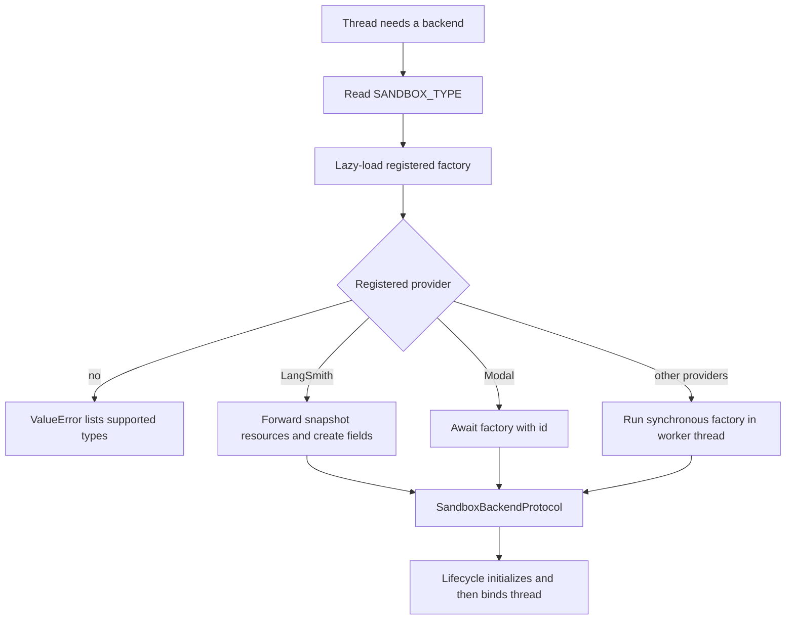
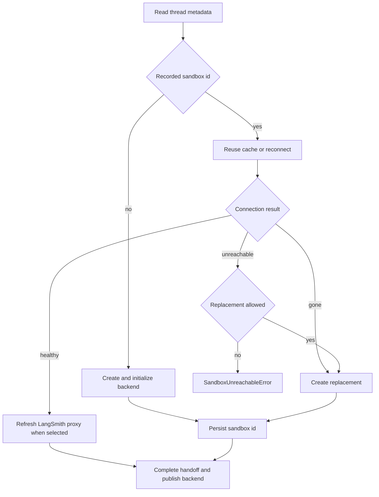

# Sandbox provider implementations

Open SWE sends repository and shell work through `SandboxBackendProtocol`. The provider registry is the selection seam; thread lifecycle code owns the persistent binding between a thread and a backend. This separation matters: selecting a provider changes provisioning, but it does not make it safe to replace a thread's existing working tree. See [sandbox lifecycle](../architecture/sandbox-lifecycle.md) for the wider thread flow and [configuration](../operations/configuration.md) for deployment configuration.

## Selection, dependencies, and startup checks

`SANDBOX_TYPE` defaults to `langsmith`. The registry lazily resolves `langsmith`, `daytona`, `modal`, `runloop`, `e2b`, or `local` to a factory; an unknown name raises `ValueError` with the supported names. Every factory accepts an optional `sandbox_id`, which means reconnect when present and create when absent.

LangSmith alone receives the registry's `snapshot_id`, CPU, memory, filesystem, and arbitrary create-body options. LangSmith and Modal factories are awaited directly; Local plus the Daytona, E2B, and Runloop wrappers run in `asyncio.to_thread` so their synchronous setup does not block the event loop.

```mermaid
flowchart TD
    Need["Thread needs a backend"] --> Select["Read SANDBOX_TYPE"]
    Select --> Load["Lazy-load registered factory"]
    Load --> Known{"Registered provider"}
    Known -->|"no"| Invalid["ValueError lists supported types"]
    Known -->|"LangSmith"| Config["Forward snapshot resources and create fields"]
    Known -->|"Modal"| Async["Await factory with id"]
    Known -->|"other providers"| Worker["Run synchronous factory in worker thread"]
    Config --> Backend["SandboxBackendProtocol"]
    Async --> Backend
    Worker --> Backend
    Backend --> Bind["Lifecycle initializes and then binds thread"]
```
The registry dispatch path and the point at which lifecycle code may bind a created backend.

Daytona, Modal, Runloop, and E2B SDK integrations are optional dependency groups. A base install includes the default LangSmith and Local implementations only. If an optional provider's own SDK import is missing, the registry changes that `ModuleNotFoundError` into an actionable `ValueError` naming `uv sync --extra sandbox-<provider>` (or `sandbox-providers`); unrelated missing imports still propagate. FastAPI calls `validate_sandbox_startup_config()` before serving, which eagerly performs that optional-provider import check. For LangSmith, it additionally checks numeric resource and TTL settings, rejects negative TTLs, and requires `SANDBOX_CREATE_EXTRA_JSON` to be a JSON object. API keys for the third-party factories are checked only when those factories run.

## Provider comparison

| Provider | Create or reconnect behavior | Required or notable configuration | Capability boundary |
|---|---|---|---|
| `langsmith` | Async get by box id or create a box, returned as `TimeoutLangSmithSandbox` | `LANGSMITH_API_KEY`; `LANGSMITH_ENDPOINT`; resource and TTL defaults; create JSON | Only built-in provider that honors registry snapshot/resource/create options, captures snapshots, configures proxy rules, stops an old box during recreation, and exposes workspace service URLs. |
| `local` | Creates `LocalShellBackend`; ignores ids | Optional `LOCAL_SANDBOX_ROOT_DIR`; optional explicit `GIT_CONFIG_GLOBAL` | Host execution with no isolation; intended only for supervised local development. |
| `daytona` | Gets an existing sandbox or creates from a snapshot | `DAYTONA_API_KEY`; `DAYTONA_SANDBOX_SNAPSHOT` defaults to `daytonaio/sandbox:0.6.0` | Synchronous third-party wrapper; selector-level LangSmith options are ignored. |
| `modal` | Reattaches with `Sandbox.from_id.aio` or creates in an app | Modal credentials; `MODAL_APP_NAME` defaults to `open-swe` | Native async third-party factory; selector-level LangSmith options are ignored. |
| `runloop` | Retrieves a devbox or creates one | `RUNLOOP_API_KEY` | Synchronous third-party wrapper; selector-level LangSmith options are ignored. |
| `e2b` | Connects by id or creates from an optional template | `E2B_API_KEY`; optional `E2B_TEMPLATE`; one-hour timeout | Synchronous third-party wrapper; selector-level LangSmith options are ignored. |

The table describes the built-in factories, not a common cloud-provider feature contract. In particular, snapshot capture, proxy configuration, and old-box stopping deliberately remain LangSmith-specific operations; a non-LangSmith selection does not acquire equivalents automatically.

## LangSmith provisioning and execution

### API endpoint, defaults, and extra create fields

Sandbox operations use the deployment's `LANGSMITH_API_KEY` and `LANGSMITH_ENDPOINT`; the former `SANDBOX_LANGSMITH_API_KEY` and `SANDBOX_LANGSMITH_ENDPOINT` overrides are not used. The implementation turns the API root into the SDK sandbox endpoint `/v2/sandboxes`. It requires an API key when constructing `LangSmithProvider`.

A new box uses a supplied snapshot, otherwise omits `snapshot_id` so LangSmith selects its root snapshot. Default provisioning is 4 vCPUs, 16 GiB memory, 128 GiB filesystem capacity, a two-hour idle TTL, and a 30-day delete-after-stop TTL; zero disables either TTL. If a caller overrides only CPU or memory, the other is passed as `None`, rather than mixing one override with a deployment default.

`SANDBOX_CREATE_EXTRA_JSON` supplies deployment-level fields and call-specific `create_params` win on collisions. Because the SDK has no public arbitrary-body seam, LangSmith temporarily wraps its transport to add those fields only to the `POST .../boxes` request. It also removes a falsey extra `snapshot_id`: an absent key selects the root snapshot, while an empty value would be invalid. Creation retries retryable status codes and known transient creation errors at most three times.

LangSmith can also expose a sandbox port through `create_workspace_service_url()`: it requests workspace-authenticated access from the box `service-url` endpoint and returns the validated service URL. That is an explicit LangSmith integration, not a capability supplied by `SandboxBackendProtocol`.

### Command deadlines and safe retry

`TimeoutLangSmithSandbox` protects an agent run from a WebSocket command that never yields an exit frame. With an effective command timeout, it starts a nonblocking command and waits for that timeout plus `SANDBOX_EXECUTE_CLIENT_GRACE_SECONDS` (30 seconds by default). A server timeout and a client-expired deadline both become an exit-124 `ExecuteResponse`; only the client case best-effort kills and drains the command. WebSocket setup, reload, and supported stream failures fall back to the base async execution path. With no effective timeout it delegates to that base path directly.

Command retries are deliberately narrow. Only `SandboxRetryableConnectionError` is retried, because it represents a rejected WebSocket upgrade before an execute frame was sent. The retry wrapper uses no more than four jittered exponential-backoff attempts, avoiding a retry of a command that might already have changed the working tree.

### GitHub proxy rules

For LangSmith thread sandboxes, lifecycle obtains a scoped GitHub access token and configures the box proxy instead of writing the real token into the filesystem. The proxy adds Basic authentication for `github.com` and `*.github.com`, and Bearer authentication plus a placeholder `GH_TOKEN` for `api.github.com` so `gh` will run. It preserves eligible caller rules while replacing stale managed rules and can append a thread-tool rule.

Proxy configuration itself is retried for transient HTTP/transport failures. A proxy update rejected because a box is not ready triggers a best-effort start, then one more configured retry sequence; a failure to refresh a reused box is treated as `SandboxUnreachableError`. Non-LangSmith providers skip this credential refresh path.

## Thread binding and provider failures

`ensure_sandbox_for_thread()` reads thread metadata and either reuses a cached connection, reconnects the recorded id, creates a new backend, or—when a task worker is validly attached—uses its coordinator's shared backend. New creation resolves a workspace's ready snapshot, resource settings, and create parameters; an inherited workspace takes those sandbox settings from the default workspace. The lifecycle reapplies the bot Git identity on each use and, for LangSmith, refreshes proxy credentials.

A deleted LangSmith box is distinguishable from an unreachable one. `ResourceNotFoundError` is mapped to `SandboxGoneError`, so the lifecycle creates a replacement. Other reconnect or proxy-refresh failures become `SandboxUnreachableError` and normally end the run rather than swap an unknown working tree for an empty backend. `allow_replacement=True` permits replacement for callers, such as read-only review preparation, whose checkout is re-derived each run. Task workers instead require their coordinator to recover first.

```mermaid
flowchart TD
    Meta["Read thread metadata"] --> Bound{"Recorded sandbox id"}
    Bound -->|"no"| Create["Create and initialize backend"]
    Bound -->|"yes"| Connect["Reuse cache or reconnect"]
    Connect --> Status{"Connection result"}
    Status -->|"healthy"| Refresh["Refresh LangSmith proxy when selected"]
    Status -->|"gone"| Replace["Create replacement"]
    Status -->|"unreachable"| Policy{"Replacement allowed"}
    Policy -->|"no"| Fail["SandboxUnreachableError"]
    Policy -->|"yes"| Replace
    Create --> Persist["Persist sandbox id"]
    Replace --> Persist
    Refresh --> Publish["Complete handoff and publish backend"]
    Persist --> Publish
```
The lifecycle preserves a working-tree-bearing binding unless deletion is known or a caller explicitly accepts replacement.

Initialization precedes publication. A newly created id is written to thread metadata only after creation, Git identity, and LangSmith proxy setup succeed; the backend is cached only after binding, handoff completion, and tool-URL provisioning. This ordering stops subsequent work from adopting a half-initialized backend. Recreation also requires a distinct new id, writes metadata before publishing it, and tries to stop the old backend only for LangSmith; an unsupported or failed stop is reported after the new binding succeeds.

The `SandboxProvider` abstraction intentionally has no delete operation. A sandbox may be the only copy of uncommitted work and an absent metadata read is not proof that the box is disposable. LangSmith instead reclaims boxes through the idle and delete-after-stop TTLs set when they are created.

## Local backend safety boundary

`local` runs directly on the operator's host. It creates the configured root directory (or uses the current directory), ignores the supplied sandbox id, and supplies an explicit environment with `inherit_env=False`. It removes selected model-provider, LangSmith, and OpenAI OAuth broker credentials before starting `LocalShellBackend`.

The lifecycle still configures a bot Git identity. To prevent that from modifying the developer's `~/.gitconfig`, Local creates `<root>/.gitconfig-sandbox` and points `GIT_CONFIG_GLOBAL` at it unless the operator set that variable explicitly. The scoped file includes the host config when present, retaining aliases and credential helpers. This is containment for host configuration, not sandbox isolation; use `local` only with human oversight.

## Extending and verifying providers

To add a built-in provider, implement `create_<name>_sandbox(sandbox_id: str | None = None)` in `openswe/sandboxes/providers/`, return a `SandboxBackendProtocol`, and add its module/function tuple to `SANDBOX_FACTORIES`. A factory may be synchronous or asynchronous; registry dispatch handles either. A custom implementation can extend `deepagents.backends.sandbox.BaseSandbox`, which provides file operations through command execution, but it must support the async operations used by lifecycle code.

Design reconnection and failure typing before registering a provider. Do not hide a failed reconnect by returning a newly created empty backend: lifecycle assumes a recorded id protects a potentially uncommitted working tree. Also decide explicitly whether the provider supports operations that are currently LangSmith-only—workspace snapshots, service URLs, proxy credential refresh, and stopping during recreation.

Focused tests cover optional-extra diagnostics, provider-specific Daytona/E2B defaults, Local environment and Git configuration isolation, LangSmith create-body and missing-box behavior, deadline/retry behavior, proxy auth, and lifecycle publication/recovery ordering. The tests are useful change guards because the provider adapters are thin while the safety properties are enforced across registry, provider, and lifecycle boundaries.
