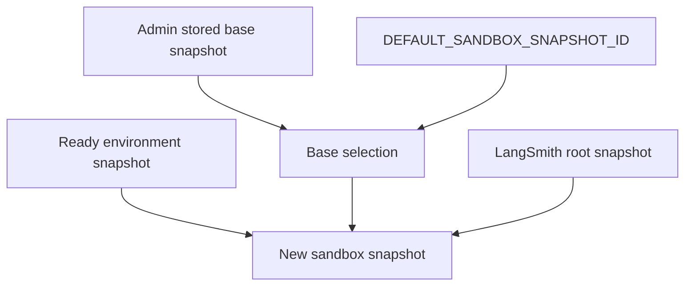

# Runtime Configuration and Customization

Open SWE combines **deployment environment variables** with a small number of
**admin-managed, LangGraph Store-backed settings**. Environment values are read
by the server process (generally at import or startup), so changing them requires
a restart. Stored settings are resolved while runs are built and can take effect
without a redeploy. This page covers settings that change behavior or security;
for deployment steps, see [Deployment](deployment.md).

> **Secret boundary:** do not put GitHub user access tokens in deployment
> variables. LangSmith sandboxes receive GitHub authentication through proxy rules
> populated with runtime-minted GitHub App installation tokens.

## Runtime entrypoint and startup checks

`langgraph.json` is the platform contract: it registers the `agent`, `reviewer`,
`analyzer`, `chat`, and `scheduler` graphs and mounts `agent.webapp:app` as the
HTTP application. The platform loads `.env` and expires checkpointer state using
the `delete` TTL strategy: a 60-minute sweep and a default TTL of 43,200 minutes
(30 days).

The FastAPI lifespan performs validation before accepting requests:

1. It pins the process to one event loop, including before queue workers are
   created.
2. It validates the selected sandbox provider.
3. In localhost dashboard development, it validates that the API credential for
   the configured default model is available (OpenAI desktop OAuth is an allowed
   substitute for an OpenAI key).
4. On shutdown, it closes cached model clients.

`DASHBOARD_ALLOWED_ORIGINS` is a comma-separated CORS allowlist. CORS middleware
is installed only when the list is nonempty, always permits credentials, and the
application rejects `*` because it is incompatible with credentialed CORS.

## Sandboxes

### Select and validate a provider

`SANDBOX_TYPE` selects a backend and defaults to `langsmith`. Built-in choices
are `langsmith`, `daytona`, `modal`, `runloop`, `e2b`, and `local`; an unknown
choice raises `ValueError` naming the supported values. Factories are loaded
lazily from the registry. The `local` backend runs commands on the host, without
isolation, and should be limited to local development.

Sandbox startup validation currently delegates to
`LangSmithProvider.validate_startup_config()` only for the `langsmith` selection;
other provider failures may therefore surface when their factory is first used.
A provider extension is a factory registered in `SANDBOX_FACTORIES` that returns
a `SandboxBackendProtocol`; synchronous factories are moved to a worker thread,
while coroutine factories are awaited.

### LangSmith snapshot, resource, and credential settings

For a new LangSmith sandbox, `DEFAULT_SANDBOX_SNAPSHOT_ID` is optional: absent a
selected environment snapshot and an admin override, the provider uses its root
snapshot. Optional integer settings shape new sandboxes:

| Variable | Default | Meaning |
|---|---:|---|
| `DEFAULT_SANDBOX_SNAPSHOT_FS_CAPACITY_BYTES` | 128 GiB | Filesystem capacity |
| `DEFAULT_SANDBOX_VCPUS` | 4 | Virtual CPUs |
| `DEFAULT_SANDBOX_MEM_BYTES` | 16 GiB | Memory |
| `DEFAULT_SANDBOX_IDLE_TTL_SECONDS` | 7,200 | Idle auto-stop; `0` disables it |
| `DEFAULT_SANDBOX_DELETE_AFTER_STOP_SECONDS` | 2,592,000 | Delete-after-stop delay; `0` disables it |
| `SANDBOX_EXECUTE_CLIENT_GRACE_SECONDS` | 30 | Client grace period beyond a command timeout |

Invalid integer text fails configuration parsing. `SANDBOX_CREATE_EXTRA_JSON` can
inject a JSON object into LangSmith sandbox-create requests; invalid JSON or a
non-object value fails with `ValueError`. This is a deliberately provider-specific
escape hatch, so prefer supported settings when possible.

`SANDBOX_LANGSMITH_API_KEY` takes precedence over the ordinary LangSmith key
(`LANGSMITH_API_KEY`, then `LANGSMITH_API_KEY_PROD`) for sandbox operations.
`SANDBOX_LANGSMITH_ENDPOINT` similarly overrides `LANGSMITH_ENDPOINT`. Use both
to put sandbox creation, proxy configuration, and captures in a different
workspace from tracing. `ENVIRONMENT_SNAPSHOT_PREFIX` changes the `openswe`
prefix used for captured environment snapshot names, avoiding collisions when
several deployments share a workspace.

Only the `langsmith` factory receives `snapshot_id`, memory, CPU, filesystem, and
extra-create overrides from `create_sandbox`; the other providers receive only an
optional existing sandbox ID.

### Runtime base-snapshot precedence

An administrator can update `base_snapshot_id` from the dashboard Sandbox page
or `PUT /dashboard/api/sandbox-settings`. The Store value is opaque free text
(up to 512 characters), and is intended to let a rebuilt image roll out without
a server restart. A ready environment snapshot has higher precedence than this
base selection.

The diagram shows snapshot selection: an environment wins; otherwise the stored
admin value wins over the deployment default, with the provider root as fallback.

A Store read error during base selection is fail-soft: it is logged and treated
as no admin setting, so the deployment default can still create the sandbox.
`get_sandbox_settings` reports stored, environment, and effective values plus an
`admin`, `env`, or `unset` source.

## Models and gateway routing

### Defaults, supported selections, and safety limits

`DEFAULT_MODEL_ID` is chosen at process import: it is `anthropic:claude-opus-5`
when `ANTHROPIC_API_KEY` is set and `OPENAI_API_KEY` is not, otherwise
`openai:gpt-5.6-sol`. `LLM_MODEL_ID` overrides that deployment default. The
dashboard's supported-model catalog controls which model/effort pairs may become
team defaults; an effort without a model, an unsupported model, or an incompatible
pair is rejected. Deprecated stored selections are normalized away.

The deployment's default is below stored team, profile, thread, and explicit run
selection. Team settings can independently supply agent, subagent, reviewer,
reviewer-subagent, grouping, chat, and title model/effort pairs, as well as a
team default repository and organization guidelines. `org_guidelines` is trimmed
and capped at 10,000 characters. The Fable switch is a workspace-wide kill switch:
when disabled, any resolved Fable model is replaced with a compatible non-Fable
fallback before model construction.

`DEFAULT_LLM_MAX_TOKENS` is 64,000 and is a completion/output budget, not a
model context-window limit. Runs use a graph recursion limit of 9,999; the agent
and reviewer also limit model calls to 5,000.

### Provider calls, fallback, and gateway

`make_model` caches clients per event loop and configuration. It supplies six
retries and a 600-second per-request timeout to OpenAI, Anthropic, Baseten,
Google GenAI, and Fireworks calls. OpenAI defaults to the Responses API and uses
`OPENAI_BASE_URL` or the legacy `OPENAI_API_BASE` when supplied. Direct Baseten
calls require `BASETEN_API_KEY`.

`LLM_FALLBACK_MODEL_ID` can name an explicit fallback. When it is unset,
Anthropic primaries fall back to `openai:gpt-5.6-sol` and OpenAI primaries to
`anthropic:claude-opus-5`; other providers have no implicit cross-provider
fallback. Middleware is installed only when the fallback differs from the
primary.

LangSmith LLM Gateway routing is opt-in through
`LANGSMITH_GATEWAY_ENABLED`. A team setting of `true` or `false` overrides this
deployment default; an unset setting inherits it. The gateway supports OpenAI,
Anthropic, Baseten, Fireworks, and Google GenAI. It uses
`LANGSMITH_GATEWAY_API_KEY`, falling back to `LANGSMITH_API_KEY_PROD` then
`LANGSMITH_API_KEY`, and `LANGSMITH_GATEWAY_BASE_URL` defaults to
`https://gateway.smith.langchain.com`. A missing gateway key or unsupported
provider logs a warning and falls back to direct provider calls rather than
failing a run. `LANGSMITH_GATEWAY_OPENAI_USE_RESPONSES` defaults to true.

## Credentials, authentication, and allowlists

- **GitHub App:** configure `GITHUB_APP_ID`, `GITHUB_APP_PRIVATE_KEY`, and
  `GITHUB_APP_INSTALLATION_ID`; `GITHUB_WEBHOOK_SECRET` verifies inbound GitHub
  webhooks. Dashboard login and stored per-user GitHub tokens use the separate
  `GITHUB_APP_CLIENT_ID` and `GITHUB_APP_CLIENT_SECRET` OAuth client.
- **Dashboard:** `DASHBOARD_JWT_SECRET` signs session and OAuth-state JWTs.
  `DASHBOARD_API_BASE_URL`, `DASHBOARD_BASE_URL`, and
  `DASHBOARD_ALLOWED_ORIGINS` must describe the browser/API deployment correctly.
  `TOKEN_ENCRYPTION_KEY` may be a most-recent-first comma/newline list of Fernet
  keys: writes use the first and reads try each, supporting gradual rotation.
- **Repository routing:** `ALLOWED_GITHUB_ORGS` and
  `ALLOWED_GITHUB_REPOS` accept a GitHub/Linear webhook when either the org or
  the `owner/repo` matches. Empty lists allow all repositories. The org list also
  gates dashboard login and makes Slack/dashboard edits outside it require an
  explicit full GitHub URL; GitHub membership/API errors fail closed.
- **Administrative access:** `CONFIGURED_ADMINS` is a comma-separated login or
  email allowlist; empty means no browser user is an admin.
  `ADMIN_OIDC_SUBJECTS` optionally permits GitHub Actions OIDC callers, and an
  empty value disables that path; `ADMIN_OIDC_AUDIENCE` defaults to `open-swe`.
  `OBSERVABILITY_AUTHORIZED_EMAILS` grants the read-only observability tools to
  listed emails, while configured admins always qualify.

For completion callbacks, both `RUN_COMPLETE_WEBHOOK_SECRET` and an absolute,
non-loopback HTTPS `COMPLETION_WEBHOOK_URL` ending in `/webhooks/run-complete`
are required in practice. With the secret absent, the endpoint rejects every
request; with a relative or loopback URL, dispatch attaches no webhook so a
platform rejection cannot break run creation. The dispatch appends the secret as
a `token` query parameter when it attaches the callback.

## Prompt and code customization seams

`DEFAULT_PROMPT_PATH` replaces the packaged `agent.resources/default_prompt.md`.
The loader trims the file, escapes braces for template interpolation, and inserts
nonempty content as **Custom Instructions**. Read errors, a missing file, or an
empty file only log/produce no custom section, rather than stopping a run. Use
this for organization-wide guidance; use `AGENTS.md` in a target repository for
repository-specific instructions.

For structural customization, `get_agent()` in `agent/server.py` is the assembly
seam for the agent model, sandbox backend, tool list, prompt, and middleware.
Use provider factories for a new sandbox implementation and register the factory
in the sandbox registry. For an external trigger, add a FastAPI route that
constructs the run's configurable source, repository, and user identity, and add
an appropriate reply tool if the trigger needs outbound communication.

## Related pages

- [Deployment](deployment.md)
- [Authentication and security](../concepts/auth-and-security.md)
- [Models, profiles, and instructions](../concepts/models-profiles-instructions.md)
- [Sandbox providers](../integrations/sandbox-providers.md)
- [Observability and MCP](../integrations/observability-and-mcp.md)
