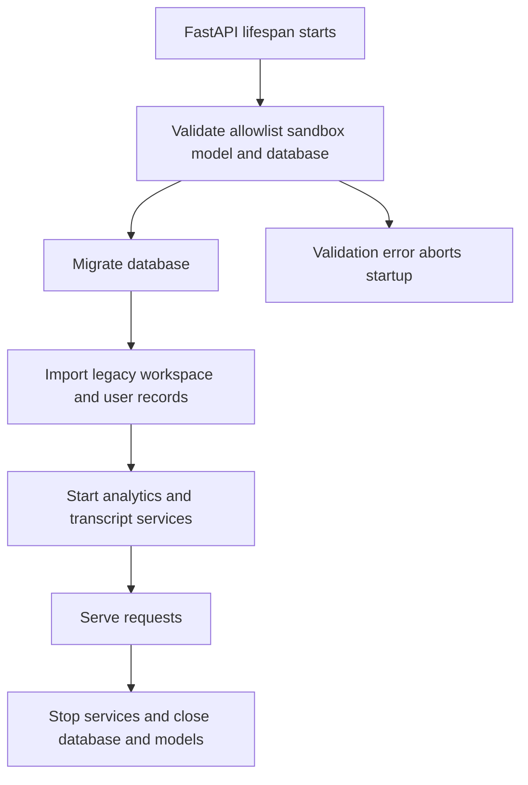
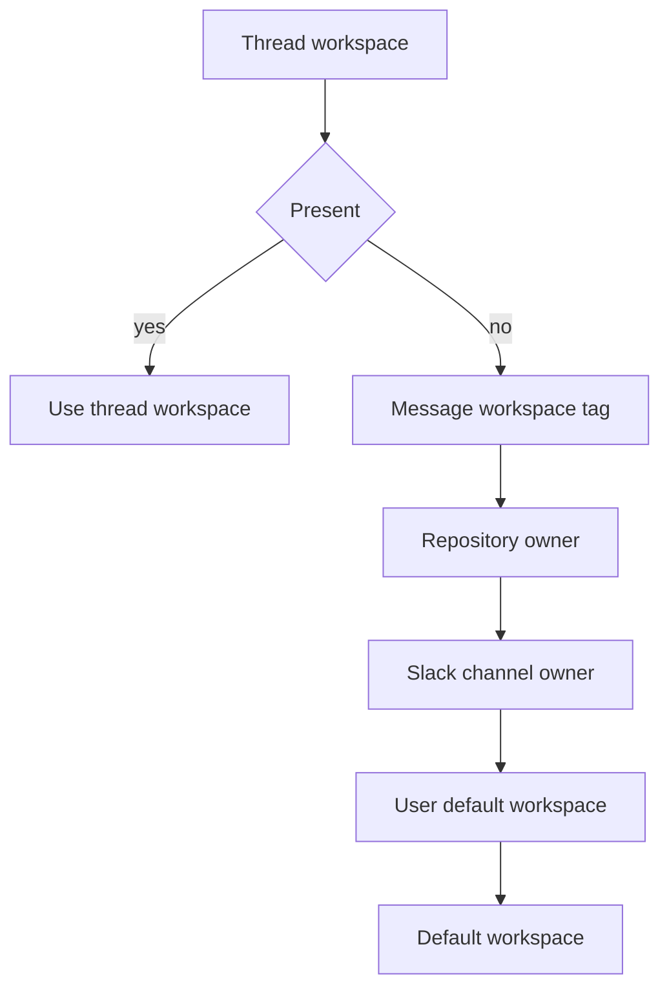

# Configuration and Workspace Administration

Open SWE has four configuration scopes. Keep credentials and deployment-wide defaults in the **environment**; use persisted settings only for the scope they are designed to control.

| Scope | Owner and persistence | Operational effect |
| --- | --- | --- |
| **Environment** | Deployment process; declared by `agent/config.py` and loaded from `.env` by `langgraph.json` | Credentials, provider choice, platform endpoints, sandbox defaults, routing policy, and feature defaults. A deployment restart is normally required after changing it. |
| **Instance** | One persisted `team_settings/default` record | Defaults inherited by every workspace, such as models, review behavior, Gateway, and Fable controls. Admin-written. |
| **Workspace** | A persisted workspace row plus a sparse `workspace_settings/<slug>` override record | Repository and Slack-channel ownership, scripts and snapshots, resource overrides, and settings which supersede the instance value. Admin-written. |
| **User and thread** | User profile namespaces and thread/run configurable data | Personal model/repository preferences and the most specific run choices. They layer above workspace defaults where the caller supports them. |

This page maps how to change those planes rather than enumerating secrets. `agent/config.py` is the environment schema, and [Deployment](deployment.md) is the installation guide. See [Authentication and security](../concepts/auth-and-security.md), [Models, profiles, and instructions](../concepts/models-profiles-instructions.md), and [Sandbox providers](../integrations/sandbox-providers.md) for domain detail.

## Environment configuration: declared once and read lazily

**Scope: environment.** `ENV` is the application registry. Its `EnvVar` objects consult the process environment at access time, rather than capturing values at import time. This permits late secret injection, rotation, and test overrides. Empty or whitespace-only values are unset; the canonical name beats every alias. Typed readers parse comma-separated lists and integers, while boolean parsing recognizes conventional truthy and falsy values (an unrecognized value returns the caller's boolean default). Accessing an undeclared name raises explicitly, so introducing a variable is a schema change in `agent/config.py`, not an ad hoc `os.environ` read.

Add aliases and deprecation metadata to the registry, not to individual consumers. The registry can report deprecated names in use and suppresses a warning for a deprecated name whose declared replacement is also configured. Mark secrets there, but do not put secret values in documentation, workspace scripts, or workspace create parameters.

### Platform topology and retained state

**Scope: environment/platform.** `langgraph.json` exposes six graphs: `agent`, `reviewer`, `analyzer`, `review-scout`, `chat`, and `scheduler`; it mounts `agent.webapp:app` as the HTTP application. Its checkpointer has delete-based retention with a 60-minute sweep and a 43200-minute default TTL. The platform reads `.env` as its environment file.

## Startup validation and failure boundaries

**Scope: environment and persistent database.** `agent.api.app` pins the process to one event loop before queue workers are built and again in FastAPI lifespan startup. Before serving, lifespan validates the GitHub login allowlist, sandbox configuration, localhost-development model credentials, and database configuration, then runs database migrations. It attempts legacy workspace and user Store imports; an import failure is logged rather than aborting startup. Workspace repository routing then remains deliberately fail-closed until the missing ownership data can be imported, so GitHub receives a retryable failure instead of an incorrect success. Analytics and the transcript listener are also best-effort startup services. Shutdown stops those services, closes the database, and closes cached model clients.

The lifespan separates fatal configuration validation from recoverable migration/import and auxiliary-service failures.

`DASHBOARD_ALLOWED_ORIGINS` is checked during app construction. A wildcard is rejected because dashboard CORS uses credentials; nonempty explicit origins install credentialed CORS middleware.

## Workspace administration and repository ownership

**Scope: workspace, with environment fallback.** A workspace owns one or more repositories—each repository may belong to exactly one workspace—plus optional Slack channels, MCP connections, workspace settings, prompt material, setup/update scripts, and sandbox/snapshot details. The database constraints make conflicting slugs, repository bindings, and channel bindings write conflicts rather than ambiguous routing. Workspace definitions cap names, prompts, scripts, repository/channel counts, and create-parameter size; repository names are normalized and deduplicated case-insensitively.

Workspace `create_params` are JSON-only and reject credential-like keys and proxy-auth fields. This prevents an administrator-facing configuration record from becoming a secret store. Put credentials in deployment configuration or the appropriate encrypted integration store instead.

A workspace can specify a base snapshot, resource overrides, and a snapshot name; it can also define a setup script and an update script. Refresh executes scripts in a disposable builder sandbox and captures the resulting immutable snapshot. Runs use the recorded immutable snapshot ID rather than the moving `:latest` tag, so an in-progress refresh cannot alter a reconnecting run. The optional update script is refreshed at most hourly while the workspace is used; its per-run invocation has a separate, tighter environment-controlled deadline.

### Workspace resolution and safe webhook routing

**Scope: thread, workspace, user, then environment fallback.** New-work resolution is ordered: existing thread workspace, `workspace:<slug>` (or legacy `env:<slug>`) tag in the opening message, repository owner, Slack-channel owner, user's default workspace, then `default`. A missing or unavailable workspace snapshot falls back to the configured base snapshot.

This is the first-match workspace-resolution order; repository ownership precedes Slack and user preference.

GitHub webhook admission has stricter semantics than normal run placement. `OPEN_SWE_UNASSIGNED_REPO_WORKSPACE` is `default` or `ignore` (invalid values become `default`). An owned repository is always routable. Under `ignore`, an unowned repository is dropped only after the workspace table is known to be populated. A failed ownership lookup, a pending legacy import, or an unpopulated table raises instead, allowing the webhook layer to return a retryable error rather than silently lose a delivery. Ordinary workspace selection logs a lookup failure and uses `default`, because placing a run is preferable to refusing it.

Dashboard operations that select a repository separately prove access against GitHub: a user operation uses the user's refreshed OAuth token; a workspace operation uses the configured GitHub App installation token. GitHub 401, 403, 404, and unexpected statuses become useful HTTP errors rather than trusting a submitted `owner/repo` string.

## Persisted settings and model precedence

### Instance and workspace settings

**Scope: instance and workspace.** `WorkspaceSettingsUpdate` is the shared schema for the instance record and a workspace's sparse override. Effective values merge in this order: hardcoded defaults, instance settings, then workspace fields that are neither missing nor `None`. The effective settings read is intentionally fail-soft: Store errors fall back to hardcoded defaults so an unavailable Store does not fail every run.

Administrators write the instance record through `PUT /dashboard/api/settings` (the old `/team-settings` alias remains), and write a selected workspace through `PUT /dashboard/api/workspaces/{workspace}/settings`. Workspace `None` means inherit from the instance; deleting its override returns it to inheritance. Settings include review toggles and instructions, default repository, Gateway/Fable/model-routing controls, agent/reviewer/chat/thread-title model pairs, and three agent-routing tiers. Model and effort pairs are validated against the supported catalog; an effort without a model, unsupported IDs, or unsupported pair is rejected. Review instructions are trimmed and length-limited.

A deprecated persisted model is cleared; a stale non-deprecated model resolves to a supported same-provider alternative when possible, then to the deployment default. Chat has no independent hardcoded default and inherits the agent model when absent or invalid. The Fable toggle is a kill switch: turning it off replaces stored Fable defaults with safe non-Fable pairs, and model construction also gates a resolved Fable model so it cannot reach `make_model` while disabled.

### User profile and thread/run settings

**Scope: user, then thread/run.** A signed-in user's profile is stored separately from OAuth credentials: editable preferences are in `profiles`, while encrypted GitHub access/refresh tokens are in `oauth_tokens`. This split prevents a profile save and OAuth refresh from overwriting each other. Profile updates validate main/subagent model-effort pairs and optionally hold default repository, branch, CI, routing, and UI preferences. OAuth access is refreshed with a per-login async lock; an unrecoverably invalid refresh authorization is deleted so callers require re-login rather than repeatedly returning a dead token.

Callers may layer profile choices and a thread's `configurable` values above the effective workspace settings. Therefore an environment or workspace edit changes a fallback; it does not rewrite a stored user, thread, or explicit run selection.

### Deployment model defaults, retries, and Gateway

**Scope: environment, overridden by instance/workspace/user/thread selection.** `LLM_MODEL_ID` and `LLM_REASONING_EFFORT` define the deployment fallback pair. If no model is configured, Anthropic-only deployments default to `anthropic:claude-opus-5-5`; all others default to `openai:gpt-6-sol`. A configured default must be in the catalog and allowed as a default, and its effort must be supported, or resolution raises. `make_model` caches clients by event loop, model options, and routing choice, and shutdown clears/closes that cache.

Each constructed model receives six retries. OpenAI, Anthropic, Baseten, Google GenAI, and Fireworks receive a 600-second default request timeout, so a stalled request retries rather than parking a run indefinitely. `LLM_FALLBACK_MODEL_ID` supplies an explicit fallback; otherwise Anthropic and OpenAI primaries have cross-provider fallback IDs, while other provider families do not.

**Scope: environment plus instance/workspace.** Gateway routing is centrally applied in `make_model`. `LANGSMITH_GATEWAY_ENABLED` wins when present; otherwise a configured `LANGSMITH_GATEWAY_API_KEY` enables Gateway by default. The persisted tri-state `gateway_enabled` overrides that environment default when `true` or `false`; `None` inherits. The implementation routes OpenAI, Anthropic, Baseten, Fireworks, and Google GenAI when a usable Gateway/LangSmith key is available. An unroutable provider or missing key logs a warning and continues directly. Direct Baseten calls require `BASETEN_API_KEY`.

## Sandboxes and snapshots

**Scope: environment, with workspace-specific provisioning overrides.** `SANDBOX_TYPE` defaults to `langsmith`; the lazy registry recognizes `langsmith`, `daytona`, `modal`, `runloop`, `e2b`, and `local`. An unknown type raises `ValueError` listing supported types. Third-party Daytona, Modal, Runloop, and E2B integrations are optional dependency groups: selecting one makes startup eagerly import its factory, producing an installation-oriented error if its extra is absent. `local` runs on the host and is not isolation; use it only for development.

Only the LangSmith factory consumes `snapshot_id`, memory, vCPU, filesystem, and arbitrary creation parameters. Its deployment resource defaults are 128 GiB filesystem, 4 vCPUs, 16 GiB memory, 7200 seconds idle TTL, and 2592000 seconds delete-after-stop TTL; `0` disables either TTL. Startup validates LangSmith numeric resource fields and requires `SANDBOX_CREATE_EXTRA_JSON`, when configured, to be a JSON object. LangSmith sandbox operations use `LANGSMITH_API_KEY` and `LANGSMITH_ENDPOINT`; the removed sandbox-specific LangSmith overrides are not a configuration path.

Workspace snapshots are the runtime override mechanism: a workspace's explicit base snapshot and ready captured snapshot take precedence for runs in that workspace; otherwise provisioning uses the provider root snapshot. `WORKSPACE_SNAPSHOT_PREFIX` (with legacy `ENVIRONMENT_SNAPSHOT_PREFIX` alias) determines generated workspace snapshot names. `OPENSWE_SCRIPT_ROOT` changes where setup/update scripts and logs reside in the sandbox, particularly for the local provider.

## Secret handling and completion callbacks

**Scope: environment and encrypted persisted credentials.** Declare GitHub App, OAuth, Slack, LangSmith, provider, dashboard signing, and webhook secrets through the environment registry; refer to the installation documentation and declarations for required values. `TOKEN_ENCRYPTION_KEY` accepts one Fernet key or a most-recent-first comma/newline list. Writes use the first key and reads try every key, which supports staged key rotation. Missing encryption configuration stops encryption; decryption logs and returns an empty value for missing keys or invalid ciphertext.

`RUN_COMPLETE_WEBHOOK_SECRET` authenticates `/webhooks/run-complete` using constant-time comparison. It fails closed when unset, so callbacks and completion/failure replies remain disabled. Dispatch attaches a callback only if the secret exists and `COMPLETION_WEBHOOK_URL` is absolute and non-loopback; a relative or loopback URL is warned about and omitted, avoiding a platform-rejected webhook that would otherwise break run creation.

## Safe change plan and focused tests

1. **Add or rename environment configuration** in `agent/config.py`; use `ENV` from consumers and encode aliases/deprecation there. Do not expose a new secret through workspace settings.
2. **Change instance defaults** with the settings API/UI; create a workspace override only when the difference is intentionally local. Verify inherited fields by reading the workspace settings view.
3. **Change repository ownership** as a workspace definition, not merely a default repository preference. Test duplicates and webhook behavior under both unassigned-repository policies.
4. **Change a sandbox provider** with its required dependency extra and credentials, then run lifespan startup validation. For workspace scripts, test refresh/capture and ensure scripts contain no credentials.
5. **Change models or Gateway** with a catalog-valid model/effort pair and exercise fallback, workspace inheritance, and direct-provider behavior when Gateway cannot be applied.
6. Cover the failure boundaries: blank/alias/typed `ENV` reads; fatal startup validation versus recoverable import failure; ownership lookup failure returning a retryable webhook result; settings merge/fail-soft fallback; workspace snapshot immutability; and completion callback omission/fail-closed verification.

## See also

- [Deployment](deployment.md)
- [Authentication and security](../concepts/auth-and-security.md)
- [Models, profiles, and instructions](../concepts/models-profiles-instructions.md)
- [Sandbox providers](../integrations/sandbox-providers.md)
