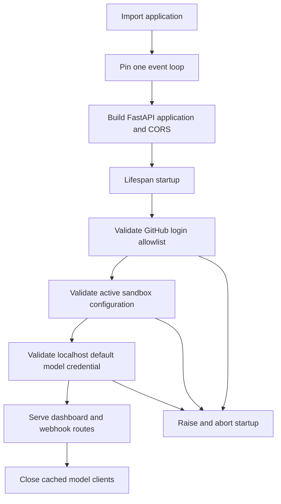

# Configuration and Runtime Settings

Open SWE has two configuration planes:

- **Deployment configuration** is the environment-variable schema in `agent/config.py`. It supplies credentials, endpoints, provider selection, URLs, and defaults. The central registry and [deployment](deployment.md) are authoritative for variable definitions and rollout details; do not put secret values in dashboard records or documentation.
- **Runtime administrator settings** are instance-wide LangGraph Store records. The dashboard changes only the supported operational choices—team defaults and the base sandbox snapshot—without redeploying. They do not replace deployment credentials.

A third, more specific runtime layer is a selected **Environment**: a reusable sandbox definition and captured snapshot. Its ready snapshot can override the general base snapshot for a run. See [dashboard UI](../integrations/dashboard-ui.md), [sandbox providers](../integrations/sandbox-providers.md), [models, profiles, and instructions](../concepts/models-profiles-instructions.md), and [authentication and security](../concepts/auth-and-security.md) for domain detail.

## The environment registry

`ENV` is the configuration boundary. Values are read lazily through declared `EnvVar` objects, rather than cached from `os.environ` at import time. This lets late secret hydration, rotation, and test monkeypatches take effect at the point of use. Blank or whitespace-only values are unset. A value supplied to `get()` wins over the declaration default; `optional()` ignores defaults; `require()` raises for an unset value.

The registry carries descriptions, secret classification, defaults, aliases, and deprecation metadata. Canonical names win over aliases; aliases are still reported as deprecated when used. Integer access fails on malformed values, lists are trimmed comma-separated values, and recognized boolean spellings are parsed while unrecognized boolean text falls back to the caller's default. Accessing an undeclared variable is an error, so adding a setting is a schema change in `agent/config.py`, not an ad-hoc environment read.

**Change rule:** declare a variable once in `agent/config.py`, including its secret and compatibility metadata, then consume it through `ENV`. The test suite enforces that literal configuration reads outside this registry do not creep into `agent/`.

### Deployment entrypoint

`langgraph.json` supplies `.env` to the platform, registers the `agent`, `reviewer`, `analyzer`, `chat`, and `scheduler` graphs, and mounts `agent.webapp:app` as the HTTP application. The checkpointer is configured for delete-based TTL cleanup, swept every 60 minutes, with a default TTL of 43200 minutes.

## Startup guards and shutdown

Application construction pins a single event loop before queue workers are built. `create_app()` rejects `*` in `DASHBOARD_ALLOWED_ORIGINS`: when explicit origins are present it installs credentialed CORS, for which a wildcard is unsafe. Lifespan startup pins the loop again, then validates the GitHub login allowlist, the active sandbox-provider configuration, and localhost-development credentials for the selected default model. A failure prevents serving; shutdown closes all cached model clients.

This shows the startup checks that must pass before FastAPI serves and the model-client cleanup on shutdown.

The GitHub guard requires `ALLOWED_GITHUB_ORGS` or `ALLOWED_GITHUB_USERS`, unless local-token authentication is enabled. Sandbox validation is provider-specific: LangSmith validates its numeric resource and TTL fields and extra JSON at boot, while an unknown `SANDBOX_TYPE` is rejected when a sandbox factory is resolved. Model validation deliberately runs only for an *explicit* `DASHBOARD_BASE_URL` beginning `http://localhost`; it checks the configured default model's provider credential, not selections that may later come from a team, profile, or thread.

## Precedence map

Configuration is resolved at the narrowest applicable scope. Environment variables remain deployment inputs; stored settings overlay them only where code explicitly consults Store.

| Decision | Resolution order | Operational consequence |
|---|---|---|
| Dashboard frontend URL | `DASHBOARD_BASE_URL`; otherwise `LANGGRAPH_URL` when the backend serves the UI | A separate frontend needs explicit public frontend/API URLs and an origin allowlist. |
| Gateway use | Team `gateway_enabled` when `true` or `false`; otherwise deployment gateway default | An unset team toggle inherits deployment intent. |
| Default model pair | Valid team choice; supported same-provider replacement for a stale choice; deployment `LLM_MODEL_ID`/effort or built-in default | Store outages degrade to defaults instead of stopping all runs. |
| Base sandbox snapshot | Selected Environment ready snapshot; stored admin base snapshot; `DEFAULT_SANDBOX_SNAPSHOT_ID`; provider root snapshot | An environment refresh does not alter a running sandbox. |

## Sandboxes and Environments

`SANDBOX_TYPE` defaults to `langsmith`; the factory registry supports `langsmith`, `daytona`, `modal`, `runloop`, `e2b`, and `local`. Only the LangSmith factory receives snapshot, resource, and extra-create parameters; other providers create or reconnect using an optional sandbox ID. An unsupported type raises a `ValueError` naming supported choices.

For LangSmith, unset resource controls resolve to a 128 GiB filesystem, 4 vCPUs, 16 GiB memory, a 7200-second idle TTL, and a 2592000-second deletion-after-stop TTL. Either TTL accepts `0` to disable that expiration. Startup rejects malformed resource/TTL numbers, negative TTLs, and invalid or non-object `SANDBOX_CREATE_EXTRA_JSON`. The provider retries transient creation errors, and its execution wrapper kills commands that exceed their timeout plus configured client-side grace instead of allowing a stalled socket to wedge a run.

### Runtime base-snapshot override

The Sandbox admin page uses `GET` and `PUT /dashboard/api/sandbox-settings`, protected by an administrator or configured admin-token identity. Its one Store record holds an opaque, trimmed `base_snapshot_id` of at most 512 characters plus update metadata. The read response reports the stored, environment, and effective values and whether the source is `admin`, `env`, or `unset`.

Provisioning reads this record fail-soft: Store failure is logged and falls back to the deployment snapshot. Clearing the stored value restores the environment default. This is intentionally appropriate for a runtime availability path, but operators should still repair Store connectivity rather than treating the fallback as durable state.

### Named environments

An Environment is a named definition containing prompt text, setup and optional update scripts, repository scope, optional resources/create parameters, and snapshot/refresh state. It is not a mutable image: a successful capture records an immutable snapshot ID, while a Docker-style `name:latest` tag moves to the new capture. Runs use that immutable ID, so a refresh cannot change an existing or reconnecting run.

A full refresh starts from the base snapshot, runs setup and update scripts, then captures; it is scheduled daily and can run on demand. A stale environment can also queue an update refresh from its current snapshot. The run that detects staleness runs its update script in its own sandbox before its first model call, while the background capture serves later runs. Failed refreshes preserve the prior ready snapshot. Environment create parameters reject credential-shaped fields and sensitive proxy headers: use deployment-managed credentials rather than persisting secrets in environment definitions.

## Models, team defaults, and gateway routing

The supported model catalog defines valid provider:model IDs, reasoning efforts, image support, and which models may be deployment defaults. `LLM_MODEL_ID` and `LLM_REASONING_EFFORT` supply the deployment fallback pair; invalid deployment IDs or efforts raise during resolution. Team settings are one Store record keyed `default`, covering review behavior, organization guidelines, a default repository, transcription, Fable, the gateway toggle, main/subagent pairs, adaptive-routing tiers, grouping, chat, and title choices.

Writes validate model-and-effort pairs: effort cannot exist without a model, and each effort must be supported by its model. Reads are fail-soft because they are on the run path. A stale, non-deprecated selection can be replaced by a supported model from the same provider; otherwise resolution reaches the global default. Chat inherits the agent choice when no valid chat pair exists, and review grouping inherits the reviewer subagent choice. Disabling Fable replaces persisted Fable defaults and a runtime gate prevents a disabled Fable model from reaching model construction.

`make_model()` adds six retries to every constructed client and a 600-second per-request timeout to OpenAI, Anthropic, Baseten, Google GenAI, and Fireworks. Clients are cached by event loop and effective options, then closed at lifespan shutdown. `LLM_FALLBACK_MODEL_ID` overrides the provider-derived cross-provider fallback; fallback middleware is installed only if a fallback exists and differs from the primary model.

Gateway routing is centralized in `make_model()`. `LANGSMITH_GATEWAY_ENABLED` is authoritative when set; otherwise a gateway-specific key enables it. Gateway credentials prefer the gateway-specific key and otherwise use the normal LangSmith key. Supported routes are OpenAI, Anthropic, Baseten, Fireworks, and Google GenAI. If no route or usable LangSmith credential exists, the system logs a warning and calls the provider directly; direct Baseten calls instead require its provider credential.

## Secret-bearing controls and completion delivery

Keep provider, identity, webhook, cookie-signing, and encryption credentials in deployment configuration. `TOKEN_ENCRYPTION_KEY` supports a most-recent-first comma- or newline-separated Fernet key list: new writes use the first key and reads try each key, enabling staged rotation without immediately invalidating stored tokens.

Run-completion callbacks are fail-closed. Without `RUN_COMPLETE_WEBHOOK_SECRET`, `/webhooks/run-complete` rejects every request. Dispatch adds the authenticated callback only when the secret exists and `COMPLETION_WEBHOOK_URL` is absolute and non-loopback; relative and loopback URLs are omitted because the platform rejects them during run creation. Configure both together when completion and failure replies are required.

## Safe change and test checklist

1. Add or change deployment settings in the central registry, then verify the authoritative deployment guidance—never distribute secret values in a dashboard setting.
2. Test startup with the intended login gate, sandbox type, CORS origins, and local-development model configuration; a passing import is not equivalent to a passing lifespan.
3. For runtime snapshot changes, verify both the reported effective source and the Store-failure fallback. For Environment changes, test a failed refresh and confirm the old ready snapshot remains usable.
4. For model or gateway changes, test model/effort validation, team inheritance, gateway toggle precedence, unavailable gateway fallback, and provider credential behavior.
5. Keep focused regression coverage around registry alias/blank/type semantics, LangSmith startup validation, sandbox precedence, environment parameter secret rejection, and completion webhook URL/secret guards.

## See also

- [Deployment](deployment.md)
- [Authentication and security](../concepts/auth-and-security.md)
- [Models, profiles, and instructions](../concepts/models-profiles-instructions.md)
- [Dashboard UI](../integrations/dashboard-ui.md)
- [Sandbox providers](../integrations/sandbox-providers.md)
