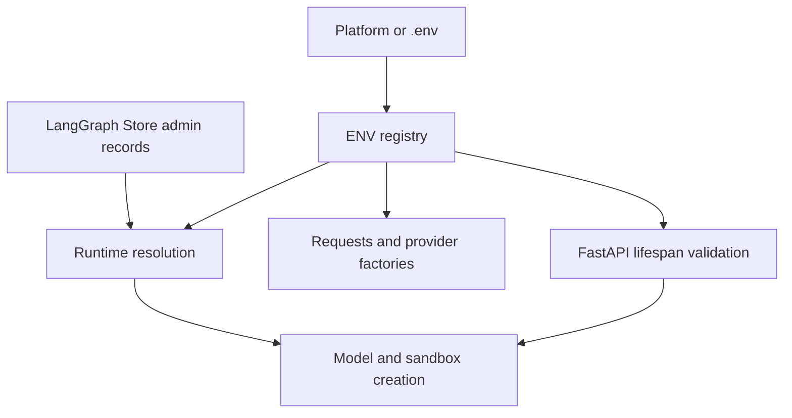

# Configuration and settings operations

Open SWE has two configuration planes:

- **Deployment configuration** is declared centrally in `agent/config.py` and supplied by the platform or `.env` (`langgraph.json` points the LangGraph platform at `.env`). It owns endpoints, credentials, provider selection, bootstrap defaults, and security boundaries.
- **Runtime configuration** is stored in the LangGraph Store and changed by an administrator through dashboard APIs. It owns team defaults, a base sandbox snapshot, and named environments. It is deliberately used to roll out operational changes without a redeploy.

Do not put secret values in source, wiki pages, named-environment `create_params`, or sandbox configuration. In particular, do not deploy GitHub user access tokens: LangSmith sandbox proxy rules receive short-lived GitHub App installation tokens at runtime.

## The environment registry and startup checks

`ENV` is the sole registry for Open SWE environment variables. Application code must read `ENV.<NAME>`, rather than `os.environ`: lookups occur when the accessor is called, so late secret hydration, key rotation, aliases, and test monkeypatching are observed. Empty and whitespace-only values are unset. The registry also supplies string, integer, boolean, and comma-separated-list accessors; malformed integers raise `ValueError`, while unrecognised booleans use the caller's default. Aliases are resolved after the current name, and the registry can report deprecated names in use.

Some consumers intentionally capture an `ENV` result during module initialization—for example, webhook clients or the completion secret. Operators should therefore provide required deployment values before the relevant process/module starts and restart the backend after changing deployment defaults.

This shows the two configuration planes converging when a run creates its model and sandbox.

The FastAPI lifespan pins the event loop, validates the selected sandbox provider, validates local-development model credentials, and closes cached model clients at shutdown. It also rejects `DASHBOARD_ALLOWED_ORIGINS=*`, because credentialed CORS cannot safely use a wildcard. Sandbox startup validation is provider-specific today: the LangSmith provider validates its active configuration at boot. Local model-key validation runs only when `DASHBOARD_BASE_URL` is localhost; it checks the deployment's default model, not later team/profile/thread choices.

`langgraph.json` registers `agent`, `reviewer`, `analyzer`, `chat`, and `scheduler`, mounts `agent.webapp:app`, and configures checkpointer TTL deletion (60-minute sweep; 43200-minute default TTL). See [deployment](deployment.md) for platform setup.

## Precedence and dashboard-owned state

### Team settings

A single `team_settings/default` Store record overlays hard-coded defaults. It controls review behavior, review tracing, the LLM Gateway tri-state toggle, transcription model, Fable enablement, organization reviewer guidelines, default repository, and default main/subagent model-and-reasoning pairs for agent and reviewer roles. The chat default inherits the agent default when absent; review diff grouping inherits the reviewer subagent default. Stored model/effort pairs are validated against the supported catalog, and stale/invalid choices resolve to a same-provider fallback where possible, then the global default. A Store outage is fail-soft: all callers receive defaults rather than every run failing.

Deployment `LLM_MODEL_ID` and `LLM_REASONING_EFFORT` are the lowest-level model defaults. A valid team setting supersedes them; explicit profile, thread, and run selection supersede defaults. `LLM_MODEL_ID` must be a supported default and its effort must be supported, otherwise default resolution raises a configuration error. The baseline default is Anthropic only when an Anthropic key is present and no OpenAI key is present; otherwise it is OpenAI. Runtime model selection and precedence are covered in [models, profiles, and instructions](../concepts/models-profiles-instructions.md).

### Base snapshot and named environments

The deployment base snapshot comes from `DEFAULT_SANDBOX_SNAPSHOT_ID`; the `sandbox_settings/default` record can override it. `resolve_base_snapshot_id` resolves **admin value, then environment variable**. The dashboard setting is opaque provider-scoped text, normalized to unset when blank and capped at 512 characters. Its read path is fail-soft, so Store failure falls back to the deployment value. `GET` settings reports both candidates, the effective value, source (`admin`, `env`, or `unset`), and audit fields.

A named environment is a Store record combining an appended prompt, repository list, optional LangSmith resource overrides, safe create-body parameters, and a captured snapshot. A run selects a named environment from the dashboard or a Slack `env:<name>` tag; otherwise it uses `default`. Missing selections and Store errors fall back to `default`, and no environment or a snapshot that is not `ready` falls back to the base snapshot. The picker exposes only slug/name/readiness—not prompts or snapshot identifiers.

Only LangSmith can capture environment snapshots. Capture names derive from `ENVIRONMENT_SNAPSHOT_PREFIX` as `<prefix>-environment-<slug>`; a colon in the prefix is discarded, name conflicts retry up to five suffixed names, and the platform supplies `:latest`. A failed replacement preserves a formerly ready snapshot; after a successful replacement, the old snapshot is deleted best-effort. `create_params` are JSON-size/type checked and reject credential-like keys and sensitive headers, including nested values.

## Sandbox providers and deployment defaults

`SANDBOX_TYPE` defaults to `langsmith`; the provider registry dispatches `langsmith`, `daytona`, `modal`, `runloop`, `e2b`, or `local`. Unknown values fail with the supported list. `local` executes on the host and is only suitable for development.

For LangSmith, `SANDBOX_LANGSMITH_API_KEY` and `SANDBOX_LANGSMITH_ENDPOINT` permit a separate sandbox workspace, otherwise standard LangSmith credentials/endpoints are used. The configured endpoint must be an absolute HTTPS URL without embedded credentials, query, or fragment when used for the proxy rule. `DEFAULT_SANDBOX_SNAPSHOT_ID` is optional: absent an environment or admin/deployment snapshot, LangSmith's root snapshot is used. The deployment may tune filesystem capacity, vCPUs, memory, idle stop TTL, and delete-after-stop TTL with the `DEFAULT_SANDBOX_*` variables; noninteger values fail when parsed. `SANDBOX_CREATE_EXTRA_JSON` must be a JSON object and is merged into LangSmith create requests, while per-environment values win on key collision.

Only the LangSmith factory receives snapshot, resource, and `create_params` overrides from the registry; other factories create/reconnect with only the sandbox id. See [sandbox providers](../integrations/sandbox-providers.md) for provider credentials and implementation boundaries.

## Models and gateway routing

Models use `provider:model` IDs. `LLM_FALLBACK_MODEL_ID` may name an explicit fallback; otherwise Anthropic and OpenAI primaries receive the corresponding cross-provider fallback and other providers do not. Fallback middleware is installed only if the resulting fallback differs from the primary.

Every supported direct provider model receives up to six retries. OpenAI, Anthropic, Baseten, Google GenAI, and Fireworks also receive the 600-second per-request timeout. A separate `ModelCallTimeoutMiddleware` applies a 900-second wall-clock limit (override `OPEN_SWE_MODEL_CALL_TIMEOUT_SECONDS`); it turns a transport hang into `ModelCallTimeoutError`, permitting fallback or completion reporting. The normal agent completion budget is `DEFAULT_LLM_MAX_TOKENS` (64000), not a context-window size.

The LangSmith LLM Gateway is opt-in. `LANGSMITH_GATEWAY_ENABLED` is the deployment default, while the nullable team `gateway_enabled` is authoritative when present. Gateway routing uses a dedicated `LANGSMITH_GATEWAY_API_KEY` if set, otherwise the standard LangSmith key, and supports OpenAI, Anthropic, Baseten, Fireworks, and Google GenAI. Unsupported providers or a missing gateway key log a warning and call the provider directly rather than failing the run. `LANGSMITH_GATEWAY_BASE_URL` changes the host; `LANGSMITH_GATEWAY_OPENAI_USE_RESPONSES` defaults to true.

## Credentials, identity, and ingress

Keep deployment secrets in the platform secret manager. Registry entries mark secret-bearing fields—including provider keys, GitHub private key and webhook secret, Slack/Linear credentials, dashboard secrets, encryption keys, Corridor token, and desktop tokens—so ownership is clear without exposing values.

- **GitHub:** `GITHUB_APP_ID`, `GITHUB_APP_PRIVATE_KEY`, and `GITHUB_APP_INSTALLATION_ID` establish app identity; `GITHUB_WEBHOOK_SECRET` authenticates deliveries. Dashboard GitHub OAuth uses `GITHUB_APP_CLIENT_ID` and `GITHUB_APP_CLIENT_SECRET`, while legacy LangSmith-brokered runtime OAuth uses `GITHUB_OAUTH_PROVIDER_ID` and `X_SERVICE_AUTH_JWT_SECRET`.
- **Dashboard:** `DASHBOARD_BASE_URL` and `DASHBOARD_API_BASE_URL` establish browser and callback URLs. `DASHBOARD_ALLOWED_ORIGINS` enables credentialed CORS only when nonempty; never include `*`. `DASHBOARD_JWT_SECRET` signs sessions/OAuth state. `TOKEN_ENCRYPTION_KEY` encrypts stored OAuth tokens and accepts a newest-first comma/newline key list for rotation.
- **Access gates:** `CONFIGURED_ADMINS` is a login/email admin allowlist; empty means no dashboard admin. `ADMIN_OIDC_SUBJECTS` optionally admits GitHub Actions OIDC admin requests and `ADMIN_OIDC_AUDIENCE` defaults to `open-swe`. `OBSERVABILITY_AUTHORIZED_EMAILS` grants read-only observability access in addition to admins. `ALLOWED_GITHUB_ORGS` and `ALLOWED_GITHUB_REPOS` control webhook acceptance and dashboard/prompt safeguards; no values means all repositories are allowed.
- **Trigger credentials:** Slack requires the bot token/signing secret and bot identity variables; optional Slack OAuth linking uses its client credentials/team id. Linear uses `LINEAR_API_KEY` and `LINEAR_WEBHOOK_SECRET`. These are only required for the trigger surfaces deployed.

`RUN_COMPLETE_WEBHOOK_SECRET` protects `/webhooks/run-complete` with a constant-time bearer-token comparison and fails closed if unset. Successful Slack completions may schedule cost refresh, while error/timeout completions post an idempotent failure response. Configure it together with `COMPLETION_WEBHOOK_URL` when completion dispatch crosses the default route.

## Server-side integration settings

Integration credentials stay in the server process, not a sandbox. Corridor reads its token from `CORRIDOR_API_TOKEN` (aliases `CORRIDOR_MCP_TOKEN` and `CORRIDOR_TOKEN`) or a token query parameter, accepts only the configured Corridor HTTPS endpoint, strips token query fields before connecting, and exposes only `analyzePlan`. Missing, invalid, or unreachable Corridor configuration simply omits its tools.

Datadog credentials are encrypted team credentials, attached as MCP headers only in the server process. `DATADOG_MCP_TOOLSETS` selects the toolset and defaults to `core`; missing credentials or connection failure returns no Datadog tools rather than failing agent startup. Notion MCP is per-user OAuth and Currents is per-user API-key configuration. See [observability and MCP](../integrations/observability-and-mcp.md) for access and lifecycle details.

## Focused operator checks

1. Before deployment, provide the required credentials for chosen trigger, model, and sandbox providers, plus dashboard origins/secrets when the dashboard is enabled. Start the app and treat lifespan validation errors as configuration failures.
2. Verify the effective sandbox source in the dashboard/API after setting an admin base snapshot. Test a named environment with a ready snapshot separately; it intentionally wins over the base snapshot.
3. When rotating OAuth encryption keys, prepend the new key, restart, let active users reauthenticate, then remove old keys only after their ciphertext is no longer needed.
4. Exercise an authorized completion webhook and an unauthorized one: the latter must be rejected, and an unset secret must reject both.

Related: [authentication and security](../concepts/auth-and-security.md), [deployment](deployment.md), [models, profiles, and instructions](../concepts/models-profiles-instructions.md), and [sandbox providers](../integrations/sandbox-providers.md).
