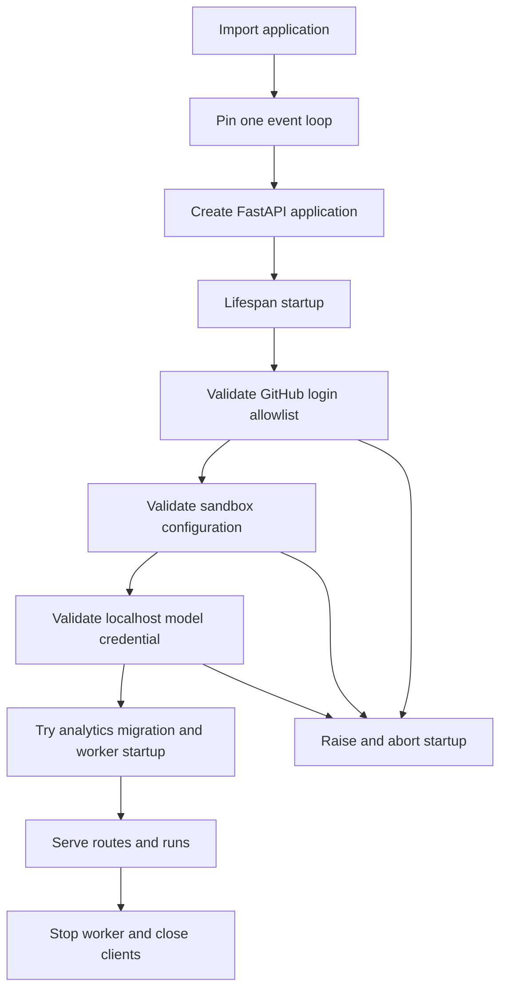
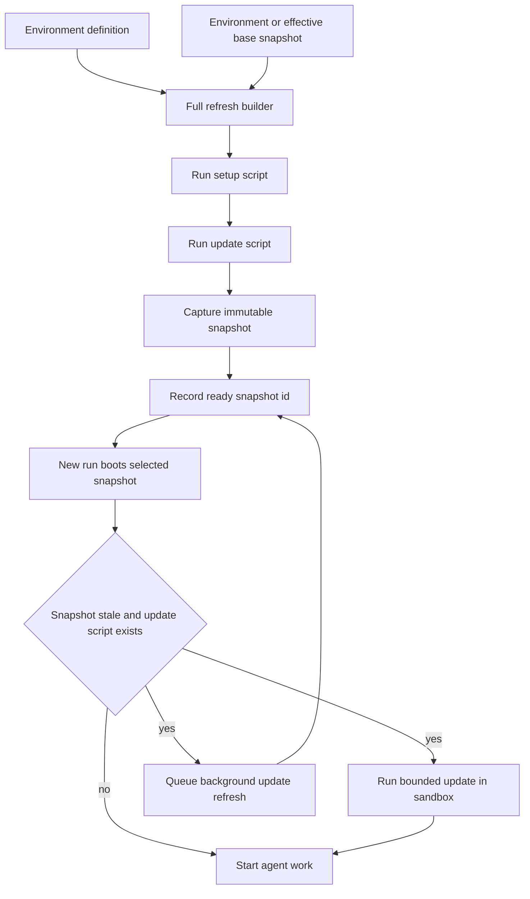

# Runtime Configuration and Administrative Settings

Open SWE uses two deliberately separate configuration planes:

- **Deployment configuration** is declared in `agent/config.py` and supplied through environment variables. It owns secrets, service endpoints, provider choice, connectivity, and defaults that are appropriate to a revision or deployment.
- **Persisted settings** live in LangGraph Store. They let administrators change team defaults, sandbox defaults, and reusable environments without publishing a new deployment; signed-in users persist their own preferences and instructions.

Persisted settings are not a secret store. Keep credentials in deployment-managed secret configuration and do not put tokens in environment scripts or sandbox create parameters. `agent/config.py` is the complete environment-variable catalog. See [Deployment](deployment.md), [Authentication and security](../concepts/auth-and-security.md), [Models, profiles, and instructions](../concepts/models-profiles-instructions.md), and [Sandbox providers](../integrations/sandbox-providers.md) for domain-specific setup.

## Deployment configuration

`ENV` is the application’s configuration schema and access point. Reads are lazy rather than an import-time copy of `os.environ`, so late secret injection and tests that patch the environment are observed. Empty or whitespace-only values are unset. Canonical names win over aliases; the registry can report deprecated aliases, parses integer, boolean, and comma-separated-list values, and rejects undeclared names. Add a declaration to `agent/config.py` and consume it through `ENV` when introducing a setting.

`langgraph.json` is the platform entrypoint configuration. It registers the `agent`, `reviewer`, `analyzer`, `chat`, and `scheduler` graphs and mounts `agent.webapp:app` as the HTTP application. It names `.env` as the environment file and configures delete-based checkpointer TTL cleanup with a 60-minute sweep and 43,200-minute default retention.

### Startup lifecycle

The FastAPI app pins one event loop before queue workers are constructed and again at lifespan startup. Before accepting requests, it validates the GitHub login allowlist, then validates the active sandbox configuration and localhost-development model credentials. It next attempts analytics migration, reporting activation, and worker start; analytics errors are logged but do **not** prevent the app serving. Shutdown stops the worker, closes analytics, and closes cached model clients.

The diagram shows fatal configuration validation before serving and best-effort analytics initialization.

Sandbox validation is currently provider-specific: `SANDBOX_TYPE=langsmith` delegates to `LangSmithProvider.validate_startup_config`; an unknown provider is rejected when sandbox creation resolves the registry. Localhost model validation is intentionally limited to an explicitly configured `DASHBOARD_BASE_URL` beginning with `http://localhost`, so it does not pre-validate models that an administrator or user might select later.

`DASHBOARD_ALLOWED_ORIGINS` controls credentialed dashboard CORS. A wildcard is rejected while the app is built, because credentialed CORS cannot safely allow `*`; nonempty explicit origins install CORS middleware.

## Persisted settings and authorization

The following Store records have different scopes and consumers:

| Scope | Stored setting | Who changes it | Runtime role |
|---|---|---|---|
| Instance | sandbox settings | dashboard admin or accepted admin token | Overrides the deployment base snapshot. |
| Instance | team settings | dashboard admin | Review behavior, organization guidance, model defaults, model-routing tiers, gateway and Fable toggles, and default repository. |
| User login | user preferences | that signed-in user | Default public/private thread visibility and local tracing project. |
| User login | user instructions | that signed-in user or the agent’s instruction tool | Appends personal instructions to runs initiated by that user. |
| Environment slug | environment definition | dashboard admin | Reusable prompt, setup/update scripts, snapshot, repositories, resource overrides, and safe create parameters. |

`CONFIGURED_ADMINS` is a case-insensitive comma-separated list of GitHub logins and/or emails; a session is admin when either identity matches. Administrative API routes normally require such a session. Sandbox settings additionally accept an administrator GitHub bearer token or an allowlisted GitHub Actions OIDC token, which supports automated image rollouts. User preference and instruction APIs are session-scoped and store records under the session’s login.

User preferences are fail-soft: a Store failure produces private visibility and no local tracing-project override rather than blocking a run. A nonblank user-instruction record is trimmed and appended to the main agent prompt for that user; it is separate from profile records so dashboard and agent-authored updates do not overwrite each other.

## Sandboxes and base snapshot precedence

`SANDBOX_TYPE` defaults to `langsmith`. The provider registry lazily supports `langsmith`, `daytona`, `modal`, `runloop`, `e2b`, and `local`; an unsupported selection raises `ValueError` listing the supported types. Provider-specific credentials and templates remain deployment configuration. The `local` provider operates on the developer’s machine and is not an isolation boundary for untrusted work.

For LangSmith, `DEFAULT_SANDBOX_SNAPSHOT_ID` selects the deployment base image. Optional resource values default to 128 GiB filesystem, 4 vCPUs, 16 GiB memory, 7,200 seconds idle TTL, and 2,592,000 seconds delete-after-stop TTL; `0` disables either TTL. Invalid numeric fields or invalid/non-object `SANDBOX_CREATE_EXTRA_JSON` fail LangSmith startup validation.

### Runtime base snapshot override

The singleton sandbox-settings Store record is exposed at `GET` and `PUT /dashboard/api/sandbox-settings`. `base_snapshot_id` is opaque provider-scoped text: it is trimmed, may be cleared, and is limited to 512 characters rather than format-validated. The response reports the stored, environment, and effective values and labels the source `admin`, `env`, or `unset`.

The persisted value takes precedence over `DEFAULT_SANDBOX_SNAPSHOT_ID`, so an administrator can roll a base image forward without redeploying. Store lookup on the provisioning path is fail-soft: failure falls back to the environment value. At creation time, a ready selected environment snapshot is higher precedence than this base snapshot; an environment-specific `base_snapshot_id` is used to build that environment. If neither a stored override nor a deployment default is present, the LangSmith provider selects its own root snapshot.

## Environments: reproducible repository setup

An environment is an administrator-owned definition, not a frozen image. It can contain a prompt appended to the agent instructions, repositories, resource/create-body overrides, a `setup_script`, and an optional `update_script`. A run can select one from the dashboard or with an `env:<name>` Slack tag; otherwise Open SWE resolves the environment named `default`. No ready environment means normal base-snapshot fallback.

Environment create parameters are bounded JSON and reject credential-like keys, authorization headers, and nested secrets. This protects persisted configuration from becoming an alternate secret channel. Scripts run with `bash -x`, so they must likewise never put secrets on command lines; their logs can expose expanded arguments.

The diagram shows environment refresh and the run-time freshness path; the run continues when its in-sandbox update fails.

A full refresh boots a throwaway LangSmith builder from the environment-specific base snapshot or the effective base, runs setup then update, and captures only if every script succeeds. Refreshes are scheduled daily at a deterministic staggered time and may also be started on demand. An incremental refresh boots the current immutable snapshot and runs only the update script. New sandboxes from a stale environment execute the bounded update script before the first model call and queue a background incremental refresh; a failed update merely sacrifices freshness, not the run.

Each capture publishes `name:latest` but runs use the recorded immutable snapshot ID. A capture in progress retains the old ready snapshot, and a failed refresh leaves it usable. This avoids changing a reconnecting run’s image and prevents a failed rebuild from replacing a known-good environment. Environment refresh requires capture support from the LangSmith provider; other providers report it as unsupported.

## Models and team-wide defaults

`LLM_MODEL_ID` and `LLM_REASONING_EFFORT` form deployment defaults. Team settings overlay a singleton `team_settings/default` record over hardcoded defaults. They validate supported model-and-effort pairs and normalize deprecated model selections. Chat inherits the agent model when unset or invalid; review grouping inherits the reviewer subagent model. Store failure is fail-soft because these values are read on run paths: hardcoded defaults are used instead.

The deployment’s fallback model is `LLM_FALLBACK_MODEL_ID` when configured; otherwise OpenAI and Anthropic primary models receive a cross-provider default. Fallback middleware is installed only when fallback and primary differ. `make_model` caches clients by running event loop and model options, and shutdown closes the cache. Direct requests use six retries; OpenAI, Anthropic, Baseten, Google GenAI, and Fireworks receive a 600-second default request timeout.

### Gateway precedence

`LANGSMITH_GATEWAY_ENABLED` is the deployment-level decision when set; otherwise a configured `LANGSMITH_GATEWAY_API_KEY` enables routing. The persisted team toggle is tri-state: `true` or `false` overrides this default, and unset inherits it. Gateway authentication prefers the gateway key and then `LANGSMITH_API_KEY`; the gateway host and OpenAI Responses behavior have deployment variables.

Only OpenAI, Anthropic, Baseten, Fireworks, and Google GenAI are gateway-routable. If routing is unavailable because the provider is unsupported or no LangSmith key is present, Open SWE logs the condition and uses the direct provider path. Baseten is the exception on the direct path: it requires `BASETEN_API_KEY` when a gateway override is not applied.

## Secret handling and completion callbacks

`TOKEN_ENCRYPTION_KEY` encrypts stored OAuth tokens. It accepts one Fernet key or a newest-first comma/newline list: encryption uses the first and decryption tries every listed key, enabling staged rotation. Prepend a new valid key, retain old keys until old ciphertext is retired or re-encrypted, then remove them. Missing encryption material prevents encryption; decryption returns an empty value after logging for missing keys or invalid ciphertext.

`DASHBOARD_JWT_SECRET` signs dashboard session/OAuth state material. Keep it, provider API keys, GitHub App material, webhook signing secrets, and sandbox-provider credentials out of Store records and logs. The dashboard rejects redirect origins outside its configured base URL and explicit allowed origins.

Run-completion replies are opt-in and fail closed. `/webhooks/run-complete` accepts a callback only when `RUN_COMPLETE_WEBHOOK_SECRET` is configured and the submitted token matches it in constant time. Dispatch attaches the completion webhook only when that secret exists and `COMPLETION_WEBHOOK_URL` is absolute and non-loopback; relative and loopback targets are omitted because the platform rejects them during run creation.

## Operating and testing checklist

1. Declare and describe deployment variables in `agent/config.py`; classify secrets there and use `ENV` in application code.
2. Treat deployment values as credential and revision defaults. Use persisted admin settings only for their explicit runtime choices, remembering that selected Store reads may fail soft.
3. Before rollout, exercise the lifespan with the selected sandbox type and a valid GitHub login allowlist. Verify analytics readiness separately because its startup failure is nonfatal.
4. Create environments only for LangSmith capture-capable deployments. Keep scripts credential-free, test them in a builder, and monitor their recorded status rather than assuming a refresh succeeded.
5. For completion replies, configure a public HTTPS `COMPLETION_WEBHOOK_URL` ending in `/webhooks/run-complete` together with `RUN_COMPLETE_WEBHOOK_SECRET`.
6. Focus tests on registry alias/blank/typed behavior, startup validation and CORS rejection, snapshot precedence and Store fallback, environment secret rejection and refresh failure retention, team model inheritance, gateway precedence, and completion-callback fail-closed behavior.

## See also

- [Deployment](deployment.md)
- [Authentication and security](../concepts/auth-and-security.md)
- [Models, profiles, and instructions](../concepts/models-profiles-instructions.md)
- [Sandbox providers](../integrations/sandbox-providers.md)
