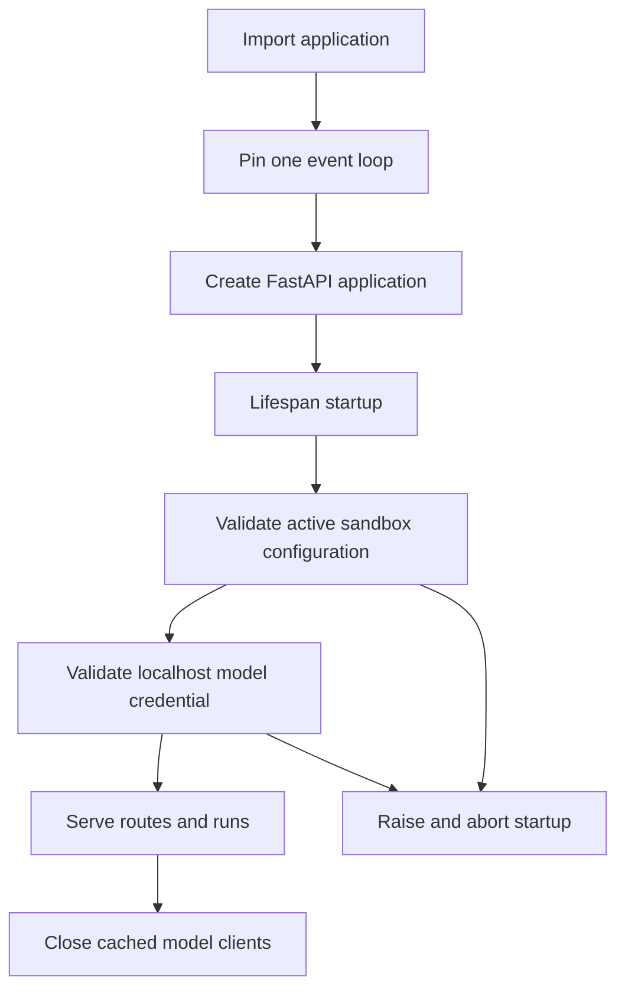

# Configuration and Startup Validation

Open SWE has two configuration planes:

- **Deployment configuration** is declared centrally in `agent/config.py` and normally supplied through environment variables (including the `.env` file named by `langgraph.json`). It covers connectivity, credentials, provider selection, UI URLs, and deployment defaults.
- **Administrator settings** are instance-wide records in LangGraph Store. They change selected behavior without a redeploy, notably the default sandbox snapshot and team-wide review/model settings. These are not substitutes for secrets or provider credentials, which remain deployment configuration.

This page describes ownership and failure behavior rather than listing every variable. `agent/config.py` is the complete variable catalog; [deployment](deployment.md) provides installation procedures. See [models, profiles, and instructions](../concepts/models-profiles-instructions.md), [auth and security](../concepts/auth-and-security.md), and [sandbox providers](../integrations/sandbox-providers.md) for their respective domains.

## Configuration ownership and value semantics

`ENV` is the single registry for application configuration. Code reads values through an `EnvVar` object rather than taking an import-time snapshot of `os.environ`: reads are lazy, so late secret hydration, key rotation, and test monkeypatching can be observed. Whitespace-only values count as unset. The registry also records descriptions, defaults, secret classification, aliases, and deprecated names; its typed accessors parse comma-separated lists, integers, and conventional boolean strings.

The canonical name takes precedence over aliases. Deprecated aliases are centralized in the registry, rather than scattered through consumers; `deprecated_in_use()` can report an alias or deprecated setting, suppressing a deprecated warning when its replacement is also set. An undeclared `ENV.NAME` or `ENV["NAME"]` is an error, which makes adding a variable an explicit configuration-schema change.

### Deployment topology

`langgraph.json` registers five graphs (`agent`, `reviewer`, `analyzer`, `chat`, and `scheduler`) and mounts `agent.webapp:app` as the platform HTTP application for dashboard and webhook routes. Its checkpointer uses delete-based TTL cleanup: a 60-minute sweep and a default TTL of 43200 minutes (30 days). The file names `.env` as its environment file.

## Startup lifecycle and failures

The FastAPI composition entrypoint is `agent.api.app:create_app`. It pins the process to a single event loop before queue work is constructed and again in lifespan startup. The lifespan then validates the active sandbox configuration and local-development model credentials. It yields only if both succeed; on shutdown it closes all cached model clients.

The diagram shows the boot-time checks performed by the FastAPI lifespan and cleanup on shutdown.

Not every bad setting is checked at boot. The sandbox validator is provider-specific: it currently validates LangSmith resource fields and extra JSON only when `SANDBOX_TYPE=langsmith`; an unknown provider name is rejected when the registry is asked to create a sandbox. Likewise, model startup validation deliberately applies only when an explicitly configured `DASHBOARD_BASE_URL` starts with `http://localhost`; it checks the credential needed by the deployment's `LLM_MODEL_ID` (or default) and does not attempt to validate models that may later be chosen through team, profile, or thread settings.

`DASHBOARD_ALLOWED_ORIGINS` is separately checked while the application is built: if it contains `*`, construction raises because credentialed CORS cannot safely use a wildcard. Nonempty explicit origins enable credentialed CORS for the dashboard API.

## Sandboxes: provider, snapshot, and runtime override

`SANDBOX_TYPE` defaults to `langsmith`. The lazy provider registry maps `langsmith`, `daytona`, `modal`, `runloop`, `e2b`, and `local` to provider factories. An unsupported value raises `ValueError` and lists the supported values. The local provider executes on the host and has no isolation, so it is for local development rather than untrusted work.

The registry passes `snapshot_id`, resource overrides, and arbitrary create parameters only to the LangSmith factory; other providers receive only an optional existing sandbox ID. For LangSmith, the normal base snapshot comes from `DEFAULT_SANDBOX_SNAPSHOT_ID` (otherwise the provider root snapshot), with defaults of 128 GiB filesystem, 4 vCPUs, 16 GiB memory, 7200 seconds idle TTL, and 2592000 seconds deletion-after-stop TTL. The two TTL values allow `0` to disable their expiration behavior. Malformed numeric resource values, negative TTLs, and invalid/non-object `SANDBOX_CREATE_EXTRA_JSON` fail LangSmith startup validation.

`SANDBOX_LANGSMITH_API_KEY` and `SANDBOX_LANGSMITH_ENDPOINT` let sandbox operations use another LangSmith workspace; each falls back to its normal `LANGSMITH_*` counterpart. The selected credentials apply to sandbox API operations, proxy setup, and environment snapshot work, so a configured base snapshot must exist in that workspace. `ENVIRONMENT_SNAPSHOT_PREFIX` defaults to `openswe` and separates environment snapshot names when deployments share a workspace.

### Stored base snapshot precedence

The sandbox-settings record is one instance-wide LangGraph Store value. An administrator can read or update it at `GET`/`PUT /dashboard/api/sandbox-settings`; the route accepts a dashboard admin or configured admin token identity. The stored `base_snapshot_id` is trimmed opaque text, capped at 512 characters, and its update records time and updater. A stored value wins over `DEFAULT_SANDBOX_SNAPSHOT_ID`; clearing it restores the environment default. An already-ready captured environment remains a higher-level selection than this base snapshot.

The read used during provisioning is intentionally fail-soft: a Store exception is logged and treated as no override, allowing the environment default to keep runs working. In contrast, the dashboard read reports the stored, environment, and effective values plus whether the source is `admin`, `env`, or `unset`.

## Models and team settings

`LLM_MODEL_ID` and `LLM_REASONING_EFFORT` establish the deployment fallback pair. Resolution accepts only catalog models allowed as defaults and validates that the effort is supported; an unsupported model or effort raises when defaults are resolved. The deployment default is used when no durable team setting supplies a valid choice. Model selection can be more specific at team, profile, thread, or run scope; changing the environment does not overwrite existing selections.

The team-settings record is also a single Store record keyed `default`. It includes review toggles, organization guidelines, review trace project, default repository, transcription model, gateway toggle, Fable opt-in, and main/subagent model-and-effort pairs for agent and reviewer, plus grouping, chat, and thread title settings. Input validation rejects unsupported model/effort combinations, an effort without a model, invalid transcription identifiers, and oversized guidelines or trace-project text. Deprecated model IDs are cleared and canonical pairs are normalized. When Fable is disabled, persisted Fable defaults are replaced with safe fallback pairs.

Store reads for team settings are fail-soft because model selection is on the run path: unavailable or absent Store data returns hardcoded defaults. Invalid/stale model data resolves first to a supported model from the same provider where possible, then to the global fallback. Chat inherits the agent default when unset, and review grouping inherits the reviewer subagent default.

`DEFAULT_LLM_MAX_TOKENS` is 64000 and is an output/completion budget, not a context-window size. `LLM_FALLBACK_MODEL_ID` can name a fallback; otherwise Anthropic and OpenAI primary models have cross-provider defaults. Fallback middleware is installed only if the fallback exists and differs from the selected primary. `make_model` caches constructed clients per running event loop and model options, and startup shutdown closes that cache.

Each supported direct provider request receives up to six retries; OpenAI, Anthropic, Baseten, Google GenAI, and Fireworks also receive a 600-second default request timeout. These bounds complement the agent's separate model-call deadline and run recursion limits described in [models, profiles, and instructions](../concepts/models-profiles-instructions.md).

### Gateway precedence

LangSmith LLM Gateway routing is centrally applied by `make_model`. `LANGSMITH_GATEWAY_ENABLED` is authoritative when set; otherwise setting `LANGSMITH_GATEWAY_API_KEY` turns routing on. A team setting is tri-state: `true` or `false` overrides this deployment default, while unset inherits it. Gateway authentication prefers `LANGSMITH_GATEWAY_API_KEY` and falls back to `LANGSMITH_API_KEY`; `LANGSMITH_GATEWAY_BASE_URL` changes the gateway host and `LANGSMITH_GATEWAY_OPENAI_USE_RESPONSES` defaults to true.

Only OpenAI, Anthropic, Baseten, Fireworks, and Google GenAI have gateway routes. If routing is enabled but the provider is not routable, or no LangSmith key is available, the code logs a warning and calls the provider directly rather than failing the run. Direct Baseten calls are stricter: with gateway routing unavailable, `BASETEN_API_KEY` is required.

## Secrets, identity, and completion delivery

Keep secrets in deployment configuration or the encrypted credential stores appropriate to their integration; do not place user GitHub access tokens in deployment environment variables. For LangSmith sandboxes, GitHub proxy rules mint an installation token at runtime and inject it on the wire for `github.com` and `api.github.com`; sandbox processes see placeholders rather than the real credential.

Important identity settings include GitHub App credentials (`GITHUB_APP_ID`, `GITHUB_APP_PRIVATE_KEY`, installation ID, client ID/secret, and webhook secret), Slack signing and bot credentials, dashboard cookie/OAuth-state signing (`DASHBOARD_JWT_SECRET`), and `TOKEN_ENCRYPTION_KEY`. The latter accepts one Fernet key or a comma/newline-separated newest-first list: encryption uses the first key and decryption tries all keys, permitting key rotation. Encryption fails when a key is absent; decryption logs and returns an empty string for missing keys or invalid ciphertext.

`CONFIGURED_ADMINS` is a normalized, comma-separated allowlist of GitHub logins and/or emails; with an empty value, no dashboard identity is an admin. `OBSERVABILITY_AUTHORIZED_EMAILS` separately grants the read-only observability tools, while configured admins are always authorized. Repository allowlists use `ALLOWED_GITHUB_ORGS` and `ALLOWED_GITHUB_REPOS`: if both are empty, any repository passes; otherwise an allowlisted owner or exact `owner/repo` is required.

Run-completion replies require both a secret and a usable delivery URL. `RUN_COMPLETE_WEBHOOK_SECRET` makes `/webhooks/run-complete` fail closed: every callback is rejected without it. Dispatch attaches a callback only when the secret exists and `COMPLETION_WEBHOOK_URL` is absolute and non-loopback; a relative or loopback URL is warned about and omitted so it cannot make run creation fail. The dispatch URL carries the token query parameter for the completion endpoint's constant-time comparison.

## Operating guidance

1. Declare new environment variables in `agent/config.py`, including whether they are secret and any alias/deprecation relationship; consume them through `ENV` rather than a new direct environment read.
2. Treat environment values as deployment defaults and credentials. Use the dashboard's persisted settings only for the explicitly supported instance-wide choices, and account for their fail-soft Store reads when designing changes.
3. Before rollout, exercise lifespan startup with the selected sandbox and model configuration. In local development, set an explicit `http://localhost...` `DASHBOARD_BASE_URL` to activate model-key validation.
4. Configure `COMPLETION_WEBHOOK_URL` as the public HTTPS `.../webhooks/run-complete` URL together with `RUN_COMPLETE_WEBHOOK_SECRET` if completion/failure replies are required.
5. Rotate `TOKEN_ENCRYPTION_KEY` by prepending a new valid key while retaining old keys, then remove old keys only after stored tokens have been re-encrypted or retired.

Focused tests should cover the registry's blank/alias/typed-value behavior, invalid LangSmith numeric and JSON settings during lifespan startup, sandbox override precedence and Store failure fallback, model-pair normalization/inheritance, gateway precedence, and the completion webhook's missing-secret and non-public-URL cases.

## See also

- [Deployment](deployment.md)
- [Authentication and security](../concepts/auth-and-security.md)
- [Models, profiles, and instructions](../concepts/models-profiles-instructions.md)
- [Sandbox providers](../integrations/sandbox-providers.md)
- [Observability and MCP](../integrations/observability-and-mcp.md)
