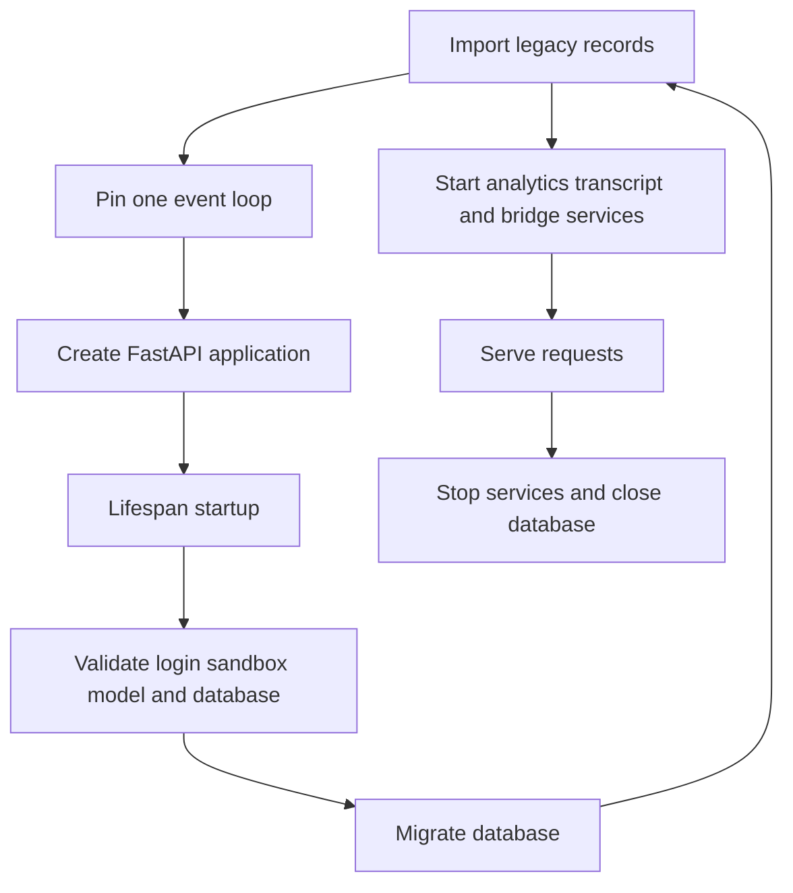

# Configuration and Workspace Administration

Open SWE has three configuration layers, each with a different owner and rollout behavior:

1. **Deployment environment** is declared in `agent/config.py` and supplied at process start (the platform configuration names `.env`). It owns credentials, connectivity, provider selection, and deployment-wide defaults.
2. **Instance and workspace settings** are durable administrator records. The instance record establishes defaults for all workspaces; a workspace stores only its overrides. They are appropriate for operational policy and model selection, not for secrets.
3. **Run-specific selection** can layer profile or thread configuration over the resolved workspace settings in callers that support it. It must not be mistaken for a durable default.

This page covers the boundaries between those layers. See [deployment](deployment.md) for installation, [models, profiles, and instructions](../concepts/models-profiles-instructions.md) for user-facing selection, [sandbox providers](../integrations/sandbox-providers.md) for provider details, and [authentication and security](../concepts/auth-and-security.md) for access control.

## Environment registry and deployment topology

`ENV` is the application configuration schema. It declares each variable's description, default, secret classification, aliases, and deprecation metadata. Reads are lazy rather than an import-time `os.environ` snapshot: whitespace-only values are unset; the canonical name wins over aliases; typed readers parse integers, booleans, and comma-separated lists. Reading an undeclared name fails explicitly. Consequently, add an environment variable to `agent/config.py` and consume it through `ENV`; do not introduce a scattered direct environment lookup.

`langgraph.json` registers six graphs: `agent`, `reviewer`, `analyzer`, `review-scout`, `chat`, and `scheduler`. It mounts `agent.webapp:app`, which in turn exposes the FastAPI dashboard API and webhook routes. The platform checkpointer deletes expired records, sweeping every 60 minutes with a default TTL of 43200 minutes (30 days), and loads `.env` as its environment file.

## Startup: blocking checks and best-effort recovery

`agent.api.app:create_app` is the HTTP composition entrypoint. It rejects `*` in `DASHBOARD_ALLOWED_ORIGINS` because the configured CORS mode allows credentials; when explicit origins are supplied, those are the only allowed credentialed origins. It also mounts the dashboard, webhook, health, plan, and sandbox-tool routers.

The FastAPI lifespan pins one event loop, then performs checks that must stop an unsafe or unusable service before it accepts traffic: the GitHub dashboard-login allowlist, the selected sandbox provider configuration, local-development default-model credentials, and required database configuration/migrations. Dashboard login requires `ALLOWED_GITHUB_ORGS` or `ALLOWED_GITHUB_USERS`, unless local-token authentication is configured.



The diagram shows the application lifespan. Validation and migration failures prevent service; legacy imports and auxiliary-service startup are logged and allowed to degrade.

Legacy workspace, user, and concierge-mode records are imported from the LangGraph Store during startup. Their import failures are deliberately non-fatal: workspace-routing failures fail closed rather than accepting unowned repositories, while user and concierge data remains unavailable until a later import. Analytics, transcript notification, and sandbox bridge listeners are also best effort, with documented in-process fallbacks where applicable. Shutdown stops bridge/transcript/analytics services and closes the database.

Local model-key validation runs only when `DASHBOARD_BASE_URL` is explicitly `http://localhost...`; it validates the configured default model's provider credential (with desktop OpenAI OAuth as an alternative), not models that a workspace, profile, or thread might choose later.

## Sandbox provider and workspace image lifecycle

`SANDBOX_TYPE` defaults to `langsmith`. The registry lazily resolves `langsmith`, `daytona`, `modal`, `runloop`, `e2b`, or `local`; an unsupported name raises `ValueError` listing supported types. Third-party Daytona, Modal, Runloop, and E2B integrations are optional dependency groups. Selecting one causes startup to import its factory so a missing extra fails at boot with its `uv sync --extra sandbox-<provider>` remedy rather than on the first run. `local` executes on the host and is for development only.

Only the LangSmith factory receives a requested snapshot, resource sizing, and create-body parameters; other providers receive an optional existing sandbox ID. For LangSmith, defaults are 128 GiB filesystem, 4 vCPUs, 16 GiB memory, 7200 seconds idle TTL, and 2592000 seconds delete-after-stop TTL; `0` disables either TTL. Invalid numeric fields, negative TTLs, or malformed/non-object `SANDBOX_CREATE_EXTRA_JSON` prevent LangSmith startup. Sandbox operations use the deployment's `LANGSMITH_API_KEY` and `LANGSMITH_ENDPOINT`.

A workspace owns repositories, optional Slack-channel bindings, prompts, setup/update scripts, sandbox resource overrides, and a base snapshot. A repository belongs to exactly one workspace. Workspace routing prefers an existing thread's workspace, then a `workspace:<slug>` (or legacy `env:<slug>`) message tag, repository ownership, Slack-channel binding, user preference, and finally `default`. If no workspace resolves, or its snapshot is not ready, sandbox creation falls back to the provider's base behavior.

A full workspace refresh boots a temporary builder from `base_snapshot_id`, runs setup and then update scripts, and captures only after all scripts succeed. An update refresh starts from the current ready snapshot and runs only the update script. Runs boot from the immutable stored snapshot ID rather than the movable `:latest` tag, so a refresh cannot alter a reconnecting run; during capture the prior ready snapshot remains usable. Workspace create parameters are bounded JSON and reject secret-like keys, preventing credentials from entering persistent workspace configuration.

`WORKSPACE_SNAPSHOT_PREFIX` controls the default snapshot-name prefix. The legacy `ENVIRONMENT_SNAPSHOT_PREFIX` remains an alias. Script and capture/update timeouts are deployment configuration, while the scripts themselves are workspace-owned administrator data.

## Administrator settings: tiering, validation, and cache

The dashboard API is rooted at `/dashboard/api` and applies same-origin protection to mutations. Administrators manage the instance record through `GET`/`PUT /dashboard/api/settings` (the older `/team-settings` route remains hidden compatibility), and per-workspace overrides through `GET`/`PUT /dashboard/api/workspaces/{workspace}/settings`. Reads require a session; writes require an administrator.

Settings resolve in this strict order:

```text
hardcoded defaults → instance settings → workspace overrides → profile/thread selection where supported
```

`None` in a workspace record means inherit the instance value. Store reads are intentionally fail-soft because all runs use these settings: an unavailable Store returns hardcoded defaults rather than failing every run. Graph factories cache the effective settings per workspace slug for 60 seconds; callers must pass the run workspace explicitly so one workspace cannot populate the cache for another.

The settings schema includes review behavior, organization guidelines and approval policy, gateway and model-routing toggles, Fable and expedited-review flags, default repository, and model/effort pairs for agent, reviewer, subagents, chat, thread titles, and routing tiers. Input rejects unsupported or incompatible model/effort pairs, an effort without a model, and review instructions over 10,000 characters. Deprecated pairs are cleared and canonical pairs normalized. Disabling Fable replaces persisted Fable defaults with safe alternatives rather than rejecting the update.

A resolved role model is always a valid pair: stale selections prefer a supported replacement from the same provider, then fall back to the global default. Chat inherits the agent default when no valid chat pair exists. Workspace settings are a default layer, not an override of explicit profile or thread selection.

## Models, fallback, and gateway routing

`LLM_MODEL_ID` and `LLM_REASONING_EFFORT` supply deployment-level default model selection. The catalog validates that a default model and reasoning effort are supported. Existing durable settings are not overwritten when those environment values change.

`make_model` applies six retries to all constructed models and, for OpenAI, Anthropic, Baseten, Google GenAI, and Fireworks, a 600-second request timeout. `LLM_FALLBACK_MODEL_ID` explicitly chooses a fallback; otherwise Anthropic and OpenAI primaries receive a cross-provider fallback. `ModelFallbackMiddleware` is attached only if that fallback differs from the primary model.

Gateway routing is resolved centrally during model construction. `LANGSMITH_GATEWAY_ENABLED` is authoritative when set; otherwise a configured `LANGSMITH_GATEWAY_API_KEY` enables the deployment default. The workspace setting is tri-state: `true` or `false` overrides that default, while `null` inherits it. Gateway credentials prefer `LANGSMITH_GATEWAY_API_KEY` and fall back to `LANGSMITH_API_KEY`. OpenAI, Anthropic, Baseten, Fireworks, and Google GenAI have gateway paths; unsupported providers or missing gateway credentials log a warning and call the provider directly. Baseten is the exception: direct operation requires `BASETEN_API_KEY`.

## Secrets and completion callbacks

`TOKEN_ENCRYPTION_KEY` is a single Fernet key or a comma/newline-separated newest-first key list. New ciphertext uses the first key; decryption tries each key, allowing a rotation to retain older ciphertext. Keep old keys until stored values have been re-encrypted or retired.

Run-completion callbacks are intentionally fail closed. Without `RUN_COMPLETE_WEBHOOK_SECRET`, `/webhooks/run-complete` rejects all calls. Dispatch attaches a completion callback only when the secret exists and `COMPLETION_WEBHOOK_URL` is an absolute, non-loopback HTTP(S) URL; relative or loopback URLs are omitted so a platform-rejected callback cannot make run creation fail.

## Safe-change checklist

1. Declare new deployment values in `agent/config.py`; retain aliases when renaming a live setting and preserve canonical-over-alias precedence.
2. Exercise lifespan startup for the selected provider, optional provider extra, login gate, database, and—during local development—default model credentials.
3. Treat workspace records as policy/data, not secret storage. In particular, preserve validation of workspace create parameters and the immutable ready-snapshot handoff.
4. Preserve settings resolution order and the 60-second per-workspace cache key. A change that drops the workspace slug can leak one workspace's model or policy to another.
5. Test model/effort normalization, fallback middleware suppression for identical models, gateway tri-state resolution, Store-failure defaults, and the missing-secret/loopback callback cases.

## See also

- [Deployment](deployment.md)
- [Authentication and security](../concepts/auth-and-security.md)
- [Models, profiles, and instructions](../concepts/models-profiles-instructions.md)
- [Sandbox providers](../integrations/sandbox-providers.md)
