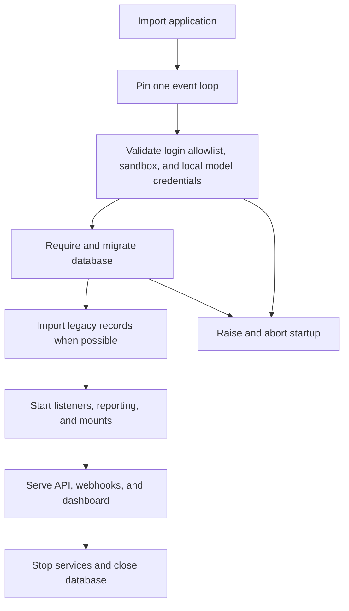

# Configuration and customization

Open SWE has three complementary configuration planes:

- **Deployment environment** supplies service URLs, provider credentials, application secrets, global defaults, and backend selection. `openswe.config.ENV` is the canonical schema.
- **Instance and workspace settings** are durable, administrator-managed records. A workspace can override selected instance defaults without exposing deployment secrets.
- **User-, thread-, and run-specific choices** can further select models, credentials, instructions, or routing where the calling feature supports them.

This page maps the boundaries and precedence rules. It is not a replacement for the complete environment-variable catalog in `openswe/config.py`. See [Deployment](deployment.md), [Authentication and security](../concepts/auth-and-security.md), [Models, profiles, and instructions](../concepts/models-profiles-instructions.md), and [Sandbox providers](../integrations/sandbox-providers.md) for adjacent operational detail.

## Deployment configuration and server boot

`ENV` declares every application-owned environment variable once, including its description, default, secret classification, aliases, and deprecation relationship. Reads are lazy: an empty or whitespace-only value is unset; the canonical name wins over aliases; typed helpers parse integers, booleans, and comma-separated lists. An undeclared variable access fails explicitly. Consequently, add a variable to this registry and consume `ENV.NAME` rather than adding a direct `os.environ` read.

`langgraph.json` is the deployment entrypoint. It registers the `agent`, `reviewer`, `review-scout`, `chat`, and `scheduler` graphs and mounts `openswe.webapp:app`. It names `.env` as the environment file. Its checkpointer deletes state using a 60-minute sweep and a 43,200-minute default TTL; Store TTL cleanup also sweeps every hour without refreshing on reads.

The FastAPI lifespan deliberately distinguishes hard prerequisites from recoverable auxiliaries:

```mermaid
flowchart TD
    Import["Import application"] --> Pin["Pin one event loop"]
    Pin --> Checks["Validate login allowlist, sandbox, and local model credentials"]
    Checks --> Database["Require and migrate database"]
    Database --> Imports["Import legacy records when possible"]
    Imports --> Services["Start listeners, reporting, and mounts"]
    Services --> Serve["Serve API, webhooks, and dashboard"]
    Serve --> Shutdown["Stop services and close database"]
    Checks --> Abort["Raise and abort startup"]
    Database --> Abort
```

The diagram shows the configuration-sensitive startup sequence. The GitHub login allowlist, selected sandbox configuration, and localhost development model credentials can prevent serving; database configuration and migrations are also required. Legacy user, automation, skill, and blob imports, analytics startup, and notification listeners are attempted after migration but log failures and allow the service to start with reduced behavior. Shutdown stops listeners/workers and closes the database.

`DASHBOARD_ALLOWED_ORIGINS` may add credentialed-CORS origins, but `*` is rejected while the application is built. The native desktop origin is included separately. Local model credential validation runs only when an explicitly configured `DASHBOARD_BASE_URL` begins with `http://localhost`; it checks the configured/default model's provider key (or desktop OpenAI OAuth), not later workspace, profile, or thread selections.

## Durable settings and precedence

The instance record remains stored under the legacy `team_settings/default` key. Workspace overrides live under `workspace_settings/<slug>`; only fields with non-`None` values override the instance. Effective settings are resolved in this order:

1. hardcoded defaults, including the environment-derived default repository and model pair;
2. the instance record;
3. the workspace record;
4. where a caller supports it, user profile and thread/run configuration.

Store reads are intentionally fail-soft: if settings storage is unavailable, model-dependent run paths use hardcoded defaults rather than failing every run. Workspace slugs are normalized, and the dashboard exposes effective values plus the workspace's sparse overrides. Instance settings are administrator writable at `/dashboard/api/settings`; workspace settings are at `/dashboard/api/workspaces/{workspace}/settings` and require an existing workspace.

Settings validate model/effort pairs against the supported model catalog, reject an effort without a model, normalize deprecated model IDs away, and cap organization review guidelines at 10,000 characters. A stale/invalid selected pair falls back first to a supported model from the same provider when possible, then to the global default. Chat inherits the agent model when no valid chat-specific pair is set. Feature flags such as draft-PR review, summaries, trace links, adaptive routing, gateway use, Fable, expedited review, sandbox OpenAI, and Slack suggestions are tri-state at stored tiers: `None` inherits. Fable is off by default; disabling it replaces any persisted Fable defaults with safe alternatives, while Fable models cannot be stored as defaults when it is enabled.

## Models, provider credentials, and gateway routing

Use provider-qualified model IDs such as `anthropic:...`, `openai:...`, or `google_genai:...`. `LLM_MODEL_ID` and `LLM_REASONING_EFFORT` establish deployment-level defaults below durable or explicit choices; supported defaults and compatible efforts are enforced by the dashboard model catalog. Credentials are deployment secrets: `ANTHROPIC_API_KEY`, `OPENAI_API_KEY`, `GOOGLE_API_KEY`, `GROQ_API_KEY`, `FIREWORKS_API_KEY`, and `BASETEN_API_KEY`. `OPENAI_BASE_URL` supports an OpenAI-compatible endpoint.

`make_model()` is the central construction point. It applies six retries to model clients and a 600-second request timeout for OpenAI, Anthropic, Baseten, Google GenAI, and Fireworks. OpenAI uses the Responses API by default, with response storage disabled and encrypted reasoning content requested. `LLM_FALLBACK_MODEL_ID` overrides fallback selection; otherwise Anthropic and OpenAI primaries receive cross-provider fallbacks. Fallback middleware is only useful when that fallback is present and differs from the primary.

The optional LangSmith LLM Gateway replaces direct provider authentication with a LangSmith key and workspace Provider Secrets. `LANGSMITH_GATEWAY_ENABLED` is authoritative when set; otherwise a configured `LANGSMITH_GATEWAY_API_KEY` enables it. A workspace's explicit `gateway_enabled` value overrides that deployment default, while `None` inherits it. The gateway prefers its dedicated key and falls back to `LANGSMITH_API_KEY`; its host and OpenAI Responses behavior are configurable with `LANGSMITH_GATEWAY_BASE_URL` and `LANGSMITH_GATEWAY_OPENAI_USE_RESPONSES`.

Only OpenAI, Anthropic, Baseten, Fireworks, and Google GenAI are gateway-routable. If routing is enabled but a provider is unsupported or no LangSmith key exists, Open SWE logs the condition and calls the provider directly. Direct Baseten calls instead require `BASETEN_API_KEY`.

## Sandboxes and workspaces

`SANDBOX_TYPE` defaults to `langsmith`. The provider registry lazily loads `langsmith`, `daytona`, `modal`, `runloop`, `e2b`, or `local`; unknown values raise an error listing supported types. The third-party provider integrations are optional dependency groups, so selecting one without its SDK fails with the relevant `uv sync --extra sandbox-<provider>` instruction. `local` runs commands on the host and is appropriate only for local development.

Startup eagerly verifies optional providers and validates LangSmith configuration, so missing SDKs or malformed LangSmith numeric/JSON resource configuration fail before the first run. For LangSmith, deployment resource defaults are 128 GiB filesystem, 4 vCPUs, 16 GiB memory, a 7,200-second idle TTL, and 2,592,000 seconds after stop; either TTL accepts `0` to disable that expiry. `SANDBOX_CREATE_EXTRA_JSON` must be a JSON object. Snapshot/resource/create-parameter overrides are honored by LangSmith; other registered providers reconnect or create using their provider-specific factory interface.

A workspace is the durable unit that owns repositories, Slack-channel bindings, settings overrides, optional sandbox prompt/scripts, and a captured snapshot. PostgreSQL constraints make a repository or Slack channel belong to at most one workspace. For a new sandbox, Open SWE resolves a workspace snapshot and resource/create parameters; an inheriting workspace uses the default workspace. If no ready workspace snapshot exists, provisioning falls back to the provider base/root snapshot.

Workspace setup and update scripts are captured in a throwaway builder sandbox. A full refresh boots from the workspace base snapshot and runs setup then update; an update refresh boots the current ready snapshot and runs only the update script. A capture is published only when every script exits successfully. Runs use the stored immutable snapshot ID rather than the moving `:latest` tag, so a refresh cannot alter an in-progress run's reconnect target. A stale snapshot may trigger a background update, but failed attempts are rate-limited to avoid creating a builder on every new sandbox.

Workspace create parameters are intentionally constrained: they must be valid bounded JSON, and values resembling credentials or authentication headers are rejected. Put credentials in deployment secrets or the managed credential mechanisms, not a workspace sandbox payload. Workspace scripts receive bound repository names through `OPENSWE_WORKSPACE_REPOS`; their traced output can expose command-line secrets, so scripts must not embed them.

## Credentials, GitHub, and completion callbacks

Deployment identity includes LangSmith (`LANGSMITH_API_KEY`, endpoint/project), GitHub App IDs, private key, installation ID, OAuth client credentials, and webhook secret; Slack/Linear signing and bot credentials; and dashboard cookie/OAuth-state signing via `DASHBOARD_JWT_SECRET`. Configure an explicit GitHub login allowlist through `ALLOWED_GITHUB_ORGS` and/or `ALLOWED_GITHUB_USERS`; startup validates that at least one is present. `CONFIGURED_ADMINS` grants dashboard administration.

`TOKEN_ENCRYPTION_KEY` encrypts persisted OAuth and connection secrets. It accepts one Fernet key or a newest-first comma/newline-separated list. Encryption writes with the first key; decryption tries all keys, enabling gradual rotation. Missing encryption keys prevent encryption; missing keys or invalid ciphertext make decryption return an empty value after logging. To rotate, prepend a new valid key, retain old keys until affected stored values are replaced or retired, then remove them.

Do not put user GitHub access tokens in environment variables or workspace scripts. LangSmith sandbox GitHub proxy rules use a runtime-minted installation token for GitHub traffic, leaving a placeholder rather than the real token in the sandbox process.

Completion replies are opt-in and fail closed. `/webhooks/run-complete` accepts a callback only when `RUN_COMPLETE_WEBHOOK_SECRET` is configured and matches in constant time. Dispatch attaches the callback only when that secret exists and `COMPLETION_WEBHOOK_URL` is absolute and not loopback; otherwise it omits the callback so a platform-rejected URL cannot prevent run creation. Use the public HTTPS `.../webhooks/run-complete` URL with the secret to enable completion and failure notifications.

## Prompts, skills, and automations

The agent system prompt is rendered from `openswe/resources/prompts/system/main.md.jinja` and its included sections. `DEFAULT_PROMPT_PATH` selects an organization-wide Markdown file; absent configuration uses the bundled `openswe.resources/default_prompt.md`. Nonempty content is injected as **Custom Instructions**. A read failure or empty file is logged/skipped rather than stopping a run. Workspace instructions and repository-specific instructions are separately rendered into the system prompt; use repository `AGENTS.md` for repository-local conventions.

Skills are persisted in PostgreSQL. They may belong to the organization (`user_id` is null) or to one user. Names must be lowercase hyphenated identifiers, descriptions cannot be blank, and instructions are size-limited. At agent load time, organization skills for anonymous/shared runs or the initiating user's skills for personal runs are presented as read-only `/name/SKILL.md` files with generated name/description frontmatter. Legacy Store skills are imported at startup when possible.

Automations are also PostgreSQL records. They may have schedule, GitHub, Slack, or Linear triggers; a schedule trigger creates a LangGraph cron whose input names the automation, while inbound GitHub events are claimed once per automation before execution. Cron input is normalized and restricted to five fields with checked ranges. Trigger validation bounds repository/channel/team identifiers, optional message regexes, and run-rate settings. Legacy Store automations are imported at startup; a failed import leaves them inactive until a later successful boot.

## Operating checklist

1. Treat `openswe/config.py` as the environment schema. Declare and document new variables there, including secrecy and aliases.
2. Set the required database, allowlist, GitHub App, `DASHBOARD_JWT_SECRET`, `TOKEN_ENCRYPTION_KEY`, LangSmith, and model/gateway credentials before deployment. Test startup logs, not only the dashboard.
3. Select and validate a sandbox provider and install its optional dependency group when needed. Use workspaces for per-workspace snapshots, scripts, bounded resource overrides, and feature/model overrides—not credentials.
4. Make settings changes at the narrowest supported scope, remembering the resolution order: hardcoded/environment defaults → instance → workspace → user/thread/run.
5. Use public HTTPS callback URLs and rotate encryption keys by overlap. Do not put token material in scripts, snapshots, workspace create parameters, or prompt files.
6. Test registry alias/blank/typed parsing; startup failures for allowlist, sandbox, CORS, database, and local credentials; workspace merge and fail-soft behavior; model-pair/gateway precedence; refresh failure semantics; callback omission; and automation trigger validation.

## See also

- [Deployment](deployment.md)
- [Authentication and security](../concepts/auth-and-security.md)
- [Models, profiles, and instructions](../concepts/models-profiles-instructions.md)
- [Sandbox providers](../integrations/sandbox-providers.md)
