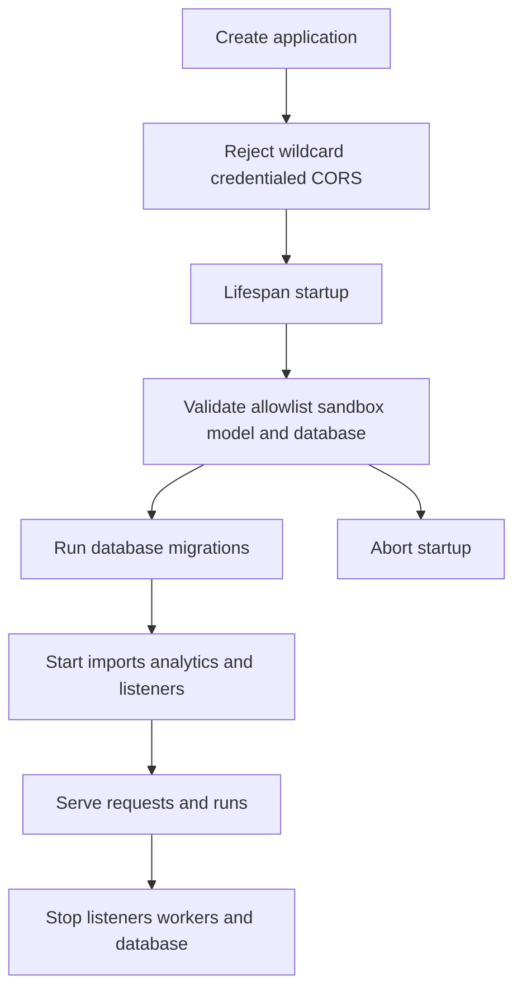
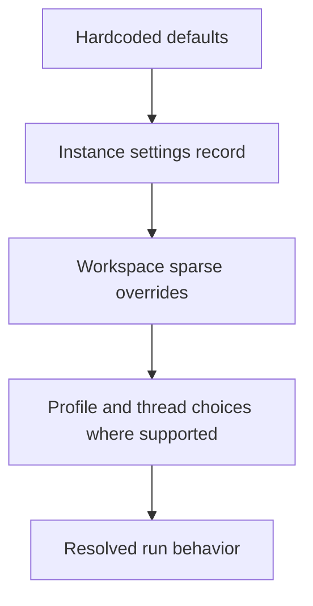

# Runtime Configuration and Workspace Settings

Open SWE has two deliberately separate configuration planes:

- **Deployment configuration** is the environment-variable schema in `agent/config.py`. It owns credentials, endpoints, provider selection, process-wide defaults, and security boundaries. Treat it as deployment-managed configuration, not dashboard data.
- **Runtime settings** are administrator-managed records in LangGraph Store. The instance record supplies shared defaults; each workspace may store sparse overrides. They are appropriate for choices such as models, review behavior, and feature toggles—not provider credentials.

This page documents resolution and operational failure behavior, rather than copying secret values or enumerating every variable. See [Deployment](deployment.md), [Authentication and security](../concepts/auth-and-security.md), [Models, profiles, and instructions](../concepts/models-profiles-instructions.md), and [Sandbox providers](../integrations/sandbox-providers.md) for adjacent concerns.

## Environment schema and deployment entrypoints

`ENV` is the sole registry for application environment variables. `EnvVar` reads lazily, trims values, and treats blank input as unset; therefore late secret injection and test monkeypatching are observed. Canonical names win over aliases, typed accessors handle integers, booleans, and comma-separated lists, and accessing an undeclared variable raises explicitly. Add a variable to this registry—including its description, secret classification, aliases, and deprecation relationship—before consuming it.

`langgraph.json` is the platform deployment entrypoint. It registers the `agent`, `reviewer`, `analyzer`, `review-scout`, `chat`, and `scheduler` graphs and mounts `agent.webapp:app` as the HTTP application. It names `.env` as the environment file and configures delete-based checkpointer TTL cleanup: a 60-minute sweep with a 43,200-minute default TTL.

## Process startup: hard gates and degradations

`agent.api.app:create_app` pins one event loop before queue workers are built, rejects `*` in `DASHBOARD_ALLOWED_ORIGINS` because CORS allows credentials, installs the application routes, and serves the dashboard UI. Its lifespan re-pins the loop and performs hard startup gates: GitHub login-allowlist validation, active sandbox validation, local-development default-model credential validation, database configuration, and migrations. A failure in one of those steps prevents serving.

```mermaid
flowchart TD
    Compose["Create application"] --> CORS["Reject wildcard credentialed CORS"]
    CORS --> Life["Lifespan startup"]
    Life --> Gates["Validate allowlist sandbox model and database"]
    Gates --> Migrate["Run database migrations"]
    Migrate --> Optional["Start imports analytics and listeners"]
    Optional --> Serve["Serve requests and runs"]
    Gates --> Abort["Abort startup"]
    Serve --> Shutdown["Stop listeners workers and database"]
```

The diagram distinguishes validation and migration gates from auxiliary startup work. User-map and concierge imports, automation migration, analytics, and transcript/bridge listeners log failures and allow startup to continue; degraded cross-process behavior is documented in their logs. Shutdown stops listeners and the analytics worker, then closes the database.

Local model-key validation is intentionally narrow: it only runs when an explicitly set `DASHBOARD_BASE_URL` starts with `http://localhost`, and only checks the configured deployment default model. Later workspace, profile, and thread choices are not prevalidated.

## Sandbox selection, resource defaults, and workspace snapshots

`SANDBOX_TYPE` defaults to `langsmith`. The lazy registry supports `langsmith`, `daytona`, `modal`, `runloop`, `e2b`, and `local`; an unknown name raises a `ValueError` that lists supported types. Optional third-party providers are imported at startup so a missing provider extra fails at boot with its install instruction. Only the LangSmith factory receives snapshot, resource, and arbitrary create-body parameters; other providers receive an optional reconnect ID. The local provider runs on the host without isolation and is development-only.

For LangSmith, deployment resource defaults are 128 GiB filesystem, 4 vCPUs, 16 GiB memory, 7,200 seconds idle TTL, and 2,592,000 seconds delete-after-stop TTL. The two TTLs accept `0` to disable expiry. At startup, configured resource values must be integers, TTLs cannot be negative, and `SANDBOX_CREATE_EXTRA_JSON` must be a JSON object. LangSmith credentials and endpoint come from `LANGSMITH_API_KEY` and `LANGSMITH_ENDPOINT`.

The base snapshot is no longer an instance-wide sandbox setting. A workspace record owns its optional `base_snapshot_id`, setup/update scripts, resource overrides, and provider create parameters. A full refresh boots from that base snapshot, runs setup and update scripts, and captures only after every script succeeds. Run sandbox creation resolves the workspace and boots from its `ready_snapshot_id`; a deliberately `base` source skips workspace lookup and has no snapshot. Thus a ready workspace snapshot takes precedence over its base snapshot, while no workspace snapshot lets the LangSmith provider use its root snapshot.

## Runtime settings: tiered inheritance

The historical “team settings” instance record remains stored at `team_settings/default`; every workspace inherits it. Workspace records live under `workspace_settings/<slug>` and are sparse: `None` or an omitted field falls through to the instance value, which falls through to hardcoded defaults. A legacy workspace record in the old namespace is read for compatibility until the workspace is saved again. Per-user profile choices and thread `configurable` values are applied by callers above these tiers.

```mermaid
flowchart TD
    Hardcoded["Hardcoded defaults"] --> Instance["Instance settings record"]
    Instance --> Workspace["Workspace sparse overrides"]
    Workspace --> Caller["Profile and thread choices where supported"]
    Caller --> Run["Resolved run behavior"]
```

The diagram shows precedence from lower to higher specificity. Store reads are deliberately fail-soft: if instance or workspace lookup fails, the application uses hardcoded defaults rather than making all runs fail. The settings API exposes `GET`/`PUT /settings` (with the older `/team-settings` alias) for the instance record and `GET`/`PUT /workspaces/{workspace}/settings` for an existing workspace; writes require an administrator, while reads require a session.

Settings cover review flags and guidelines, gateway, Fable, expedited-review and sandbox-OpenAI toggles, default repository, and model/effort pairs for agent, reviewer, subagents, routing tiers, chat, and titles. Writes validate model/effort compatibility, reject an effort without a model, trim and bound organization guidelines, and clear deprecated model IDs. A workspace view returns both its effective settings and only the overrides it owns, which makes inheritance visible to the dashboard.

When a model pair is stale or invalid at resolution, the system first seeks a supported model from the same provider and then uses the global default. Chat inherits the agent setting when no valid chat-specific pair exists. Fable is disabled by default; when disabled, persisted Fable defaults are replaced with a safe non-Fable fallback, and the runtime gate prevents a Fable model from reaching construction.

## Model and gateway deployment defaults

`LLM_MODEL_ID` and `LLM_REASONING_EFFORT` provide the deployment-level fallback pair below runtime settings. The model catalog controls accepted IDs and supported efforts. `make_model` installs six retries for all supported direct providers and a 600-second default request timeout for OpenAI, Anthropic, Baseten, Google GenAI, and Fireworks.

`LLM_FALLBACK_MODEL_ID` explicitly selects a fallback. If unset, Anthropic and OpenAI primaries use their cross-provider fallback; other providers have none. Fallback middleware is constructed only when the resolved fallback differs from the primary model.

Gateway resolution is also layered. `LANGSMITH_GATEWAY_ENABLED` is authoritative when set; otherwise a configured `LANGSMITH_GATEWAY_API_KEY` enables it. A workspace `gateway_enabled` value of `true` or `false` overrides that deployment default, while `null` inherits it. The gateway can route OpenAI, Anthropic, Baseten, Fireworks, and Google GenAI. If its provider is unsupported or no LangSmith key is usable, it logs and calls the provider directly instead of failing the run.

## Secret-sensitive operational settings

Keep credentials in deployment configuration; do not move them into runtime settings. `TOKEN_ENCRYPTION_KEY` is one Fernet key or a newest-first comma/newline-separated key list: new tokens use the first key and reads try all keys, enabling rotation without invalidating stored tokens.

Run-completion callbacks are fail-closed. Without `RUN_COMPLETE_WEBHOOK_SECRET`, `/webhooks/run-complete` rejects all calls. Dispatch attaches a callback only if that secret exists and `COMPLETION_WEBHOOK_URL` is absolute and non-loopback; otherwise it omits the callback so platform URL rejection cannot prevent run creation.

## Change and test guidance

1. Declare deployment variables in `agent/config.py` and use `ENV`; never scatter direct reads of `os.environ`.
2. Exercise lifespan startup with the selected sandbox provider and credentials. In local development, an explicit localhost dashboard URL activates default-model credential checks.
3. Use workspace snapshots and workspace resource overrides for repository-specific runtime environments; use deployment variables for provider-wide capacity defaults and credentials.
4. Test settings changes across all tiers: hardcoded default, instance setting, workspace override, clearing an override, and Store failure fallback. Keep cache keys workspace-specific.
5. Test invalid sandbox integers/JSON and missing optional provider extras at startup, model/effort validation and stale fallback, gateway precedence/direct fallback, and completion callback rejection for missing secret or loopback URLs.

## See also

- [Deployment](deployment.md)
- [Authentication and security](../concepts/auth-and-security.md)
- [Models, profiles, and instructions](../concepts/models-profiles-instructions.md)
- [Sandbox providers](../integrations/sandbox-providers.md)
