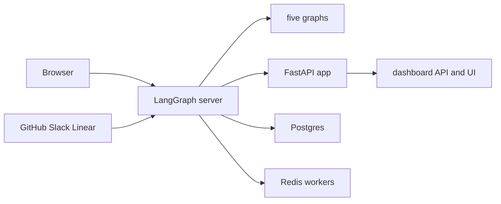

# Development, Packaging, and Deployment

Open SWE is normally one LangGraph deployment. The runtime registers five graphs (`agent`, `reviewer`, `analyzer`, `chat`, and `scheduler`) and attaches the FastAPI application `agent.webapp:app`; FastAPI installs dashboard, plan, workflow-approval, health, and integration-webhook routers. When a dashboard build is present, that same origin serves the UI as well as the API and LangGraph routes.



This is the normal same-origin production topology: the deployment receives browser and webhook traffic, while the runtime uses its backing services.

See [Configuration](configuration.md) for the environment contract and [Dashboard UI](../integrations/dashboard-ui.md) for frontend behavior.

## Local runtime

Install Python development dependencies with `make install`, which runs `uv sync --extra dev`. The full local backend is started with:

```bash
make dev
```

`make dev` first starts the Compose Postgres service when `POSTGRES_URI` is not set, rejects an already occupied port 2024, then executes `uv run langgraph dev --no-browser --port 2024 --n-jobs-per-worker 10`. Compose supplies PostgreSQL 16 on loopback port 5433, waits for its health check, and persists data in the named `open-swe-postgres` volume. An explicit `POSTGRES_URI` skips that local container.

`langgraph.json` is the full development/deployment manifest: Python 3.14, LangGraph API 0.13.3, all five graphs, `agent.webapp:app`, `.env`, and a deleting checkpoint TTL (60-minute sweep; 43,200-minute default). The `langgraph-api` resolver constraint is held at `>=0.13.3,<0.14`, matching the manifest rather than falling back to the end-of-life 0.10.3 runtime.

The local CLI persists its own threads, checkpoints, and Store under `.langgraph_api` in the working directory. Preserve or deliberately replace that directory when moving worktrees; do not run two continuous instances against one shared state directory, because copied state diverges and shared integrations can duplicate background work.

### Dashboard modes

Build the dashboard before running the backend when it should serve static UI:

```bash
make build-dashboard
make dev
```

The build writes `ui/.output/public`. The backend uses that directory by default or `DASHBOARD_STATIC_DIR` when configured. It serves files and HTML navigation from a final catch-all, but declines dashboard API, webhook, health, and LangGraph-owned paths so the UI cannot shadow them. Hashed assets are immutable-cacheable; the HTML shell is revalidated.

For UI iteration, use:

```bash
make dev-ui
```

This concurrently runs Vite on port 3000 and the backend on port 2024 with `DASHBOARD_DEV_SERVER_URL=http://localhost:3000`. Open port 2024: FastAPI reverse-proxies non-reserved UI requests to Vite, while API calls, login callbacks, and cookies remain at the backend origin. Vite's HMR WebSocket connects directly to port 3000. `make web` alone runs the workspace dashboard dev server; it proxies backend prefixes to `DASHBOARD_API_URL`, defaulting to `http://localhost:2024`.

`make run` is deliberately narrower: `uv run uvicorn agent.webapp:app --reload --port 8000` starts only FastAPI. It is useful for HTTP-route work but cannot create LangGraph runs, so dashboard agent features require `make dev`.

### Mount prefix and direct Vite use

The dashboard's `DASHBOARD_BASE_PATH` must equal the LangGraph `http.mount_prefix`, including the route context at which the backend serves it. It controls Vite's router and asset URLs. For a locally prefixed server, use `DASHBOARD_BASE_PATH=/<prefix>/ make build-dashboard`; the platform image derives this value from its manifest mount prefix. A mismatch breaks client routes or asset URLs.

Opening Vite directly at `http://localhost:3000` changes the browser origin. Set `DASHBOARD_BASE_URL` and `DASHBOARD_API_BASE_URL` to that origin and add `http://localhost:3000/dashboard/api/auth/callback` to the GitHub App. `DASHBOARD_ALLOWED_ORIGINS` lists additional credentialed CORS origins; FastAPI rejects `*` because credentials are enabled.

### Webhook exposure

Local `langgraph dev` does not authenticate raw LangGraph routes. Never tunnel all of port 2024. `make tunnel NGROK_DOMAIN=<name>.ngrok-free.dev` invokes ngrok using `examples/ngrok/webhooks-only.yml`; the policy returns 404 except for `/webhooks/*`. This permits external integration delivery while keeping dashboard and raw LangGraph APIs local. Restart `make dev` after changing `.env`, because code reload does not reload environment configuration.

## Production backend

Choose either:

- **LangGraph Platform:** connect the repository in LangSmith Deployments. The `dockerfile_lines` in `langgraph.json` install Node/pnpm, build and copy the dashboard, derive its base path from the mount prefix, and set `DASHBOARD_STATIC_DIR`. This is best effort: a UI-build failure is logged but does not block the backend deployment.
- **Standalone Docker:** run `docker build -t open-swe .`. The root image is a production LangGraph API image, not a sandbox image. Its `langchain/langgraph-api:0.13.3-py3.14` base, graph registrations, HTTP app, and checkpointer TTL mirror the manifest and it exposes port 8000.

A standalone Agent Server needs `DATABASE_URI` (Postgres), `REDIS_URI`, `LANGSMITH_API_KEY`, `LANGGRAPH_CLOUD_LICENSE_KEY`, and `LANGGRAPH_URL` set to its public URL. Keep workers available: scale-to-zero is unsuitable because background work depends on Redis and Postgres. The root Dockerfile does not build the dashboard; build it before `docker build` or point `DASHBOARD_STATIC_DIR` at a build directory.

The standalone default `LANGGRAPH_AUTH_TYPE=noop` exposes raw LangGraph routes to any network client. Use LangSmith authentication (`LANGGRAPH_AUTH_TYPE=langsmith`, `LANGSMITH_AUTH_ENDPOINT`, and `LANGSMITH_TENANT_ID`) or enforce an authenticated/private network boundary. Dashboard sessions and webhook signatures protect custom routes, not raw `/threads`, `/runs`, `/assistants`, or `/store` endpoints.

## Separate dashboard deployment and workspace builds

A separate dashboard is optional. Build it from the repository root with `docker build -f ui/Dockerfile .`. The multi-stage Node 24 image performs a frozen pnpm workspace install, builds the dashboard to Nitro `.output`, runs as `node` on port 8080, and resolves `DASHBOARD_API_URL` at request time. It fails rather than selecting a default backend when that variable is absent.

The production proxy forwards the incoming path and query to its configured backend, streams non-GET/HEAD bodies, preserves distinct `Set-Cookie` headers, and leaves redirects for the browser to follow. It fronts backend prefixes including `/dashboard/api` and `/webhooks`, which keeps browser dashboard requests same-origin. Set backend `DASHBOARD_BASE_URL` and `DASHBOARD_API_BASE_URL` to the frontend origin, and register `<frontend-origin>/dashboard/api/auth/callback` with GitHub. The cross-origin alternative builds with `VITE_DASHBOARD_API_BASE_URL` pointing to the backend and adds the frontend origin to `DASHBOARD_ALLOWED_ORIGINS`; `VITE_*` values are browser-visible and must not contain secrets.

The pnpm workspace has `ui`, `desktop`, and `tests/e2e` members. Root `build`, `check`, `typecheck`, and `test` invoke Turborepo, while `lint` uses oxlint and `format` / `format:check` use oxfmt directly. Turbo does not cache `dev` or `check`; its build cache covers `.output/**`, `.vercel/output/**`, and `build/**` and includes backend URL, source commit, Vercel, E2E, and `VITE_*` inputs. Package-level commands can be scoped with `pnpm --filter <package> run <script>`.

## Desktop packaging

The experimental Electron application packages the compiled dashboard UI and a local backend runtime. It asks packaged users for a compatible organization backend URL and stores it locally rather than choosing a hosted default. Its `open-swe://app` origin proxies dashboard API traffic to that selected backend; it does not expose the server-side LangSmith key or call raw LangGraph APIs from the renderer.

For **This Mac** work, Electron starts a private loopback LangGraph server and stops it with the app. Local threads reuse the agent graph and protocol but differ in filesystem backend and cloud integrations. The packaged local backend has its own SQLite checkpoints and local app data; cloud features and GitHub login use the selected shared backend. Local mode can skip GitHub login but is limited to local projects and threads.

For source development, run `make dev` and `make desktop` (equivalent to `pnpm run dev:desktop`). The cloud backend defaults to `http://localhost:2024`; its precedence is `--backend-url`, `OPEN_SWE_BACKEND_URL`, saved configuration, then that development default. Package with `pnpm --dir desktop run pack` for an unpacked application or `pnpm --dir desktop run dist` for an installer. Both build the dashboard and package dashboard and local-backend resources; this does not deploy the web application.

`make install-desktop` is the macOS update path: it requires a clean tree, switches and fast-forwards `main`, then calls `scripts/install_desktop.sh`; `make install-checkout` calls the same installer without changing Git state. The installer is macOS-only, requires Node, `ditto`, uv, and pnpm or Corepack, packages the app, stages it, and swaps it into `/Applications` or `~/Applications`.

`langgraph.desktop.json` is intentionally separate from the server manifest: it exposes only the agent graph, uses `agent.local_auth:auth` and a local checkpointer, and disables the built-in UI and Studio auth.

## Checks and operational helpers

- `make test [TEST_FILE=...]` and `make integration_tests` run pytest through uv and skip absent requested paths. `make lint`, `make format`, `make format-check`, and `make typecheck` run Ruff or `ty check agent tests`.
- `scripts/create_sandbox_snapshot.py` calls `SandboxClient.create_snapshot` for a chosen Docker image, name, and filesystem capacity, then prints the snapshot ID. Assign it to a workspace's base snapshot in the dashboard.
- `scripts/purge_wakeup_crons.py` is a one-time cleanup for expired `thread_wakeup` crons. Start with `--dry-run`; it resolves the deployment from `--url` or `LANGGRAPH_URL` and credentials from `LANGGRAPH_API_KEY` or `LANGSMITH_API_KEY`.
