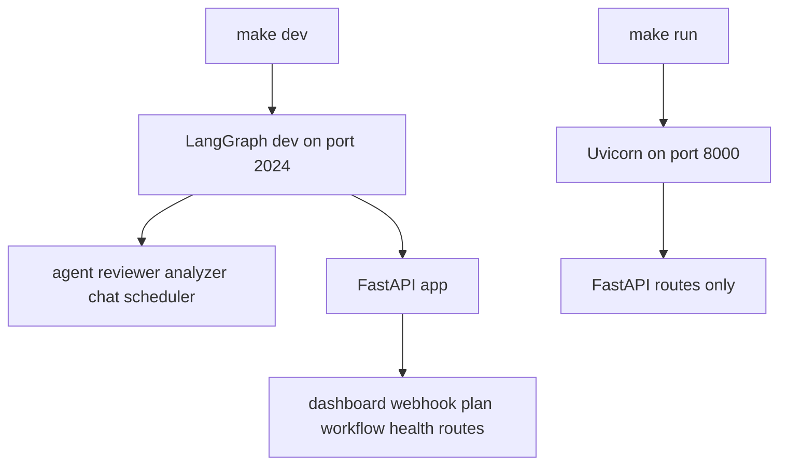
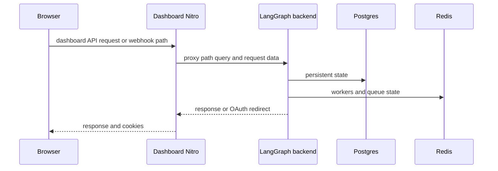

# Development, deployment, and runtime operations

Open SWE runs a LangGraph backend and dashboard as separately deployable processes. The backend registers five graphs—`agent`, `reviewer`, `analyzer`, `chat`, and `scheduler`—and mounts `agent.webapp:app` for dashboard, webhook, plan, workflow-approval, and health HTTP routes. The dashboard is a server-rendered UI that fronts backend paths; it is not embedded in the backend image.

Use this page for process boundaries and operator checks. See [Configuration](configuration.md) for the full environment contract, [Dashboard UI](../integrations/dashboard-ui.md) for product and desktop behavior, and [Testing](../testing/overview.md) for test-layer selection.

## Local backend

Install the Python environment and development extras:

```bash
make install
```

This runs `uv sync --extra dev`. The normal end-to-end entrypoint is:

```bash
make dev
```

It runs `uv run langgraph dev --no-browser --port 2024`. `langgraph.json` supplies the five graph registrations, the `agent.webapp:app` HTTP app, `.env`, and a deleting checkpointer TTL: it sweeps every 60 minutes and defaults checkpoints to 43,200 minutes. One process at `http://localhost:2024` therefore serves both the LangGraph runtime and the FastAPI routes.

`make run` is intentionally narrower:

```bash
make run
```

It starts `uv run uvicorn agent.webapp:app --reload --port 8000`, without the LangGraph runtime. Use it for an HTTP-only route change, not an end-to-end dashboard Agents-chat or graph-run change; those require `make dev` on port 2024.



This shows the local serving boundary: `make dev` joins graph and HTTP serving, while `make run` does not start graph execution.

### Startup and health checks

Creating the FastAPI app pins a single event loop before queue workers initialize. Its lifespan repeats that pin, validates the selected sandbox provider and local-development default-model credentials, then closes cached model clients on shutdown. Invalid active LangSmith sandbox configuration fails at boot rather than at first sandbox creation. Local model credential validation applies only when `DASHBOARD_BASE_URL` starts with `http://localhost`; it checks the configured default model and raises for its missing provider key, not later team, profile, or thread selections.

Use `GET /health` as a basic process health probe; it returns `{"status":"healthy"}`. It is a liveness-style route, not a dependency-readiness check. Also treat lifespan failures in logs as startup configuration failures before sending webhook traffic.

The FastAPI composition rejects `DASHBOARD_ALLOWED_ORIGINS=*`, then enables credentialed CORS only when configured origins are nonempty. This protects the browser boundary but is not a substitute for dashboard authentication or mutation authorization.

### Runtime-version boundary

Local development and the cloud manifest use Python 3.14 and LangGraph API `0.13.3`. `pyproject.toml` constrains the local `langgraph-api` resolution to `>=0.13.3,<0.14`, avoiding an end-of-life resolver outcome and aligning `langgraph dev` with `langgraph.json`. The standalone backend image uses the matching `langchain/langgraph-api:0.13.3-py3.14` base.

`langgraph.desktop.json` is a distinct trimmed manifest: it exposes only `agent`, disables the built-in UI, and configures `agent.local_auth:auth` with Studio authentication disabled. Do not use it as a replacement for the normal multi-graph service.

### Focused local validation

Do **not** run the full Python suite locally. Select the smallest relevant target, for example:

```bash
make test TEST_FILE=tests/github/test_open_pull_request.py
make lint
make typecheck
```

`make test` (or `make tests`) runs `uv run pytest -vvv` for `TEST_FILE` and skips a missing requested path; the default is `tests/`, so always set a narrow path locally. `make integration_tests` targets `tests/integration_tests/` when present. `make lint` runs Ruff checks and formatting diff, `make format` applies formatting and fixes, `make format-check` verifies formatting, and `make typecheck` runs `ty check agent tests`.

For an operational smoke check, start the intended server, request `/health`, and exercise the exact proxied or webhook route changed. A dashboard-proxy check such as `curl -i http://localhost:3000/dashboard/api/me` should return the backend response (commonly `401` when unauthenticated), not dashboard HTML.

## Dashboard workspace and local UI

The pnpm workspace contains `ui`, `desktop`, and `tests/e2e`; Turborepo coordinates package `dev`, `build`, `typecheck`, `test`, and `check` tasks. Install workspace dependencies from the repository root, then start the dashboard:

```bash
pnpm install
make web
```

`make web` calls `pnpm run dev`, which scopes `turbo run dev` to `open-swe-dashboard`. In development, Vite/Nitro proxies backend prefixes to `DASHBOARD_API_URL`, defaulting to `http://localhost:2024`; set that variable before startup to front another backend. The production-only handler deliberately has no fallback, but the local dev proxy does.

For the normal local dashboard login flow, set `DASHBOARD_ALLOWED_ORIGINS="http://localhost:3000"`, set `DASHBOARD_API_BASE_URL="http://localhost:3000"`, and register `http://localhost:3000/dashboard/api/auth/callback` with the GitHub App. The origin allowlist is also the backend's mutation CSRF gate: without the dashboard origin, reads can work while cookie-authenticated writes fail.

`pnpm run build`, `pnpm run typecheck`, and `pnpm run test` fan out through Turborepo; scope a package task with `pnpm --filter open-swe-dashboard run <script>`. Root `pnpm run lint` uses oxlint, and `pnpm run format`/`pnpm run format:check` use oxfmt once across repository JS/TS files rather than as Turbo tasks. Turbo caches `.output/**`, `.vercel/output/**`, and `build/**`; `DASHBOARD_API_URL`, `VERCEL`, `E2E_HARNESS`, and `VITE_*` are build cache inputs. `VITE_*` values are browser-visible and must not contain secrets.

## Desktop development and packaging

The experimental Electron application packages the compiled dashboard UI. Start its development wrapper with:

```bash
make desktop
```

This calls `pnpm run dev:desktop`; start `make dev` first for the normal backend. Development uses `http://localhost:2024` by default. To use a hosted backend, pass `--backend-url` through `pnpm --dir desktop run start -- --backend-url=https://your-backend.example.com` or set `OPEN_SWE_BACKEND_URL`.

Package an unpacked app with `pnpm --dir desktop run pack`, or an installer with `pnpm --dir desktop run dist`. Packaged builds prompt for and locally store the organization backend URL at first launch; they do not default to a hosted maintainer deployment. Permit `<backend-url>/dashboard/api/auth/callback` in the GitHub App for desktop login.

On macOS, `make install-desktop` refuses a dirty checkout, switches and fast-forwards `main`, then invokes `scripts/install_desktop.sh`; `make install-checkout` invokes the script without changing Git state. The script is macOS-only, requires Node, `ditto`, uv, and pnpm or corepack, installs with a frozen lockfile, packs the app, and stages then swaps it into `/Applications` or `~/Applications`.

## Production backend

Build the standalone backend image from the repository root:

```bash
docker build -t open-swe .
```

The root `Dockerfile` is a production LangGraph API server image, not a sandbox image. It starts from `langchain/langgraph-api:0.13.3-py3.14`, installs this repository under the image constraints, and sets `LANGSERVE_GRAPHS`, `LANGGRAPH_HTTP`, and `LANGGRAPH_CHECKPOINTER` for the five graphs, FastAPI app, and deleting TTL. It exposes port 8000.

A standalone deployment needs the application environment plus Agent Server backing services: `DATABASE_URI` for Postgres, `REDIS_URI` for Redis, `LANGSMITH_API_KEY` unless tracing is disabled, and `LANGGRAPH_CLOUD_LICENSE_KEY`. Expose port 8000 through ingress and set `LANGGRAPH_URL` to the public backend URL. Do not deploy it on scale-to-zero infrastructure: background runs rely on Redis/Postgres-backed workers remaining available. If built-in LangGraph API routes are publicly reachable, place the service behind private networking, an API gateway, or custom LangGraph authentication before using `LANGGRAPH_AUTH_TYPE=noop`.

Set `DASHBOARD_API_BASE_URL` to the URL browsers use for dashboard API requests and OAuth callbacks, and update GitHub, Linear, and Slack webhook targets plus OAuth callbacks after a public URL change. The dashboard callback is `<DASHBOARD_API_BASE_URL>/dashboard/api/auth/callback`. LangGraph Cloud / Platform is an alternative backend deployment path: connect the repository, configure the same environment there, and use the hosted deployment URL for `LANGGRAPH_URL` and callbacks.

## Dashboard production topology

Build the dashboard image from the repository root:

```bash
docker build -f ui/Dockerfile .
```

`ui/Dockerfile` is a multi-stage Node 24 Alpine build. It installs the dashboard workspace with the frozen lockfile, builds `open-swe-dashboard`, copies its Nitro `.output` server to the final image, runs as `node`, and exposes port 8080. Set `DASHBOARD_API_URL` in the running deployment: the proxy reads it per request and throws when it is absent, so one image can front different backends without a dangerous default.

In a deployed build, Nitro sends `/dashboard/api/**` and `/webhooks/**` to the backend proxy. It preserves the path, query, method, request body, and OAuth redirects; it filters hop-by-hop/reframed headers and preserves separate `Set-Cookie` headers. Server-rendered dashboard calls go directly to the backend and explicitly forward the incoming `osw_session` cookie.



This shows the production proxy boundary and the backend services that must remain available for background work.

The recommended topology is same-origin: point `DASHBOARD_API_BASE_URL` and the GitHub App callback at the dashboard origin, so browser `/dashboard/api/*` requests and `osw_session` stay on that host. For direct cross-origin browser calls, set `VITE_DASHBOARD_API_BASE_URL` and `DASHBOARD_API_BASE_URL` to the backend, retain `DASHBOARD_API_URL` for SSR and webhook proxying, and add the dashboard origin to `DASHBOARD_ALLOWED_ORIGINS`. In that mode the cookie belongs to the backend, initial dashboard pages render unauthenticated, and the client resolves the session after hydration.

## Snapshots and maintenance helpers

Create a LangSmith sandbox snapshot with `uv run python scripts/create_sandbox_snapshot.py`. The script creates a snapshot from a Docker image using `SandboxClient`, defaults to `johanneslangchain/open-swe-sandbox:gh-cli-amd64` and a 32 GiB filesystem, requires `--api-key` or `LANGSMITH_API_KEY`, and prints the UUID to assign to `DEFAULT_SANDBOX_SNAPSHOT_ID`.

`scripts/purge_wakeup_crons.py` is a one-time backfill for expired one-shot `thread_wakeup` crons; regular scheduling now purges them opportunistically. Run its `--dry-run` first, then run without it to delete. It resolves the deployment from `--url` or `LANGGRAPH_URL` and an API key from `LANGGRAPH_API_KEY` or `LANGSMITH_API_KEY` (including registry-supported deprecated aliases).

`examples/github-actions/set-base-snapshot.yml` is a copy-ready reference workflow, not an active workflow. It PUTs a snapshot ID to `/dashboard/api/sandbox-settings` using a short-lived GitHub Actions OIDC bearer token. Enable `id-token: write`; allowlist its repository or full subject via `ADMIN_OIDC_SUBJECTS`, and keep `ADMIN_OIDC_AUDIENCE` aligned with the requested audience (default `open-swe`). An administrator-owned personal access token is an alternative; `secrets.GITHUB_TOKEN` is neither an OIDC credential nor a user identity accepted for this operation.
