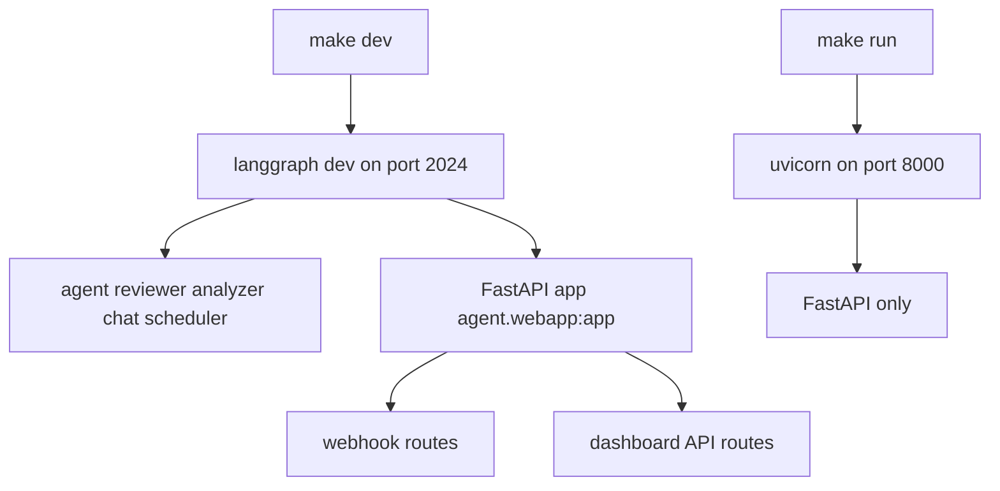
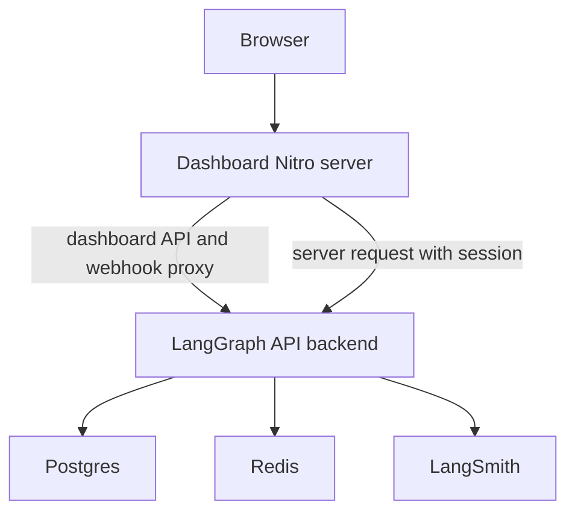

# Local Dev, Build & Deployment

Open SWE is deployed as two independently runnable services:

- The **backend** is a LangGraph application exposing the `agent`, `reviewer`, `analyzer`, `chat`, and `scheduler` graphs, alongside the FastAPI app `agent.webapp:app`. The HTTP app provides webhook, dashboard, and health routes.
- The **dashboard** is the `ui/` TanStack Start/Nitro application. It proxies selected requests to the backend rather than embedding one backend address in its production build.

See [Configuration](configuration.md) for the complete environment contract, [Dashboard UI](../integrations/dashboard-ui.md) for UI behavior, and [Testing](../testing/overview.md) for broader test guidance.

## Local backend

Install Python dependencies and development tools with:

```bash
make install
```

This runs `uv sync --extra dev`. The primary entrypoint is:

```bash
make dev
```

It runs `uv run langgraph dev --no-browser --port 2024`. `langgraph.json` supplies the five graph imports, `agent.webapp:app`, a `.env` file, and a deleting checkpointer TTL: a 60-minute sweep removes checkpoints after the 43,200-minute default TTL. Thus one local process at `http://localhost:2024` serves both LangGraph and FastAPI routes.

`make run` is deliberately narrower: it runs `uv run uvicorn agent.webapp:app --reload --port 8000`. It is useful for the HTTP app, but it does not start the LangGraph runtime, so it cannot support dashboard Agents chat features that invoke LangGraph. Use `make dev` for end-to-end development.



Local entrypoints: `make dev` joins graph and HTTP serving; `make run` serves only FastAPI.

### Runtime-version boundary

Do **not** treat every manifest and image as the same LangGraph API runtime:

| Context | Python | LangGraph API version source |
|---|---:|---|
| Local `langgraph dev` and cloud manifest | 3.12 | `langgraph.json` declares `api_version` `0.12.6`; `pyproject.toml` constrains local resolution to `>=0.12.6,<0.13`. |
| Standalone root backend image | 3.12 | `Dockerfile` is based on `langchain/langgraph-api:0.13.2-py3.12`. |
| Desktop manifest | 3.12 | `langgraph.desktop.json` declares `api_version` `0.12.6`. |

The `pyproject.toml` constraint prevents uv from selecting the end-of-life `langgraph-api` 0.10.3 due to pre-release peer bounds. It aligns local development with `langgraph.json`, **not** with the root image's 0.13.2 base. Before changing graphs, checkpointer behavior, or runtime-specific behavior, test the intended deployment path; the graph and HTTP registrations are currently duplicated between `langgraph.json` and Docker `LANGSERVE_GRAPHS`/`LANGGRAPH_HTTP`.

`langgraph.desktop.json` is intentionally trimmed: it exposes only `agent`, disables the built-in UI, and uses `agent.local_auth:auth` with Studio auth disabled.

### Focused backend checks

The Makefile wrappers keep backend checks in the uv environment:

- `make test` or `make tests` runs verbose pytest for `TEST_FILE` (default `tests/`); a missing requested path is skipped.
- `make integration_tests` runs `tests/integration_tests/` when present.
- `make lint` runs `ruff check` plus formatter diff; `make format` applies Ruff formatting and fixes; `make format-check` verifies formatting.
- `make typecheck` runs `basedpyright agent tests`.

## Dashboard workspace and local UI

The pnpm workspace contains `ui`, `desktop`, and `tests/e2e`; Turborepo coordinates package `dev`, `build`, `typecheck`, `test`, and `check` tasks. After `pnpm install` at the repository root, run:

```bash
make web
```

This invokes `pnpm run dev`, or `turbo run dev --filter=open-swe-dashboard`, and starts Vite at `http://localhost:3000`. In development, Vite proxies backend-owned paths to `DASHBOARD_API_URL`, defaulting to `http://localhost:2024`; this includes `/dashboard/api`, `/webhooks`, and mock-harness paths. Set `DASHBOARD_API_URL` before starting the command to use another backend.

For the normal local dashboard/login flow, configure `DASHBOARD_ALLOWED_ORIGINS="http://localhost:3000"` and set `DASHBOARD_API_BASE_URL="http://localhost:3000"` with the GitHub App callback at `http://localhost:3000/dashboard/api/auth/callback`. The origin allowlist is also the backend's credentialed CORS/CSRF boundary: it rejects `*`, and missing the UI origin causes non-GET dashboard writes to fail CSRF validation even though reads can work.

`pnpm run build`, `pnpm run typecheck`, and `pnpm run test` fan out through Turborepo; use `pnpm --filter open-swe-dashboard run <script>` to scope a package task. Root `pnpm run lint` (oxlint) and `pnpm run format`/`pnpm run format:check` (oxfmt) are not Turbo tasks and operate once across JS/TS files. Turbo caches build outputs in `.output/**`, `.vercel/output/**`, and `build/**`; `DASHBOARD_API_URL`, `VERCEL`, `E2E_HARNESS`, and `VITE_*` are cache inputs. `VITE_*` values become browser-visible build data, so never put a secret in them.

## Desktop packaging

The experimental Electron app in `desktop/` bundles the compiled dashboard UI. `make desktop` runs `pnpm run dev:desktop`; normally start `make dev` as its backend first. Development defaults to `http://localhost:2024`; use `pnpm --dir desktop run start -- --backend-url=https://your-backend.example.com` or `OPEN_SWE_BACKEND_URL` for a hosted backend.

Package with `pnpm --dir desktop run pack` for an unpacked app or `pnpm --dir desktop run dist` for an installer. Packaged apps ask for and store an organization backend URL on first launch; they do not default to a maintainer deployment. Permit `<backend-url>/dashboard/api/auth/callback` in the GitHub App for desktop login.

On macOS, `make install-desktop` requires a clean checkout, switches and fast-forwards `main`, then calls `scripts/install_desktop.sh`; `make install-checkout` calls the script without changing Git state. The script rejects non-macOS hosts, verifies Node, `ditto`, uv, and pnpm or corepack, installs from a frozen lockfile, packages the app, and swaps it into `/Applications` or `~/Applications`.

## Production backend

The root `Dockerfile` is the production **LangGraph API server** image, not a sandbox image:

```bash
docker build -t open-swe .
```

It installs the repository into `langchain/langgraph-api:0.13.2-py3.12` under that image's API constraints, registers `agent.webapp:app`, the five graphs, and the same checkpointer TTL through environment variables, removes package-management tooling, and exposes port `8000`. This wiring mirrors the active cloud manifest's graphs and TTL, but the base API version differs as described above.

A standalone deployment needs the full application environment plus Agent Server services: `DATABASE_URI` for Postgres, `REDIS_URI` for Redis, `LANGSMITH_API_KEY` unless tracing is disabled, and `LANGGRAPH_CLOUD_LICENSE_KEY`. Publish port 8000 through ingress and set `LANGGRAPH_URL` to its public backend URL. Do not use scale-to-zero hosting: background runs require Redis/Postgres-backed workers to remain available. If built-in LangGraph API routes are publicly reachable, do not rely on `LANGGRAPH_AUTH_TYPE=noop`; put the service behind private networking, a gateway, or custom LangGraph authentication.

Update GitHub, Linear, and Slack webhook targets and OAuth callbacks when the public URLs change. `DASHBOARD_API_BASE_URL` is the browser-facing dashboard API/callback origin: set it to the dashboard origin for same-origin proxying, or the backend origin for direct cross-origin calls. The GitHub callback is `<DASHBOARD_API_BASE_URL>/dashboard/api/auth/callback`.

Alternatively connect the repository to LangGraph Cloud / Platform, configure the same application environment there, and use the hosted deployment URL for `LANGGRAPH_URL` and callbacks. That path uses `langgraph.json` and its 0.12.6 API declaration, rather than the standalone Docker base tag.

## Dashboard production topology

Build the dashboard image from the repository root:

```bash
docker build -f ui/Dockerfile .
```

`ui/Dockerfile` uses multi-stage `node:24-alpine`, installs the dashboard workspace with the frozen lockfile, copies only `.output` to the final image, runs as the `node` user, and exposes its Nitro server on port 8080. In a production dashboard deployment, `DASHBOARD_API_URL` is required and read per request; an unset value fails rather than silently choosing a hosted backend. Consequently one image can front different backend deployments.

The deployed Nitro handler proxies `/dashboard/api/**` and `/webhooks/**` to that backend and preserves OAuth redirects. Server-side calls can use the request session cookie. The recommended arrangement is same-origin: dashboard browser traffic and the OAuth callback use the dashboard origin, letting `osw_session` remain on that host. For direct cross-origin traffic, set `VITE_DASHBOARD_API_BASE_URL` and `DASHBOARD_API_BASE_URL` to the backend, keep `DASHBOARD_API_URL` at that backend for SSR/proxying, and include the dashboard origin in `DASHBOARD_ALLOWED_ORIGINS`. In that alternative, the session cookie belongs to the backend, pages initially render unauthenticated and hydrate client-side.



Production topology: the dashboard fronts the backend, while backend workers depend on Postgres, Redis, and LangSmith services.

## Snapshots and operational helpers

Run `scripts/create_sandbox_snapshot.py` with `uv run python`. It uses `SandboxClient` to create a LangSmith sandbox snapshot from an image (by default `johanneslangchain/open-swe-sandbox:gh-cli-amd64`) with a default 32 GiB filesystem, then prints the snapshot UUID and `DEFAULT_SANDBOX_SNAPSHOT_ID` assignment. It requires `--api-key` or `LANGSMITH_API_KEY`/`LANGSMITH_API_KEY_PROD`.

`scripts/purge_wakeup_crons.py` is a one-time cleanup for expired one-shot `thread_wakeup` cron rows; the regular scheduling tool now purges them opportunistically. Start with `--dry-run`, then run without it to delete. It obtains the deployment from `--url`, `LANGGRAPH_URL`, or `LANGGRAPH_URL_PROD`, and its API key from `LANGGRAPH_API_KEY`, `LANGSMITH_API_KEY`, or `LANGSMITH_API_KEY_PROD`.

`examples/github-actions/set-base-snapshot.yml` is a reference workflow, not an active workflow. It PUTs a snapshot ID to `/dashboard/api/sandbox-settings` using a GitHub Actions OIDC bearer token. Enable `id-token: write` and allowlist the workflow with `ADMIN_OIDC_SUBJECTS`; `owner/repo` entries match the token repository claim, while entries containing `:` match its full subject. `ADMIN_OIDC_AUDIENCE` defaults to `open-swe` and must match the requested audience. A personal access token is an alternative only when its owner is in `CONFIGURED_ADMINS`; `secrets.GITHUB_TOKEN` is neither an OIDC credential nor a user identity for this endpoint.
