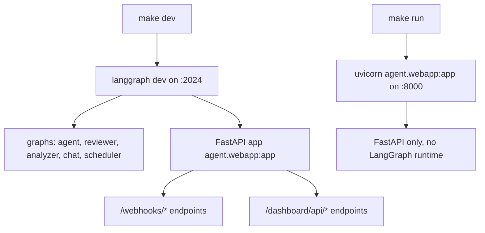
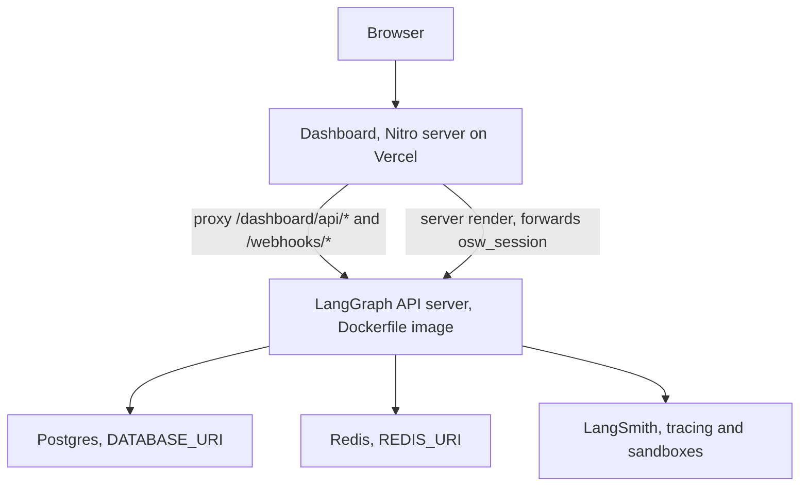

# Local Dev, Build & Deployment

Open SWE has two runnable pieces, and this page covers how to run, build, and
deploy each of them:

- **The backend** — a LangGraph application that serves several graphs
  (`agent`, `reviewer`, `analyzer`, `chat`, `scheduler`) *and* a FastAPI app
  (`agent.webapp:app`) that owns the webhooks and the dashboard API. Both are
  served together by `langgraph dev` locally, and by the LangGraph API server
  image in production.
- **The dashboard** — a TanStack Start + Vite web app in `ui/` (package name
  `open-swe-dashboard`) that is a thin client over the FastAPI dashboard API.

Setup prerequisites (GitHub App creation, LangSmith, Slack/Linear/GitHub
triggers, and every environment variable) live in
[`docs/INSTALLATION.md`](repo://docs/INSTALLATION.md); this page references them
at a pointer level. For the meaning of individual environment variables see
[operations/configuration](configuration.md), and for the dashboard's runtime
architecture see [integrations/dashboard-ui](../integrations/dashboard-ui.md).

## Prerequisites (pointer)

The installation guide requires Python 3.11–3.13, the [uv](https://docs.astral.sh/uv/)
package manager, the LangGraph CLI, [ngrok](https://ngrok.com/) to expose local
webhook endpoints, and [pnpm](https://pnpm.io/) for the dashboard. The backend
requires Python `>=3.11`, declared in `pyproject.toml`.

Before anything runs end-to-end you must complete the one-time setup steps in
`docs/INSTALLATION.md`: create and install a **GitHub App** (App ID, private
key, installation ID, client ID/secret, webhook secret), configure **LangSmith**
(API key, tenant/project IDs, optional per-user GitHub OAuth provider, and a
sandbox snapshot), and set up whichever **triggers** (GitHub, Linear, Slack)
your team uses. Those credentials and the full `.env` variable list are the
input to every run and deploy described below.

## Backend local development

The `Makefile` is the canonical entry point for backend workflows; each target
is a thin wrapper over a `uv run` command.

- `make dev` runs `uv run langgraph dev --no-browser --port 2024`. This is the
  primary local-dev command: it serves **all** graphs declared in
  `langgraph.json` *and* the FastAPI app (`agent.webapp:app`) together on
  `http://localhost:2024`. The FastAPI app owns both the `/webhooks/*`
  endpoints and the `/dashboard/api/*` endpoints, so the webhooks and the
  dashboard's Agents chat both work against this single server.
- `make run` runs `uv run uvicorn agent.webapp:app --reload --port 8000`. This
  serves the FastAPI app **without** the LangGraph runtime, on port 8000.
  Because the dashboard's Agents chat features call LangGraph, `make run` is
  insufficient for full local dev — use `make dev` on `:2024`.
- `make install` runs `uv sync --extra dev` to install dependencies including
  dev extras (basedpyright, pytest, ruff).
- `make test` / `make tests` run `uv run pytest`; `make integration_tests` runs
  the `tests/integration_tests/` suite; `make lint`, `make format`,
  `make format-check` wrap `ruff`, and `make typecheck` runs
  `uv run basedpyright agent tests`.

`langgraph.json` is the deployment manifest for both local dev and the
production image: it declares the graph import paths, the FastAPI HTTP app
(`agent.webapp:app`), a checkpointer TTL policy, and `.env` as the env file.
The local dev server's `langgraph-api` version is pinned in `pyproject.toml`
via `constraint-dependencies = ["langgraph-api>=0.12.6,<0.13"]` so that tests
and local runs use the same runtime that serves production, rather than uv's
default resolution landing on an end-of-life release.

`langgraph.desktop.json` is a separate, trimmed manifest used by the desktop
build: it exposes only the `agent` graph, disables the built-in UI, and wires a
local auth handler (`agent.local_auth:auth`) with Studio auth disabled.

Local backend entrypoints: `make dev` serves graphs plus FastAPI together, while `make run` serves FastAPI alone.

## Dashboard local development

The dashboard lives in a pnpm workspace whose members are `ui`, `desktop`, and
`tests/e2e` (declared in `pnpm-workspace.yaml`). Turborepo orchestrates the
per-package `dev`, `build`, `typecheck`, `test`, and `check` tasks
(`turbo.json`), and the root `package.json` scripts invoke Turborepo.

- `make web` runs `pnpm run dev`, which is `turbo run dev --filter=open-swe-dashboard`,
  starting Vite on `http://localhost:3000`.
- The dev server proxies `/dashboard/api/*` to `DASHBOARD_API_URL`, which
  defaults to `http://localhost:2024`; export that variable before `make web`
  to point the dashboard at a different backend. Because the value is read at
  request time, no `ui/.env` is required and one build can front any backend.
- `pnpm run build`, `pnpm run typecheck`, and `pnpm run test` fan out across the
  workspace through Turborepo; scope one to a package with
  `pnpm --filter open-swe-dashboard run <script>`.
- `pnpm run lint` (oxlint) and `pnpm run format` / `pnpm run format:check`
  (oxfmt) are **not** Turborepo tasks — they run once from the root over every
  JS/TS file in the repo, so there is no per-package variant.

Turborepo's `build` task caches `.output/**`, `.vercel/output/**`, and
`build/**`, and treats `DASHBOARD_API_URL`, `VERCEL`, `E2E_HARNESS`, and any
`VITE_*` variable as cache-affecting build inputs, so changing them invalidates
cached builds. `VITE_*`-prefixed values (for example the Datadog RUM settings)
are baked into the browser bundle at build time and are therefore public.

## Desktop app (experimental)

The Electron app in `desktop/` bundles the compiled dashboard UI and is an
early-access convenience surface; the web UI is the recommended way to use Open
SWE. Run `make desktop` (`pnpm run dev:desktop`) alongside a running backend
(`make dev` on `:2024`). Packaged builds are produced with
`pnpm --dir desktop run pack` (unpacked) or `pnpm --dir desktop run dist`
(installer), and they prompt for the organization's backend URL on first launch
rather than defaulting to any hosted deployment.

`make install-desktop` installs or updates Open SWE Desktop on macOS: it refuses
to run with a dirty working tree, fast-forwards to `main`, then delegates to
`scripts/install_desktop.sh`. `make install-checkout` runs that same script
against the current checkout without touching git state. The install script is
macOS-only, checks for `node`, `ditto`, `uv`, and a `pnpm`/`corepack` launcher,
packs the app, and atomically swaps it into `/Applications` (or `~/Applications`
when `/Applications` is not writable).

## Operational scripts and CI helpers

The `scripts/` directory holds standalone operational tasks run with
`uv run python`:

- `scripts/create_sandbox_snapshot.py` builds a LangSmith sandbox snapshot from
  a Docker image and prints the resulting UUID to set as
  `DEFAULT_SANDBOX_SNAPSHOT_ID`.
- `scripts/purge_wakeup_crons.py` is a one-time backfill that deletes expired
  one-shot `thread_wakeup` crons from a deployment, resolving the deployment URL
  from `--url`/`LANGGRAPH_URL`/`LANGGRAPH_URL_PROD` and the API key from
  `LANGGRAPH_API_KEY`/`LANGSMITH_API_KEY`/`LANGSMITH_API_KEY_PROD`.
- Other helpers include `scripts/list_snapshots.py`,
  `scripts/check_pr_merge_status.py`, and `scripts/scrape_pr_context.py`.

`examples/github-actions/set-base-snapshot.yml` is a copy-ready reference
workflow (not an active workflow) that rolls a new base sandbox snapshot out to
a running deployment from CI by `PUT`ting to `/dashboard/api/sandbox-settings`.
It authenticates with **GitHub Actions OIDC** (`permissions: id-token: write`),
minting a short-lived signed token so no long-lived secret is stored; the
deployment allowlists the workflow via `ADMIN_OIDC_SUBJECTS` (matched against
the token's `sub`/`repository` claim) and an `ADMIN_OIDC_AUDIENCE` that defaults
to `open-swe`. The alternative auth path is an admin personal access token whose
owner is listed in `CONFIGURED_ADMINS`; `secrets.GITHUB_TOKEN` works for
neither, because installation tokens carry no user identity and are not OIDC
tokens.

## Production deployment shape

Production runs the backend and the dashboard separately.

### Backend image

The root `Dockerfile` builds the production LangGraph API server image (it is
**not** the sandbox image). It starts from `langchain/langgraph-api`, installs
the repo with `uv pip install`, bakes the graph and HTTP-app wiring into
`LANGSERVE_GRAPHS` / `LANGGRAPH_HTTP` environment variables, sets the
checkpointer TTL policy, and exposes port `8000`. The baked graph list and HTTP
app mirror `langgraph.json`, so the image serves the same graphs plus
`agent.webapp:app` that `make dev` serves locally.

A standalone container additionally requires the Agent Server backing services
and settings: `DATABASE_URI` (Postgres), `REDIS_URI` (Redis),
`LANGSMITH_API_KEY` (unless tracing is disabled), and
`LANGGRAPH_CLOUD_LICENSE_KEY`, plus the full `.env` from installation. Scale-to-
zero hosting must not be used because background runs depend on the Redis/
Postgres-backed workers staying available. `LANGGRAPH_URL` must be set to the
public backend URL so webhooks and the dashboard create runs against the same
server, and webhook/OAuth callback URLs must be updated to production URLs. As
an alternative to self-hosting the image, the backend can be deployed to
LangGraph Cloud / Platform by connecting the repo and setting the same
environment variables.

### Dashboard image and hosting

`ui/Dockerfile` is a multi-stage Node 24 build (run from the repo root) that
installs the workspace with the frozen pnpm lockfile, builds
`open-swe-dashboard` into a Nitro `.output` server, and runs it on port `8080`.
The backend it fronts is read from `DASHBOARD_API_URL` at runtime, so one image
serves any deployment. The dashboard is typically hosted on Vercel; browser
requests to `/dashboard/api/*` and webhook deliveries to `/webhooks/*` are
proxied to the backend, and server renders call the backend directly.

Because that proxy makes browser requests **same-origin**, the recommended
production wiring sets both `DASHBOARD_API_BASE_URL` and the GitHub App
dashboard callback URL to the Vercel/dashboard origin, so the `osw_session`
cookie is set on the dashboard host. An alternative cross-origin mode points
the browser at the backend directly via `VITE_DASHBOARD_API_BASE_URL` and
requires the dashboard origin in `DASHBOARD_ALLOWED_ORIGINS`; see
[integrations/dashboard-ui](../integrations/dashboard-ui.md) and
[operations/configuration](configuration.md) for the cookie, CORS, and CSRF
implications.

Production topology: the dashboard image fronts the backend image, which depends on Postgres, Redis, and LangSmith.
