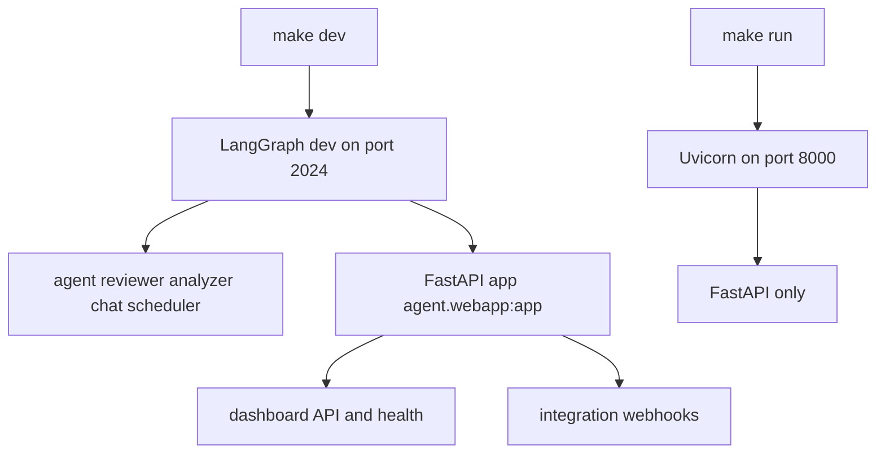
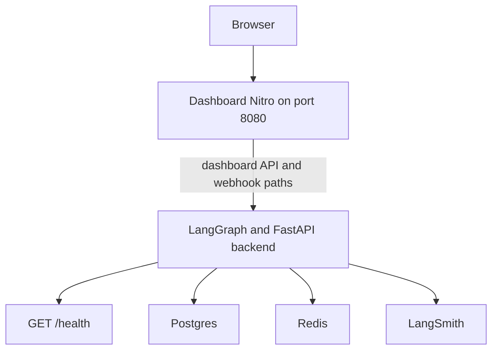

# Development, Service Startup, and Deployment

Open SWE has two deployable service surfaces:

- The **backend** is a LangGraph application with `agent`, `reviewer`, `analyzer`, `chat`, and `scheduler` graphs, plus the FastAPI app `agent.webapp:app`. The HTTP app owns dashboard APIs, integration webhooks, and health.
- The **dashboard** is the server-rendered TanStack Start/Nitro application in `ui/`. It can proxy browser dashboard requests and webhook deliveries to a separately deployed backend.

The dashboard is a required production surface rather than merely a convenience UI: GitHub sign-in there stores user tokens used by agent runs, and it administers user mappings, defaults, enabled repositories, review styles, and environments. See [Configuration](configuration.md) for the environment contract, [Dashboard UI](../integrations/dashboard-ui.md) for product behavior, and [Testing](../testing/overview.md) for the wider test strategy.

## Local topology

Install backend development dependencies with:

```bash
make install
```

This runs `uv sync --extra dev`. The end-to-end backend entrypoint is:

```bash
make dev
```

It starts `uv run langgraph dev --no-browser --port 2024`. `langgraph.json` registers all five graphs and `agent.webapp:app`, loads `.env`, and configures deleting checkpoint retention: the server sweeps every 60 minutes and the default TTL is 43,200 minutes. Therefore `http://localhost:2024` serves both graph-runtime and FastAPI routes.

`make run` is intentionally narrower:

```bash
make run
```

It runs `uv run uvicorn agent.webapp:app --reload --port 8000`. It is appropriate when exercising the HTTP application alone, but it does not start the LangGraph runtime and cannot support dashboard Agents chat features that invoke LangGraph. Use `make dev` for ordinary end-to-end development.



The local entrypoints separate full graph-plus-HTTP serving from HTTP-only serving.

At FastAPI startup, the application pins a single event loop, validates sandbox startup configuration and local-development LLM configuration, and closes cached models at shutdown. A configuration error can therefore prevent the HTTP service from becoming ready. The backend exposes `GET /health`, which returns `{"status": "healthy"}`; point a backend load-balancer health check directly to that route. A dashboard deployment only proxies `/dashboard/api/**` and `/webhooks/**`, so it is not a substitute for exposing or probing backend `/health`.

### Local dashboard

Install workspace dependencies at the repository root, then run the UI in another terminal:

```bash
pnpm install
make web
```

`make web` invokes `pnpm run dev`, which runs the dashboard Vite server at `http://localhost:3000`. In development, Vite proxies backend-owned routes to `DASHBOARD_API_URL`, defaulting to `http://localhost:2024`; set that variable before startup to select another backend. Development also proxies mock-harness and raw LangGraph paths when applicable, whereas a normal production dashboard deliberately proxies only dashboard API and webhook routes.

For local dashboard login, set `DASHBOARD_ALLOWED_ORIGINS="http://localhost:3000"`, set `DASHBOARD_API_BASE_URL="http://localhost:3000"`, and register `http://localhost:3000/dashboard/api/auth/callback` with the GitHub App. Although the browser's dashboard requests are same-origin through Vite and need no CORS preflight, the allowlist is also the backend CSRF gate for non-GET requests; omitting the UI origin allows reads but makes saves fail with `403 CSRF check failed`. Keep the local API base URL on `http://` so the session cookie uses `SameSite=Lax` rather than `Secure`.

For a quick proxy diagnostic, with both services running, `curl -i http://localhost:3000/dashboard/api/me` should produce the backend's `401`, not dashboard HTML.

### Runtime boundary

Do not assume every development and deployment path uses a different runtime release. The repository now aligns them on Python 3.14 and LangGraph API 0.13.3:

| Context | Runtime declaration |
|---|---|
| Local `langgraph dev` and LangGraph Cloud / Platform | `langgraph.json`: Python 3.14 and `api_version` `0.13.3`; `pyproject.toml` constrains local `langgraph-api` resolution to `>=0.13.3,<0.14`. |
| Standalone root backend image | `langchain/langgraph-api:0.13.3-py3.14`. |
| Desktop local-agent manifest | `langgraph.desktop.json`: Python 3.14 and `api_version` `0.13.3`. |

The local constraint avoids uv resolving the end-of-life 0.10.3 runtime because of pre-release peer bounds. The production Docker configuration repeats the cloud manifest's graph registrations, HTTP app, and checkpoint TTL in environment variables; keep those two declarations synchronized when adding or changing a graph.

`langgraph.desktop.json` is intentionally reduced for the local desktop agent: it exposes only `agent`, disables the built-in UI, and sets `agent.local_auth:auth` while disabling Studio authentication.

### Focused checks

The Makefile runs Python checks through `uv`:

- `make test` or `make tests` runs verbose pytest for `TEST_FILE` (default `tests/`); a missing requested path is reported and skipped.
- `make integration_tests` runs `tests/integration_tests/` when it exists.
- `make lint` runs `ruff check` and a formatting diff. `make format` applies formatting and safe Ruff fixes; `make format-check` verifies formatting.
- `make typecheck` runs `ty check agent tests`.

The pnpm workspace contains `ui`, `desktop`, and `tests/e2e`. Turborepo orchestrates package `dev`, `build`, `typecheck`, `test`, and `check` tasks. `pnpm run build`, `pnpm run typecheck`, and `pnpm run test` fan out through Turbo; scope a task with `pnpm --filter open-swe-dashboard run <script>`. Root `pnpm run lint` uses oxlint and `pnpm run format` / `pnpm run format:check` use oxfmt once over the JavaScript and TypeScript workspace rather than as Turbo tasks. Build caching includes `.output/**`, `.vercel/output/**`, and `build/**`; `DASHBOARD_API_URL`, `VERCEL`, `E2E_HARNESS`, and `VITE_*` are cache inputs. Since `VITE_*` values are browser-visible build data, never put secrets in them.

## Desktop client

The experimental Electron app in `desktop/` bundles the compiled dashboard UI. Start it with `make desktop` (equivalent to `pnpm run dev:desktop`) after starting `make dev`; an optional `make web` supplies the normal browser UI too. Desktop development defaults to `http://localhost:2024`; use `pnpm --dir desktop run start -- --backend-url=https://your-backend.example.com` or `OPEN_SWE_BACKEND_URL` to choose another backend. Resolution prefers the command-line URL, then that environment variable, saved configuration, and finally the development default; legacy `--url` and `OPEN_SWE_DESKTOP_URL` remain accepted.

The app also starts a private local-agent LangGraph service on a random loopback port for **This Mac** tasks. Electron proxies the bundled UI's `/dashboard/api/*` calls to the selected shared backend, while this local service is stopped with the app. Packaged builds ask for and store an organization backend URL on first launch; they do not default to a maintainer deployment. Permit `<backend-url>/dashboard/api/auth/callback` in the GitHub App for desktop login.

Package the current platform with:

```bash
pnpm --dir desktop run pack
pnpm --dir desktop run dist
```

Both build `ui/`, package its static output with Electron, and write outputs to `desktop/dist/`; `pack` creates an unpacked application and `dist` an installer.

On macOS, `make install-desktop` refuses a dirty checkout, switches and fast-forwards `main`, then calls `scripts/install_desktop.sh`. `make install-checkout` calls that script without changing Git state. The script is macOS-only; it requires Node, `ditto`, uv, and either pnpm or corepack, installs from the frozen lockfile, packages the app, then stages and replaces `/Applications/Open SWE.app` (or `~/Applications/Open SWE.app` when needed).

## Production backend

Build the standalone LangGraph Agent Server image from the repository root:

```bash
docker build -t open-swe .
```

The root `Dockerfile` is a backend server image, not a sandbox image. It uses `langchain/langgraph-api:0.13.3-py3.14`, installs this repository subject to the image constraints, registers the FastAPI app, five graphs, and deleting checkpoint TTL through `LANGGRAPH_HTTP`, `LANGSERVE_GRAPHS`, and `LANGGRAPH_CHECKPOINTER`, removes package-management tooling, and exposes port 8000.

A standalone server needs the ordinary application environment plus Agent Server backing services: `DATABASE_URI` for Postgres, `REDIS_URI` for Redis, `LANGSMITH_API_KEY` unless tracing is disabled, and `LANGGRAPH_CLOUD_LICENSE_KEY`. Publish port 8000 through ingress and set `LANGGRAPH_URL` to the public backend URL. Do not choose scale-to-zero hosting: background runs need Redis/Postgres-backed workers to remain available. When using `LANGGRAPH_AUTH_TYPE=noop`, raw LangGraph routes must stay behind private networking, an authenticated gateway, or custom LangGraph authentication.

For Docker Engine, the documented local-style run maps an external port to container 8000 and may use `--add-host=host.docker.internal:host-gateway` to reach Postgres and Redis on the Linux host. On Docker Desktop that hostname resolves automatically; with database containers, use their shared-network service names instead. Reconfigure GitHub, Linear, and Slack webhook targets and OAuth callbacks whenever public URLs change. The GitHub callback is always `<DASHBOARD_API_BASE_URL>/dashboard/api/auth/callback`.

Alternatively, connect the repository to LangGraph Cloud / Platform, configure the same application environment, and use its hosted URL for `LANGGRAPH_URL` and integration callbacks.

## Dashboard production topology

Build the dashboard container from the repository root:

```bash
docker build -f ui/Dockerfile .
```

`ui/Dockerfile` is a multi-stage Node 24 Alpine build. It installs the dashboard workspace with the frozen lockfile, builds the Nitro output, copies `.output` into a final image that runs as `node`, and exposes the server on port 8080. `ui/vercel.json` uses the same frozen dashboard install and `pnpm run build`, with deployments enabled for `main`, `preview`, and `prod` branches.

Set `DASHBOARD_API_URL` in the dashboard runtime environment. The Nitro proxy reads it per request, strips one trailing slash, and throws if it is absent rather than selecting a default backend. It forwards the original path and query, request headers and non-GET/HEAD body; it preserves upstream redirects manually so OAuth redirects remain browser navigations. The proxy filters hop-by-hop and stale framing headers, while emitting every upstream `Set-Cookie` separately. This permits one dashboard artifact to front different backends safely.

The recommended arrangement is same-origin proxying: set `DASHBOARD_API_URL` to the backend, but set `DASHBOARD_API_BASE_URL` and the GitHub dashboard callback to the dashboard origin. The dashboard then forwards `/dashboard/api/**` and `/webhooks/**`, and the `osw_session` cookie is issued to and sent from the dashboard host. If browsers call the backend cross-origin instead, set both `VITE_DASHBOARD_API_BASE_URL` and `DASHBOARD_API_BASE_URL` to the backend, retain `DASHBOARD_API_URL` for server rendering and proxying, and add the dashboard origin to `DASHBOARD_ALLOWED_ORIGINS`. In that mode the session belongs to the backend; initial dashboard pages render unauthenticated and resolve the session after client hydration.



The dashboard fronts browser application paths; backend workers and health depend on the backend service and its external stores.

The FastAPI application rejects `DASHBOARD_ALLOWED_ORIGINS="*"` because it enables credentialed CORS. When configured, the origins govern credentialed methods for dashboard APIs; they are an origin/CSRF control, not a replacement for authentication.

## Snapshots and operational helpers

`scripts/create_sandbox_snapshot.py` creates a LangSmith sandbox snapshot from a Docker image through `SandboxClient`, then prints its UUID as a `DEFAULT_SANDBOX_SNAPSHOT_ID` assignment. Its defaults are `johanneslangchain/open-swe-sandbox:gh-cli-amd64` and a 32 GiB filesystem; supply `--api-key` or set `LANGSMITH_API_KEY` or `LANGSMITH_API_KEY_PROD`.

`scripts/purge_wakeup_crons.py` is a one-time backfill for expired one-shot `thread_wakeup` crons. Run it first with `--dry-run`; without that flag it deletes the expired rows. It resolves the target from `--url`, `LANGGRAPH_URL`, or `LANGGRAPH_URL_PROD`, and an optional API key from `LANGGRAPH_API_KEY`, `LANGSMITH_API_KEY`, or `LANGSMITH_API_KEY_PROD`.

`examples/github-actions/set-base-snapshot.yml` is a copy-ready reference workflow rather than an active repository workflow. It PUTs a new snapshot ID to `/dashboard/api/sandbox-settings` using a short-lived GitHub Actions OIDC bearer token and requires `id-token: write`. Enable this deployment access with `ADMIN_OIDC_SUBJECTS`: `owner/repo` entries match the token's repository claim, and entries containing `:` match its full subject. `ADMIN_OIDC_AUDIENCE` defaults to `open-swe` and must match the workflow audience. An admin personal access token is an alternative only if its owner is listed in `CONFIGURED_ADMINS`; `secrets.GITHUB_TOKEN` is neither a user identity nor an OIDC token for this endpoint.
