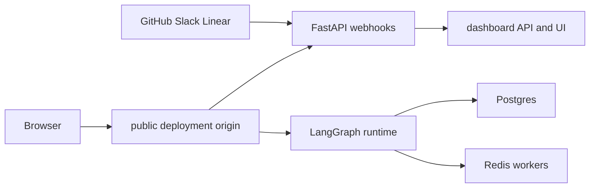

# Build, Development, and Deployment Topology

Open SWE is normally a single LangGraph deployment. Its manifest registers the `agent`, `reviewer`, `analyzer`, `chat`, and `scheduler` graphs and mounts the FastAPI app `agent.webapp:app`; the app owns dashboard API, plan and workflow approval, health, and integration webhook routers. A built dashboard can be served at that same deployment origin, while LangGraph owns the runtime routes.

There are three deliberately different backend modes. Do not substitute one for another:

| Mode | Entrypoint and port | Use and limitation |
|---|---|---|
| **FastAPI-only** | `make run` → Uvicorn on `:8000` | Narrow HTTP/router work; it does **not** start the LangGraph runtime, so run-creating dashboard features do not work. |
| **Full local LangGraph development** | `make dev` → `langgraph dev` on `:2024` | Local integration development: all graphs, FastAPI, and an optional dashboard build in one server. |
| **Production deployment** | LangGraph Platform or the root Docker image on `:8000` | Persistent public service with backing services, production authentication, and a stable public URL. |

See [Configuration](configuration.md) for the complete environment contract, [Dashboard UI](../integrations/dashboard-ui.md) for UI details, and [Testing overview](../testing/overview.md) for broader test guidance.

## Build workspaces and local prerequisites

Install Python development dependencies with:

```bash
make install
```

This runs `uv sync --extra dev`. The repository constrains locally resolved `langgraph-api` to `>=0.13.3,<0.14`, matching the `0.13.3` manifest instead of resolving the end-of-life `0.10.3` runtime.

The JavaScript workspace contains `ui`, `desktop`, and `tests/e2e`; use `pnpm install` from the repository root. Root `pnpm run build`, `pnpm run typecheck`, `pnpm run test`, and `pnpm run check` delegate across packages through Turborepo. Root `lint` and `format` / `format:check` run oxlint and oxfmt once rather than as Turbo tasks. Turbo does not cache persistent `dev` or `check`; its build cache tracks `.output/**`, `.vercel/output/**`, and `build/**`, and treats `DASHBOARD_API_URL`, `VERCEL`, `E2E_HARNESS`, and `VITE_*` as build inputs.

Python counterparts are `make test [TEST_FILE=...]`, `make integration_tests`, `make lint`, `make format`, `make format-check`, and `make typecheck`. The test recipes skip a requested path that does not exist; type checking runs `ty check agent tests`.

## Local backend modes

### Full LangGraph development

```bash
make dev
```

This runs `uv run langgraph dev --no-browser --port 2024 --n-jobs-per-worker 10`. `langgraph.json` is the common development/platform manifest: Python 3.14, API version 0.13.3, the five graph registrations, `.env`, `agent.webapp:app`, and delete-based checkpoint retention (60-minute sweeps and a 43,200-minute default TTL). `langgraph dev` reloads code, but restart it after changing `.env`.

Build the dashboard before starting the server when the backend should serve static UI:

```bash
make build-dashboard
make dev
```

`make build-dashboard` installs the filtered workspace with the frozen lockfile and writes the dashboard to `ui/.output/public`. The backend selects an explicit `DASHBOARD_STATIC_DIR` when set, otherwise that in-repository output only when it contains `_shell.html`. It serves files and HTML client routes but refuses reserved dashboard API, webhook, health, and LangGraph prefixes. This prevents the UI catch-all from shadowing runtime routes; hashed assets are immutable-cacheable and the shell is revalidated for new asset hashes.


The full development server combines graph and HTTP serving; the Uvicorn mode only serves FastAPI.

### FastAPI-only development

```bash
make run
```

This invokes `uv run uvicorn agent.webapp:app --reload --port 8000`. It is appropriate for FastAPI work but has no LangGraph runtime. Anything that creates runs—particularly dashboard agent features—needs `make dev` instead.

### UI hot reload and direct Vite work

```bash
make dev-ui
```

`make dev-ui` runs `make web` and `make dev` concurrently, passing `DASHBOARD_DEV_SERVER_URL=http://localhost:3000` to the backend. Open `http://localhost:2024`: FastAPI reverse-proxies non-reserved UI requests to Vite, while API, login callbacks, cookies, and LangGraph remain at the backend origin. Vite's HMR WebSocket connects directly to port 3000. If Vite is unavailable, the backend proxy returns a helpful 502 rather than silently serving stale UI.

`make web` alone runs `pnpm run dev`, which starts the dashboard development server. In development it proxies backend prefixes to `DASHBOARD_API_URL`, defaulting to `http://localhost:2024`, so an ordinary local UI requires no `ui/.env`. When opening Vite directly at `http://localhost:3000`, make that frontend origin the `DASHBOARD_BASE_URL` and `DASHBOARD_API_BASE_URL`, and add `http://localhost:3000/dashboard/api/auth/callback` to the GitHub App. `DASHBOARD_ALLOWED_ORIGINS` adds credentialed CORS origins; `*` is rejected because credentials are enabled.

### Mount-prefix invariant

A dashboard bundle's `DASHBOARD_BASE_PATH` must equal the LangGraph `http.mount_prefix` where the backend serves it. It controls dashboard asset and client-router URLs. Locally, build a prefixed deployment with `DASHBOARD_BASE_PATH=/<prefix>/ make build-dashboard` and use the mounted URL as `LANGGRAPH_URL`. The platform manifest derives the build value from its mount prefix. A mismatch sends routes or assets outside the mounted application.

## Safely receiving local webhooks

`langgraph dev` leaves raw LangGraph API routes unauthenticated. Do not publish port 2024 wholesale. Instead:

```bash
make tunnel NGROK_DOMAIN=<name>.ngrok-free.dev
```

The target requires `NGROK_DOMAIN`, points ngrok at port 2024, and applies `examples/ngrok/webhooks-only.yml`. Its policy returns 404 outside `/webhooks/*`, allowing GitHub, Slack, or Linear delivery without exposing `/threads`, `/runs`, `/assistants`, or `/store`. Any replacement tunnel needs an equivalent path allowlist. Point integration settings at the public webhook URLs and retain the local dashboard origin for normal development.

## Production backend deployment

### LangGraph Platform

Connect the repository to a LangSmith Deployment and set the same application environment, including a public deployment `LANGGRAPH_URL` and webhook/callback URLs. The `dockerfile_lines` in `langgraph.json` install Node and pnpm, best-effort build the dashboard for the manifest mount prefix, and copy it to `/opt/open-swe-dashboard`. A UI build failure is logged but does not block backend deployment. Platform injects `LANGSMITH_API_KEY`, tracing, and project settings.

### Standalone Docker

```bash
docker build -t open-swe .
```

The root `Dockerfile` builds the production LangGraph API server—not a sandbox image—from `langchain/langgraph-api:0.13.3-py3.14`. It installs this repository and sets the HTTP app, five graph registrations, and checkpoint TTL in `LANGGRAPH_HTTP`, `LANGSERVE_GRAPHS`, and `LANGGRAPH_CHECKPOINTER`; it exposes port 8000.

Supply `DATABASE_URI` for Postgres, `REDIS_URI`, `LANGSMITH_API_KEY`, `LANGGRAPH_CLOUD_LICENSE_KEY`, and public `LANGGRAPH_URL`, then expose port 8000 through ingress. Background runs depend on Redis- and Postgres-backed workers staying available, so scale-to-zero hosting is unsuitable. The root image does not build the dashboard: build it before `docker build` or provide a valid `DASHBOARD_STATIC_DIR`.

The standalone image defaults to `LANGGRAPH_AUTH_TYPE=noop`, meaning raw LangGraph routes are network-accessible. Use LangSmith auth (`LANGGRAPH_AUTH_TYPE=langsmith`, `LANGSMITH_AUTH_ENDPOINT`, and `LANGSMITH_TENANT_ID`) or a private/authenticated network boundary. Dashboard sessions and webhook signatures secure custom routes only; they do not protect raw LangGraph endpoints.



The recommended production topology gives browser traffic and webhook delivery one public origin while runtime workers retain persistent backing services.

## Separate dashboard deployment

The bundled dashboard is the simple default, but `ui/Dockerfile` can produce a distinct Nitro frontend image. Build from the repository root with `docker build -f ui/Dockerfile .`; it uses a frozen workspace install and Node 24 multi-stage build, copies `.output`, runs as `node`, and listens on port 8080. The production proxy reads `DASHBOARD_API_URL` on each request rather than baking it into the image; it fails explicitly when missing so it cannot accidentally front a production backend.

For same-origin browser behavior, the frontend proxy forwards `/dashboard/api/*` and `/webhooks/*` to the backend, preserving the original path/query, request body, separate `Set-Cookie` lines, and browser-visible OAuth redirects. Set the backend's `DASHBOARD_BASE_URL` and `DASHBOARD_API_BASE_URL` to the frontend origin and register `<frontend-origin>/dashboard/api/auth/callback` with GitHub. For a cross-origin alternative, build with `VITE_DASHBOARD_API_BASE_URL` set to the backend, leave `DASHBOARD_API_BASE_URL` at the backend, and add the frontend origin to `DASHBOARD_ALLOWED_ORIGINS`. `VITE_*` is browser-visible build input: never put secrets there.

## Desktop packaging boundary

The experimental Electron application packages the compiled dashboard UI and local backend resources; it is not a hosted-web deployment. Packaged users enter and persist a compatible organization backend URL, with no maintainer-hosted default. Its internal `open-swe://app` UI proxies dashboard calls to the selected backend. **This Mac** runs a private random-port loopback LangGraph backend that is stopped with the app, while cloud features and GitHub login use the selected shared backend.

For source development, run `make dev` and `make desktop`; the shared-backend default is `http://localhost:2024`. Backend selection is command line, `OPEN_SWE_BACKEND_URL`, saved configuration, then that development default. Use `pnpm --dir desktop run pack` for an unpacked build or `pnpm --dir desktop run dist` for an installer. Both build the UI, build the Electron main process and local backend, and package their resources into `desktop/dist/`.

On macOS, `make install-desktop` requires a clean checkout, switches/fast-forwards `main`, then invokes `scripts/install_desktop.sh`; `make install-checkout` invokes the script without changing Git state. The script is macOS-only, requires Node, `ditto`, `uv`, and pnpm or corepack, performs a frozen install and package build, then stages and swaps the application into `/Applications` or `~/Applications`.

## Operational helpers

- `scripts/create_sandbox_snapshot.py` creates a LangSmith sandbox snapshot from a Docker image through `SandboxClient` and prints the ID for `DEFAULT_SANDBOX_SNAPSHOT_ID`. It accepts a name, image, filesystem capacity, and an explicit or environment-derived LangSmith key.
- `scripts/purge_wakeup_crons.py` is a backlog-cleanup tool for expired one-shot `thread_wakeup` cron rows. Run `uv run python scripts/purge_wakeup_crons.py --dry-run` first; it resolves the URL from `--url` or `LANGGRAPH_URL` and credentials from `LANGGRAPH_API_KEY` or `LANGSMITH_API_KEY`.
- `examples/github-actions/set-base-snapshot.yml` is a copy-ready workflow that updates `/dashboard/api/sandbox-settings` with a short-lived GitHub Actions OIDC token. Grant `id-token: write` and allowlist `ADMIN_OIDC_SUBJECTS`; `owner/repo` entries match the repository claim and entries containing `:` match `sub`. `ADMIN_OIDC_AUDIENCE` defaults to `open-swe`. An admin personal access token is an alternative only when its owner is in `CONFIGURED_ADMINS`; `secrets.GITHUB_TOKEN` works for neither path.
