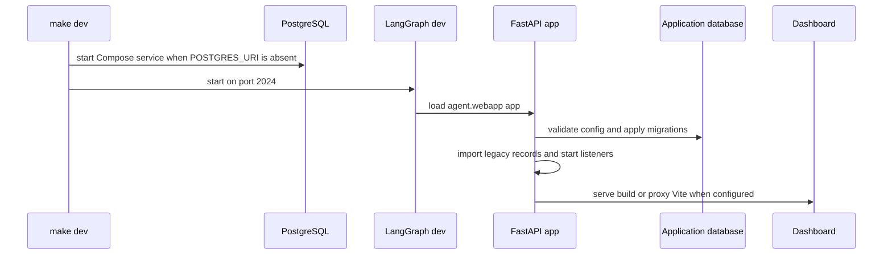

# Development, Deployment, and Startup Operations

Open SWE combines a LangGraph runtime with the FastAPI application `agent.webapp:app`. The primary manifest, `langgraph.json`, registers six graphs—`agent`, `reviewer`, `analyzer`, `review-scout`, `chat`, and `scheduler`—loads `.env`, and defines a deleting checkpointer TTL (60-minute sweep; 43,200-minute default). The FastAPI app supplies dashboard, plan, workflow-approval, health, webhook, and sandbox-tool routes; LangGraph supplies its own runtime routes.

The normal operational topology is a single public origin: the backend serves the dashboard at `/`, browser requests use relative `/dashboard/api/*` paths, and webhooks arrive at the same deployment. This avoids cross-origin session-cookie and CORS setup. See [Configuration](configuration.md) for the complete environment contract and [Dashboard UI](../integrations/dashboard-ui.md) for the UI integration boundary.

## Local development

### Install and start

```bash
make install
make build-dashboard
make dev
```

`make install` runs `uv sync --extra dev`. `make build-dashboard` installs the filtered dashboard workspace with the frozen lockfile and creates `ui/.output/public`. `make dev` starts `uv run langgraph dev --no-browser --port 2024 --n-jobs-per-worker 10`.

Before starting LangGraph, `make dev` checks that port 2024 is free. It also starts the Compose PostgreSQL service unless `POSTGRES_URI` is already set in the shell or `.env`. The service is PostgreSQL 16, bound only to `127.0.0.1:5433`, with data retained in the named `open-swe-postgres` volume. `make postgres` starts that dependency separately. The application maps a missing local-development `POSTGRES_URI` to the same loopback database.

`langgraph dev` loads `.env`; restart it after changing environment values. It provides a local runtime for graphs and, when a dashboard build exists, the HTTP app and dashboard on `http://localhost:2024`. `make run` is deliberately narrower: it runs `uvicorn agent.webapp:app --reload --port 8000` and does **not** start LangGraph, so dashboard actions that create runs require `make dev`.



This startup sequence distinguishes required database initialization from best-effort imports and listeners.

### Dashboard build and hot reload

The backend finds a static build first through `DASHBOARD_STATIC_DIR`, otherwise at `ui/.output/public`. It only treats the directory as a build when `_shell.html` exists. Its UI catch-all refuses dashboard API, webhook, health, and LangGraph-owned prefixes, so it cannot shadow runtime routes. It serves client navigations from `_shell.html` with `Cache-Control: no-cache`; hashed static assets are immutable-cacheable.

For UI work, use:

```bash
make dev-ui
```

This runs `make web` and `make dev` concurrently, passing `DASHBOARD_DEV_SERVER_URL=http://localhost:3000` to the backend. Open the backend at `http://localhost:2024`: the backend reverse-proxies non-reserved UI requests to Vite, preserving same-origin API, OAuth, and cookie behavior, while Vite's HMR WebSocket connects directly to port 3000. `make web` alone runs the dashboard dev server; it proxies backend paths to `DASHBOARD_API_URL`, defaulting to `http://localhost:2024`.

A dashboard built for a mounted deployment must use `DASHBOARD_BASE_PATH` equal to the LangGraph `http.mount_prefix` plus its trailing slash. The Platform manifest computes this value while building the dashboard. For a manual prefixed build, supply the corresponding value to `make build-dashboard`; otherwise client router and asset URLs will not resolve under the mount.

Opening Vite directly on port 3000 is a separate browser origin. Set `DASHBOARD_BASE_URL` and `DASHBOARD_API_BASE_URL` to that origin and register `http://localhost:3000/dashboard/api/auth/callback` with the GitHub App. For other credentialed origins, configure `DASHBOARD_ALLOWED_ORIGINS`; `*` is rejected because FastAPI enables credentials.

### Local webhooks

`langgraph dev` leaves raw LangGraph routes unauthenticated. Do not publish port 2024 wholesale. Instead:

```bash
make tunnel NGROK_DOMAIN=<name>.ngrok-free.dev
```

The target tunnels port 2024 through `examples/ngrok/webhooks-only.yml`, which allows `/webhooks/*` and returns 404 elsewhere. This permits public GitHub, Slack, and Linear deliveries without exposing dashboard or raw LangGraph endpoints. Use an equivalent filtering proxy if using another tunnel provider.

## Database migrations and application lifecycle

`POSTGRES_URI` is required at application startup. The application accepts PostgreSQL URI schemes, converts synchronous PostgreSQL URLs to `asyncpg`, and creates/uses the `open_swe` schema. On every start, it acquires a PostgreSQL advisory transaction lock, creates the schema if necessary, and upgrades Alembic migrations before serving the application lifecycle.

After migrations, startup attempts one-time imports of legacy workspace records, user mappings, and concierge preferences from the LangGraph Store. An import failure is logged but does not abort startup; workspace import failure is operationally significant because repository routing fails closed until it succeeds. Configured administrators are synchronized next. Analytics workspace/reporting setup, the analytics worker, transcript listener, and sandbox-bridge listener are also started independently: failures are logged and leave the app running, with documented in-process fallbacks where applicable. Shutdown stops bridge and transcript listeners, stops the analytics worker, and closes the database.

Create a migration with:

```bash
make migration m="Short description"
```

The helper requires a non-empty message, finds the next four-digit migration prefix, generates a random Alembic revision chained to all current heads, and prints the created path. Review the generated migration before committing it; production startup applies it automatically under the advisory lock.

## Production backend

### LangGraph Platform

Connect the repository to a LangSmith deployment. `langgraph.json` includes Docker build lines that install Node and pnpm temporarily, build the dashboard for the configured mount prefix, copy its public output to `/opt/open-swe-dashboard`, stamp build information, and set `DASHBOARD_STATIC_DIR`. The dashboard build is best effort: a failure is logged and backend deployment continues without a bundled UI. The Platform deployment URL should be used for `LANGGRAPH_URL`, webhook endpoints, and OAuth callbacks.

### Standalone Docker

The root `Dockerfile` builds a LangGraph API server image, not a sandbox image:

```bash
docker build -t open-swe .
```

It is based on `langchain/langgraph-api:0.13.3-py3.14`, installs the repository with `uv`, sets the HTTP app and checkpointer environment, registers six graph entrypoints, and exposes port 8000. This standalone Dockerfile's LangGraph API base version is distinct from the release-candidate API constraint in the current `langgraph.json`; update and validate both delivery paths together when changing runtime compatibility.

A standalone Agent Server requires its backing services and settings, including `DATABASE_URI` for Agent Server, `REDIS_URI`, `LANGSMITH_API_KEY`, `LANGGRAPH_CLOUD_LICENSE_KEY`, application `POSTGRES_URI`, and a public `LANGGRAPH_URL`. Keep workers available rather than using scale-to-zero hosting: background execution depends on the Redis/PostgreSQL-backed service. Publish port 8000 through authenticated ingress.

The root image does not build the dashboard. Build it before `docker build` so `ui/.output/public` is in the image context, or configure `DASHBOARD_STATIC_DIR` to a supplied build directory. A backend without either can still serve APIs but not the dashboard shell.

Standalone images default to `LANGGRAPH_AUTH_TYPE=noop`. That leaves raw LangGraph routes such as `/threads`, `/runs`, `/assistants`, and `/store` open to reachable network clients; dashboard sessions and webhook signature verification protect only custom application routes. Use LangSmith authentication (`LANGGRAPH_AUTH_TYPE=langsmith` with `LANGSMITH_AUTH_ENDPOINT` and `LANGSMITH_TENANT_ID`) or enforce an authenticated private-network/gateway boundary.

## Separate dashboard deployment

A separately deployed dashboard is optional. Build it from the repository root:

```bash
docker build -f ui/Dockerfile .
```

`ui/Dockerfile` uses a Node 24 multi-stage build, installs the filtered workspace with `--frozen-lockfile`, creates the Nitro `.output`, and runs it as user `node` on port 8080. `DASHBOARD_API_URL` is read on every proxied request, not baked into the image. It is mandatory: the production proxy throws rather than selecting a fallback backend.

The production proxy forwards the original path, query, method, request body, and non-hop-by-hop headers to the configured backend. It streams responses, preserves distinct `Set-Cookie` headers, removes invalid reframing headers, and handles redirects manually so OAuth redirects remain browser navigations. Set the backend's dashboard base and API base URLs to the frontend origin for this same-origin proxy mode. The alternative is a browser-facing `VITE_DASHBOARD_API_BASE_URL` plus credentialed CORS configured on the backend; do not put secrets in `VITE_*` variables.

The pnpm workspace contains `ui`, `desktop`, `cli`, and `tests/e2e`. Turborepo runs `dev`, `build`, `typecheck`, `test`, and `check`; build cache outputs include `.output/**`, `.vercel/output/**`, and `build/**`. Its cache key includes `DASHBOARD_API_URL`, `SOURCE_COMMIT`, `VERCEL`, `E2E_HARNESS`, and `VITE_*`; development also tracks `DASHBOARD_BASE_PATH`, `OPEN_SWE_DEV_SESSION`, and `PORT`. Root `lint` and formatting scripts invoke oxlint and oxfmt directly rather than through Turbo.

## Desktop packaging

The experimental Electron client packages the compiled dashboard, a private loopback local-agent backend, and the `oswe` CLI. Packaged users choose and store an organization backend URL rather than defaulting to a maintainer-hosted service. Cloud dashboard and login calls go to that backend; **This Mac** runs the local agent through Electron's loopback server. The local mode has separate local projects and threads and can be used without GitHub sign-in.

For source development, run `make dev` and `make desktop`. The desktop process uses `http://localhost:2024` by default; `--backend-url` and `OPEN_SWE_BACKEND_URL` override it, ahead of saved configuration. Package with `pnpm --dir desktop run pack` for an unpacked app or `pnpm --dir desktop run dist` for an installer. Both build the UI, Electron main process, local backend, and CLI before electron-builder packages the listed resources.

On macOS, `make install-desktop` rejects a dirty checkout, fast-forwards `main`, and invokes `scripts/install_desktop.sh`; `make install-checkout` invokes the same installer without changing Git state. The script is macOS-only and requires Node, `ditto`, `uv`, Bun, and either pnpm or Corepack. It installs the frozen workspace, packages the app, stages it, quits a running instance, and atomically replaces `/Applications/Open SWE.app` or `~/Applications/Open SWE.app` when the system Applications directory is not writable.

## Checks and operational scripts

- `make test [TEST_FILE=...]` and `make integration_tests` run pytest through uv, skipping a requested path that is absent. `make lint`, `make format`, and `make format-check` run Ruff; `make typecheck` runs `ty check agent tests`.
- `make swagger` regenerates `swagger.json` from `agent.webapp.app.openapi()`.
- `scripts/create_sandbox_snapshot.py` creates a LangSmith sandbox snapshot using `SandboxClient`. It requires `LANGSMITH_API_KEY` or `--api-key`, accepts snapshot/image/filesystem options, prints the snapshot ID, and directs operators to set it as a workspace base snapshot in the dashboard.
- `scripts/purge_wakeup_crons.py` is a one-time cleanup for expired one-shot `thread_wakeup` cron rows. Run it with `--dry-run` first; it resolves the target from `--url` or `LANGGRAPH_URL`, and credentials from `LANGGRAPH_API_KEY` or `LANGSMITH_API_KEY`.
- `make cli` requires Bun and produces the self-contained `cli/dist/oswe` binary.
