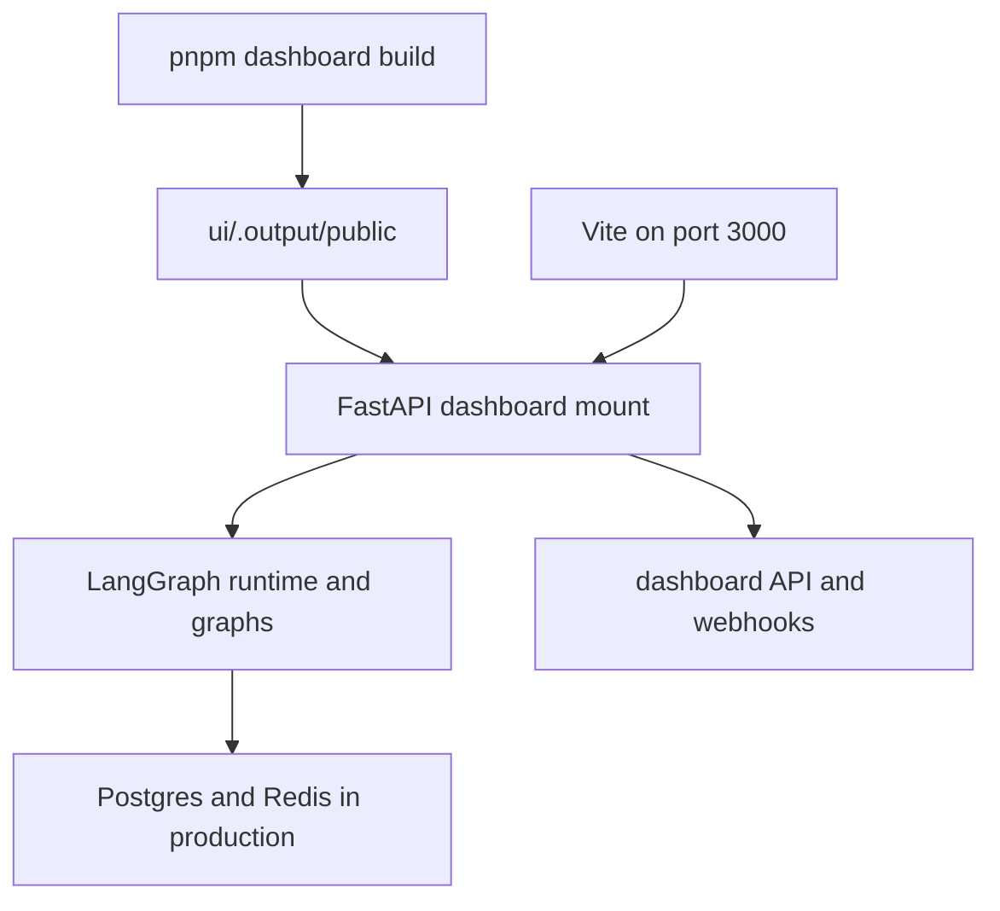

# Development, Packaging, and Deployment

Open SWE is normally one LangGraph deployment: the LangGraph runtime serves the registered graphs and `agent.webapp:app`, while the FastAPI app supplies dashboard, webhook, health, plan, workflow-approval, and sandbox-tool routes. A dashboard build can be served by that same deployment, which is the simplest topology for browser sessions, OAuth callbacks, webhooks, and relative `/dashboard/api/*` requests. See [Configuration](configuration.md) for the complete environment contract and [Dashboard UI](../integrations/dashboard-ui.md) for application behavior.

## Deployment manifests and database lifecycle

`langgraph.json` is the normal LangGraph Platform/local-dev manifest. It selects Python 3.14 and the `>~=0.15.0rc1` API line, loads `.env`, registers six graphs (`agent`, `reviewer`, `analyzer`, `review-scout`, `chat`, and `scheduler`), attaches `agent.webapp:app`, and sets delete-on-expiry checkpoint retention (60-minute sweep, 43,200-minute default TTL). The local dependency constraints deliberately cover the corresponding 0.15 release-candidate runtime line.

Open SWE application data requires PostgreSQL independently of LangGraph's local in-memory threads and Store. During FastAPI lifespan startup, the application validates configuration, requires its database configuration, then runs migrations before it starts the analytics worker and transcript listener. A deployment therefore needs a database role that can create and migrate the application schema; `DATABASE_URI` alone is Agent Server infrastructure, while application analytics and records use `POSTGRES_URI`.

For local work, `make dev` starts the Compose `postgres:16` service unless `POSTGRES_URI` is already set in the environment or `.env`. Compose binds it only to `127.0.0.1:5433`, waits for `pg_isready`, and persists data in the named `open-swe-postgres` volume. Use `make postgres` to start it separately, and `make migration m="..."` to create a migration.



This shows the two interchangeable dashboard sources that the backend can front, alongside the LangGraph and application services.

## Local entrypoints

Install Python development dependencies with:

```bash
make install
```

This runs `uv sync --extra dev`. The full backend entrypoint is:

```bash
make dev
```

It refuses an occupied port 2024, ensures the local PostgreSQL service when needed, then runs `uv run langgraph dev --no-browser --port 2024 --n-jobs-per-worker 10`. This is the mode to use for graph runs and dashboard agent features. `make run`, by contrast, runs `uvicorn agent.webapp:app --reload --port 8000`; it is suitable for narrow FastAPI work but does not start the LangGraph runtime.

To serve a static dashboard from the local backend, build it first:

```bash
make build-dashboard
make dev
```

The build writes `ui/.output/public`. The backend uses `DASHBOARD_STATIC_DIR` when explicitly configured, otherwise it discovers that in-repository directory. It serves files and the client shell only for non-reserved browser navigations: dashboard API, webhook, health, and LangGraph runtime prefixes remain available to their owners. Hashed assets receive immutable caching; the HTML shell is served with `no-cache`. If no valid build exists, no dashboard catch-all is installed.

For UI hot reload, use:

```bash
make dev-ui
```

This runs `make web` and `make dev` together, with `DASHBOARD_DEV_SERVER_URL=http://localhost:3000`. The backend proxies non-reserved UI requests to Vite, preserving the backend's browser origin for APIs and cookies; Vite's HMR WebSocket connects directly to port 3000. `make web` alone runs the Vite dashboard server on port 3000 and, in development, proxies backend prefixes to `DASHBOARD_API_URL`, defaulting to `http://localhost:2024`.

### Mount-prefix invariant

**A bundled dashboard must be built with `DASHBOARD_BASE_PATH` equal to the LangGraph `http.mount_prefix`, including the trailing slash.** Vite uses it as both asset and client-router base, while the FastAPI dashboard routes evaluate paths relative to the mount. For a local prefixed deployment, build with `DASHBOARD_BASE_PATH=/<prefix>/ make build-dashboard` and set `LANGGRAPH_URL` to the mounted public URL. The Platform manifest derives this value from `http.mount_prefix` while building. A mismatch leaves otherwise healthy API routes reachable but sends dashboard assets or client navigation outside the application mount.

## Webhooks and local exposure

`langgraph dev` leaves raw LangGraph routes unauthenticated. Do not expose port 2024 as a general tunnel. Instead run:

```bash
make tunnel NGROK_DOMAIN=<name>.ngrok-free.dev
```

The target requires `NGROK_DOMAIN`, tunnels port 2024, and applies `examples/ngrok/webhooks-only.yml`, which returns 404 for all paths outside `/webhooks/*`. This permits signature-checked GitHub, Slack, and Linear webhook delivery without publishing dashboard or raw runtime routes. Restart `make dev` after changing `.env`; reload does not replace environment configuration.

## Dashboard workspace and separate deployment

The JavaScript workspace contains `ui`, `desktop`, and `tests/e2e`. Root `pnpm run build`, `typecheck`, `test`, and `check` delegate through Turborepo; `lint` and formatting run oxlint/oxfmt directly at the repository root. Turbo does not cache `dev`, and its build cache includes `.output/**`, `.vercel/output/**`, and `build/**`; variables such as `DASHBOARD_API_URL`, `SOURCE_COMMIT`, `VERCEL`, `E2E_HARNESS`, and `VITE_*` are declared build inputs.

A separate dashboard deployment is optional. Build it from the repository root:

```bash
docker build -f ui/Dockerfile .
```

`ui/Dockerfile` is a multi-stage Node 24 build that installs the locked workspace, builds `open-swe-dashboard`, and runs the Nitro server as `node` on port 8080. Its backend is selected at request time by `DASHBOARD_API_URL`, so one image can serve different backend deployments; production fails rather than silently selecting a fallback when that variable is absent. The production Nitro handler fronts `/dashboard/api/**` and `/webhooks/**`, preserving path, query, request body, cookies, streaming response bodies, separate `Set-Cookie` headers, and browser-visible OAuth redirects.

For this same-origin proxy arrangement, set the backend's `DASHBOARD_BASE_URL` and `DASHBOARD_API_BASE_URL` to the dashboard origin and register `<dashboard origin>/dashboard/api/auth/callback` with the GitHub App. Alternatively, bake `VITE_DASHBOARD_API_BASE_URL` with the backend origin, keep `DASHBOARD_API_BASE_URL` on the backend, and add the frontend origin to `DASHBOARD_ALLOWED_ORIGINS`; do not place secrets in `VITE_*` variables. Credentialed CORS rejects a wildcard origin.

## Production backend packaging

There are two backend paths:

- **LangGraph Platform:** connect the repository and configure the same application environment. The `dockerfile_lines` in `langgraph.json` install Node and pnpm, build the dashboard for the manifest mount prefix, copy its public output to `/opt/open-swe-dashboard`, stamp build information, and set `DASHBOARD_STATIC_DIR`. The build is deliberately best-effort: a dashboard build failure logs and continues with a backend-only deployment.
- **Standalone Docker:** `docker build -t open-swe .` creates a LangGraph API server image, not a sandbox image. The root Dockerfile uses `langchain/langgraph-api:0.13.3-py3.14`, installs the repository, registers the six graphs, FastAPI app, and checkpoint TTL through environment variables, and exposes port 8000. It does not build the dashboard; build `ui/.output/public` before the Docker build or provide `DASHBOARD_STATIC_DIR` at runtime.

The standalone image's 0.13.3 base is distinct from the current 0.15 release-candidate manifest/runtime constraint; validate runtime compatibility when changing graph or deployment dependencies rather than assuming these paths are interchangeable.

A standalone Agent Server needs `DATABASE_URI` (Postgres), `REDIS_URI`, `LANGSMITH_API_KEY`, `LANGGRAPH_CLOUD_LICENSE_KEY`, and a public `LANGGRAPH_URL`, in addition to Open SWE's application environment such as `POSTGRES_URI`. Keep workers available: scale-to-zero hosting breaks background work that depends on Redis and Postgres. The default `LANGGRAPH_AUTH_TYPE=noop` exposes raw LangGraph routes to anyone who reaches the service. Use LangSmith authentication or a private/authenticated network boundary; dashboard sessions and webhook signatures protect custom routes, not the raw runtime API.

## Desktop distribution

The experimental Electron client packages the compiled dashboard UI and a private local backend. Packaged users select and store an organization backend URL on first launch; there is no maintainer-hosted default. The bundled UI has the internal `open-swe://app` origin and proxies dashboard API requests to that selected backend. The separate loopback-only local backend supports **This Mac** work and stops with Electron; it uses the trimmed `langgraph.desktop.json`, which exposes only the agent graph, disables the built-in UI, and uses local authentication and checkpointer implementations.

For source development, run `make dev` and `make desktop`. The shared backend defaults to `http://localhost:2024`; `--backend-url` or `OPEN_SWE_BACKEND_URL` overrides it, ahead of saved configuration and the development default. Packaging uses:

```bash
pnpm --dir desktop run pack
pnpm --dir desktop run dist
```

Both build `ui/`, build the Electron main process, build a locked Python local-backend runtime, and package the dashboard and backend resources. The macOS helper `make install-desktop` requires a clean checkout, fast-forwards `main`, then installs; `make install-checkout` installs the current checkout without changing Git state. Its installer is macOS-only, verifies Node, `ditto`, `uv`, and a pnpm/corepack launcher, then stages and swaps the app into `/Applications` or `~/Applications`.

## Focused verification and maintenance

- Run backend tests with `make test [TEST_FILE=...]` or `make integration_tests`; use `make lint`, `make format`, `make format-check`, and `make typecheck` for Ruff and `ty` checks. Dashboard proxy behavior is covered by `ui/server/backend-proxy.test.ts`; dashboard serving, reserved-path precedence, and mount behavior are covered by `tests/dashboard/test_dashboard_ui.py`.
- Use `scripts/create_sandbox_snapshot.py` to create a LangSmith sandbox snapshot from a Docker image via `SandboxClient`. It prints the snapshot UUID for selection as a workspace base snapshot in the dashboard.
- `scripts/purge_wakeup_crons.py` is a one-time cleanup for expired one-shot `thread_wakeup` crons. Run `--dry-run` first; it resolves the deployment from `--url` or `LANGGRAPH_URL` and uses `LANGGRAPH_API_KEY` or `LANGSMITH_API_KEY`.
