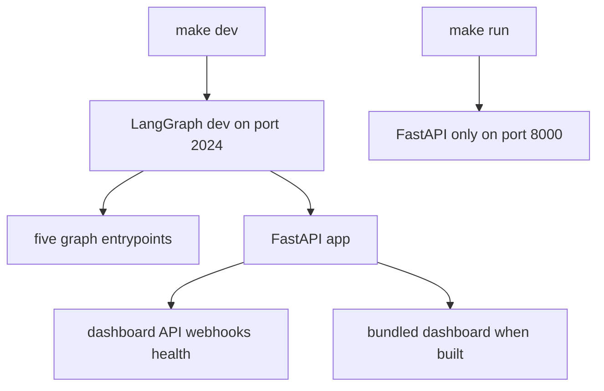
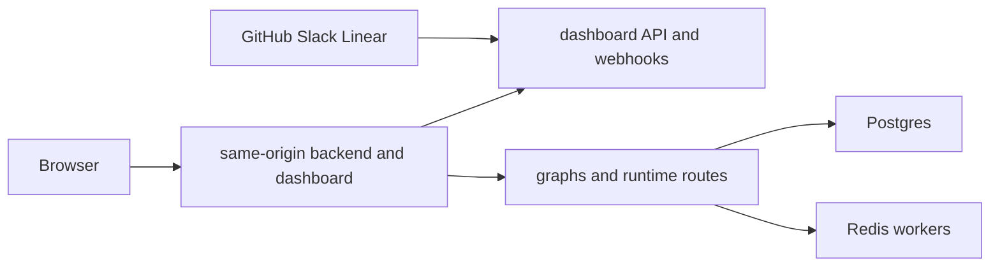

# Development, Deployment, and Serving

Open SWE's normal topology is one LangGraph deployment: five graphs (`agent`, `reviewer`, `analyzer`, `chat`, and `scheduler`), the FastAPI application `agent.webapp:app`, and—when a dashboard build is available—the dashboard at the same origin. The FastAPI composition owns dashboard, plan, workflow-approval, health, and GitHub/Linear/Slack webhook routers; LangGraph owns its runtime routes.

The same-origin deployment is the default because relative `/dashboard/api/*` calls and the `osw_session` cookie need no browser CORS configuration. See [Configuration](configuration.md) for the complete environment contract, [Dashboard UI](../integrations/dashboard-ui.md) for UI behavior, and [Invocation](../workflows/invocation.md) for how requests become runs.

## Local serving modes

Install backend development dependencies with:

```bash
make install
```

This runs `uv sync --extra dev`. The full local runtime is:

```bash
make dev
```

It executes `uv run langgraph dev --no-browser --port 2024`. `langgraph.json` is the serving manifest: it selects Python 3.14 and LangGraph API 0.13.3, registers all five graphs and `agent.webapp:app`, loads `.env`, and configures checkpoint deletion (a 60-minute sweep and a 43,200-minute default TTL). The project constrains locally resolved `langgraph-api` to `>=0.13.3,<0.14` so uv tests the manifest's runtime rather than resolving the end-of-life 0.10.3 release.

Build the dashboard before starting that server when the backend should serve it itself:

```bash
make build-dashboard
make dev
```

`make build-dashboard` writes the client build to `ui/.output/public`. The backend discovers that directory by default (or an explicit `DASHBOARD_STATIC_DIR`) and serves the shell at non-reserved HTML routes. It deliberately declines `/dashboard/api`, `/webhooks`, `/health`, and LangGraph-owned prefixes such as `/threads` and `/runs`, so the catch-all cannot shadow API endpoints. Hashed assets are immutable-cacheable, while the shell is revalidated so a new build can refer to new asset hashes.



The diagram contrasts the full LangGraph runtime with the HTTP-only development server.

`make run` executes `uv run uvicorn agent.webapp:app --reload --port 8000`. It is useful for narrow FastAPI work, but does not start LangGraph; anything that creates runs, including dashboard Agents features, requires `make dev`.

### UI hot reload and direct Vite access

For normal UI work, use:

```bash
make dev-ui
```

This starts `make web` and `make dev` together. Vite listens on port 3000, while the backend is given `DASHBOARD_DEV_SERVER_URL=http://localhost:3000` and reverse-proxies non-reserved UI requests. Open `http://localhost:2024`: API calls, login callbacks, and cookies remain on the backend origin, but modules arrive from Vite. The HMR WebSocket is intentionally direct to Vite's port, not forwarded through FastAPI.

`make web` alone runs the dashboard Vite server. In development it proxies backend prefixes to `DASHBOARD_API_URL`, defaulting to `http://localhost:2024`. Opening Vite directly at `http://localhost:3000` instead makes that frontend origin part of the login and CSRF contract: set `DASHBOARD_BASE_URL` and `DASHBOARD_API_BASE_URL` to that origin and add its callback URL, `http://localhost:3000/dashboard/api/auth/callback`, to the GitHub App. `DASHBOARD_ALLOWED_ORIGINS` is only for additional credentialed origins; FastAPI rejects `*` because credentials are enabled.

### Mount-prefix invariant

The dashboard build's base path must equal the LangGraph `http.mount_prefix` at which the backend serves it. `DASHBOARD_BASE_PATH` controls Vite's router and asset base. For a local prefixed server, build with `DASHBOARD_BASE_PATH=/<prefix>/ make build-dashboard` and keep `LANGGRAPH_URL` on that mounted URL. The platform manifest extracts `http.mount_prefix` during its image build and supplies the corresponding build value automatically. A mismatch causes client routes or asset URLs to point outside the mounted application.

## Webhooks during local development

`langgraph dev` does not authenticate raw LangGraph API routes. Do not expose port 2024 wholesale. `make tunnel NGROK_DOMAIN=<name>.ngrok-free.dev` runs ngrok against port 2024 with `examples/ngrok/webhooks-only.yml`; the policy returns 404 for every path except `/webhooks/*`. GitHub, Slack, and Linear can therefore deliver to the public hostname while dashboard and LangGraph access stays local. Another tunnel is acceptable only if it provides an equivalent allowlist.

Point integration settings at the public webhook paths—such as `/webhooks/github`, `/webhooks/slack`, and `/webhooks/linear`—and use the URL where the dashboard is actually opened for the GitHub OAuth callback. Restart `make dev` after changing `.env`: it reloads code but not environment configuration.

## Production backend

There are two supported backend delivery paths:

- **LangGraph Platform:** connect the repository in LangSmith Deployments. `langgraph.json` builds and copies the dashboard into the platform image; a dashboard-build failure is logged but does not prevent backend deployment. The platform injects `LANGSMITH_API_KEY`, tracing, and project values.
- **Standalone Docker:** build the root image with `docker build -t open-swe .`. It is a LangGraph API server image, not a sandbox image. Its `langchain/langgraph-api:0.13.3-py3.14` base and environment registrations mirror the five graphs, FastAPI app, and checkpointer policy in the manifest, and it exposes port 8000.

For a standalone server, provide `DATABASE_URI` (Postgres), `REDIS_URI`, `LANGSMITH_API_KEY`, `LANGGRAPH_CLOUD_LICENSE_KEY`, and the public backend `LANGGRAPH_URL`; publish port 8000 through ingress. Do not choose scale-to-zero hosting: background work depends on Redis- and Postgres-backed workers remaining available. The image only serves a dashboard if `ui/.output/public` was built before `docker build`, or if `DASHBOARD_STATIC_DIR` names a build directory.

The standalone image defaults to `LANGGRAPH_AUTH_TYPE=noop`, which leaves raw LangGraph routes open to any network client. Use `LANGGRAPH_AUTH_TYPE=langsmith` with `LANGSMITH_AUTH_ENDPOINT` and `LANGSMITH_TENANT_ID`, or place the service behind private networking or an authenticated gateway. Dashboard session and webhook signature checks do not secure raw `/threads`, `/runs`, `/assistants`, or `/store` endpoints.



The default production topology keeps browser traffic and webhook delivery on one public deployment origin.

When public URLs change, update `LANGGRAPH_URL`, webhook targets, and the GitHub callback (`<dashboard API base URL>/dashboard/api/auth/callback`). `DASHBOARD_BASE_URL` and `DASHBOARD_API_BASE_URL` normally default to `LANGGRAPH_URL` when the backend serves a build or fronts Vite.

## Separate dashboard deployment

A separate dashboard is optional. `ui/Dockerfile`, built from the repository root with `docker build -f ui/Dockerfile .`, uses a multi-stage Node 24 build, a frozen pnpm workspace install, and runs the Nitro `.output` server as user `node` on port 8080. `DASHBOARD_API_URL` is read for each request, not baked into the image, so the same image can front different backends; the production handler fails explicitly if it is unset.

The handler proxies `/dashboard/api/**` and `/webhooks/**`, preserves path and query, streams non-GET bodies, forwards separate `Set-Cookie` headers, and leaves OAuth redirects for the browser to follow. Set the backend's `DASHBOARD_BASE_URL` and `DASHBOARD_API_BASE_URL` to the frontend origin and register its callback for the same-origin proxy arrangement. Alternatively, build with `VITE_DASHBOARD_API_BASE_URL` set to the backend, keep `DASHBOARD_API_BASE_URL` on the backend, and include the frontend origin in `DASHBOARD_ALLOWED_ORIGINS`; the client then resolves the session after hydration. Never use secrets in `VITE_*` values because they are build-time browser data.

The pnpm workspace comprises `ui`, `desktop`, and `tests/e2e`. Turborepo runs package `dev`, `build`, `typecheck`, `test`, and `check` tasks; build cache inputs include `DASHBOARD_API_URL`, `VERCEL`, `E2E_HARNESS`, and `VITE_*`. Root `lint` and formatting commands run oxlint/oxfmt directly rather than as Turbo tasks.

## Desktop boundary

The experimental Electron client bundles the compiled dashboard and asks packaged users for an organization backend URL on first launch; it does not select a maintainer-hosted backend. It proxies bundled UI dashboard calls to that selected backend, while a private loopback LangGraph server supports the **This Mac** local-agent mode. Cloud features and GitHub login use the selected shared backend; local mode can be used without GitHub sign-in but is limited to local projects and threads.

For source development, run `make dev` and `make desktop`; the desktop process defaults to `http://localhost:2024`, or accepts `--backend-url` / `OPEN_SWE_BACKEND_URL`. Its backend resolution order is command line, environment, saved configuration, then that development default. Package with `pnpm --dir desktop run pack` for an unpacked app or `pnpm --dir desktop run dist` for an installer. Both rebuild and package the dashboard plus local backend resources; this packaging does not deploy the hosted web app.

On macOS, `make install-desktop` refuses a dirty checkout, fast-forwards `main`, and calls `scripts/install_desktop.sh`; `make install-checkout` uses the current checkout without changing Git state. The script is macOS-only, checks Node, `ditto`, uv, and a pnpm/corepack launcher, packages the application, then stages and swaps it into `/Applications` or `~/Applications`.

## Focused checks and operational helpers

- `make test [TEST_FILE=...]` and `make integration_tests` run pytest in uv (and skip a missing requested directory); `make lint`, `make format`, and `make format-check` run Ruff across the repository. `make typecheck` runs `ty check agent tests`.
- `scripts/create_sandbox_snapshot.py` creates a LangSmith sandbox snapshot from a Docker image through `SandboxClient`, then prints the UUID to use as `DEFAULT_SANDBOX_SNAPSHOT_ID`.
- `scripts/purge_wakeup_crons.py` is a one-time backfill for expired one-shot `thread_wakeup` crons. Start with `--dry-run`; it resolves the target from `--url`/`LANGGRAPH_URL` and credentials from `LANGGRAPH_API_KEY` or `LANGSMITH_API_KEY` (including registered deprecated production aliases).
- `examples/github-actions/set-base-snapshot.yml` is a copy-ready CI workflow that updates `/dashboard/api/sandbox-settings` using a short-lived GitHub Actions OIDC token. Enable `id-token: write` and constrain `ADMIN_OIDC_SUBJECTS`; an `owner/repo` entry matches `repository`, while an entry containing `:` matches `sub`. `ADMIN_OIDC_AUDIENCE` defaults to `open-swe`. A personal access token works only when its owner is in `CONFIGURED_ADMINS`; `secrets.GITHUB_TOKEN` is neither suitable OIDC nor an identifiable user credential.
