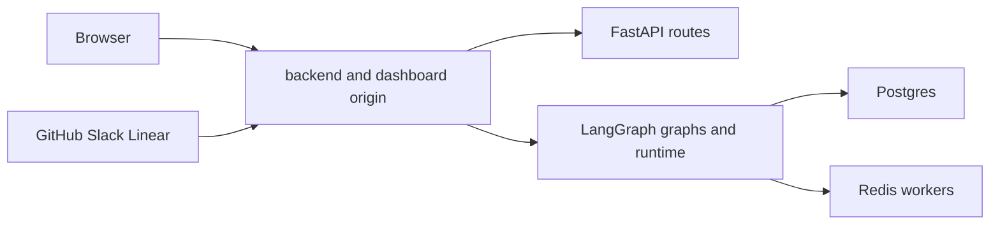

Open SWE is normally one LangGraph deployment. Its manifest registers five graphs—`agent`, `reviewer`, `analyzer`, `chat`, and `scheduler`—alongside the FastAPI app `agent.webapp:app`. The FastAPI layer installs the dashboard, plan, workflow-approval, health, and GitHub, Linear, and Slack webhook routers; the LangGraph server supplies graph runtime routes. `langgraph.json` also loads `.env` and specifies checkpoint deletion with a 60-minute sweep and a 43,200-minute default TTL.

When a dashboard build is available, the backend serves it at the same origin as `/dashboard/api/*` and webhooks. This is the simplest production topology: browser requests can use relative URLs and the `osw_session` cookie without cross-origin configuration. See [Configuration](configuration.md) for the full environment contract and [Dashboard UI](../integrations/dashboard-ui.md) for UI behavior.

## Local serving

Install backend development dependencies with:

```bash
make install
```

This runs `uv sync --extra dev`. For the complete local application, run:

```bash
make dev
```

It executes `uv run langgraph dev --no-browser --port 2024 --n-jobs-per-worker 10`. This is the mode required for graph runs and dashboard agent features. The project constrains the locally resolved `langgraph-api` to `>=0.13.3,<0.14`, matching the manifest's API version and avoiding resolution to the end-of-life 0.10.3 runtime.

Build a dashboard for the backend to serve:

```bash
make build-dashboard
make dev
```

The build lands in `ui/.output/public`. The backend uses that directory by default, or `DASHBOARD_STATIC_DIR` when explicitly configured. Its UI catch-all deliberately declines API and LangGraph-owned paths—including `/dashboard/api`, `/webhooks`, `/health`, `/threads`, `/runs`, and `/store`—so it cannot shadow those routes. It serves only an HTML-accepting unknown route as the client shell, marks hashed assets immutable, and makes the shell revalidate for new asset hashes.


The full server combines LangGraph and FastAPI; the narrow server is only for FastAPI-focused work.

`make run` executes `uv run uvicorn agent.webapp:app --reload --port 8000`. It does **not** start the LangGraph runtime, so run creation and dashboard agent features will not work there.

### Dashboard development

For same-origin UI hot reload, use:

```bash
make dev-ui
```

This starts `make web` and `make dev` together, passing `DASHBOARD_DEV_SERVER_URL=http://localhost:3000` to the backend. Open `http://localhost:2024`: non-reserved UI requests are reverse-proxied to Vite, while APIs, login callbacks, cookies, and runtime routes remain on the backend origin. The HMR WebSocket intentionally connects directly to Vite on port 3000.

`make web` alone runs `pnpm run dev`, which scopes Turborepo to `open-swe-dashboard`. In development, Vite proxies backend prefixes to `DASHBOARD_API_URL`, defaulting to `http://localhost:2024`; no `ui/.env` is needed. If opening Vite itself at `http://localhost:3000`, configure `DASHBOARD_BASE_URL` and `DASHBOARD_API_BASE_URL` as that frontend origin and add `http://localhost:3000/dashboard/api/auth/callback` to the GitHub App. `DASHBOARD_ALLOWED_ORIGINS` is for additional credentialed origins only: the FastAPI app rejects `*` when credential support is enabled.

Dashboard asset and client-router paths have a strict mount-prefix invariant. `DASHBOARD_BASE_PATH` must equal the LangGraph `http.mount_prefix` where the build is served. For a local prefix, use `DASHBOARD_BASE_PATH=/<prefix>/ make build-dashboard` and keep `LANGGRAPH_URL` on the mounted URL. The Platform manifest derives the build value from its mount prefix; a mismatch sends assets or client routes outside the application mount.

## Local webhook exposure

Do not publicly expose local port 2024 wholesale: `langgraph dev` leaves raw LangGraph routes unauthenticated. Instead run:

```bash
make tunnel NGROK_DOMAIN=<name>.ngrok-free.dev
```

The target requires `NGROK_DOMAIN`, forwards port 2024 through ngrok, and applies `examples/ngrok/webhooks-only.yml`. That traffic policy returns 404 for every path except `/webhooks/*`, letting integrations deliver without publishing `/threads`, `/runs`, `/assistants`, or `/store`. Any replacement tunnel must enforce the same allowlist. Point GitHub, Slack, and Linear at their public webhook paths, but continue to open the dashboard locally. Restart `make dev` after `.env` changes because code reload does not reload environment configuration.

## Backend deployment

Two backend delivery paths are supported:

- **LangGraph Platform:** connect the repository in LangSmith Deployments. The `dockerfile_lines` in `langgraph.json` install Node tooling, build the dashboard for the configured mount prefix, and copy it to `/opt/open-swe-dashboard`. That build is best-effort: failure is logged and the backend remains deployable. The platform injects LangSmith tracing and project credentials.
- **Standalone Docker:** build with `docker build -t open-swe .`. The root Dockerfile is a production LangGraph API image, not a sandbox image. It starts from `langchain/langgraph-api:0.13.3-py3.14`, installs the repository, registers the FastAPI app, five graphs, and TTL policy through `LANGGRAPH_HTTP`, `LANGSERVE_GRAPHS`, and `LANGGRAPH_CHECKPOINTER`, and exposes port 8000.

A standalone server needs Agent Server backing services and settings: `DATABASE_URI` for Postgres, `REDIS_URI`, `LANGSMITH_API_KEY`, `LANGGRAPH_CLOUD_LICENSE_KEY`, and public `LANGGRAPH_URL`. Publish port 8000 through ingress. Do not use scale-to-zero hosting: background runs require Redis- and Postgres-backed workers to stay available. The root Dockerfile does not build the dashboard; build it before `docker build` or provide a suitable `DASHBOARD_STATIC_DIR`.

The standalone image defaults to `LANGGRAPH_AUTH_TYPE=noop`, which exposes raw LangGraph endpoints to reachable network clients. Use LangSmith authentication (`LANGGRAPH_AUTH_TYPE=langsmith` plus `LANGSMITH_AUTH_ENDPOINT` and `LANGSMITH_TENANT_ID`) or keep the service behind an authenticated gateway or private network. Dashboard sessions and webhook signature validation protect custom routes, not raw runtime routes.



The recommended topology puts browser traffic, webhooks, FastAPI, and the LangGraph runtime behind one public origin.

## Separate dashboard deployment and workspace commands

A separate frontend is optional. Build it from the repository root:

```bash
docker build -f ui/Dockerfile .
```

`ui/Dockerfile` uses a multi-stage Node 24 Alpine build, installs the pnpm workspace with the frozen lockfile, builds `open-swe-dashboard`, and runs Nitro on port 8080 as `node`. The backend it fronts is supplied as `DASHBOARD_API_URL` in the deployment environment rather than baked into the image, allowing one image to serve different backend deployments.

For the same-origin proxy arrangement, set the backend's `DASHBOARD_BASE_URL` and `DASHBOARD_API_BASE_URL` to the frontend origin, and register `<frontend origin>/dashboard/api/auth/callback` in the GitHub App. The frontend proxies `/dashboard/api/*` browser traffic and `/webhooks/*` deliveries to the backend; server-side rendering forwards the session cookie. Alternatively, build with `VITE_DASHBOARD_API_BASE_URL` set to the backend origin, retain the backend API base URL, and put the frontend origin in `DASHBOARD_ALLOWED_ORIGINS`. `VITE_*` values are browser-visible build inputs, so never place secrets in them.

The pnpm workspace contains `ui`, `desktop`, and `tests/e2e`. Root `pnpm run build`, `pnpm run typecheck`, `pnpm run test`, and `pnpm run check` delegate to Turborepo; `pnpm run lint` uses oxlint and `pnpm run format` / `pnpm run format:check` use oxfmt directly. Turbo caches build outputs and treats `DASHBOARD_API_URL`, `VERCEL`, `E2E_HARNESS`, and `VITE_*` as cache-affecting build inputs. Its `dev` task is persistent and uncached, with development-specific inputs such as `DASHBOARD_BASE_PATH`, `OPEN_SWE_DEV_SESSION`, and `PORT`.

For UI work against a deployed backend, `pnpm run dev:prod` requires `DASHBOARD_API_URL`; it does not default to a potentially unrelated production deployment. Its helper obtains a session through the desktop-style PKCE loopback handoff and caches it locally with restrictive permissions, then starts Vite with that session for proxied requests. Treat actions from this mode as real actions on the selected deployment.

## Desktop packaging

The experimental Electron application bundles the compiled dashboard UI and a local backend. Its separate `langgraph.desktop.json` manifest exposes only the `agent` graph, uses `agent.local_auth:auth`, disables Studio authentication, and disables the built-in UI. Packaged users select and store their organization's compatible backend URL; there is no maintainer-hosted default. Cloud features and GitHub login use that selected backend. **This Mac** uses Electron's private loopback LangGraph server for local-agent work; it is stopped with the app. Local mode can be used without GitHub sign-in, but cloud threads, settings, and other account-backed features remain behind sign-in.

For source development, run `make dev` and `make desktop`. The desktop app defaults to `http://localhost:2024`; `--backend-url` and `OPEN_SWE_BACKEND_URL` override it. Resolution order is command line, environment, saved configuration, then the development default. Package with:

```bash
pnpm --dir desktop run pack
pnpm --dir desktop run dist
```

Both commands build the UI, build the Electron main process and local backend resources, and package them; `pack` creates an unpacked application and `dist` creates the platform installer. This is desktop distribution, not a deployment of the hosted web application.

On macOS, `make install-desktop` refuses a dirty working tree, switches and fast-forwards `main`, then invokes `scripts/install_desktop.sh`. `make install-checkout` invokes the same script without changing Git state. The script is macOS-only, checks Node, `ditto`, `uv`, and a pnpm or Corepack launcher, packages the app, stages it, and swaps it into `/Applications` or `~/Applications` when the system Applications directory is not writable.

## Focused validation and operational helpers

Never default to the full test suite for a local change. Use the narrowest relevant check:

- `make test TEST_FILE=tests/<target>` runs a focused pytest path through uv; `make integration_tests` is the integration suite target. Both Make recipes skip a missing requested path.
- `make lint`, `make format-check`, and `make typecheck` provide focused Python quality checks; `make format` rewrites files. For dashboard or desktop changes, run the package-scoped command or relevant Turbo task rather than every workspace test.
- `scripts/create_sandbox_snapshot.py` creates a LangSmith sandbox snapshot from a Docker image through `SandboxClient`, then prints the ID for `DEFAULT_SANDBOX_SNAPSHOT_ID`.
- `scripts/purge_wakeup_crons.py` is a one-time cleanup for expired one-shot `thread_wakeup` crons. Start with `--dry-run`; it uses `--url` or `LANGGRAPH_URL` and `LANGGRAPH_API_KEY` or `LANGSMITH_API_KEY`.
- `examples/github-actions/set-base-snapshot.yml` is a copy-ready workflow that updates `/dashboard/api/sandbox-settings` using a short-lived GitHub Actions OIDC token. Allowlist trusted repositories or subjects with `ADMIN_OIDC_SUBJECTS`; `ADMIN_OIDC_AUDIENCE` defaults to `open-swe`. An admin personal access token requires its owner in `CONFIGURED_ADMINS`; `secrets.GITHUB_TOKEN` is neither an OIDC token nor an identifiable user credential.
