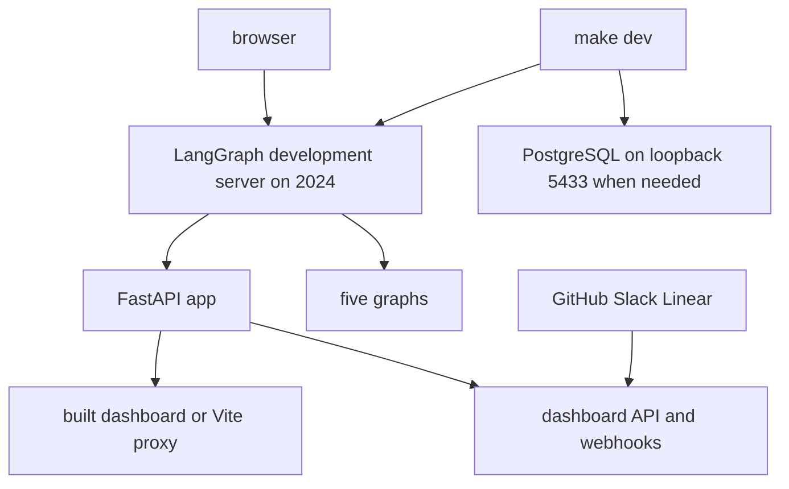

# Development, deployment, and maintenance

Open SWE is normally one LangGraph deployment. Its manifest registers five graphs—`agent`, `reviewer`, `review-scout`, `chat`, and `scheduler`—and mounts the FastAPI app `openswe.webapp:app`. The FastAPI app supplies the dashboard API, health endpoints, webhooks, and optional dashboard serving; LangGraph supplies graph/runtime endpoints. The normal topology keeps the dashboard, callback URLs, webhooks, and API at one public origin.

Use [Configuration](configuration.md) for the environment contract, [Dashboard UI](../integrations/dashboard-ui.md) for browser behavior, [Quickstart](../quickstart.md) to get started, and [Testing](../testing/overview.md) for the broader test strategy.


```mermaid
flowchart TD
  Dev["make dev"] --> Pg["PostgreSQL on loopback 5433 when needed"]
  Dev --> Runtime["LangGraph development server on 2024"]
  Runtime --> Graphs["five graphs"]
  Runtime --> App["FastAPI app"]
  App --> Api["dashboard API and webhooks"]
  App --> Ui["built dashboard or Vite proxy"]
  Browser["browser"] --> Runtime
  Providers["GitHub Slack Linear"] --> Api
```

This is the local full-runtime topology; the browser and integrations reach different parts of the same backend.

## Local development

### Install and select a serving mode

Install Python development dependencies with `make install`, which runs `uv sync --extra dev`. The usual entrypoint is:

```bash
make dev
```

It first starts local PostgreSQL unless `POSTGRES_URI` is already set in the shell or `.env`, refuses to reuse occupied port 2024, then runs `uv run langgraph dev --no-browser --port 2024 --n-jobs-per-worker 10`. The manifest loads `.env`, selects Python 3.14 and the LangGraph API `>~=0.15.0rc1`, configures checkpointer deletion (60-minute sweep; 43,200-minute default TTL), and configures Store TTL sweeping without refreshing entries on read. The Python constraints keep local `langgraph-api` in the `>=0.15.0rc1,<0.16` range to match the manifest.

The automatic database is `postgres:16`, named `open-swe-postgres`, bound only to `127.0.0.1:5433`, and backed by the named `open-swe-postgres` volume. Use `make postgres` to start it separately. Stopping/removing the container does not discard the volume; `docker compose down` stops it. Set `POSTGRES_URI` to use another database instead. Application startup requires its application database and runs migrations before starting normal work.

`make run` is deliberately narrower:

```bash
make run
```

It starts `uvicorn openswe.webapp:app --reload --port 8000`, without the LangGraph runtime. It is suitable for focused FastAPI work and interactive FastAPI docs, but dashboard actions that create graph runs require `make dev`.

### Dashboard build and hot reload

For a static dashboard served by the backend, build it before running the full server:

```bash
make build-dashboard
make dev
```

The build installs the filtered pnpm workspace dependencies and writes the public bundle to `ui/.output/public`. The backend serves an explicit `DASHBOARD_STATIC_DIR` when it contains `_shell.html`; otherwise it discovers that in-repository build. Its catch-all never claims dashboard API, webhook, health, OpenAPI/docs, MCP, or LangGraph-owned routes such as `/threads`, `/runs`, and `/store`. Hashed assets receive immutable caching, while the SPA shell is revalidated so it can reference a new asset set.

For UI work, use:

```bash
make dev-ui
```

This runs `make web` and `make dev` concurrently, passing `DASHBOARD_DEV_SERVER_URL=http://localhost:3000` to the backend. Open `http://localhost:2024`: the backend reverse-proxies non-reserved UI requests to Vite, keeping API calls, OAuth redirects, and cookies on the backend origin. Vite's HMR WebSocket connects directly to port 3000.

`make web` runs only the Vite/Turbo dashboard dev server. In development it proxies backend prefixes to `DASHBOARD_API_URL`, defaulting to `http://localhost:2024`; use it directly at `http://localhost:3000` only after setting `DASHBOARD_BASE_URL` and `DASHBOARD_API_BASE_URL` to that origin and registering `http://localhost:3000/dashboard/api/auth/callback` with the GitHub App. `DASHBOARD_ALLOWED_ORIGINS` is for additional credentialed origins and cannot contain `*`.

### Mount-prefix invariant

When a LangGraph deployment uses `http.mount_prefix`, dashboard asset and client-router paths must use that same prefix. Supply a trailing-slash value such as `DASHBOARD_BASE_PATH=/prefix/ make build-dashboard` for a local prefixed build. The platform image build derives this value from `langgraph.json`. A mismatch makes asset or client-side route URLs escape the mounted application.

## Safe local webhook exposure

`langgraph dev` leaves raw LangGraph development routes unauthenticated. Do not expose port 2024 wholesale. Instead claim a static ngrok domain and run:

```bash
make tunnel NGROK_DOMAIN=<name>.ngrok-free.dev
```

The target normalizes the supplied domain and tunnels port 2024 with `examples/ngrok/webhooks-only.yml`. Its traffic policy returns 404 for every path outside `/webhooks/*`, so GitHub, Slack, and Linear can deliver while dashboard and raw runtime routes remain local. An alternative tunnel must impose the same allowlist. Restart `make dev` after changing `.env`; code reload does not imply environment reload.

## Production backend

### LangGraph Platform or standalone Docker

For LangGraph Platform, connect the repository to a LangSmith deployment and set the application environment. The hosted URL becomes `LANGGRAPH_URL` and the basis for webhook targets and OAuth callbacks. `langgraph.json` contains image-build lines that attempt to build and copy the dashboard to `/opt/open-swe-dashboard`; the deployment continues without a bundled UI if that best-effort build fails.

For a standalone Agent Server image:

```bash
docker build -t open-swe .
```

The root `Dockerfile` is the production LangGraph API image, not a sandbox image. It uses `langchain/langgraph-api:0.15.1-py3.14`, installs the repository under the image constraints, declares the FastAPI app, graph registrations, and checkpointer TTL through environment variables, and exposes port 8000. It does not build the dashboard: build `ui/.output/public` before `docker build`, or provide a valid `DASHBOARD_STATIC_DIR`.

A standalone deployment needs Agent Server backing configuration including `DATABASE_URI` for Postgres, `REDIS_URI`, `LANGSMITH_API_KEY`, and `LANGGRAPH_CLOUD_LICENSE_KEY`, plus public `LANGGRAPH_URL`. Publish port 8000 through ingress and do not scale the backend to zero: Redis/Postgres-backed background workers must remain available. The application itself uses `POSTGRES_URI` for application data and migrations; provide it as well where analytics/application storage is enabled.

The image defaults to `LANGGRAPH_AUTH_TYPE=noop`, so raw LangGraph routes are open to network clients that can reach it. Use LangSmith authentication (`LANGGRAPH_AUTH_TYPE=langsmith`, `LANGSMITH_AUTH_ENDPOINT`, and `LANGSMITH_TENANT_ID`) or enforce an authenticated/private network boundary. Dashboard sessions and webhook signatures protect custom routes; they do not protect `/threads`, `/runs`, `/assistants`, or `/store`.

## Separate dashboard deployment

A dashboard can be deployed separately when it must front a different backend origin. Build from the repository root:

```bash
docker build -f ui/Dockerfile .
```

`ui/Dockerfile` is a multi-stage Node 24 build that performs a frozen, filtered pnpm install, builds the Nitro output, and runs it as user `node` on port 8080. The server reads `DASHBOARD_API_URL` at request time—not build time—so one image can front different deployments. It fails clearly if the variable is absent rather than selecting a fallback backend.

The production proxy forwards dashboard API and webhook requests with their original path/query and streamed non-GET bodies. It preserves individual `Set-Cookie` headers and leaves redirects manual so OAuth redirects reach the browser. The usual same-origin proxy arrangement sets the backend's `DASHBOARD_BASE_URL` and `DASHBOARD_API_BASE_URL` to the dashboard's public origin and registers that callback URL. The cross-origin alternative compiles `VITE_DASHBOARD_API_BASE_URL` with the backend URL and adds the frontend origin to `DASHBOARD_ALLOWED_ORIGINS`; do not put secrets in `VITE_*` variables.

The pnpm workspace includes `bridge-client`, `ui`, `desktop`, `cli`, and `tests/e2e`. Turbo orchestrates `dev`, `build`, `typecheck`, `test`, and `check`; build cache inputs include `DASHBOARD_API_URL`, `SOURCE_COMMIT`, `VERCEL`, `E2E_HARNESS`, and `VITE_*`. Root `lint` and format commands use oxlint/oxfmt directly rather than Turbo.

## Desktop and CLI distribution

The experimental Electron client packages the compiled dashboard UI. Packaged users enter and store a compatible organization backend URL; no maintainer-hosted URL is selected by default. The Electron `open-swe://app` origin proxies dashboard API requests to that backend, so the browser does not receive a LangSmith key or call raw LangGraph routes directly.

**This Mac** tasks use a sandbox bridge: the app long-polls the selected backend for execution and file requests, operates in the chosen local checkout, and posts results back. The cloud thread remains on the shared backend, but it can continue locally only while the app's bridge is available. Earlier local-server threads remain supported temporarily; newly created local tasks use the bridge.

For development, run `make dev` and `make desktop`. The source app defaults to `http://localhost:2024`; resolution order is `--backend-url`, `OPEN_SWE_BACKEND_URL`, saved configuration, then that default. Package an unpacked app with `pnpm --dir desktop run pack`, or an installer with `pnpm --dir desktop run dist`.

On macOS, `make install-desktop` requires a clean checkout, fast-forwards `main`, then invokes `scripts/install_desktop.sh`; `make install-checkout` installs the current checkout without changing Git state. The script is macOS-only, requires Node, `ditto`, `uv`, Bun, and pnpm or Corepack, packages the app, and stages then swaps it into `/Applications` or `~/Applications`.

`make cli` builds `cli/dist/oswe` with Bun. The resulting single-file `oswe` binary embeds its runtime, so its destination machine needs neither Node nor Bun. It starts a cloud agent on a chosen backend but serves that agent's shell/file operations from the current local directory through the same bridge pattern. This is intentionally unsandboxed local execution as the invoking user; review the CLI security warning before distributing or using it in automation.

## Database migrations, OpenAPI, and maintenance

`make migration m="Short description"` runs `scripts/new_migration.py`. The script requires a non-empty message, finds the highest four-digit migration filename, then generates the next Alembic revision chained to all current heads. Commit the generated migration with the schema-changing code. At service startup, the FastAPI lifespan validates configuration, requires the database, and calls the migration routine before it starts normal listeners and workers.

The checked-in `swagger.json` is the generated OpenAPI schema for custom FastAPI routes. Regenerate it after changing routes or models:

```bash
make swagger
```

The command imports `openswe.webapp:app` and writes sorted, indented `app.openapi()` output. `make run` provides the corresponding live `/openapi.json` and `/docs` at port 8000. Those FastAPI documents do not describe LangGraph runtime routes and that Uvicorn server cannot create graph runs.

Useful focused operations are:

- `make test [TEST_FILE=...]`, `make integration_tests`, `make lint`, `make format`, `make format-check`, and `make typecheck` run the Python test, Ruff, and `ty` checks; test targets skip a requested path that does not exist.
- `scripts/create_sandbox_snapshot.py` creates a LangSmith sandbox snapshot from an image (and optional capacity/name), prints its ID, and directs operators to select it as a workspace base snapshot in the dashboard.
- `scripts/purge_wakeup_crons.py --dry-run` lists expired one-shot `thread_wakeup` crons before deletion; without `--dry-run` it removes them. It obtains the deployment URL from `--url` or `LANGGRAPH_URL` and credentials from `LANGGRAPH_API_KEY` or `LANGSMITH_API_KEY`.
- `scripts/rebuild_transcript_projections.py <thread_id> [...]` repairs specified transcript read projections by replaying their event logs using `POSTGRES_URI`. It does not alter attachments, tool outputs, or a thread's version; inspect failures because it continues with subsequent thread IDs and exits nonzero if any rebuild failed.
