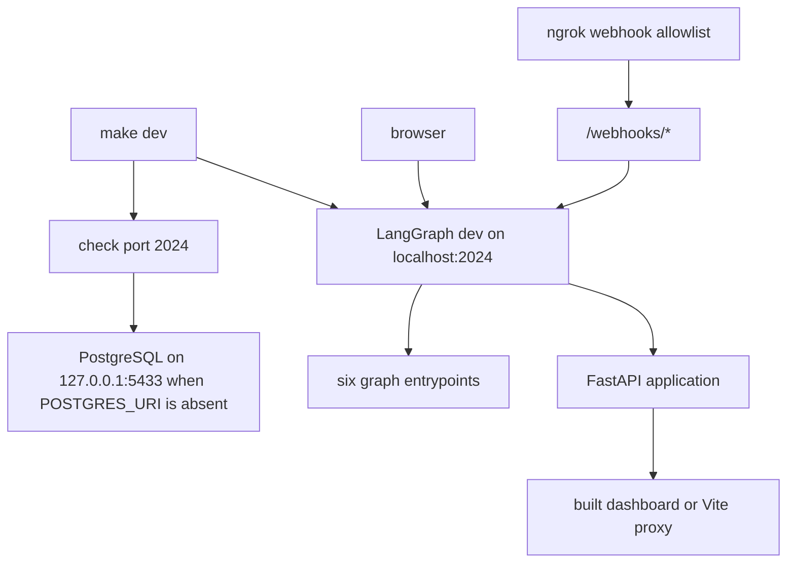
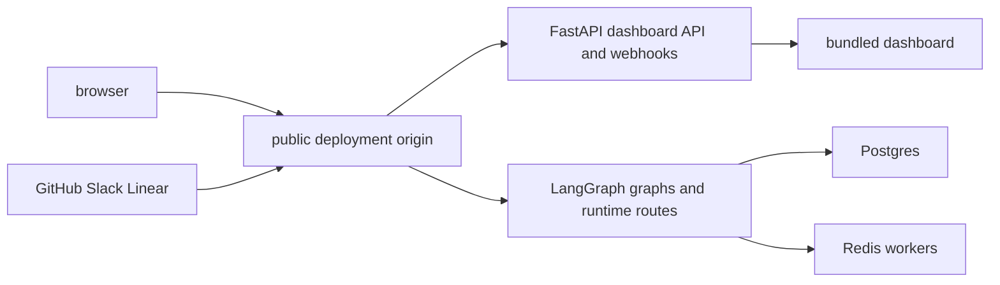

# Development, Build, Deployment, and Runtime Operations

Open SWE is normally one public deployment: the LangGraph server runs six graph entrypoints (`agent`, `reviewer`, `analyzer`, `review-scout`, `chat`, and `scheduler`) beside the FastAPI application `openswe.webapp:app`. The FastAPI application owns the dashboard API, health endpoints, and integration webhooks; LangGraph owns runtime routes and graph execution. A dashboard build can be served from the same origin, which keeps browser requests to `/dashboard/api/*` and the `osw_session` cookie same-origin.

See [Configuration](configuration.md) for the environment-variable contract, [Dashboard UI](../integrations/dashboard-ui.md) for browser behavior, and [Testing](../testing/overview.md) for the wider test strategy.

## Local runtime

### Prerequisites and state

Local development requires Python 3.14+, `uv`, the LangGraph CLI installed by the Python environment, plus Node 22.22.2+ and pnpm when working on the dashboard. Install backend development dependencies with:

```bash
make install
```

This runs `uv sync --extra dev`. Create `.env` before starting; `langgraph dev` loads it through `langgraph.json`. It needs the ordinary application credentials and secrets (for example model, GitHub, Slack, `TOKEN_ENCRYPTION_KEY`, and `DASHBOARD_JWT_SECRET`) for the paths being exercised. `LANGGRAPH_URL`, `DASHBOARD_BASE_URL`, and `DASHBOARD_API_BASE_URL` default to `http://localhost:2024` locally.

Open SWE also needs its own PostgreSQL database. Unless `POSTGRES_URI` is supplied in the shell or `.env`, `make dev` first starts the Compose `postgres:16` service. It is loopback-only at `127.0.0.1:5433`, passes its health check before `make dev` continues, and stores data in the named `open-swe-postgres` volume. Use `make postgres` to start it separately. An explicit `POSTGRES_URI` skips this container.

`langgraph dev` retains local threads, checkpoints, and Store data in `.langgraph_api` in the worktree. Stop a server cleanly before copying or sharing that directory. Separate copies diverge; a shared directory must have only one backend process using it at a time.


```mermaid
flowchart TD
  Dev["make dev"] --> Check["check port 2024"]
  Check --> DB["PostgreSQL on 127.0.0.1:5433 when POSTGRES_URI is absent"]
  Dev --> LG["LangGraph dev on localhost:2024"]
  LG --> Graphs["six graph entrypoints"]
  LG --> API["FastAPI application"]
  API --> UI["built dashboard or Vite proxy"]
  Browser["browser"] --> LG
  Tunnel["ngrok webhook allowlist"] --> Webhooks["/webhooks/*"]
  Webhooks --> LG
```

This local topology keeps ordinary browser and raw LangGraph traffic on localhost while admitting only webhook paths through the public tunnel.

### Serving modes

Run the full development runtime with:

```bash
make dev
```

It refuses to start if port 2024 is already in use, then runs `uv run langgraph dev --no-browser --port 2024 --n-jobs-per-worker 10`. The manifest uses Python 3.14 and a pre-release 0.15 LangGraph API range, registers the six graphs and the FastAPI app, loads `.env`, and configures deleting checkpoints with a 60-minute sweep and a 43,200-minute default TTL. The Python constraints keep `langgraph-api` in the corresponding `>=0.15.0rc1,<0.16` range.

To serve a static dashboard from that same server, build it first:

```bash
make build-dashboard
make dev
```

The build writes `ui/.output/public`. The backend chooses an explicit `DASHBOARD_STATIC_DIR` when set, otherwise this in-repository build. Its UI catch-all only handles HTML navigation and files; it declines dashboard API, webhooks, health, OpenAPI/docs, and LangGraph prefixes such as `/threads`, `/runs`, and `/store`. Hashed assets are immutable-cacheable while the shell is revalidated, so API paths are not shadowed and a new shell can point to new assets.

`make run` is intentionally narrower: it runs `uvicorn openswe.webapp:app --reload --port 8000` without LangGraph. It is appropriate for custom FastAPI routes and live OpenAPI documentation, but anything creating LangGraph runs requires `make dev`. Regenerate the checked-in custom FastAPI schema after route/model changes with:

```bash
make swagger
```

`make swagger` imports `openswe.webapp:app` and writes `swagger.json`; LangGraph runtime endpoints are not part of that custom schema.

### Dashboard development and mount prefixes

For same-origin UI hot reload, run:

```bash
make dev-ui
```

This starts `make web` and `make dev` together, passing `DASHBOARD_DEV_SERVER_URL=http://localhost:3000` to the backend. Open `http://localhost:2024`: non-reserved UI requests are reverse-proxied to Vite, whereas dashboard API and LangGraph routes remain on the backend origin. The HMR WebSocket deliberately connects directly to port 3000.

`make web` alone runs `pnpm run dev`, which starts the dashboard Vite task. During development Vite proxies backend prefixes to `DASHBOARD_API_URL`, defaulting to `http://localhost:2024`. Opening `http://localhost:3000` directly changes the browser origin: set both `DASHBOARD_BASE_URL` and `DASHBOARD_API_BASE_URL` to that origin, add `http://localhost:3000/dashboard/api/auth/callback` to the GitHub App, and configure an additional credentialed origin only when required. The FastAPI app rejects `DASHBOARD_ALLOWED_ORIGINS=*`, since credentialed CORS cannot safely use a wildcard.

The dashboard's `DASHBOARD_BASE_PATH` must equal the LangGraph `http.mount_prefix` where the backend serves it. Build a locally mounted UI with `DASHBOARD_BASE_PATH=/<prefix>/ make build-dashboard`. Platform builds derive this value from the manifest mount prefix. A mismatch sends client-router navigation or assets outside the mounted application.

## Local webhook exposure

Do **not** publish port 2024 indiscriminately. The local LangGraph runtime has no authentication for raw runtime endpoints. Use the pinned public hostname and policy:

```bash
make tunnel NGROK_DOMAIN=<name>.ngrok-free.dev
```

The target requires `NGROK_DOMAIN`, strips a supplied scheme/trailing slash, and runs ngrok to port 2024 with `examples/ngrok/webhooks-only.yml`. Its policy returns 404 for every path other than `/webhooks/*`. Point GitHub, Slack, and optional Linear webhook configuration at that public host, but continue opening the dashboard locally. If Slack OAuth is configured, its local tunnel policy must also preserve the documented callback relay to localhost without publishing dashboard routes.

After configuration changes, restart `make dev`: code reload does not reload `.env`. Operationally verify `/ok` locally, the dashboard login and a run, a webhook delivery from the provider, and that a non-webhook tunnel path receives ngrok's 404. `/ok` alone does not prove a dashboard build or Vite server is available.

## Production backend

There are two backend delivery paths:

- **LangGraph Platform:** connect this repository as a LangSmith deployment and set the application environment. `langgraph.json` installs Node during the image build, attempts a dashboard build for the manifest mount prefix, copies it to `/opt/open-swe-dashboard`, stamps build information, and sets `DASHBOARD_STATIC_DIR`. A failed dashboard build is logged but does not block the backend deployment.
- **Standalone Docker:** `docker build -t open-swe .` creates the production LangGraph API image, not a sandbox image. It uses `langchain/langgraph-api:0.15.1-py3.14`, installs this repository, defines the FastAPI application, six graphs, and checkpointer policy through image environment variables, and exposes port 8000. The root Dockerfile does not build the dashboard; build it before `docker build` or provide `DASHBOARD_STATIC_DIR`.

A standalone deployment needs the Agent Server services and settings: `DATABASE_URI` for Agent Server Postgres, `REDIS_URI`, `LANGSMITH_API_KEY`, `LANGGRAPH_CLOUD_LICENSE_KEY`, and public `LANGGRAPH_URL`; application analytics/storage also requires `POSTGRES_URI`. Do not use scale-to-zero hosting: Redis- and Postgres-backed workers must remain available for background runs. Publish port 8000 through ingress and update `LANGGRAPH_URL`, webhook targets, and the GitHub callback when the public URL changes.

The standalone image defaults to `LANGGRAPH_AUTH_TYPE=noop`. This leaves raw LangGraph routes exposed to any network client that can reach them; dashboard sessions and webhook signatures secure only their custom routes. Prefer `LANGGRAPH_AUTH_TYPE=langsmith` with `LANGSMITH_AUTH_ENDPOINT` and `LANGSMITH_TENANT_ID`, or enforce a private/authenticated network boundary.


```mermaid
flowchart LR
  Browser["browser"] --> Origin["public deployment origin"]
  Providers["GitHub Slack Linear"] --> Origin
  Origin --> FastAPI["FastAPI dashboard API and webhooks"]
  Origin --> Runtime["LangGraph graphs and runtime routes"]
  FastAPI --> UI["bundled dashboard"]
  Runtime --> PG["Postgres"]
  Runtime --> Redis["Redis workers"]
```

This deployed topology uses one public origin for the dashboard, browser API traffic, and webhook delivery; raw runtime routes need their own authentication boundary.

## Separate dashboard deployment

A separate dashboard is optional. Build it from the repository root:

```bash
docker build -f ui/Dockerfile .
```

`ui/Dockerfile` uses a multi-stage Node 24 Alpine build, installs the filtered workspace with the frozen lockfile, creates the dashboard Nitro `.output`, and serves it as user `node` on port 8080. `DASHBOARD_API_URL` is read per request, not baked into the image, so one image can front different backends. The Nitro proxy fails clearly if it is unset; it forwards the original path/query and streamed non-GET body, retains individual `Set-Cookie` headers, and leaves OAuth redirects for the browser.

For this same-origin proxy arrangement, set the backend's `DASHBOARD_BASE_URL` and `DASHBOARD_API_BASE_URL` to the dashboard origin and register its GitHub callback. A cross-origin client alternative builds with `VITE_DASHBOARD_API_BASE_URL` targeting the backend and adds the dashboard origin to `DASHBOARD_ALLOWED_ORIGINS`. Never put secrets in `VITE_*` values.

The pnpm workspace includes `bridge-client`, `ui`, `desktop`, `cli`, and `tests/e2e`. Root `pnpm run build`, `check`, `test`, and `typecheck` fan out through Turborepo; `lint` (oxlint) and `format`/`format:check` (oxfmt) run at the root. Turbo caches `.output/**`, `.vercel/output/**`, and `build/**`; its build cache inputs include `DASHBOARD_API_URL`, `SOURCE_COMMIT`, `VERCEL`, `E2E_HARNESS`, and `VITE_*`.

## Desktop and CLI artifacts

The experimental Electron app bundles the dashboard UI and asks packaged users for a compatible backend URL on first launch; it has no maintainer-hosted default. Its `open-swe://app` origin proxies dashboard API requests to that backend, so the browser does not call raw LangGraph APIs. New **This Mac** threads use a local sandbox bridge that long-polls the connected backend; they depend on the app remaining open. Existing legacy local threads can still run on the bundled loopback server.

For source development, run `make dev` then `make desktop`; the development default is `http://localhost:2024`. Backend resolution is command-line `--backend-url`, `OPEN_SWE_BACKEND_URL`, saved configuration, then that default. Package an unpacked app or installer with:

```bash
pnpm --dir desktop run pack
pnpm --dir desktop run dist
```

Both build the dashboard, local backend resources, and the `oswe` CLI before Electron packaging. To build the standalone CLI binary directly, use `make cli`; it requires Bun and compiles `cli/src/main.ts` to `cli/dist/oswe`, embedding its runtime.

On macOS, `make install-desktop` refuses a dirty worktree, fast-forwards `main`, and invokes `scripts/install_desktop.sh`; `make install-checkout` packages the current checkout without changing Git state. The script is macOS-only, requires Node, `ditto`, `uv`, Bun, and pnpm or Corepack, then packages and atomically replaces `Open SWE.app` in `/Applications` or `~/Applications`.

## Migrations, checks, and maintenance helpers

Create the next numbered Alembic migration with:

```bash
make migration m="Short description"
```

The migration helper requires a message, finds the next numeric filename prefix, creates a random revision ID, and chains the revision to every current head.

Focused commands are:

- `make test [TEST_FILE=...]` and `make integration_tests` run pytest through uv and skip a requested missing path rather than failing.
- `make lint`, `make format`, and `make format-check` run Ruff; `make typecheck` runs `ty check openswe tests`.
- `scripts/create_sandbox_snapshot.py` creates a LangSmith sandbox snapshot from an image and prints its UUID. Provide `LANGSMITH_API_KEY` or `--api-key`, then set the snapshot through the dashboard workspace configuration.
- `scripts/purge_wakeup_crons.py --dry-run` identifies expired one-shot `thread_wakeup` crons before deletion. It resolves a deployment from `--url` or `LANGGRAPH_URL`, and credentials from `LANGGRAPH_API_KEY` or `LANGSMITH_API_KEY`.

Before declaring a backend ready, check startup logs for successful database migration and required configuration, call `/ok` and `/health`, authenticate through the dashboard, start a representative run, and deliver a signed webhook. For a deployment with analytics/storage, also confirm its PostgreSQL role can create and migrate the application schema; a healthy homepage does not establish that background initialization succeeded.
