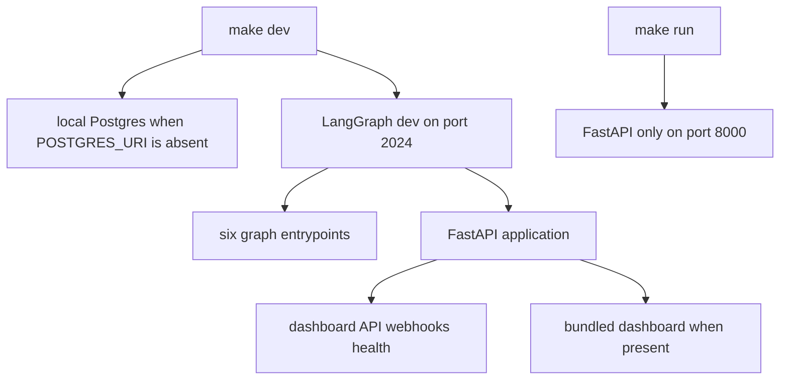
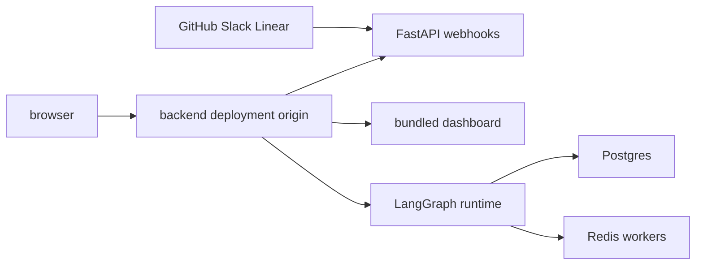

# Development, Packaging, and Deployment

Open SWE is normally delivered as one LangGraph deployment: the `agent`, `reviewer`, `analyzer`, `review-scout`, `chat`, and `scheduler` graphs, plus the FastAPI application `agent.webapp:app`. The FastAPI application supplies the dashboard API and integration webhooks; the LangGraph server supplies graph/runtime endpoints. A dashboard build can be served from the same origin, avoiding cross-origin browser cookies and CORS in the standard topology.

`langgraph.json` is the platform/local-dev manifest. It selects Python 3.14 and the `>~=0.15.0rc1` API version, registers the graphs and HTTP app, loads `.env`, and configures deletion-based checkpoint TTL (60-minute sweep; 43,200-minute default). Its platform build instructions attempt to bundle the dashboard, but deliberately continue with a backend-only deployment if that UI build fails.

See [Configuration](configuration.md) for the environment contract, [Dashboard UI](../integrations/dashboard-ui.md) for browser behavior, and [Testing](../testing/overview.md) for the broader test strategy.

## Local backend and dashboard

### Prerequisites and installation

Use Python 3.14+, `uv`, Node 22.22.2+ and pnpm. Install Python development dependencies with:

```bash
make install
```

This runs `uv sync --extra dev`. For a complete clone setup, including all optional Python extras, follow `uv sync --all-extras` in `docs/DEVELOPMENT.md`.

The normal local server is:

```bash
make dev
```

`make dev` refuses to start if port 2024 is already listening, then runs `uv run langgraph dev --no-browser --port 2024 --n-jobs-per-worker 10`. It serves all registered graphs and the FastAPI app at `http://localhost:2024`. In contrast, `make run` runs only `uvicorn agent.webapp:app --reload --port 8000`; it is useful for focused HTTP work and `/docs`, but it does not start the LangGraph runtime, so operations that create runs require `make dev`.

Open SWE needs PostgreSQL for application tables. Unless `POSTGRES_URI` is already in the shell or `.env`, the `dev` dependency starts `docker compose up -d --wait postgres`: a `postgres:16` container bound only to `127.0.0.1:5433`, with a named `open-swe-postgres` volume. `make postgres` starts it independently. Local LangGraph state is separate: `langgraph dev` persists threads, checkpoints, and Store data under `.langgraph_api` in the working directory. Do not let simultaneous worktrees use a shared state directory; copied state diverges, while a shared link must be used by only one backend at a time.


```mermaid
flowchart TD
  Dev["make dev"] --> Database["local Postgres when POSTGRES_URI is absent"]
  Dev --> Runtime["LangGraph dev on port 2024"]
  Runtime --> Graphs["six graph entrypoints"]
  Runtime --> Api["FastAPI application"]
  Api --> Routes["dashboard API webhooks health"]
  Api --> Bundle["bundled dashboard when present"]
  Run["make run"] --> Uvicorn["FastAPI only on port 8000"]
```

This contrasts the full local runtime with the HTTP-only Uvicorn process.

### Bundled UI, Vite, and mount prefixes

Build a static dashboard for same-origin serving:

```bash
make build-dashboard
make dev
```

`make build-dashboard` installs the filtered workspace with the frozen lockfile and writes the dashboard client build to `ui/.output/public`. The backend uses `DASHBOARD_STATIC_DIR` when set, otherwise that in-repository directory. Its catch-all serves real files or the client shell only for HTML navigation, declines API and LangGraph-owned prefixes (`/dashboard/api`, `/webhooks`, `/health`, `/threads`, `/runs`, and others), and makes hashed static assets immutable while requiring the shell to revalidate. Thus it cannot shadow runtime or custom API routes.

For UI development, run:

```bash
make dev-ui
```

This runs Vite (`make web`) and `make dev` concurrently with `DASHBOARD_DEV_SERVER_URL=http://localhost:3000`. Open `http://localhost:2024`: the backend reverse-proxies non-reserved UI requests to Vite, while API calls and cookies remain on the backend origin. The HMR WebSocket intentionally connects directly to Vite on port 3000.

`make web` is `pnpm run dev`, which uses Turborepo to start `open-swe-dashboard`. The Vite development proxy sends backend prefixes to `DASHBOARD_API_URL`, defaulting to `http://localhost:2024`. If instead the browser is opened directly on `http://localhost:3000`, configure `DASHBOARD_BASE_URL` and `DASHBOARD_API_BASE_URL` for that origin and register `http://localhost:3000/dashboard/api/auth/callback` with the GitHub App. `DASHBOARD_ALLOWED_ORIGINS` grants additional credentialed origins only; `*` is rejected because FastAPI enables credentials.

A bundled dashboard must be built with `DASHBOARD_BASE_PATH` equal to LangGraph's `http.mount_prefix` (with its trailing slash). This controls Vite router and asset paths. The platform manifest derives it from `langgraph.json`; for an independently prefixed local build, pass `DASHBOARD_BASE_PATH=<prefix>/ make build-dashboard`. A mismatch puts client navigation or assets outside the mounted application.

### Local webhook exposure

Do not publish a whole local LangGraph port: `langgraph dev` has unauthenticated raw runtime routes. Instead:

```bash
make tunnel NGROK_DOMAIN=<name>.ngrok-free.dev
```

The target requires `NGROK_DOMAIN`, forwards port 2024 through ngrok, and applies `examples/ngrok/webhooks-only.yml`. The policy returns 404 for any path outside `/webhooks/*`, allowing signed GitHub, Slack, and Linear deliveries without exposing dashboard or raw LangGraph endpoints. A substitute tunnel must enforce the same allowlist. Restart `make dev` after changing `.env`; code reload does not reload environment configuration.

## JavaScript workspace and checks

The pnpm workspace contains `ui`, `desktop`, `cli`, and `tests/e2e`. Root scripts delegate `dev`, `build`, `check`, `test`, and `typecheck` to Turborepo; `lint` uses oxlint and `format`/`format:check` use oxfmt directly at the root. Turbo declares build outputs and marks `DASHBOARD_API_URL`, `SOURCE_COMMIT`, `VERCEL`, `E2E_HARNESS`, and `VITE_*` as build cache inputs; its persistent development task also receives `DASHBOARD_BASE_PATH`, `OPEN_SWE_DEV_SESSION`, and `PORT`.

Useful focused checks are:

- `make test [TEST_FILE=...]` and `make integration_tests` run pytest through uv, skipping a requested path that does not exist.
- `make lint`, `make format`, and `make format-check` use Ruff; `make typecheck` runs `ty check agent tests`.
- `pnpm run build`, `pnpm run typecheck`, and `pnpm run test` fan out through Turbo; `pnpm run test:e2e` and `pnpm run test:e2e:desktop` select their E2E package.
- `make swagger` regenerates `swagger.json` from `agent.webapp:app`. The live Uvicorn schema is `/openapi.json`, but it does not include LangGraph runtime endpoints.

## Production backend

### LangGraph Platform and standalone Docker

For LangGraph Platform, connect this repository to a LangSmith deployment, set the application environment, and use the hosted URL as `LANGGRAPH_URL` and for webhook/OAuth callback configuration. The manifest's dashboard build makes the same origin serve the UI when successful.

For a standalone server:

```bash
docker build -t open-swe .
```

The root `Dockerfile` builds a LangGraph API server image—not a sandbox—from `langchain/langgraph-api:0.15.1-py3.14`. It installs the repository with uv, declares the six graph registrations, FastAPI app, and TTL policy through `LANGSERVE_GRAPHS`, `LANGGRAPH_HTTP`, and `LANGGRAPH_CHECKPOINTER`, then exposes port 8000. It does not build the dashboard. Build it before the image, or provide `DASHBOARD_STATIC_DIR` holding a compatible build.

A standalone Agent Server needs `DATABASE_URI` (Postgres), `REDIS_URI`, `LANGSMITH_API_KEY`, and `LANGGRAPH_CLOUD_LICENSE_KEY`, plus the public `LANGGRAPH_URL`. Publish port 8000 through ingress. Do not use scale-to-zero hosting: background runs rely on Redis- and Postgres-backed workers remaining available. Application analytics additionally uses `POSTGRES_URI`; setting only `DATABASE_URI` does not enable it.

The standalone image defaults to `LANGGRAPH_AUTH_TYPE=noop`. That leaves raw LangGraph paths such as `/threads`, `/runs`, `/assistants`, and `/store` available to any network client. Use LangSmith auth (`LANGGRAPH_AUTH_TYPE=langsmith`, `LANGSMITH_AUTH_ENDPOINT`, and `LANGSMITH_TENANT_ID`) or a private/authenticated network boundary. Dashboard sessions and webhook signature verification protect custom routes, not those raw runtime routes.


```mermaid
flowchart LR
  Browser["browser"] --> Origin["backend deployment origin"]
  Integrations["GitHub Slack Linear"] --> Api["FastAPI webhooks"]
  Origin --> Ui["bundled dashboard"]
  Origin --> Api
  Origin --> GraphRuntime["LangGraph runtime"]
  GraphRuntime --> Postgres["Postgres"]
  GraphRuntime --> Redis["Redis workers"]
```

This is the same-origin production topology; standalone and Platform differ in packaging and infrastructure ownership, not in the browser-facing boundary.

### Separate dashboard deployment

A dashboard can instead be deployed separately. Build `ui/Dockerfile` from the repository root with `docker build -f ui/Dockerfile .`. It uses a multi-stage Node 24 Alpine build, installs the filtered pnpm workspace with `--frozen-lockfile`, and runs the Nitro `.output` server as `node` on port 8080.

At runtime its server proxy reads `DASHBOARD_API_URL`; it intentionally throws if unset rather than choosing a production fallback. It forwards the original path, query, request headers and non-GET/HEAD body to the backend, removes hop-by-hop/reframed headers, keeps individual `Set-Cookie` lines, and returns redirects without following them so browser OAuth navigation remains correct. Therefore one image can front different backends, but every deployment must set its own backend origin.

The preferred arrangement proxies browser dashboard API and webhook paths through that frontend, then sets the backend's `DASHBOARD_BASE_URL` and `DASHBOARD_API_BASE_URL` to the frontend origin and registers its callback URL. A cross-origin alternative bakes `VITE_DASHBOARD_API_BASE_URL` into the client and adds the frontend origin to `DASHBOARD_ALLOWED_ORIGINS`; treat `VITE_*` values as public build-time data.

## Desktop packaging and boundary

The experimental Electron client ships the compiled web UI and asks packaged users for a compatible organization backend URL; it has no maintainer-hosted default. Its `open-swe://app` UI proxies dashboard API traffic to that selected backend, so it does not expose a LangSmith key or call raw LangGraph API paths directly. Changing backend URL clears the previous deployment session data.

Desktop also has a distinct local-agent mode. Electron owns a loopback-only LangGraph server, proxies it to the bundled UI, and stops it with the app. It uses the same agent graph and streaming protocol but a local filesystem backend; cloud integrations differ. The local server uses `langgraph.desktop.json`, a separate manifest that exposes only the agent graph, disables the built-in UI, uses `agent.local_auth:auth` with Studio auth disabled, and chooses a local checkpointer. Packaged resources include the dashboard, local backend, and CLI.

For source development, run `make dev` in one terminal and `make desktop` in another. The desktop process defaults to `http://localhost:2024`; resolution is command-line `--backend-url`, `OPEN_SWE_BACKEND_URL`, saved configuration, then that development default. Build an unpacked app with `pnpm --dir desktop run pack`, or an installer with `pnpm --dir desktop run dist`; both build the UI, local backend, and CLI, but do not deploy the hosted web app.

On macOS, `make install-desktop` first rejects a dirty checkout, fast-forwards `main`, then calls `scripts/install_desktop.sh`; `make install-checkout` runs the installer against the current checkout without changing Git state. The script is macOS-only, requires Node, `ditto`, uv, Bun, and a pnpm or Corepack launcher; it creates a packaged app, stages it, and swaps it into `/Applications` or `~/Applications` depending on write access.

## Operational scripts

- `scripts/create_sandbox_snapshot.py` creates a LangSmith sandbox snapshot through `SandboxClient`. It accepts a snapshot name, Docker image, filesystem capacity, and API key (defaulting to `LANGSMITH_API_KEY`), prints the snapshot ID, and directs operators to set it as a workspace base snapshot in the dashboard.
- `scripts/purge_wakeup_crons.py` is a one-time cleanup for expired one-shot `thread_wakeup` cron rows. Begin with `uv run python scripts/purge_wakeup_crons.py --dry-run`; it resolves the deployment from `--url` or `LANGGRAPH_URL`, and credentials from `LANGGRAPH_API_KEY` or `LANGSMITH_API_KEY`, before listing or deleting expired IDs.
- `make migration m="..."` creates a new migration through `scripts/new_migration.py`.
- `make cli` builds the self-contained `cli/dist/oswe` binary with Bun; the binary is also included by desktop packaging.
