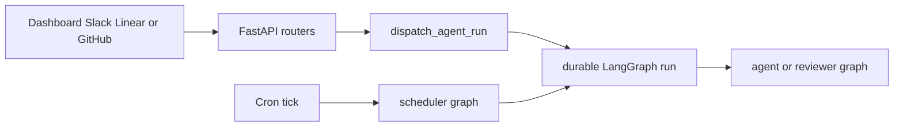

# Open SWE Codebase Guide

Open SWE is a LangGraph and Deep Agents coding-agent framework. A coding thread works in an isolated sandbox; separate graphs handle pull-request review, review-style analysis, read-only PR chat, and scheduled work. This page is an entry point, not a substitute for source and tests: read the owning implementation and its focused tests before changing behavior, then use the linked guide for just-in-time context.

## Start a local change

The Python backend uses `uv`; the dashboard and desktop workspace use `pnpm`. Python 3.14 is required.

```bash
make install            # uv sync --extra dev
pnpm install
make dev                # LangGraph graphs plus FastAPI HTTP app on port 2024
make web                # dashboard development server
make run                # FastAPI HTTP app only on port 8000
make desktop            # Electron desktop client; backend must already be available
```

Use `make dev` for graph execution and an end-to-end ingress-to-run change. Use `make run` only when the FastAPI service is the boundary under examination; it does not start the LangGraph development server. Start `make web` separately for dashboard work. Configuration, credentials, required services, and production concerns belong in [Runtime Configuration and Customization](operations/configuration.md) and [Development, Service Startup, and Deployment](operations/deployment.md).

### Working rules

- Keep Python implementations async-first. Add a synchronous method only when an interface requires one, and have it raise `NotImplementedError`; do not build parallel sync and async paths.
- Preserve the deliberate boundaries: tools must be exported and explicitly authorized on the graph that uses them, middleware order is significant, and sandbox-provider additions must be registered.
- For a coding thread, an existing but unreachable sandbox fails rather than being silently replaced, protecting uncommitted work. A deleted sandbox is recreated. The read-only reviewer is the exception: it may replace an unreachable sandbox because it reconstructs its checkout on every run.
- Prefer the narrowest validation that proves the changed behavior. Do **not** run the full local pytest suite by invoking `make test` without `TEST_FILE`; preserve complete failure output.

## Find the runtime boundary

`langgraph.json` registers five graph exports and the FastAPI app. The modules in `agent/graphs/` are stable, thin re-exports; make behavioral changes in the owning module rather than a registration shim.

| Runtime surface | Registered target | Route changes to |
|---|---|---|
| Coding agent | `agent.graphs.agent:traced_agent` | [Coding Agent Assembly](architecture/agent-graph.md) for graph construction, sandbox, models, tools, skills, and subagents; [Middleware Stack and Failure Boundaries](architecture/middleware-stack.md) for ordering and failure behavior. |
| PR reviewer | `agent.graphs.reviewer:traced_reviewer_agent` | [Review and Review-Style Graphs](architecture/reviewer-and-analyzer.md) and [Pull Request Review Workflow](workflows/pr-review.md). The reviewer has finding and publication tools, not commit, push, or PR-opening tools. |
| Review-style analyzer | `agent.graphs.analyzer:traced_analyzer` | [Review and Review-Style Graphs](architecture/reviewer-and-analyzer.md). |
| PR chat | `agent.graphs.chat:traced_chat_agent` | [Review and Review-Style Graphs](architecture/reviewer-and-analyzer.md). It has no sandbox: dashboard code seeds PR virtual files and it uses read-only GitHub-backed repository access. |
| Scheduler | `agent.graphs.scheduler:get_scheduler` | [Scheduling, Background Work, and CI Monitoring](workflows/scheduling-and-baby-sit.md). Its single launch node selects reconciliation, PR watch evaluation, background-task monitoring, session or agent cost refresh, or a scheduled agent run. |
| HTTP application | `agent.webapp:app` | [Runtime Architecture and Entrypoints](architecture/overview.md), [Inbound Invocation Workflow](workflows/invocation.md), or [Dashboard, Web UI, and Desktop Clients](integrations/dashboard-ui.md). |



This shows the two run-launch paths: interactive entry surfaces converge on durable dispatch, while a scheduler tick selects a maintenance action or launches scheduled work.

The FastAPI compatibility export delegates to `agent/api/app.py`. Its lifespan pins the event loop, validates sandbox and local-development LLM configuration before serving, and closes cached models on shutdown. Credentialed CORS is installed only when `DASHBOARD_ALLOWED_ORIGINS` is configured and rejects `*`.

## Route a change by responsibility

### Agent state, capabilities, and context

- **Thread identity, durable runs, configurable metadata, continuation, or interruption:** [Threads, Run State, and Durable Dispatch](concepts/threads-and-state.md) and [Follow-up, Interrupt, and Stop Workflow](workflows/follow-up-messages.md). `dispatch_agent_run` is the common contract for Slack, Linear, GitHub, and dashboard launches; it selects `agent` or `reviewer`, defaults to interruption, and requires callers to choose either a prebuilt input or source content and identities—not both.
- **Sandbox reconnect, creation, credentials, snapshots, or a new provider:** [Thread Sandbox Lifecycle](architecture/sandbox-lifecycle.md) and [Sandbox Provider Integrations](integrations/sandbox-providers.md).
- **Model selection, reasoning effort, profile/team defaults, or instructions:** [Models, Profiles, and Instruction Precedence](concepts/models-profiles-instructions.md) and [Run Context Engineering Workflow](workflows/context-engineering.md).
- **A built-in or connected tool, capability grant, tool input safety, or MCP integration:** [Curated Tools and Capabilities](concepts/tools.md) and [Observability, MCP, and Connected Tools](integrations/observability-and-mcp.md).
- **Authorization, webhook validation, GitHub tokens, untrusted content, or approval policy:** [Authorization, Credentials, and Trust Boundaries](concepts/auth-and-security.md).

### Ingress, delivery, and product behavior

- **Dashboard API, web UI proxying, Electron supervision, or local-project execution:** [Dashboard, Web UI, and Desktop Clients](integrations/dashboard-ui.md).
- **Slack, Linear, GitHub, dashboard, desktop, or automation invocation:** [Inbound Invocation Workflow](workflows/invocation.md). GitHub automatic review is considered only for `opened` and `ready_for_review` PR events after the repository's auto-review and organization gates pass.
- **Commits, pushes, pull-request creation/update, delivery approval, or CI-facing agent behavior:** [Pull Request Delivery Workflow](workflows/pr-creation.md).
- **Findings, review publication, reviewer replies, re-review, or review-style learning:** [Pull Request Review Workflow](workflows/pr-review.md) and [Review and Review-Style Graphs](architecture/reviewer-and-analyzer.md).
- **Recurring schedules, one-shot wakeups, PR watch state, CI monitoring, stale-run reconciliation, or cost maintenance:** [Scheduling, Background Work, and CI Monitoring](workflows/scheduling-and-baby-sit.md).

## Validate only the affected seam

Start with the test beside the changed contract. The repository's pytest fixtures replace the store client with an in-memory store while preserving production serialization, clear the process-global TTL cache around every test, and enable automatic review by default unless a test overrides the gate.

```bash
make test TEST_FILE=tests/github/test_open_pull_request.py
uv run pytest -vvv tests/path/to_test.py::test_name
make lint
make format-check
make typecheck
```

`make test TEST_FILE=…` runs the selected existing file or directory with `pytest -vvv`; an absent path is reported as skipped. `make lint` runs Ruff checks and a formatting diff, `make format-check` checks formatting without edits, and `make typecheck` runs `ty check agent tests`. Ruff's configured line length is 100 and pytest uses `asyncio_mode = "auto"`. For test ownership and a wider command map, use [Focused Validation Strategy](testing/overview.md).

Use Playwright only for a real cross-boundary proof: the harness runs real agent code, a local sandbox, local git remote, dashboard, and Electron paths, while faking the LLM and external SaaS HTTP services. Browser tests are serial with one worker; the desktop configuration selects the Electron spec.

```bash
pnpm run test:e2e:install
pnpm exec playwright test tests/full_flow.spec.ts
pnpm run test:e2e:desktop
```

The single-spec command is the preferred browser iteration loop. See [Focused Validation Strategy](testing/overview.md) for dashboard and desktop unit-test seams, Playwright artifacts, and when an integration-level test is warranted.

## Read next

- Need the whole service topology first? [Runtime Architecture and Entrypoints](architecture/overview.md).
- Need settings or deployment assumptions? [Runtime Configuration and Customization](operations/configuration.md) and [Development, Service Startup, and Deployment](operations/deployment.md).
- Need a request traced from an external system to a graph? [Inbound Invocation Workflow](workflows/invocation.md).
- Need a change-to-test decision? [Focused Validation Strategy](testing/overview.md).
