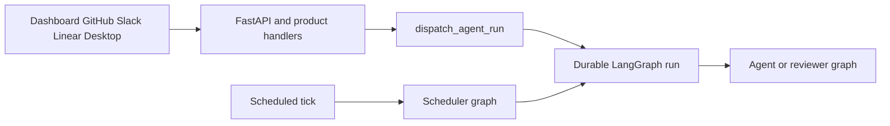

# Open SWE Codebase Guide

Open SWE is an asynchronous software factory built on Deep Agents and LangGraph. Coding work is isolated per thread in a sandbox; separate graphs handle read-only pull-request review, review-style analysis, PR chat, and scheduled work. Treat repository source and tests as authoritative. The pages linked here are navigation and just-in-time context, not a replacement for inspecting the owning code and its focused tests.

## Set up the smallest useful local loop

The backend requires Python 3.14 or later and uses `uv`; `ui`, `desktop`, and `tests/e2e` are a `pnpm` workspace. For a first local backend setup, follow [docs/DEVELOPMENT.md](../docs/DEVELOPMENT.md): it covers credentials, a stable webhook tunnel, and preserving local LangGraph state when changing worktrees.

```bash
make install            # uv sync --extra dev
make dev                # uv run langgraph dev --no-browser --port 2024
make run                # uv run uvicorn agent.webapp:app --reload --port 8000
make dev-ui             # Vite plus LangGraph development server
make web                # pnpm run dev
make desktop            # pnpm run dev:desktop
```

Use `make dev` for graph execution: it serves every registered graph, the FastAPI app, and a built dashboard when present. `make run` is FastAPI-only, so it cannot create LangGraph runs. For UI work, `make dev-ui` runs Vite and the backend together while the backend fronts the UI on port 2024; `make desktop` starts Electron and needs a backend separately. `make tunnel NGROK_DOMAIN=<name>.ngrok-free.dev` exposes only `/webhooks/*`; do not replace that allowlist with a tunnel that publishes the unauthenticated development LangGraph API.

Keep implementations async-only. If an interface forces a synchronous method, make it raise `NotImplementedError` instead of maintaining parallel synchronous and asynchronous paths. Use strong Python and TypeScript types rather than widening values to `Any` or `any`.

## Identify the runtime boundary before editing

`langgraph.json` is the public deployment registration point: it declares five graph entrypoints—`agent`, `reviewer`, `analyzer`, `chat`, and `scheduler`—and mounts `agent.webapp:app`. Each graph target is a thin `agent/graphs/` re-export; normally change the owning module, not the shim. The deployed checkpointer uses delete-based TTL cleanup with a 60-minute sweep and a default retention of 43,200 minutes.

| Entrypoint | Owning concern | Start here when changing… |
| --- | --- | --- |
| `agent.graphs.agent:traced_agent` | Main coding graph in `agent/server.py` | Agent construction, tools, skills, prompts, models, middleware, or coding sandbox preparation. |
| `agent.graphs.reviewer:traced_reviewer_agent` | Reviewer graph in `agent/reviewer.py` | Diff-grounded findings, review publication, and reviewer sandbox behavior. |
| `agent.graphs.analyzer:traced_analyzer` | Review-style analyzer in `agent/analyzer.py` | Repository review guidance and analyzer scheduling. |
| `agent.graphs.chat:traced_chat_agent` | PR chat in `agent/chat.py` | Dashboard PR chat, virtual PR files, or read-only GitHub-backed repository access. |
| `agent.graphs.scheduler:get_scheduler` | Scheduler in `agent/scheduler.py` | Cron routing, scheduled runs, stale-run reconciliation, environment refresh, watches, background work, costs, or feedback prompts. |
| `agent.webapp:app` | FastAPI composition in `agent/api/app.py` | Dashboard APIs/UI, health, plan and workflow-approval APIs, CORS, or webhook ingress. |

The coding-agent factory is stateless: thread continuity is owned by LangGraph state and metadata plus the thread sandbox, not by a long-lived graph object. The FastAPI lifespan pins one event loop, validates GitHub login, sandbox, and local model configuration, then attempts analytics migration/reporting and worker startup without blocking service startup if that analytics setup fails; shutdown stops the worker and closes analytics and cached models. Credentialed CORS is installed only for configured origins, and a wildcard origin is rejected.



This routing diagram shows the primary durable-run boundary: interactive product and webhook paths dispatch agent or reviewer work, while the scheduler either runs maintenance work itself or launches scheduled agent work.

### Do not weaken these boundaries

- `dispatch_agent_run` is the shared dashboard, GitHub, Slack, and Linear dispatch contract for the `agent` and `reviewer` graphs. It defaults to the `interrupt` multitask strategy. A caller must provide either a prebuilt run input or content plus optional context/identities—not both.
- An unreachable main-agent sandbox is not silently replaced because it may contain uncommitted work. The reviewer can opt into replacement because it recreates its checkout for each review. See [Thread Sandbox Lifecycle](architecture/sandbox-lifecycle.md).
- The reviewer is non-mutating: it has finding and publication tools, not commit, push, or PR-opening tools. PR chat has no sandbox and keeps its filesystem and subagent operations read-only; it is seeded with PR virtual files and resolves a repository-scoped GitHub App token rather than passing a user credential.
- The scheduler has one launch node. It routes task state to stale-run reconciliation, baby-sit watches, background-task monitoring, environment refresh, session/agent cost refresh, feedback prompts, or scheduled-agent launch; missing required identifiers are returned as result statuses.

## Route the change to its detailed guide

### Runtime, state, and extension points

- [Runtime Architecture and Public Surfaces](architecture/overview.md) — service composition, graph and HTTP surfaces, dashboard/desktop boundary, and startup lifecycle.
- [Coding Agent Assembly](architecture/agent-graph.md) — `get_agent`, model and environment resolution, tools, skills, subagents, and preparation.
- [Agent Middleware Stack](architecture/middleware-stack.md) — ordering-sensitive tool guards, queues, retries, timeouts, fallbacks, and provider message normalization.
- [Thread Sandbox Lifecycle](architecture/sandbox-lifecycle.md) and [Sandbox Provider Integration](integrations/sandbox-providers.md) — sandbox ownership, reconnection/replacement policy, provider configuration, proxying, and local execution.
- [Review and Review-Style Graphs](architecture/reviewer-and-analyzer.md) — reviewer/analyzer contracts, findings, and publishing.
- [Threads, Invocations, and Durable State](concepts/threads-and-state.md) — thread, run, checkpoint, metadata, store, and analytics ownership.
- [Tool and Skill Capability Model](concepts/tools.md) and [Models, Profiles, and Instructions](concepts/models-profiles-instructions.md) — capability gates and configuration/prompt precedence.

### Product ingress and delivery

- [Invocation from Dashboard, Webhooks, and Desktop](workflows/invocation.md) — authorization, context construction, thread selection, and durable dispatch.
- [Follow-up, Interruption, and Completion Handling](workflows/follow-up-messages.md) — active-run interruption, queuing, stopping, completion, and feedback.
- [Pull Request Delivery and Approval](workflows/pr-creation.md) — preflight, workflow-change approval, PR creation/update, and recovery.
- [Pull Request Review and Re-review](workflows/pr-review.md) — triggers, canonical reviewer threads, findings, publication, replies, and settlement.
- [Schedules, Background Tasks, and CI Monitoring](workflows/scheduling-and-baby-sit.md) — persisted automations, scheduler runs, watches, and maintenance.
- [Dashboard, Web UI, and Desktop Integration](integrations/dashboard-ui.md) — dashboard API/UI routes, Vite proxying, and Electron backend supervision.
- [Authentication, Authorization, and Security Boundaries](concepts/auth-and-security.md) and [MCP, Connected Tools, and Observability](integrations/observability-and-mcp.md) — identity gates, credentials, webhooks, integrations, and tracing.

### Operations

- [Runtime Configuration and Administrative Settings](operations/configuration.md) — environment and persisted settings, validation, and precedence.
- [Development, Packaging, and Deployment](operations/deployment.md) — local serving, UI build/mount behavior, secure tunnel use, container build, and desktop packaging.

## Validate only the changed boundary

**Never run the full test suite locally.** First locate the nearest behavior test—often under `tests/agent/`, `tests/reviewer/`, `tests/sandbox/`, `tests/dashboard/`, `tests/github/`, `tests/slack/`, `tests/middleware/`, or `tests/tools/`—then run the narrowest file or node id and the proportionate quality check.

```bash
make test TEST_FILE=tests/github/test_open_pull_request.py
uv run pytest -vvv tests/agent/test_dispatch.py::test_dispatch_accepts_prebuilt_input
make lint
make format-check
make typecheck
```

`make test` runs only an existing supplied path; use direct `pytest` for a node id. Pytest uses `asyncio_mode = "auto"`. Its shared fixtures route store access through an in-memory implementation that preserves production model serialization, clear the process-global TTL cache around every case, hide locally bundled dashboard files, and enable automatic review by default. Tests for those gates should override the relevant fixture explicitly.

Use a focused UI package command for UI or desktop work. Escalate to one Playwright spec only for an end-to-end contract that cannot be proved below the product boundary:

```bash
pnpm install --frozen-lockfile
pnpm run test:e2e:install
pnpm exec playwright test tests/full_flow.spec.ts
```

The browser and desktop E2E harnesses execute real agent code, local sandbox behavior, local git, and the real dashboard/Electron paths, while faking the LLM and external SaaS HTTP boundaries. Browser tests run serially with one worker; the separate desktop configuration selects only `desktop.spec.ts`. See [Testing Strategy and Focused Validation](testing/overview.md) for subsystem ownership, fakes, artifacts, and narrow frontend commands.
