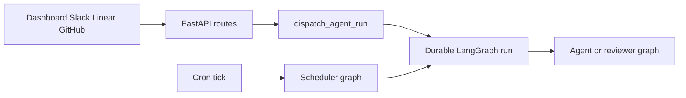

# Open SWE Codebase Guide

Open SWE is an asynchronous coding agent and software factory. Coding threads use isolated sandboxes; separate reviewer and analyzer graphs handle pull-request review and repository-specific review-style learning. Treat source code and tests as authoritative. This page and its links are optional just-in-time context for locating the right owner and validating a safe change.

## Start the smallest useful local loop

The Python project requires Python 3.14 or later and uses `uv`; `ui`, `desktop`, and `tests/e2e` are a pnpm/Turbo workspace.

```bash
make install            # uv sync --extra dev
make dev                # uv run langgraph dev --no-browser --port 2024
make run                # uv run uvicorn agent.webapp:app --reload --port 8000
make dev-ui             # Vite plus LangGraph development server
make web                # pnpm run dev
make desktop            # pnpm run dev:desktop
```

Use `make dev` when the change executes a registered graph: it serves every graph plus the HTTP app. `make run` serves the FastAPI compatibility entrypoint only. `make dev-ui` runs Vite and the backend together, with the backend fronting Vite at `:2024`; `make desktop` starts Electron and needs a backend separately. To accept local GitHub or Slack webhooks, `make tunnel NGROK_DOMAIN=<name>.ngrok-free.dev` exposes only `/webhooks/*`, because the development server does not authenticate its LangGraph API.

Python is async-only: implement the asynchronous path. If an interface requires a synchronous method, make it raise `NotImplementedError` rather than maintaining two implementations. Use absolute imports except that a same-package import may use one leading dot; do not use parent-relative imports.

## Registered entrypoints and ownership

`langgraph.json` is the deployment registration point. It declares five graph entrypoints—`agent`, `reviewer`, `analyzer`, `chat`, and `scheduler`—and the FastAPI HTTP application. Graph targets are deliberately thin `agent/graphs/` re-export modules, so normally change the owning implementation rather than a shim. The deployment checkpointer deletes expired state, sweeps every 60 minutes, and defaults to a 43,200-minute TTL.

| Entrypoint | Owning concern | Route a change here when it affects… |
| --- | --- | --- |
| `agent.graphs.agent:traced_agent` | Main coding graph in `agent/server.py` | agent assembly, models, prompts, skills, middleware, tools, and coding sandbox preparation |
| `agent.graphs.reviewer:traced_reviewer_agent` | Reviewer graph in `agent/reviewer.py` | diff-grounded findings, reviewer tools, review publication, and reviewer sandbox preparation |
| `agent.graphs.analyzer:traced_analyzer` | Analyzer graph in `agent/analyzer.py` | repository review-style analysis and learned guidance |
| `agent.graphs.chat:traced_chat_agent` | PR chat graph in `agent/chat.py` | dashboard PR chat, virtual PR files, and GitHub-backed read-only access |
| `agent.graphs.scheduler:get_scheduler` | Scheduler graph in `agent/scheduler.py` | cron routing, scheduled runs, stale-run repair, watch evaluation, background tasks, environment refresh, and cost or feedback work |
| `agent.webapp:app` | FastAPI composition in `agent/api/app.py` | dashboard/API surface, health, plan and workflow-approval APIs, CORS, or webhook ingress |

`agent.webapp:app` is a compatibility re-export of the application constructed in `agent/api/app.py`. At import time the app pins its event loop before queue workers can be built. Its lifespan validates the GitHub login allowlist, sandbox startup configuration, and local-development model configuration; shutdown closes cached models. Dashboard, plan, workflow-approval, Linear, Slack, health, and GitHub routers are included, then the dashboard UI is mounted. Credentialed CORS is installed only when configured origins are present, and configuration rejects `*`.



This diagram shows the shared work-routing boundary: interactive coding and review triggers create durable runs, while the scheduler either performs a maintenance task or launches scheduled agent work.

### Boundaries to preserve while changing an entrypoint

- The main coding-agent graph is stateless and is rebuilt by `get_agent`; thread continuity lives in sandbox state and thread metadata rather than in a long-lived graph instance. Read [Threads, Runs, and Durable State](concepts/threads-and-state.md) before changing identity, checkpoint, metadata, or concurrency behavior.
- Do not automatically replace an unreachable coding sandbox: it could discard uncommitted work. Reviewer preparation can opt into replacement because its checkout is recreated for each review. See [Thread-Scoped Sandbox Lifecycle](architecture/sandbox-lifecycle.md) and [Sandbox Provider Integration](integrations/sandbox-providers.md).
- The reviewer is non-mutating: its reviewer-specific tools manage findings and publication, not commits, pushes, or PR creation. PR chat is sandbox-less; the dashboard seeds `/pr/` virtual files, and it uses a repository-scoped GitHub App token for read-only repository access. See [Reviewer and Style Analyzer Graphs](architecture/reviewer-and-analyzer.md) and [Pull Request Review and Re-review](workflows/pr-review.md).
- Slack, Linear, GitHub, dashboard, and desktop callers share `dispatch_agent_run` for `agent` or `reviewer` durable-run creation. It assigns an invocation identity and streaming configuration, defaults to the `interrupt` multitask strategy, and rejects a prebuilt input combined with content, context, or source identities. See [Invoking Work Across Product Surfaces](workflows/invocation.md) and [Follow-Up, Interrupt, and Queue Handling](workflows/follow-up-messages.md).
- The scheduler is a single launch node. It routes a tick to reconciliation, baby-sit evaluation, background-task monitoring, environment refresh, session-cost, thread-feedback, or agent-cost work; otherwise it launches a scheduled agent run. Required missing identifiers return explicit result statuses rather than falling through to work.

## Route the change to its detailed guide

### Architecture, state, and extension seams

- [Runtime and Product Architecture](architecture/overview.md) — deployment registration, product surfaces, FastAPI composition, and durable dispatch.
- [Coding Agent Assembly](architecture/agent-graph.md) — `get_agent`, sandbox/backend resolution, model and profile choices, prompts, skills, tools, subagents, and middleware.
- [Agent Middleware Stack](architecture/middleware-stack.md) — ordering-sensitive guards, retries, timeouts, queues, fallbacks, and error handling.
- [Thread-Scoped Sandbox Lifecycle](architecture/sandbox-lifecycle.md) — sandbox binding, reconnection, reset and replacement rules, and environment freshness.
- [Threads, Runs, and Durable State](concepts/threads-and-state.md) — thread and invocation identity, checkpoints, metadata, stores, and durable-run semantics.
- [Models, Profiles, and Instructions](concepts/models-profiles-instructions.md) — model selection, profile snapshots, prompt composition, and skills.
- [Tooling and Capability Boundaries](concepts/tools.md) — curated, dynamic, integration, and administrative tools plus their policy constraints.

### Ingress, delivery, and product behavior

- [Invoking Work Across Product Surfaces](workflows/invocation.md) — authorization, source context, thread selection, durable dispatch, and completion across dashboard, desktop, GitHub, Slack, Linear, and schedules.
- [Follow-Up, Interrupt, and Queue Handling](workflows/follow-up-messages.md) — follow-up routing, interruption, pending work, and terminal handling.
- [Pull Request Creation and Delivery Controls](workflows/pr-creation.md) — GitHub access, branch and PR delivery, approvals, and CI linkage.
- [Pull Request Review and Re-review](workflows/pr-review.md) — automatic and manual review, canonical reviewer threads, findings, replies, and re-review gates.
- [Scheduled Work, Background Tasks, and CI Monitoring](workflows/scheduling-and-baby-sit.md) — schedules, reconciliation, background work, watches, costs, and feedback jobs.
- [Dashboard, Web UI, and Desktop Integration](integrations/dashboard-ui.md) — dashboard APIs, UI proxying and packaging, desktop supervision, and local projects.
- [Authentication, Authorization, and Credential Scope](concepts/auth-and-security.md) — sessions, OAuth, webhook verification, repository/actor gates, and credential exposure.
- [Observability and Connected Tool Integrations](integrations/observability-and-mcp.md) — tracing, gateways, MCP, and connection scopes.

### Configuration and serving

- [Configuration and Runtime Settings](operations/configuration.md) — environment registry, startup validation, models/gateway controls, team settings, and sandbox settings.
- [Build, Development, and Deployment Topology](operations/deployment.md) — local and deployed serving, dashboard builds, Docker/LangGraph wiring, webhook exposure, and desktop packaging.

## Validate the changed boundary, not the repository

**Focused validation is preferred; do not run the full local test suite.** Select the narrowest behavior-owning test and only the quality check relevant to the change. Tests should protect observable behavior and meaningful deterministic edge cases, not constants, prompts, internal call order, or other implementation trivia.

```bash
make test TEST_FILE=tests/github/test_open_pull_request.py
uv run pytest -vvv tests/path/to_test.py::test_name
make lint
make format-check
make typecheck
```

`make test` runs an existing file or directory, so do not invoke it with its default `tests/` value locally; use direct pytest for a node id. Pytest runs asynchronous tests in auto mode. The shared fixtures route `agent.store` through an in-memory store while retaining production serialization, clear the process-global TTL cache around each test, hide any locally built dashboard, supply a test GitHub login allowlist, and enable automatic review by default. Tests of those gates must override the corresponding fixture or stub explicitly.

Start with the owning family—such as `tests/agent/`, `tests/reviewer/`, `tests/sandbox/`, `tests/webhooks/`, `tests/dashboard/`, `tests/github/`, `tests/slack/`, `tests/middleware/`, or `tests/tools/`—then consult [Testing Strategy and Focused Validation](testing/overview.md) for fakes and package-specific commands. For a frontend-only change, use the narrow workspace check rather than a Python suite.

Use a single Playwright spec only when the change crosses real product boundaries:

```bash
pnpm install --frozen-lockfile
pnpm run test:e2e:install
pnpm exec playwright test tests/full_flow.spec.ts
```

The E2E harness runs real agent code, the local sandbox provider, local git, and the actual dashboard and Electron paths; it fakes the model and external SaaS HTTP boundaries. Browser tests run serially with one worker, and the separate desktop configuration selects `desktop.spec.ts`. The harness reuses its local web server, so a focused warm spec is the intended iteration loop rather than the browser suite. See [Testing Strategy and Focused Validation](testing/overview.md) for the test boundary and artifacts.
