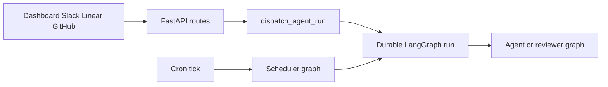

# Open SWE Codebase Guide

Open SWE is a LangGraph and Deep Agents software-engineering framework: work can arrive from the dashboard, GitHub, Slack, Linear, or a schedule; coding work runs in a thread-scoped isolated sandbox and can produce a pull request. This page is a change-routing hub. Read the relevant source and tests first; the linked OpenWiki pages are optional just-in-time context, not an authority over the repository.

## Start a local developer loop

Use Python 3.14 and `uv` for the backend. The dashboard and desktop workspace use `pnpm`.

```bash
make install            # uv sync --extra dev
make dev                # uv run langgraph dev --no-browser --port 2024
make run                # uv run uvicorn agent.webapp:app --reload --port 8000
make dev-ui             # Vite plus LangGraph development server
make web                # pnpm run dev
make desktop            # pnpm run dev:desktop
```

Use `make dev` when a change needs LangGraph graph execution; it serves the registered graphs and HTTP app. `make run` is FastAPI-only. `make dev-ui` fronts Vite through the backend at `:2024`; `make desktop` starts Electron and requires the backend separately. For local webhook exposure, `make tunnel NGROK_DOMAIN=<name>.ngrok-free.dev` restricts the ngrok policy to `/webhooks/*` because the development server has no authentication.

Python is async-first: implement the async path. Add a synchronous method only when an interface requires it, and make that method raise `NotImplementedError`; do not maintain parallel implementations.

## Entrypoints and execution boundaries

`langgraph.json` is the deployment registration point. Its graph targets are thin `agent/graphs/` re-export shims; change the owning module, not the shim, unless the public entrypoint itself must move. It also mounts `agent.webapp:app` and configures the deployed checkpointer with delete-based TTL cleanup (60-minute sweep and 43,200-minute default retention).

| Entrypoint | Owning concern | Start here for changes to… |
| --- | --- | --- |
| `agent.graphs.agent:traced_agent` | Main coding graph (`agent/server.py`) | Agent assembly, tools, skills, models, prompts, middleware, and coding sandbox preparation. |
| `agent.graphs.reviewer:traced_reviewer_agent` | Reviewer graph (`agent/reviewer.py`) | Diff-grounded findings, review publication, reviewer sandbox behavior, and reviewer middleware. |
| `agent.graphs.analyzer:traced_analyzer` | Style analyzer (`agent/analyzer.py`) | Repository review-style analysis and learned guidance. |
| `agent.graphs.chat:traced_chat_agent` | PR chat (`agent/chat.py`) | Dashboard “chat with this PR,” virtual PR files, and read-only repository access. |
| `agent.graphs.scheduler:get_scheduler` | Scheduler (`agent/scheduler.py`) | Cron routing, scheduled work, stale-run repair, CI watches, background tasks, and cost refreshes. |
| `agent.webapp:app` | FastAPI composition (`agent/api/app.py`) | Dashboard APIs/UI mount, health, plan/approval APIs, CORS, and webhook ingress. |



This is the principal work-routing boundary: interactive coding and review triggers converge on durable run creation, while the scheduler selects maintenance work or launches a scheduled agent run.

### Invariants worth preserving

- The main agent factory is stateless and rebuilt for execution. Thread continuity belongs to LangGraph state/metadata and the thread sandbox, not to a long-lived graph object.
- A missing sandbox may be recreated, but do **not** silently replace an unreachable main-agent sandbox: it could contain uncommitted work. Reviewer code may opt into replacement because it recreates its checkout for each review.
- The reviewer has no commit, push, or PR-opening tools. PR chat is also sandbox-less and excludes shell and file mutation; it receives `/pr/` virtual files and uses a repository-scoped GitHub App token for GitHub-backed reads.
- `dispatch_agent_run` is the shared Slack, Linear, GitHub, and dashboard creation contract for `agent` or `reviewer`. Its default multitask strategy is `interrupt`, and callers must choose either a prebuilt input or content/context/identities—not both.
- FastAPI pins a single event loop before queue construction, validates sandbox and local-development model configuration at startup, and closes cached models at shutdown. Credentialed CORS is added only for configured origins; `*` is rejected.

## Choose the detailed guide

### Architecture and extensibility

- [Runtime and Product Architecture](architecture/overview.md) — deployment topology, FastAPI composition, durable dispatch, and surface boundaries.
- [Coding Agent Assembly](architecture/agent-graph.md) — `get_agent`, backend/model/profile resolution, curated tools, skills, subagents, and preparation.
- [Middleware and Failure Boundaries](architecture/middleware-stack.md) — ordering-sensitive retries, timeouts, guards, queues, fallbacks, and error reporting.
- [Thread Sandbox Lifecycle](architecture/sandbox-lifecycle.md) and [Sandbox Provider Integration](integrations/sandbox-providers.md) — thread binding, safe recovery, proxy state, provider selection, and adding a provider.
- [Review and Style Analysis Graphs](architecture/reviewer-and-analyzer.md) — the non-mutating reviewer, finding lifecycle, and style analysis.
- [Threads, Durable Runs, and State](concepts/threads-and-state.md) — checkpoints, metadata, thread identity, and ownership boundaries.
- [Tool Catalog and Authorization](concepts/tools.md) — exporting, wiring, authorizing, and safely changing tools.
- [Models, Profiles, and Instructions](concepts/models-profiles-instructions.md) — configuration precedence and prompt inputs.

### Ingress, product, and delivery workflows

- [Inbound Invocation to Durable Run](workflows/invocation.md) — validation, identity/context construction, threads, dispatch, and completion across dashboard, desktop, Slack, Linear, GitHub, and automation.
- [Follow-ups, Interrupts, and Stop Control](workflows/follow-up-messages.md) — continuation and cancellation semantics for active durable work.
- [Pull Request Delivery and Approval](workflows/pr-creation.md) — commits, pushes, workflow approval gates, PR creation, and CI state.
- [Pull Request Review Workflow](workflows/pr-review.md) — manual/automatic reviews, findings, publishing, replies, and settlement.
- [Scheduling, Background Work, and CI Monitoring](workflows/scheduling-and-baby-sit.md) — schedule lifecycle, reconciliation, watches, and background tasks.
- [Dashboard and Desktop Clients](integrations/dashboard-ui.md) — authenticated browser APIs, UI proxy/mount behavior, Electron supervision, and local projects.
- [Authentication, Authorization, and Secret Boundaries](concepts/auth-and-security.md) — webhook verification, membership gates, OAuth/App tokens, encryption, and credential proxies.
- [Observability, Browser, and MCP Integrations](integrations/observability-and-mcp.md) — optional integrations and their configuration/authorization gates.

### Operations

- [Configuration and Startup Validation](operations/configuration.md) — lazy environment settings, persisted administrator settings, credentials, aliases, and failure behavior.
- [Development, Deployment, and Serving](operations/deployment.md) — local versus deployed serving, dashboard builds/mount prefixes, webhook exposure, and desktop distribution.

## Validate only the changed boundary

**Never run the full suite locally.** Select the narrowest test that owns the behavior, then run the relevant quality check.

```bash
make test TEST_FILE=tests/github/test_open_pull_request.py
uv run pytest -vvv tests/path/to_test.py::test_name
make lint
make format-check
make typecheck
```

`make test` accepts an existing path; use direct `pytest` for a node id. Pytest uses asyncio auto mode; shared fixtures substitute an in-memory store through the production serialization route, clear the global TTL cache before and after each case, hide any locally bundled dashboard, and enable auto-review by default. Override those defaults explicitly when testing their gates.

Use focused pytest families such as `tests/agent/`, `tests/reviewer/`, `tests/sandbox/`, `tests/webhooks/`, `tests/dashboard/`, `tests/github/`, `tests/slack/`, `tests/middleware/`, or `tests/tools/` according to the changed owner. Run a focused dashboard or desktop workspace check through its package when changing frontend code.

Escalate to a single Playwright spec only for a genuine cross-boundary contract:

```bash
pnpm install --frozen-lockfile
pnpm run test:e2e:install
pnpm exec playwright test tests/full_flow.spec.ts
```

The E2E harness exercises real agent code, a temporary local sandbox, local git, the real dashboard, and Electron paths while faking the model and external SaaS HTTP boundaries. Browser runs use one worker; the separate desktop configuration selects `desktop.spec.ts`. See [Focused Validation Strategy](testing/overview.md) for test ownership, fakes, artifacts, and narrow frontend/desktop commands.
