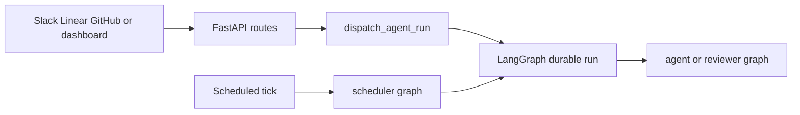

# Open SWE Quickstart & Wiki Map

Open SWE is an open-source coding-agent framework built with Deep Agents (`deepagents.create_deep_agent`) and operated as a LangGraph application. It accepts engineering work from the dashboard, GitHub, Slack, Linear, or schedules, works in an isolated environment, and can deliver a pull request. Use this page to route a change to its owning subsystem; the linked pages carry the detailed contracts.

## Runtime entrypoints

`langgraph.json` is the runtime registration point. `make dev` starts LangGraph development serving the five registered graphs and the FastAPI HTTP app together. Files in `agent/graphs/` are intentionally thin re-export shims, so change an implementation in its owning module rather than in a registration shim.

| Entry point | Registered target | Route changes here when you need to… |
|---|---|---|
| `agent` | `agent.graphs.agent:traced_agent` | Change the main coding graph, per-thread sandbox lifecycle, tools, prompts, models, or middleware. |
| `reviewer` | `agent.graphs.reviewer:traced_reviewer_agent` | Change read-only PR review and finding behavior. |
| `analyzer` | `agent.graphs.analyzer:traced_analyzer` | Change repository review-style analysis. |
| `chat` | `agent.graphs.chat:traced_chat_agent` | Change dashboard PR chat, which uses seeded PR virtual files and read-only GitHub-backed repository access without a sandbox. |
| `scheduler` | `agent.graphs.scheduler:get_scheduler` | Change cron-triggered reconciliation, CI watch evaluation, background-task monitoring, session-cost refresh, or scheduled agent work. |
| HTTP app | `agent.webapp:app` | Change dashboard, health, plan and workflow-approval APIs, or Slack, Linear, and GitHub webhook ingress. |



This shows the shared durable-run boundary: interactive triggers use `dispatch_agent_run`, while a scheduler tick selects its maintenance action or launches scheduled work.

### Boundaries to preserve

- The main coding graph is rebuilt per thread; the sandbox and thread metadata retain that thread's continuity. Do not automatically replace an unreachable coding sandbox because it can contain uncommitted work. A deleted sandbox can be recreated, and the reviewer alone permits replacement of an unreachable sandbox because its checkout is re-derived for every review.
- The reviewer has no commit, push, or PR-opening tools. PR chat is likewise sandbox-less and read-only. Route behavior changes to [Reviewer & Review-Style Analyzer Graphs](architecture/reviewer-and-analyzer.md) or [PR Review Workflow](workflows/pr-review.md).
- `agent.webapp:app` is a compatibility re-export of the FastAPI application in `agent/api/app.py`. Startup pins one event loop and validates sandbox and local-development LLM configuration; shutdown closes cached models. Credentialed CORS is enabled only for configured dashboard origins and rejects `*`.
- Slack, Linear, GitHub, and dashboard triggers share `dispatch_agent_run`. It creates a durable run for `agent` or `reviewer`, defaults to an interrupt multitask strategy, and rejects a prebuilt input mixed with source content or identities. For webhook verification, deterministic thread IDs, authorization, input assembly, and replies, use [Invocation: Slack, Linear & GitHub Webhooks](workflows/invocation.md).

## Local developer loop

Python dependencies use **uv**; the dashboard and desktop workspace uses **pnpm**.

```bash
make install            # uv sync --extra dev
make dev                # uv run langgraph dev --no-browser --port 2024
make run                # uv run uvicorn agent.webapp:app --reload --port 8000
make web                # pnpm run dev
make desktop            # pnpm run dev:desktop
```

Use `make dev` for graph execution or an end-to-end webhook-to-run change. `make run` starts FastAPI only, not the LangGraph runtime. `make desktop` starts the Electron wrapper and expects its backend to be available. The project requires Python `>=3.11`; the served LangGraph runtime is Python 3.12. Python code is async-only by convention: add the async implementation, not parallel synchronous and asynchronous paths.

### Focused validation

```bash
make test
make test TEST_FILE=tests/dashboard/test_dashboard_thread_api.py
uv run pytest -vvv tests/path/to_test.py::test_name
make lint
make format
make typecheck
```

`make test` runs `uv run pytest -vvv` for an existing `TEST_FILE` and otherwise reports a skipped path. `make integration_tests` similarly runs `tests/integration_tests/` only when it exists. `make lint` runs Ruff checks plus format diff checking; `make format` applies Ruff formatting and fixable checks; `make typecheck` runs basedpyright over `agent` and `tests`. Ruff uses a 100-character line length and pytest has `asyncio_mode = "auto"`.

Shared pytest fixtures keep tests isolated by substituting an in-memory store through the production serialization path, clearing the process-global TTL cache around each test, and enabling auto-review unless a test overrides that gate.

For a browser, webhook, sandbox/git, or Electron boundary, run the Playwright harness:

```bash
pnpm install --frozen-lockfile
pnpm run test:e2e:install
pnpm run test:e2e            # browser suite
pnpm run test:e2e:desktop    # Electron suite
```

The harness runs the real agent code, local sandbox, local git remote, dashboard, and Electron paths, while faking the LLM and external SaaS HTTP boundaries. Browser tests run serially with one worker; the desktop configuration selects only the Electron spec. See [Testing Guide](testing/overview.md) for focused test ownership, iteration, and artifacts.

## Task-routing map

### Runtime, state, and extension work

- [System Architecture Overview](architecture/overview.md) — topology, FastAPI composition, durable dispatch, and state ownership.
- [Agent Graph & get_agent Factory](architecture/agent-graph.md) — graph construction, tool and middleware assembly, model/backend resolution, plan mode, and subagents.
- [Middleware Stack](architecture/middleware-stack.md) — ordering, retries, timeouts, tool errors, and queued follow-ups.
- [Threads, Thread IDs & Persistence](concepts/threads-and-state.md) — thread identity, metadata, checkpoints, and access behavior.
- [Sandbox Lifecycle & Providers](architecture/sandbox-lifecycle.md) — reconnect/create rules and protection of in-progress work; [Sandbox Provider Integrations](integrations/sandbox-providers.md) — provider selection and extension.
- [Agent Tools (Curated Toolset)](concepts/tools.md) — tool availability, authorization, and safe tool additions.
- [Models, Profiles, Team Defaults & Instructions](concepts/models-profiles-instructions.md) — model, effort, profile, and instruction precedence.

### Invocation, product surfaces, and delivery

- [Dashboard API & Web/Desktop UI](integrations/dashboard-ui.md) — dashboard APIs, UI proxying, Electron supervision, and local-project controls.
- [Invocation: Slack, Linear & GitHub Webhooks](workflows/invocation.md) — verification, authorization, dispatch, replies, and follow-ups.
- [PR Creation & GitHub Delivery](workflows/pr-creation.md) — commits, pushes, PR creation, approvals, and delivery guards.
- [PR Review Workflow](workflows/pr-review.md) — findings, auto-review, publication, and reconciliation.
- [Scheduling, Cron & Baby-Sit CI Monitoring](workflows/scheduling-and-baby-sit.md) — schedule lifecycle and scheduler-owned tasks.
- [Authentication, Authorization & Security Boundaries](concepts/auth-and-security.md) — credentials, webhook verification, dashboard authorization, and security constraints.
- [Context Engineering: AGENTS.md, Source Context & Skills](workflows/context-engineering.md) — repository instructions, source context, and skills.

### Operations and testing

- [Configuration & Environment Variables](operations/configuration.md) — sandbox, model, authentication, webhook, and integration configuration.
- [Local Dev, Build & Deployment](operations/deployment.md) — setup, workspace builds, desktop packaging, deployment, and operational scripts.
- [Testing Guide](testing/overview.md) — Python, dashboard, desktop, and Playwright test layers and diagnostics.
