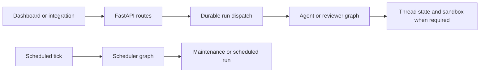

# Open SWE change map

Open SWE is a LangGraph and Deep Agents coding-agent framework. This page is a routing aid, not a substitute for implementation research: **source code and focused tests are authoritative**. The generated wiki is optional just-in-time context—read the linked owner page when it helps, then follow the code and its closest tests.

## Start safely

1. Read `AGENTS.md`, the public entrypoint below, its callers, and representative tests before changing code.
2. Keep the diff focused and preserve the async-only convention. A sync method is permitted only when an interface requires it, in which case it should raise `NotImplementedError`.
3. Run **only tests related to the change**; do not run the full suite locally. Preserve complete failure output.

Python dependencies use `uv`; the dashboard and desktop workspace use `pnpm`. Python 3.14 is required.

```bash
make install            # uv sync --extra dev
make dev                # LangGraph development server, including registered graphs and HTTP app
make run                # FastAPI only, on port 8000
make web                # dashboard development server
make desktop            # Electron desktop development
```

Use `make dev` when changing graph execution or an ingress-to-run path. `make run` serves `agent.webapp:app` but does not replace the LangGraph runtime. Configuration, credentials, sandbox selection, and startup checks belong in [Configuration and settings operations](operations/configuration.md); broader local and deployment procedures are in [Development, deployment, and runtime operations](operations/deployment.md).

## Public runtime entrypoints

`langgraph.json` is the registration boundary. It exposes five graph factories and the compatibility HTTP target `agent.webapp:app`. The modules in `agent/graphs/` are re-export shims; change the owning implementation rather than a shim unless the registration boundary itself is changing.

| Registered key | Target | Start here for |
|---|---|---|
| `agent` | `agent.graphs.agent:traced_agent` | Coding-agent assembly, tools, model selection, middleware, and mutable work. |
| `reviewer` | `agent.graphs.reviewer:traced_reviewer_agent` | Read-only PR review, findings, review publication, and review checkout setup. |
| `analyzer` | `agent.graphs.analyzer:traced_analyzer` | Repository-specific review-style analysis. |
| `chat` | `agent.graphs.chat:traced_chat_agent` | Dashboard “chat with this PR.” It has no sandbox and uses seeded `/pr/` virtual files plus read-only GitHub access. |
| `scheduler` | `agent.graphs.scheduler:get_scheduler` | Reconciliation, PR watch evaluation, background-task monitoring, cost refresh, and scheduled agent runs. |
| HTTP app | `agent.webapp:app` | Dashboard APIs, health, plan/workflow approval, and Slack, Linear, and GitHub webhook ingress. |



This is the high-level execution boundary: web-facing triggers dispatch durable graph runs, while scheduler invocations select maintenance work or launch a scheduled run.

The FastAPI composition pins the event loop, validates sandbox and local-development model configuration during lifespan startup, closes cached models during shutdown, and only enables credentialed CORS for explicit dashboard origins. For service topology and durable-state boundaries, see [Runtime architecture and service composition](architecture/overview.md).

## Route the change by responsibility

### Agent behavior, state, and safe extension

- **Main coding behavior, prompts, models, skills, tools, subagents, or graph construction** → [Coding agent assembly](architecture/agent-graph.md), [Agent middleware stack](architecture/middleware-stack.md), and [Tool capability model](concepts/tools.md).
- **Checkpoint, thread ID, metadata, run interruption, or persisted settings** → [Threads, run state, and durable records](concepts/threads-and-state.md).
- **Sandbox creation, reconnect/recovery, credentials injected into a sandbox, or a provider** → [Sandbox binding and recovery lifecycle](architecture/sandbox-lifecycle.md) and [Sandbox provider abstraction](integrations/sandbox-providers.md). Preserve the failure policy: a coding sandbox that is unreachable is not silently replaced because it may contain uncommitted work; reviewer checkout recovery can opt into replacement.
- **Model/profile/default precedence, reasoning effort, or instructions** → [Model, profile, and instruction resolution](concepts/models-profiles-instructions.md).
- **Authorization, webhook verification, GitHub token choice, user credentials, or local-project confinement** → [Authorization, credentials, and safety controls](concepts/auth-and-security.md).

### Product surfaces, inbound work, and delivery

- **Dashboard routes, web UI proxying, UI state, or Electron local-project behavior** → [Dashboard, web UI, and desktop clients](integrations/dashboard-ui.md).
- **Slack, Linear, GitHub, dashboard, desktop, or evaluation trigger through durable dispatch** → [Inbound invocation to durable run](workflows/invocation.md). `dispatch_agent_run` is the shared agent/reviewer dispatch contract; callers must not mix a prebuilt run input with content or source identities.
- **Replies, cancellation, interruption, or queued follow-up messages** → [Follow-up, interruption, and stop handling](workflows/follow-up-messages.md).
- **Prompt context, source events, repository instructions, skills, or untrusted-content handling** → [Run context engineering](workflows/context-engineering.md).
- **Commit/push/PR creation or workflow-file approval** → [Code delivery and pull-request creation](workflows/pr-creation.md).
- **Manual/automatic PR review, findings, re-review, or GitHub checks** → [Pull-request review lifecycle](workflows/pr-review.md) and [Review and review-style graphs](architecture/reviewer-and-analyzer.md).
- **Cron schedules, CI baby-sitting, stale-run reconciliation, or background monitoring** → [Scheduling, CI monitoring, and background work](workflows/scheduling-and-baby-sit.md).
- **Observability, MCP catalogs, browser tools, gateway models, or connected services** → [Observability, MCP, browser, and connected tools](integrations/observability-and-mcp.md).

## Validate the focused boundary

Choose the closest existing test first. Shared pytest fixtures provide an in-memory Store through production serialization, reset the global TTL cache around tests, and enable auto-review by default; override the latter when testing its opt-in gate.

```bash
make test TEST_FILE=tests/path/to_test.py
uv run pytest -vvv tests/path/to_test.py::test_name
make lint
make format
make typecheck
```

`make lint` runs Ruff checks and a formatting diff; `make format` applies Ruff formatting and fixable checks; `make typecheck` runs `ty check agent tests`. Ruff has a 100-character line length and pytest uses `asyncio_mode = "auto"`. Use [Testing and focused validation](testing/overview.md) to select graph, sandbox, dashboard, or workflow suites rather than broadening validation by default.

For an end-to-end boundary, the Playwright harness uses the real agent code, local sandbox, local git remote, dashboard, and Electron paths while faking the LLM and external SaaS HTTP services. Install Chromium once, then prefer a single relevant spec during iteration:

```bash
pnpm install --frozen-lockfile
pnpm run test:e2e:install
pnpm exec playwright test tests/full_flow.spec.ts
pnpm run test:e2e:desktop
```

The browser suite is serial with one worker; the separate desktop configuration selects the Electron spec. See [Testing and focused validation](testing/overview.md) for harness setup, artifacts, and narrower test choices.
