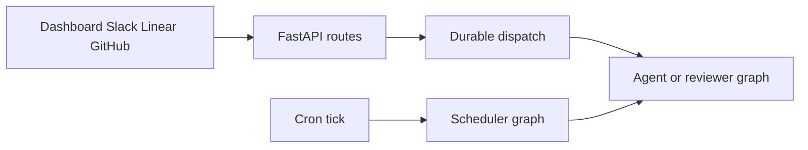

# Open SWE Engineering Guide

Open SWE is an asynchronous software factory. It accepts coding work from the dashboard, GitHub, Slack, Linear, or schedules; a coding thread has an isolated sandbox, while separate graphs handle pull-request review, review-style analysis, review scouting, PR chat, and scheduled work. This is a routing guide: **source and tests are authoritative**. Read the owner and its focused tests before changing behavior; use the linked pages for just-in-time system context.

## Pick the workspace before starting

| Planned change | Primary workspace and local loop | Read next |
| --- | --- | --- |
| Agent assembly, prompts, tools, middleware, sandbox lifecycle, model selection, thread state, webhook/dispatch behavior, reviewer/analyzer/scout/scheduler graphs, or FastAPI | Python with `uv`; use `make dev` when the LangGraph runtime is needed | [Runtime Architecture](architecture/overview.md), [Coding Agent Assembly](architecture/agent-graph.md), [Threads, Invocations, and Durable State](concepts/threads-and-state.md), or [Inbound Invocation and Durable Dispatch](workflows/invocation.md) |
| Dashboard React/UI, browser API client, UI build/proxy, or desktop Electron client | Root pnpm/turbo workspace (`ui/`, `desktop/`, and `tests/e2e/`); use `make dev-ui` for dashboard work and start `make dev` separately for desktop work | [Dashboard, Web UI, and Desktop](integrations/dashboard-ui.md) |
| Playwright browser or Electron end-to-end contract | `tests/e2e/` pnpm workspace; run one relevant Playwright spec against the harness | [Testing Strategy and Harnesses](testing/overview.md) |
| Environment settings, workspace/repository ownership, models, sandbox providers, credentials, startup, database, deployment, or local webhook exposure | Python runtime plus deployment configuration | [Configuration and Workspace Administration](operations/configuration.md), [Development, Packaging, and Deployment](operations/deployment.md), [Sandbox Provider Integrations](integrations/sandbox-providers.md), or [Authentication, Authorization, and Credential Scope](concepts/auth-and-security.md) |
| Delivery, review, follow-up, schedule, background work, or CI watch behavior | Begin at the workflow named by the user-visible behavior, then follow it to its graph/route and tests | [Pull Request Delivery and Approval](workflows/pr-creation.md), [Pull Request Review Lifecycle](workflows/pr-review.md), [Follow-ups, Interrupts, and Completion](workflows/follow-up-messages.md), or [Scheduling, Background Work, and CI Watching](workflows/scheduling-and-baby-sit.md) |

Do not treat the JavaScript workspace as a replacement for the Python runtime: `ui`, `desktop`, and `tests/e2e` are the pnpm/turbo workspace, while the graphs, agent, FastAPI app, and ordinary pytest tests are Python. Conversely, UI and Electron behavior should be validated through their pnpm package/scripts rather than by a backend-only pytest test.

## Establish the local loop

Python requires 3.14 or newer and uses `uv`; the dashboard and desktop require Node 22.22.2 or newer and `pnpm`. For a full local setup, including `.env`, GitHub/Slack apps, PostgreSQL, tunnel safety, and worktree state, follow [`docs/DEVELOPMENT.md`](../docs/DEVELOPMENT.md).

```bash
make install            # uv sync --extra dev
make build-dashboard    # pnpm install + dashboard build
make dev                # LangGraph graphs + FastAPI + built dashboard on :2024
make dev-ui             # Vite on :3000, backend on :2024, one browser origin
make run                # FastAPI only on :8000
make desktop            # Electron; start the backend separately
```

`make dev` starts local PostgreSQL unless `POSTGRES_URI` is already set, then serves the LangGraph runtime and the FastAPI application on port 2024. `make run` deliberately omits the LangGraph runtime, so it is unsuitable for changes that create runs. `make dev-ui` runs Vite and that backend together; open `http://localhost:2024`, where the backend fronts the Vite UI. For webhook development, `make tunnel NGROK_DOMAIN=<name>.ngrok-free.dev` publishes only `/webhooks/*`; do not expose the unauthenticated LangGraph development API.

Python changes are async-first: implement the async path. If an interface requires a synchronous method, leave it raising `NotImplementedError` rather than maintaining two implementations. Keep strong Python and TypeScript types, put model-facing prompts in `agent/resources/prompts/`, and create schema migrations with `make migration m="Short description"`.

## Runtime entrypoints and ownership

`langgraph.json` is the deployment registry: it selects Python 3.14, registers six graphs, and mounts `agent.webapp:app`. The registered `agent/graphs/` modules are re-export boundaries, not the normal place to implement a feature. Change the owning module unless the public graph target itself changes.

| Registered graph or app | Owner | Route changes here |
| --- | --- | --- |
| `agent` — `agent.graphs.agent:traced_agent` | `agent/server.py` | Coding-agent factory, tools, middleware, context, model, and sandbox preparation. See [Coding Agent Assembly](architecture/agent-graph.md) and [Agent Middleware Stack](architecture/middleware-stack.md). |
| `reviewer` — `agent.graphs.reviewer:traced_reviewer_agent` | `agent/reviewer.py` | Read-only diff review, findings, publication, and reviewer checkout behavior. See [Review, Style Analysis, and Review Scout Graphs](architecture/reviewer-and-analyzer.md). |
| `analyzer` — `agent.graphs.analyzer:traced_analyzer` | `agent/analyzer.py` | Repository review-style learning. |
| `review-scout` — `agent.graphs.review_scout:traced_review_scout` | `agent/review_scout/graph.py` | Review-scout discovery and targets. |
| `chat` — `agent.graphs.chat:traced_chat_agent` | `agent/chat.py` | Dashboard PR chat, virtual PR files, and read-only repository access. |
| `scheduler` — `agent.graphs.scheduler:get_scheduler` | `agent/scheduler.py` | Cron routing, scheduled agents, reconciliation, watches, refreshes, background tasks, and usage/feedback jobs. |
| `agent.webapp:app` | `agent/api/app.py` | FastAPI lifespan, dashboard/static UI, dashboard/plan/approval APIs, health, sandbox-tool API, and Slack/Linear/GitHub webhook routes. |



This shows the high-level routing boundary: interactive ingress uses the shared durable-dispatch contract, while a cron invocation enters the scheduler graph, which either performs its selected maintenance task or launches scheduled agent work.

The main agent is stateless and is rebuilt by its factory; per-thread continuity belongs in the sandbox and thread metadata. Preserve sandbox safety: a main-agent sandbox that is unreachable is not silently replaced because it may hold uncommitted work, whereas reviewer work can recreate its checkout. The reviewer exposes findings tools but no commit, push, or PR-opening tools. PR chat has no sandbox, seeds `/pr/` virtual files, and excludes shell and file-mutation tools.

For a trigger or durable-run change, start at [Inbound Invocation and Durable Dispatch](workflows/invocation.md). Slack, Linear, GitHub, and dashboard paths converge on `dispatch_agent_run`, which defaults to interruption when work conflicts. Callers must supply either a fully built run input or content/context/source identities—not both. For request lifecycle, startup, or browser-origin changes, start at [Runtime Architecture](architecture/overview.md): startup pins one event loop, validates login/sandbox/local-model setup, migrates the configured database, and shuts down workers, database, and cached models. Credentialed CORS is installed only for explicit dashboard origins and rejects `*`.

The deployed checkpointer uses delete-based TTL cleanup: it sweeps every 60 minutes and defaults to 43,200 minutes of retention. Treat that as operational state policy, not a graph-local setting.

## Route by behavior, not by file name

- **Instructions, context, profiles, tools, or models:** [Context Assembly and Prompt Engineering](workflows/context-engineering.md), [Model, Profile, and Instruction Resolution](concepts/models-profiles-instructions.md), and [Tool Surfaces and Capability Gating](concepts/tools.md).
- **Thread identity, checkpoints, durable state, or ownership:** [Threads, Invocations, and Durable State](concepts/threads-and-state.md) and [Thread Sandbox Lifecycle](architecture/sandbox-lifecycle.md).
- **A new/changed dashboard endpoint or privileged integration:** put the router in the feature-owning package rather than the dashboard router aggregator; then consult [Dashboard, Web UI, and Desktop](integrations/dashboard-ui.md), [Authentication, Authorization, and Credential Scope](concepts/auth-and-security.md), and [MCP, Connected Tools, and Observability](integrations/observability-and-mcp.md).
- **Sandbox selection, provider startup, snapshot, or proxy behavior:** [Sandbox Provider Integrations](integrations/sandbox-providers.md) and [Thread Sandbox Lifecycle](architecture/sandbox-lifecycle.md).
- **PR delivery, plan/workflow approval, review findings, or CI follow-up:** [Pull Request Delivery and Approval](workflows/pr-creation.md), [Pull Request Review Lifecycle](workflows/pr-review.md), and [Follow-ups, Interrupts, and Completion](workflows/follow-up-messages.md).
- **Recurring tasks, reconciliation, baby-sit, workspace refresh, or costs:** [Scheduling, Background Work, and CI Watching](workflows/scheduling-and-baby-sit.md).

## Validate the changed boundary

Never run the full suite locally. Select the smallest source-owning test or test node that proves observable behavior, then add the narrow quality check appropriate to the changed language. Do not add mechanical tests for constants, mappings, prompt text, or incidental call order.

```bash
make test TEST_FILE=tests/github/test_open_pull_request.py
uv run pytest -vvv tests/agent/test_dispatch.py::test_name
make lint
make format-check
make typecheck
```

`make test` accepts an existing path; direct `pytest` accepts a node id. Pytest uses asyncio auto mode. Shared fixtures offer an in-memory LangGraph Store that still round-trips through production serialization, reset the process-global TTL cache around each case, avoid a locally built dashboard by default, and enable automatic review unless a test overrides the gate. Use the family owning the change—such as `tests/agent/`, `tests/middleware/`, `tests/reviewer/`, `tests/sandbox/`, `tests/dashboard/`, `tests/github/`, `tests/slack/`, `tests/webhooks/`, or `tests/tools/`—rather than a broad test directory.

For `ui/` or `desktop/` changes, use the relevant package script (root scripts run turbo across the pnpm workspace; `pnpm --filter open-swe-dashboard run <script>` scopes dashboard work). Escalate to one E2E spec only when a real cross-boundary contract needs proof:

```bash
pnpm install --frozen-lockfile
pnpm run test:e2e:install
pnpm exec playwright test tests/full_flow.spec.ts
```

The Playwright harness runs the real LangGraph agent, local temporary sandbox, local git remote, dashboard, and Electron path; it fakes only the model and external SaaS HTTP boundaries. Browser tests are serial with one worker, and the desktop command selects only the Electron spec. Prefer a warm, focused spec over the browser suite; see [Testing Strategy and Harnesses](testing/overview.md) for ownership, fake boundaries, artifacts, and commands.
