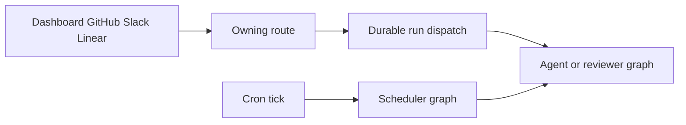

# Open SWE Change Guide

Open SWE is an asynchronous coding agent and software factory. Coding work is isolated per thread; separate read-only reviewer, review-style analyzer, and review-scout graphs support the delivery and review loop. Use this page to identify the boundary a change crosses, then read the linked owner page and its source/tests. The wiki is just-in-time context; repository code and tests remain authoritative.

## Choose the runtime before changing it

Open SWE has two developer surfaces. Do not use frontend commands to validate a Python change, or vice versa.

| Surface | Setup and local loop | Use it for |
| --- | --- | --- |
| **Python backend** | Python 3.14 with `uv`; `make install`, then `make dev` for LangGraph plus the HTTP app, or `make run` for FastAPI-only serving. `make dev` starts local PostgreSQL unless `POSTGRES_URI` is configured. | Graph factories, API routes, webhooks, dispatch, sandboxes, models, middleware, persistence, and backend tests. |
| **pnpm workspace** | `ui`, `desktop`, and `tests/e2e` are a pnpm/Turbo workspace. Use `pnpm install --frozen-lockfile`; `make web` starts dashboard development and `make desktop` starts Electron. `make dev-ui` runs Vite and the backend together, with the backend fronting Vite. | Dashboard/desktop implementation, workspace checks, and browser/Electron tests. |

```bash
make install
make dev
make run
make dev-ui
make web
make desktop
```

Use `make dev` for a graph or durable-run change: it serves every graph registered by `langgraph.json` and the FastAPI app on port 2024. `make run` exposes only `agent.webapp:app` through Uvicorn on port 8000. For public local webhook testing, `make tunnel NGROK_DOMAIN=<name>.ngrok-free.dev` exposes only `/webhooks/*`; the development server itself has no authentication.

## Entry points and ownership map

`langgraph.json` is the public deployment registration point. Its six graph targets are deliberately thin `agent/graphs/` re-exports: normally change the owning implementation, not the shim. The same configuration registers `agent.webapp:app`, uses Python 3.14, and retains checkpointer data with delete-based cleanup (60-minute sweeps and a 43,200-minute default TTL).

| If the change affects… | Public entrypoint and implementation owner | Read next |
| --- | --- | --- |
| Coding-agent assembly, prompts, tools, model/profile choice, or middleware | `agent.graphs.agent:traced_agent` → `agent/server.py` | [Coding Agent Assembly](architecture/agent-graph.md), [Middleware and Run Guardrails](architecture/middleware-stack.md), [Tools](concepts/tools.md), [Models, Profiles, and Instruction Resolution](concepts/models-profiles-instructions.md) |
| A pull-request review, review-style learning, review scout, or PR chat | `reviewer` → `agent/reviewer.py`; `analyzer` → `agent/analyzer.py`; `review-scout` → `agent/review_scout/graph.py`; `chat` → `agent/chat.py` | [Review, Style Analysis, and Review Scout Graphs](architecture/reviewer-and-analyzer.md), [Pull Request Review Workflow](workflows/pr-review.md) |
| A browser API, dashboard feature, webhook, startup behavior, or static UI mount | `agent.webapp:app` → `agent/api/app.py` | [Dashboard, Web UI, and Desktop Integration](integrations/dashboard-ui.md), [Authorization, Credentials, and Security Boundaries](concepts/auth-and-security.md), [Development, Deployment, and Startup Operations](operations/deployment.md) |
| Dashboard, GitHub, Slack, Linear, or desktop initiation and durable continuation | The source route plus `agent.dispatch.dispatch_agent_run` | [Invocation from Product and Webhook Surfaces](workflows/invocation.md), [Threads, Runs, and Durable State](concepts/threads-and-state.md), [Follow-ups, Interruption, and Completion](workflows/follow-up-messages.md) |
| Recurring work, CI watch, stale-run reconciliation, sandbox background work, workspace refresh, or cost/feedback jobs | `agent.graphs.scheduler:get_scheduler` → `agent/scheduler.py` | [Schedules, Background Tasks, and CI Watching](workflows/scheduling-and-baby-sit.md) |
| Sandbox selection, reconnect/replacement policy, credentials, or a provider | Sandbox lifecycle/provider boundary | [Thread Sandbox Lifecycle](architecture/sandbox-lifecycle.md), [Sandbox Provider Integration](integrations/sandbox-providers.md), [Configuration and Workspace Administration](operations/configuration.md) |
| PR creation, commits/pushes, workflow-file approval, or CI handoff | Coding agent delivery tools and middleware | [Code Delivery and Pull Request Creation](workflows/pr-creation.md) |
| MCP, connected services, browser/observability integrations, or credential eligibility | Tool loader and integration boundary | [MCP, Connected Services, and Observability](integrations/observability-and-mcp.md), [Authorization, Credentials, and Security Boundaries](concepts/auth-and-security.md) |



This routing shows the common interactive path and the scheduler path; analyzer, review-scout, and chat are registered graph surfaces with their own callers rather than replacements for the coding-agent dispatch contract.

## Preserve the boundaries that make a change safe

- The coding-agent graph is stateless and rebuilt for execution. Per-thread continuity belongs in LangGraph state/metadata and the sandbox. A deleted sandbox can be recreated, but a merely unreachable coding sandbox is not silently replaced because it may contain uncommitted work; reviewer and review-scout flows can opt into replacement because their checkouts are recreated.
- `dispatch_agent_run` is the shared dashboard, GitHub, Slack, and Linear contract for durable `agent` or `reviewer` runs. Its default multitask strategy interrupts existing work, and a caller must supply either a prebuilt input or content/context/source identities—not both.
- The reviewer has finding and publishing tools but no commit, push, or PR-opening tools. PR chat is sandbox-less: it reads seeded `/pr/` virtual files and makes repository reads with a repo-scoped GitHub App token rather than a user credential.
- Keep API ownership local. `agent/dashboard/routes.py` aggregates feature routers below `/dashboard/api`; put a new endpoint in the feature package that owns it rather than in that aggregator.
- Application lifespan pins one event loop, validates login, sandbox, local-model, and database configuration, runs migrations, then starts optional analytics/transcript/bridge listeners. Workspace-import failure leaves repository routing fail-closed; the optional listener and analytics failures are logged so serving can continue. Credentialed CORS requires explicit dashboard origins and rejects `*`.
- Follow repository conventions: async-only implementations; a sync method required by an interface raises `NotImplementedError`. Use strong types, owner-scoped tests, and model-facing Markdown prompts under `agent/resources/prompts/` rather than inline Python prompts.

## Focused validation by changed boundary

Never run the full suite locally. Select the narrowest observable-behavior test first, then add a proportional check.

### Python backend

```bash
make test TEST_FILE=tests/github/test_open_pull_request.py
uv run pytest -vvv tests/path/to_test.py::test_name
make lint
make format-check
make typecheck
```

`make test` accepts an existing file or directory; use direct `pytest` for a node ID. Pytest runs async tests in auto mode. Shared fixtures provide an in-memory LangGraph Store through the production serialization path, reset TTL and sandbox process globals around every case, hide any local dashboard bundle, and enable automatic review by default. Override those defaults deliberately when testing a gate. Start from the owner family—such as `tests/agent/`, `tests/reviewer/`, `tests/sandbox/`, `tests/webhooks/`, `tests/dashboard/`, `tests/github/`, `tests/slack/`, `tests/middleware/`, or `tests/tools/`—rather than broadening the run.

### pnpm workspace

For dashboard or Electron changes, use the affected package's focused test/check script through pnpm; root workspace commands are `pnpm run check`, `pnpm run typecheck`, `pnpm run test`, `pnpm run lint`, and `pnpm run format:check`. Use `make dev-ui` when the behavior depends on the backend proxy and dashboard hot reload, and keep a desktop change on the Electron path started by `make desktop`.

### Cross-boundary browser or desktop contract

Escalate to one Playwright spec only when the contract crosses real product boundaries—for example, webhook ingress through graph execution into the dashboard or Electron. The harness runs real agent code, local sandbox, local git, dashboard, and Electron paths, while faking the LLM and external SaaS HTTP APIs.

```bash
pnpm install --frozen-lockfile
pnpm run test:e2e:install
pnpm exec playwright test tests/full_flow.spec.ts
```

Browser tests run serially with one worker; `pnpm run test:e2e:desktop` selects the Electron-only configuration. See [Testing Strategy and Focused Validation](testing/overview.md) for the test seams, database requirements, fakes, and artifacts.

## Finish the change plan

Before implementation, name the owner boundary, the public entrypoint (if any), the state or authorization invariant, and one focused test that would fail before the change. For configuration, deployment, or migration changes, also read [Configuration and Workspace Administration](operations/configuration.md) and [Development, Deployment, and Startup Operations](operations/deployment.md). For an inbound feature, trace [Invocation from Product and Webhook Surfaces](workflows/invocation.md) through [Context Construction](workflows/context-engineering.md), delivery or review workflow, and completion handling rather than modifying only the first route.
