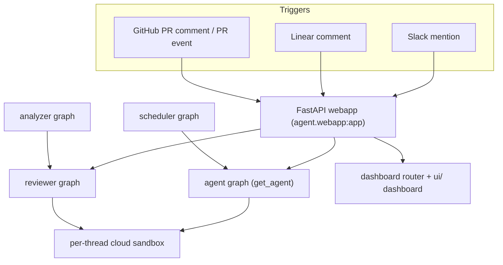

# Open SWE Quickstart & Wiki Map

This is the navigational hub for the Open SWE wiki. It orients you to what the
system is, how to run it locally, and which section to open for a given task.
Deep content lives in the linked pages; treat source code and tests as
authoritative over any prose here.

## What Open SWE is

Open SWE is an open-source framework for building an org's internal coding
agent. It is **composed on** the Deep Agents framework
(`deepagents.create_deep_agent`) and runs as a **LangGraph app**: each thread
spawns its own isolated cloud sandbox, and the agent is invoked from Slack,
Linear, or GitHub (PR comments, plus auto-review on `opened` /
`ready_for_review`).

The runtime is served by `langgraph dev` from `langgraph.json`, which declares
**five graph entrypoints plus a FastAPI app**, all served together:

| Graph | `langgraph.json` entrypoint | Underlying factory | Purpose |
|---|---|---|---|
| `agent` | `agent.graphs.agent:traced_agent` | `agent.server:get_agent` | Main coding agent (Slack/Linear/GitHub-triggered). |
| `reviewer` | `agent.graphs.reviewer:traced_reviewer_agent` | `agent.reviewer:get_reviewer_agent` | Read-only PR reviewer; findings model + `publish_review`. |
| `analyzer` | `agent.graphs.analyzer:traced_analyzer` | `agent.analyzer:get_analyzer` | Learns per-repo review style from historical PRs. |
| `chat` | `agent.graphs.chat:traced_chat_agent` | `agent.chat:get_chat_agent` | Dashboard Agents chat graph. |
| `scheduler` | `agent.graphs.scheduler:get_scheduler` | `agent.scheduler:get_scheduler` | Deterministic cron fan-out, reconciliation, `/baby-sit` CI checks. |

The FastAPI app is `agent.webapp:app` (a compatibility shim re-exporting
`agent.api.app:app`). At startup it mounts the dashboard router and the plan,
workflow-approval, Linear, Slack, health, and GitHub webhook routers.

The agent itself is **stateless** — all per-thread state lives in the sandbox
plus thread metadata — and is rebuilt per thread by the graph factory.



Inbound triggers land on the FastAPI webapp, which dispatches LangGraph runs; every agent/reviewer thread owns an isolated sandbox.

## Developer loop

Python dependencies are managed with **uv**; the JS dashboard/desktop use
**pnpm**. `langgraph dev` serves all graphs and the FastAPI app together.

```bash
make install            # uv sync --extra dev (pytest, ruff, basedpyright, …)
make dev                # uv run langgraph dev — serves all graphs + FastAPI app
make run                # uvicorn agent.webapp:app --reload --port 8000 (FastAPI only)
make test               # uv run pytest -vvv tests/
make lint               # ruff check + ruff format --diff
make format             # ruff format + ruff check --fix
make typecheck          # basedpyright agent tests
make web                # pnpm run dev — the ui/ dashboard
```

Conventions that matter: `requires-python = ">=3.11"` while `langgraph.json`
pins the runtime to 3.12; ruff uses line-length 100; tests default to unit-only
under `tests/` with `asyncio_mode = "auto"`; the app is **async-only** (do not
add sync/async dual implementations).

## Task-routing map

Pick the section that matches what you are trying to do.

### Architecture
- [System Architecture Overview](architecture/overview.md) — the five graphs, the FastAPI webapp, dashboard router, sandbox layer, and web/desktop UI, and how they connect.
- [Agent Graph & get_agent Factory](architecture/agent-graph.md) — how a deep agent is assembled per-thread with resolved model, curated tools, backend, subagents, and middleware.
- [Middleware Stack](architecture/middleware-stack.md) — the ordered middleware chain around every model call for the agent and reviewer.
- [Sandbox Lifecycle & Providers](architecture/sandbox-lifecycle.md) — per-thread get-or-create-then-reconnect lifecycle, provider selection, the GitHub proxy, and failure handling.
- [Reviewer & Review-Style Analyzer Graphs](architecture/reviewer-and-analyzer.md) — read-only reviewer graph and the analyzer that learns per-repo review style.

### Concepts
- [Agent Tools (Curated Toolset)](concepts/tools.md) — what tools the agent/reviewer/analyzer expose and the agent/UI parity principle.
- [Models, Profiles, Team Defaults & Instructions](concepts/models-profiles-instructions.md) — model + reasoning-effort resolution precedence and layered instructions.
- [Threads, Thread IDs & Persistence](concepts/threads-and-state.md) — deterministic thread-id derivation, thread metadata/state, and Slack code-channel keying.
- [Authentication, Authorization & Security Boundaries](concepts/auth-and-security.md) — GitHub dual-mode auth, webhook signature verification, dashboard OAuth, and encryption at rest.

### Workflows
- [Invocation: Slack, Linear & GitHub Webhooks](workflows/invocation.md) — how an inbound mention/comment/event becomes a dispatched run.
- [PR Creation & GitHub Delivery](workflows/pr-creation.md) — commit, push, and draft-PR flow plus guards and CI feedback.
- [PR Review Workflow](workflows/pr-review.md) — auto-review and comment-triggered reviews from webhook to published findings.
- [Scheduling, Cron & Baby-Sit CI Monitoring](workflows/scheduling-and-baby-sit.md) — scheduler graph and the opt-in `/baby-sit` CI monitoring flow.
- [Context Engineering: AGENTS.md, Source Context & Skills](workflows/context-engineering.md) — how the agent gathers context and uses skills.
- [Mid-Run Follow-Up Messages](workflows/follow-up-messages.md) — how messages sent while the agent is working are queued and injected.

### Integrations
- [Dashboard API & Web/Desktop UI](integrations/dashboard-ui.md) — the dashboard router and the `ui/` React dashboard + `desktop/` Electron wrapper.
- [Observability & MCP Integrations](integrations/observability-and-mcp.md) — Datadog/LangSmith tools, Corridor/Notion MCP, Currents, and Stagehand browser.
- [Sandbox Provider Integrations](integrations/sandbox-providers.md) — pluggable sandbox providers and how to add a new one.

### Operations & Testing
- [Configuration & Environment Variables](operations/configuration.md) — environment variables across sandbox, models, auth, webhooks, and integrations.
- [Local Dev, Build & Deployment](operations/deployment.md) — running locally, building, and deploying the backend and dashboard.
- [Testing Guide](testing/overview.md) — test layout, conventions, and how to run unit and e2e tests.
