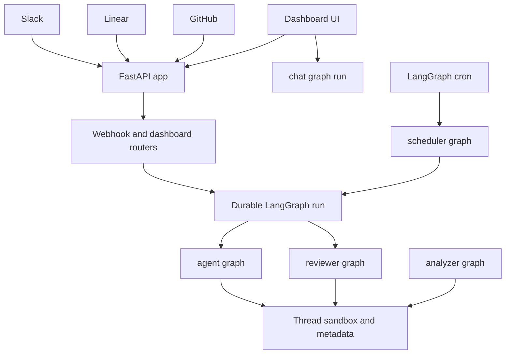

# Open SWE Quickstart & Wiki Map

Open SWE is an open-source framework for building an organization's internal coding agent. It composes the Deep Agents framework (`deepagents.create_deep_agent`) into a LangGraph application rather than forking an agent harness. This page is an entry point: use the links below for implementation detail, and treat code and tests as authoritative when this page and the repository disagree.

## Mental model

A LangGraph runtime hosts five named graphs and a custom FastAPI app. The normal coding agent is constructed for a thread/run rather than retained as an in-memory agent session; its thread-specific working environment is the sandbox and persisted thread metadata. Webhooks and the dashboard create durable LangGraph runs against a selected graph. A thread is therefore the continuity boundary for follow-up work, while a graph factory is the assembly boundary for a particular run.

| Runtime entrypoint | Registered target | Use it for |
|---|---|---|
| `agent` | `agent.graphs.agent:traced_agent` | Main coding work initiated from Slack, Linear, GitHub, schedules, or the dashboard. |
| `reviewer` | `agent.graphs.reviewer:traced_reviewer_agent` | Read-only PR review and findings publication. |
| `analyzer` | `agent.graphs.analyzer:traced_analyzer` | Per-repository review-style learning from historical feedback and finding outcomes. |
| `chat` | `agent.graphs.chat:traced_chat_agent` | Read-only, sandbox-less dashboard chat about one PR. |
| `scheduler` | `agent.graphs.scheduler:get_scheduler` | One-step handling of cron tasks: scheduled agent runs, reconciliation, background-task monitoring, baby-sit watches, or session-cost refresh. |
| HTTP app | `agent.webapp:app` | Dashboard API, plan and workflow-approval APIs, health, and GitHub, Linear, and Slack webhooks. |

The graph modules are deliberately thin re-export boundaries. For example, the `agent` graph re-exports `get_agent`/`traced_agent` from `agent.server`, and the scheduler re-exports its factory from `agent.scheduler`. Keep deployment registration in `langgraph.json` and implementation in the owning module when adding a graph.



This is the cross-system runtime flow: human surfaces enter the FastAPI composition layer; dispatch selects a durable graph run; coding, review, and analysis use their thread-scoped sandbox where applicable. The dashboard's PR chat takes a separate read-only graph path, and cron invokes the scheduler graph before it may create agent work.

### Important boundaries

- **Main agent:** `get_agent` resolves run settings and a sandbox/backend, then creates a fresh Deep Agent with the curated tools, optional integrations, subagents, prompt, and ordered middleware. Start with [Agent Graph & get_agent Factory](architecture/agent-graph.md) before changing its assembly or behavior.
- **Review and chat are not coding-agent aliases:** the reviewer prepares a PR/diff and has finding-oriented, non-mutating tools; PR chat has no sandbox and reads supplied PR virtual files plus read-only repository data. Review behavior belongs in [Reviewer & Review-Style Analyzer Graphs](architecture/reviewer-and-analyzer.md) or [PR Review Workflow](workflows/pr-review.md).
- **HTTP composition is intentionally central:** `agent.webapp:app` is a compatibility re-export of the FastAPI app built in `agent/api/app.py`. Its lifespan pins a single event loop, validates sandbox and local-development LLM configuration before serving, and closes cached models on shutdown. It mounts dashboard, plan, workflow-approval, Linear, Slack, health, and GitHub routers. If `DASHBOARD_ALLOWED_ORIGINS` is configured, CORS allows credentials only for those origins and rejects `*` rather than running an unsafe credentialed wildcard policy.
- **Inbound events are gated before work:** webhook routes verify their platform signatures and filter unsupported or ineligible events. Accepted webhook work runs in FastAPI background tasks and ultimately creates a durable run. GitHub automatic review is enabled only for opted-in repositories and supported PR actions; do not treat every PR event as a main-agent invocation. See [Invocation: Slack, Linear & GitHub Webhooks](workflows/invocation.md).
- **State and failure expectations:** an unreachable pre-existing main-agent sandbox is not silently replaced, protecting uncommitted work. The sandbox lifecycle, provider selection, and recovery rules are documented in [Sandbox Lifecycle & Providers](architecture/sandbox-lifecycle.md). Thread identity, persistence, and continuation semantics are in [Threads, Thread IDs & Persistence](concepts/threads-and-state.md).

## Local developer loop

### Install and start the right process

Python dependencies use **uv**. JavaScript workspace commands use **pnpm**. `make dev` is the normal backend development entrypoint because it runs `langgraph dev` on port 2024 and loads every graph plus the FastAPI app specified by `langgraph.json`. `make run` is useful for FastAPI-only route work, but it does **not** start the LangGraph runtime needed to execute graphs.

```bash
make install            # uv sync --extra dev
make dev                # uv run langgraph dev --no-browser --port 2024
make run                # uv run uvicorn agent.webapp:app --reload --port 8000
make web                # pnpm run dev
make desktop            # pnpm run dev:desktop
```

Use the web dashboard only after a backend is running. For end-to-end webhook development, follow the setup, credentials, and tunnel sequence in [`docs/INSTALLATION.md`](../docs/INSTALLATION.md); the local backend listens on port 2024, which is also the documented tunnel target. Deployment and image details belong in [Local Dev, Build & Deployment](operations/deployment.md), and individual settings belong in [Configuration & Environment Variables](operations/configuration.md).

The repository declares Python `>=3.11`, while `langgraph.json` selects Python 3.12 for the served runtime. Ruff targets `py311` with line length 100; pytest collects `tests/` with `asyncio_mode = "auto"`; basedpyright checks `agent` and `tests`. Follow the repository's async-only convention: do not add a separate functioning synchronous implementation beside an async path.

### Validate before handing off

```bash
make test                                      # uv run pytest -vvv tests/
make test TEST_FILE=tests/dashboard/test_dashboard_thread_api.py
uv run pytest -vvv tests/path/to_test.py::test_name
make lint                                      # ruff check and formatting diff
make format                                    # apply ruff formatting and fixes
make typecheck                                 # basedpyright agent tests
```

`make test` accepts `TEST_FILE` and safely skips a missing path; `make integration_tests` similarly runs `tests/integration_tests/` only when it exists. Choose the narrowest test that proves the changed boundary, then run lint and type checks appropriate to the change. The Python suite is not the whole test system: UI unit tests, desktop tests, and real-runtime Playwright coverage have distinct owners and commands. Use [Testing Guide](testing/overview.md) to select the layer and focused directory.

## Task-routing map

Use this map to avoid tracing from the wrong entrypoint.

### Architecture and core behavior

- [System Architecture Overview](architecture/overview.md) — components and top-level request paths.
- [Agent Graph & get_agent Factory](architecture/agent-graph.md) — execution gate, model/backend resolution, tools, subagents, and middleware assembly.
- [Middleware Stack](architecture/middleware-stack.md) — ordering, retry/timeout behavior, queued follow-ups, and tool/error boundaries.
- [Sandbox Lifecycle & Providers](architecture/sandbox-lifecycle.md) — get/reconnect/create rules, persistence, proxy credentials, and provider extension.
- [Reviewer & Review-Style Analyzer Graphs](architecture/reviewer-and-analyzer.md) — review preparation, findings, style learning, and review-specific lifecycle.
- [Agent Tools (Curated Toolset)](concepts/tools.md) — static and dynamic tool surfaces, Deep Agents built-ins, plan-mode restrictions, and authorization boundaries.
- [Models, Profiles, Team Defaults & Instructions](concepts/models-profiles-instructions.md) — settings precedence and prompt/input ownership.
- [Authentication, Authorization & Security Boundaries](concepts/auth-and-security.md) — token modes, webhook verification, and access controls.

### Invocations and user-facing integrations

- [Invocation: Slack, Linear & GitHub Webhooks](workflows/invocation.md) — platform validation, deterministic thread selection, input construction, and dispatch.
- [PR Creation & GitHub Delivery](workflows/pr-creation.md) — commit/push/PR output and guards.
- [PR Review Workflow](workflows/pr-review.md) — auto-review, findings, publication, and reconciliation.
- [Scheduling, Cron & Baby-Sit CI Monitoring](workflows/scheduling-and-baby-sit.md) — scheduler tasks and CI watch behavior.
- [Mid-Run Follow-Up Messages](workflows/follow-up-messages.md) — queueing and injecting a later Slack or Linear message.
- [Context Engineering: AGENTS.md, Source Context & Skills](workflows/context-engineering.md) — repository instructions, supplied context, and skills.
- [Dashboard API & Web/Desktop UI](integrations/dashboard-ui.md) — dashboard router, OAuth, Agents API, React UI, and Electron wrapper.
- [Observability & MCP Integrations](integrations/observability-and-mcp.md) — server-side optional integrations and their security boundaries.

### Operate and test safely

- [Configuration & Environment Variables](operations/configuration.md) — required service, sandbox, model, auth, webhook, and integration settings.
- [Local Dev, Build & Deployment](operations/deployment.md) — prerequisites, local setup, build, and deployment operations.
- [Testing Guide](testing/overview.md) — pytest subsystem map, shared fixtures, UI/desktop unit tests, and Playwright e2e harness.
