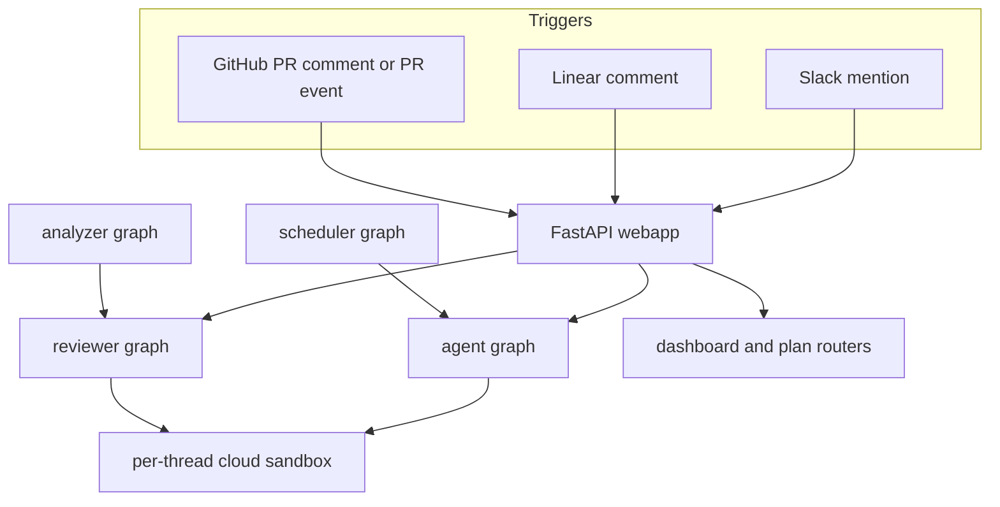

# Open SWE Quickstart & Wiki Map

Open SWE is an open-source framework for building an organization's internal coding
agent. It composes the Deep Agents framework (`deepagents.create_deep_agent`) into a
LangGraph application. The main agent works from an isolated sandbox per thread and is
invoked through Slack, Linear, or GitHub; GitHub can also opt repositories and authors
into PR auto-review on `opened` and `ready_for_review` events.

Use this page to choose an entrypoint and then follow the focused page for the system
boundary you intend to change. Source and tests remain authoritative.

## Start locally

Python dependencies use `uv`; the dashboard and desktop applications use `pnpm`.
Install the Python development extras, then select the narrowest process or check for
your change:

```bash
make install            # uv sync --extra dev (pytest, ruff, basedpyright, …)
make dev                # uv run langgraph dev — serves all graphs + FastAPI app
make run                # uvicorn agent.webapp:app --reload --port 8000 (FastAPI only)
make test               # uv run pytest -vvv tests/
make integration_tests  # runs tests/integration_tests/ when it exists
make lint               # ruff check + ruff format --diff
make format             # ruff format + ruff check --fix
make typecheck          # basedpyright agent tests
make web                # pnpm run dev — the ui/ dashboard
make desktop            # pnpm run dev:desktop — Electron wrapper
```

`make dev` is the integrated backend loop: `langgraph dev` reads `langgraph.json` and
serves its graphs together with the configured FastAPI app. Use `make run` only when
you need the HTTP app without the LangGraph runtime. The project accepts Python
`>=3.11`, while the served LangGraph runtime is pinned to Python 3.12. Ruff uses a
100-character line length, pytest enables `asyncio_mode = "auto"`, and production code
is async-only: implement the async path rather than maintaining sync/async duplicates.

## Runtime entrypoints

`langgraph.json` names five graphs. Its graph imports are thin stable re-exports under
`agent/graphs/`; the owning modules build the actual graph factories.

| Graph | Served entrypoint | Owning factory | Use it when investigating |
|---|---|---|---|
| `agent` | `agent.graphs.agent:traced_agent` | `agent.server:get_agent` | Coding work triggered from a conversation or webhook. |
| `reviewer` | `agent.graphs.reviewer:traced_reviewer_agent` | `agent.reviewer:get_reviewer_agent` | Read-only PR findings and publishing. |
| `analyzer` | `agent.graphs.analyzer:traced_analyzer` | `agent.analyzer:get_analyzer` | Per-repository review-style learning. |
| `chat` | `agent.graphs.chat:traced_chat_agent` | `agent.chat:get_chat_agent` | Dashboard Agents chat. |
| `scheduler` | `agent.graphs.scheduler:get_scheduler` | `agent.scheduler:get_scheduler` | Cron fan-out, reconciliation, and CI monitoring. |

The configured HTTP app, `agent.webapp:app`, is a compatibility re-export of the app
assembled in `agent/api/app.py`. That app includes the dashboard, plan and
workflow-approval, Linear, Slack, health, and GitHub webhook routers. The main coding
agent factory is rebuilt for each thread; its durable task state is held by the
sandbox and thread metadata rather than the agent object.



Inbound collaboration surfaces converge on the HTTP application; agent and reviewer
work use thread-specific sandboxes, while the dashboard exposes human review surfaces.

## Plan before implementing

For work that needs a reviewed approach rather than immediate code changes, start with
[Plan Mode, Review & Approval](workflows/plan-mode-and-approval.md). Plan mode is
explicit: the agent enters it only at a user's express request. It researches the
target repository read-only, produces a self-contained HTML artifact under
`/workspace/plans/`, and publishes it with `save_plan`. Tool gating and prompt rules
keep implementation actions out of the planning phase.

The dashboard or a Slack approval action can approve the ready artifact. Approval
clears plan mode and re-dispatches the **same durable thread** with the reviewed plan
and feedback; a rejection instead keeps plan mode active for revision. Start there
before changing plan tools, plan persistence, dashboard review endpoints, or Slack
approval handling.

## Task-routing map

### Architecture and core concepts

- [System Architecture Overview](architecture/overview.md) — choose this first for the
  component map, request paths, graph boundaries, FastAPI composition, and UI.
- [Agent Graph & `get_agent` Factory](architecture/agent-graph.md) — agent assembly,
  model resolution, tools, subagents, and per-run setup.
- [Middleware Stack](architecture/middleware-stack.md) — ordered hooks around model and
  tool activity; use it before changing control flow or failure handling.
- [Sandbox Lifecycle & Providers](architecture/sandbox-lifecycle.md) — sandbox reuse,
  reconnection, safe failure behavior, and provider extension.
- [Reviewer & Review-Style Analyzer Graphs](architecture/reviewer-and-analyzer.md) —
  the read-only review graph and repository-specific style analysis.
- [Agent Tools (Curated Toolset)](concepts/tools.md) — tool exposure, authorization,
  and agent/UI parity.
- [Models, Profiles, Team Defaults & Instructions](concepts/models-profiles-instructions.md)
  — model and reasoning precedence plus layered instructions.
- [Threads, Thread IDs & Persistence](concepts/threads-and-state.md) — durable identity,
  metadata, and state ownership.
- [Authentication, Authorization & Security Boundaries](concepts/auth-and-security.md)
  — OAuth, GitHub tokens, signatures, and authorization boundaries.

### User and automation workflows

- [Invocation: Slack, Linear & GitHub Webhooks](workflows/invocation.md) — turn an
  inbound event into a dispatched durable run.
- [Plan Mode, Review & Approval](workflows/plan-mode-and-approval.md) — plan artifact,
  comments, rejection, approval, and same-thread implementation resumption.
- [PR Creation & GitHub Delivery](workflows/pr-creation.md) — commits, push, draft PRs,
  review requests, and delivery safeguards.
- [PR Review Workflow](workflows/pr-review.md) — automatic and comment-triggered PR
  review from webhook to published findings.
- [Scheduling, Cron & Baby-Sit CI Monitoring](workflows/scheduling-and-baby-sit.md) —
  scheduled runs and opt-in CI watch behavior.
- [Context Engineering: AGENTS.md, Source Context & Skills](workflows/context-engineering.md)
  — repository instructions, source context, and skills.
- [Mid-Run Follow-Up Messages](workflows/follow-up-messages.md) — queueing messages
  that arrive while an agent run is active.

### Integrations, operations, and verification

- [Dashboard API & Web/Desktop UI](integrations/dashboard-ui.md) — dashboard API,
  React UI, Electron wrapper, and their backend boundary.
- [Observability & MCP Integrations](integrations/observability-and-mcp.md) — hosted
  integrations, credential handling, and exposure controls.
- [Sandbox Provider Integrations](integrations/sandbox-providers.md) — provider
  contracts and adding a backend.
- [Configuration & Environment Variables](operations/configuration.md) — runtime,
  sandbox, model, auth, webhook, and integration configuration.
- [Local Dev, Build & Deployment](operations/deployment.md) — local services, builds,
  and deployment considerations.
- [Testing Guide](testing/overview.md) — pytest and Playwright layers, focused test
  placement, and commands.
