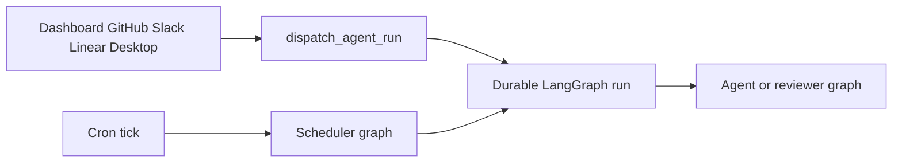

# Open SWE Codebase Guide

Open SWE is an asynchronous software factory built on LangGraph and Deep Agents. A coding thread has an isolated sandbox; separate reviewer and analyzer graphs handle pull-request review and review-style analysis. Work can enter through the dashboard, GitHub, Slack, Linear, desktop, or schedules.

This is a change-routing hub, not a substitute for implementation research. **Source code and tests are authoritative.** Generated OpenWiki pages are optional just-in-time context: begin with the source owner and its focused tests, then use the links below to orient a cross-cutting change.

## Set up the local loop

The backend requires Python 3.14 or later and uses `uv`; `ui`, `desktop`, and `tests/e2e` are a pnpm workspace. For a full local setup, credentials, PostgreSQL, and webhook configuration, follow [`docs/DEVELOPMENT.md`](../docs/DEVELOPMENT.md).

```bash
make install            # uv sync --extra dev
make build-dashboard    # build ui/.output/public when a bundled dashboard is needed
make dev                # LangGraph dev at :2024
make dev-ui             # Vite plus LangGraph dev; use :2024 for the browser
make run                # FastAPI-only uvicorn server at :8000
make web                # dashboard Vite server
make desktop            # Electron; start a backend separately
```

`make dev` starts local PostgreSQL when `POSTGRES_URI` is unset, then serves the five graph registrations, FastAPI app, and a built dashboard if one is available. Use it for any behavior that creates or resumes LangGraph runs. `make run` exposes only FastAPI, so it cannot create runs. `make dev-ui` runs Vite on `:3000` and has the backend front it on `:2024`, avoiding a browser cross-origin setup.

For GitHub or Slack development, use the static-domain tunnel rather than publishing the whole development port:

```bash
make tunnel NGROK_DOMAIN=<name>.ngrok-free.dev
```

The supplied ngrok policy exposes only `/webhooks/*`, which matters because `langgraph dev` has unauthenticated LangGraph runtime endpoints. Restart the backend after editing `.env`; code reload does not reload environment settings.

### Contributor rules that affect implementation

- Implement async paths. If an interface requires a synchronous method, make it raise `NotImplementedError`; do not maintain parallel sync and async implementations.
- Use strong Python and TypeScript types; do not use `Any` or `any` to silence a type problem.
- Put model-facing prompts and tool descriptions in `agent/resources/prompts/` and load them through `load_prompt` or `render_prompt`, rather than embedding them in Python.
- Add an API write control only when the appropriately authorized agent tool can perform the same write, unless a direct control is explicitly required. Do not swallow errors.

## Find the runtime owner

`langgraph.json` is the deployment registration point. It pins the Python served runtime, registers five graphs, mounts `agent.webapp:app`, and configures delete-based checkpoint expiration. The graph modules under `agent/graphs/` are intentionally thin re-export shims: edit the implementation module unless the public graph entrypoint itself changes.

| Entrypoint | Owner | Start here when changing… |
| --- | --- | --- |
| `agent.graphs.agent:traced_agent` | `agent/server.py` | Coding-agent assembly, sandbox preparation, tools, skills, prompts, models, or middleware. |
| `agent.graphs.reviewer:traced_reviewer_agent` | `agent/reviewer.py` | Read-only PR review, finding lifecycle, reviewer checkout, or review publication. |
| `agent.graphs.analyzer:traced_analyzer` | `agent/analyzer.py` | Repository review-style analysis and generated review guidance. |
| `agent.graphs.chat:traced_chat_agent` | `agent/chat.py` | Dashboard PR chat, virtual PR context, and read-only GitHub-backed repository access. |
| `agent.graphs.scheduler:get_scheduler` | `agent/scheduler.py` | Cron routing, stale-run repair, workspace refresh, watches, costs, or scheduled work. |
| `agent.webapp:app` | `agent/api/app.py` | FastAPI composition, dashboard routes and UI mounting, health/completion endpoints, CORS, or webhooks. |



The diagram shows the main creation boundary: interactive sources share durable dispatch, while cron invokes the scheduler, which either performs maintenance or launches scheduled agent work.

### Preserve these boundaries

- The coding graph is stateless. Its factory rebuilds it for execution; per-thread continuity is held in the sandbox and thread metadata, not a process-lifetime graph object.
- Do not silently replace an unreachable coding sandbox: it may contain uncommitted work. The reviewer can replace its sandbox because it recreates its checkout each review.
- The reviewer has review/finding tools but no commit, push, or PR-opening tools. PR chat has no sandbox; it reads seeded `/pr/` virtual files and GitHub data using a repository-scoped App token.
- Slack, Linear, GitHub, and dashboard callers use `dispatch_agent_run` for `agent` or `reviewer` runs. Its usual multitask behavior interrupts an active run. A caller must supply either a complete prebuilt input or content/context/source identities, never both.
- The scheduler has one launch node. It routes cron state to reconciliation, CI/watch evaluation, background-task monitoring, workspace refresh, feedback/cost jobs, or `launch_scheduled_agent_run`; missing identifiers become result statuses rather than an implicit run.

## HTTP startup and dashboard ownership

`agent.webapp:app` is a compatibility import of the composed FastAPI application. Before serving, its lifespan validates GitHub-login, sandbox, and local model configuration; requires and migrates the database; performs legacy Store imports; and starts reporting/analytics best-effort. Shutdown stops the worker, closes the database, and closes cached models. A failed workspace import leaves repository routing fail-closed rather than treating repositories as unowned.

The app installs credentialed CORS only when `DASHBOARD_ALLOWED_ORIGINS` is set and rejects `*`. `agent/dashboard/routes.py` aggregates dashboard APIs under `/dashboard/api`, including a same-origin dependency for mutations. Put a new endpoint in its owning feature package—not in that aggregate router—and compose it there.

For configuration prerequisites, environment behavior, database requirements, and persisted workspace settings, see [Runtime Configuration and Workspace Settings](operations/configuration.md). For deployment, packaging, and dashboard serving, see [Development, Packaging, and Deployment](operations/deployment.md).

## Route a change to its detailed guide

### Architecture and extension points

- [Runtime Architecture and Service Composition](architecture/overview.md) — service topology, API/UI composition, durable dispatch, and persistent boundaries.
- [Coding Agent Assembly](architecture/agent-graph.md) — `get_agent`, models, sandbox/backend selection, prompts, skills, subagents, and tools.
- [Agent Middleware, Limits, and Failure Semantics](architecture/middleware-stack.md) — ordering-sensitive timeouts, retries, queues, routing, and completion behavior.
- [Thread Sandbox Lifecycle](architecture/sandbox-lifecycle.md) and [Sandbox Provider Integration Contract](integrations/sandbox-providers.md) — thread binding, recovery, provider capabilities, and proxy behavior.
- [Pull Request Reviewer and Style Analyzer](architecture/reviewer-and-analyzer.md) — reviewer findings, review publication, re-review, and analyzer ownership.
- [Threads, Invocations, and Durable State](concepts/threads-and-state.md) — checkpoint, metadata, database, Store, and thread identity ownership.
- [Tool Capability and Authorization Model](concepts/tools.md) — tool assembly, dynamic integrations, gates, and tool failures.
- [Configuration Resolution for Models, Profiles, and Instructions](concepts/models-profiles-instructions.md) — model/profile precedence and model-visible instructions.

### Ingress, product, and delivery

- [Inbound Invocation and Durable Dispatch](workflows/invocation.md) — authorization and normalization from dashboard, desktop, Slack, GitHub, Linear, and schedules.
- [Follow-ups, Interrupts, and Completion](workflows/follow-up-messages.md) — continuation, interruption, queuing, and source-specific completion.
- [Code Delivery and Pull Request Creation](workflows/pr-creation.md) — commits, pushes, workflow approval, PR creation, and updates.
- [Pull Request Review and Re-review](workflows/pr-review.md) — manual and automatic review triggers, findings, GitHub checks, and watch-based review.
- [Scheduled Work, CI Monitoring, and Background Automation](workflows/scheduling-and-baby-sit.md) — recurring runs, reconciliation, watches, and background tasks.
- [Dashboard, Web UI, and Desktop Clients](integrations/dashboard-ui.md) — authenticated browser APIs, UI proxying, and Electron supervision.
- [Authentication, Authorization, and Security Boundaries](concepts/auth-and-security.md) — sessions, webhook verification, repository access, and credentials.
- [MCP, Connected Tools, and Observability Integrations](integrations/observability-and-mcp.md) — credential-scoped integrations and tracing/analytics.

## Validate only the changed boundary

**Focused validation is preferred; do not run the full test suite locally.** Start with the narrowest test that owns observable behavior, then run only the relevant quality check.

```bash
make test TEST_FILE=tests/github/test_open_pull_request.py
uv run pytest -vvv tests/path/to_test.py::test_name
make lint
make format-check
make typecheck
```

`make test` accepts an existing file or directory; direct `pytest` is better for one node id. Pytest uses asyncio auto mode. The shared fixtures route Store access through an in-memory implementation that retains the production serialization path, clear global state between cases, and enable auto-review by default; a test for those gates must override the fixture deliberately.

Choose a focused family by owner—for example `tests/agent/`, `tests/reviewer/`, `tests/sandbox/`, `tests/webhooks/`, `tests/dashboard/`, `tests/github/`, `tests/slack/`, `tests/middleware/`, or `tests/tools/`. For dashboard or desktop changes, run the scoped workspace check rather than the root workspace sweep.

Escalate to one Playwright spec only when the contract genuinely crosses the UI, webhook, agent, sandbox, or desktop boundary:

```bash
pnpm install --frozen-lockfile
pnpm run test:e2e:install
pnpm exec playwright test tests/full_flow.spec.ts
```

The E2E harness runs real agent code, local temporary sandbox and git, dashboard, and Electron paths while faking the LLM and external SaaS HTTP boundaries. Browser runs use one worker; the separate desktop configuration selects the Electron spec. See [Testing Strategy and Focused Test Suites](testing/overview.md) for test ownership, fakes, artifacts, and focused frontend commands.
