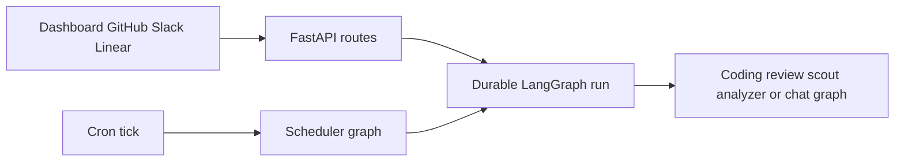

# Open SWE Change Guide

Open SWE is an asynchronous coding agent and software factory. Coding threads use isolated sandboxes; separate graphs provide read-only pull-request review, review scouting, and repository review-style analysis. Treat repository source and tests as authoritative. Use this page for just-in-time routing rather than reading the whole wiki before making a change.

## Start locally

The backend requires Python 3.14+ and uses `uv`; `ui`, `desktop`, and `tests/e2e` are a pnpm workspace. For the complete credential, database, dashboard, tunnel, and worktree-state procedure, start with [Development, Packaging, and Deployment](operations/deployment.md) and `docs/DEVELOPMENT.md`.

```bash
make install            # uv sync --extra dev
make dev                # langgraph dev on :2024
make dev-ui             # Vite plus backend on :2024
make run                # FastAPI-only uvicorn on :8000
make web                # dashboard Vite server
make desktop            # Electron wrapper; start the backend separately
```

Use `make dev` for any change that creates or executes LangGraph runs: it starts local PostgreSQL when `POSTGRES_URI` is absent, then serves the graphs and the FastAPI app. `make run` deliberately lacks the LangGraph runtime, so run creation does not work there. `make dev-ui` keeps the browser on `:2024` while the backend fronts Vite on `:3000`. For webhook work, `make tunnel NGROK_DOMAIN=<name>.ngrok-free.dev` exposes only `/webhooks/*`; do not publish the unauthenticated local LangGraph API through a broad tunnel.

### Repository rules that affect a change

- Implement async paths. If an interface mandates a synchronous method, make it raise `NotImplementedError` rather than maintaining a parallel sync implementation.
- Use strong Python and TypeScript types; do not use `Any` or `any` to suppress an error. Use absolute imports except for a same-package single-dot import.
- Put model-facing prompts in `agent/resources/prompts/` and load them with `prompt("<dir>/<name>")`; do not inline them in Python.
- Put a new dashboard endpoint in the feature package that owns it, not in the `agent/dashboard/routes.py` aggregator. Make user-initiated UI writes optimistic unless that would be unsafe or misleading.
- Preserve failures: an `except` must propagate or log what it swallows. Use structured logging with a static message and values in `extra`.

## Pick the execution boundary first

`langgraph.json` is the deployed registration point: it selects Python 3.14, registers six graphs, mounts `agent.webapp:app`, and configures delete-based checkpoint cleanup with a 60-minute sweep and a 43,200-minute default TTL. The graph modules under `agent/graphs/` are thin re-export boundaries; normally change the implementation they import, not the deployment shim.

| Entrypoint | Change owner | Route for the detailed design |
| --- | --- | --- |
| `agent.graphs.agent:traced_agent` | Main coding graph: assembly, middleware, prompts, tools, models, and coding sandbox preparation | [Coding Agent Assembly](architecture/agent-graph.md); [Agent Middleware and Failure Boundaries](architecture/middleware-stack.md) |
| `agent.graphs.reviewer:traced_reviewer_agent` | Read-only PR review and finding publication | [Review, Scout, and Style-Analysis Graphs](architecture/reviewer-and-analyzer.md); [Pull Request Review and Findings](workflows/pr-review.md) |
| `agent.graphs.review_scout:traced_review_scout` | Review scouting | [Review, Scout, and Style-Analysis Graphs](architecture/reviewer-and-analyzer.md) |
| `agent.graphs.analyzer:traced_analyzer` | Repository review-style analysis and learned guidance | [Review, Scout, and Style-Analysis Graphs](architecture/reviewer-and-analyzer.md) |
| `agent.graphs.chat:traced_chat_agent` | Dashboard PR chat and its read-only context | [Review, Scout, and Style-Analysis Graphs](architecture/reviewer-and-analyzer.md); [Dashboard, Web UI, and Desktop Integration](integrations/dashboard-ui.md) |
| `agent.graphs.scheduler:get_scheduler` | Schedules, watches, background supervision, and maintenance ticks | [Schedules, Watches, and Background Supervision](workflows/scheduling-and-baby-sit.md) |
| `agent.webapp:app` | FastAPI lifecycle, dashboard API/UI, webhooks, health, sandbox tool routes, and OpenAI-compatible sandbox routes | [Runtime and Product Architecture](architecture/overview.md); [Runtime Configuration and Workspace Settings](operations/configuration.md) |


```mermaid
flowchart LR
    Trigger["Dashboard GitHub Slack Linear"] --> API["FastAPI routes"]
    API --> DurableRun["Durable LangGraph run"]
    DurableRun --> Graph["Coding review scout analyzer or chat graph"]
    Cron["Cron tick"] --> Scheduler["Scheduler graph"]
    Scheduler --> DurableRun
```

This diagram shows the high-level boundary between external ingress, durable graph execution, and scheduler-launched work.

The FastAPI composition is also operationally significant. Before startup it pins the event loop; its lifespan validates GitHub-login, sandbox, model, and database configuration; runs migrations; starts best-effort analytics, transcript, and bridge listeners; and stops those resources and closes the database at shutdown. Credentialed CORS accepts configured origins plus `open-swe://app`, and rejects `*`.

## Task-routing map

Choose the smallest domain that owns the behavior. Follow links only when the change crosses that boundary.

| If the change concerns… | Start here | Then consult when needed |
| --- | --- | --- |
| Runtime topology, graph registration, FastAPI composition, or surface boundaries | [Runtime and Product Architecture](architecture/overview.md) | [Inbound Invocation to Durable Run](workflows/invocation.md) |
| Agent construction, models, profile resolution, prompts, skills, or engineering tools | [Coding Agent Assembly](architecture/agent-graph.md) | [Models, Profiles, and Instruction Resolution](concepts/models-profiles-instructions.md), [Tool Surfaces and Dynamic Availability](concepts/tools.md), [Context Assembly and Repository Guidance](workflows/context-engineering.md) |
| Middleware order, retries, fallbacks, safety guards, queues, or terminal errors | [Agent Middleware and Failure Boundaries](architecture/middleware-stack.md) | [Follow-Ups, Interruption, and Completion](workflows/follow-up-messages.md) |
| Sandbox creation, reconnection, a stale checkout, local bridge, or provider selection | [Per-Thread Sandbox Lifecycle](architecture/sandbox-lifecycle.md) | [Sandbox Providers and Local Bridges](integrations/sandbox-providers.md) |
| Thread IDs, durable runs, checkpoints, Store-backed data, or input attribution | [Threads, Durable Runs, and State](concepts/threads-and-state.md) | [Inbound Invocation to Durable Run](workflows/invocation.md) |
| Dashboard API, web UI, static serving, Vite proxying, or Electron supervision | [Dashboard, Web UI, and Desktop Integration](integrations/dashboard-ui.md) | [Development, Packaging, and Deployment](operations/deployment.md) |
| GitHub/Slack identity, webhook verification, tokens, credentials, or mutation safety | [Identity, Credentials, and Safety Boundaries](concepts/auth-and-security.md) | [Runtime Configuration and Workspace Settings](operations/configuration.md) |
| LangSmith, Datadog, browser tools, Notion, Corridor, Currents, or MCP | [Observability and MCP Tool Integrations](integrations/observability-and-mcp.md) | [Tool Surfaces and Dynamic Availability](concepts/tools.md) |
| PR branch/commit preparation, push approval, publication, or CI handoff | [Pull Request Creation and Approval](workflows/pr-creation.md) | [Schedules, Watches, and Background Supervision](workflows/scheduling-and-baby-sit.md) |
| Automatic/on-demand review, findings, replies, reruns, review scout, or style feedback | [Pull Request Review and Findings](workflows/pr-review.md) | [Review, Scout, and Style-Analysis Graphs](architecture/reviewer-and-analyzer.md) |
| A user schedule, baby-sit watch, background task, cost refresh, or feedback maintenance | [Schedules, Watches, and Background Supervision](workflows/scheduling-and-baby-sit.md) | [Threads, Durable Runs, and State](concepts/threads-and-state.md) |
| Environment variables, workspace settings, startup failures, or deployment defaults | [Runtime Configuration and Workspace Settings](operations/configuration.md) | [Development, Packaging, and Deployment](operations/deployment.md) |

## Focused validation only

**Never run the full suite locally.** Start with the smallest existing behavioral test that owns the changed boundary. Add a test only for a concrete regression that current coverage would miss; prefer extending an existing test over adding scaffolding or implementation-coupled mocks.

```bash
make test TEST_FILE=tests/github/test_open_pull_request.py
uv run pytest -vvv tests/path/to_test.py::test_name
make lint
make format-check
make typecheck
```

`make test` runs `pytest -vvv` only when `TEST_FILE` exists; direct `pytest` is appropriate for one node ID. Python tests run with asyncio auto mode. Shared fixtures route Store access through an in-memory implementation that retains the production serialization path, remove process-global TTL and LangGraph caches before and after cases, reset sandbox registries, hide a locally built dashboard, and treat automatic review as enabled unless a test overrides that gate. PostgreSQL-specific regressions skip unless `TEST_ANALYTICS_POSTGRES_URI` is set, so account for that when interpreting a focused run.

For frontend code, run the owning package's narrow `pnpm` check rather than the workspace-wide test command. Escalate to one Playwright spec only for a real browser/backend/Electron contract:

```bash
pnpm install --frozen-lockfile
pnpm run test:e2e:install
pnpm exec playwright test tests/full_flow.spec.ts
```

The E2E harness uses real agent code, the local sandbox provider, local git, the dashboard, and Electron paths while faking the model and external SaaS HTTP boundaries. Browser execution is intentionally serial with one worker; the desktop configuration selects only `desktop.spec.ts`. Reuse a warm local E2E server for a single-spec iteration. See [Focused Testing Strategy and Harnesses](testing/overview.md) for test-family selection, fakes, artifacts, and narrow dashboard/desktop commands.
