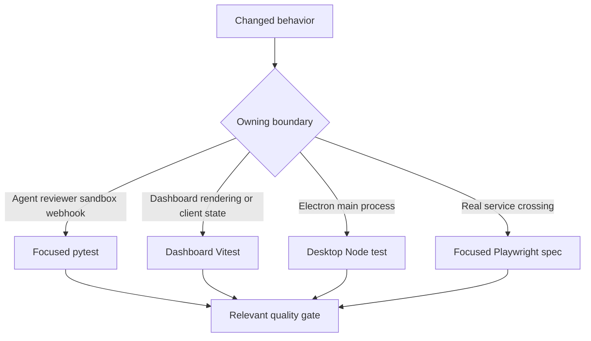
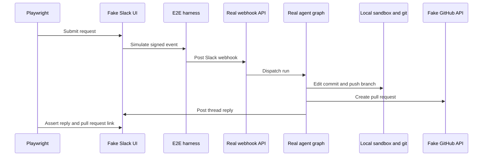

# Testing Strategy and Focused Validation

Validate at the lowest layer that owns the changed **observable contract**. Use focused pytest tests for agent assembly, reviewer, sandbox, webhook, API, and tool behavior; dashboard Vitest tests for React rendering and client state; and desktop Node tests for Electron main-process code. Escalate to Playwright only when the contract crosses the real webhook, authenticated dashboard, local git or sandbox, or Electron boundary. Never run the full local suite: start with the owning file or one test.



This decision flow routes a change to the smallest test that can demonstrate its user-visible or integration-level result.

## What makes a test worth adding

Add a test when it protects meaningful behavior: a result, authorization boundary, durable state transition, failure response, or cross-component contract. Keep inputs and fakes deterministic. Avoid tests that restate constants, prompt text, source layout, exact internal call order, or other implementation details that a behavior-preserving refactor should not have to update. For a change that crosses a boundary, assert the externally observable output or state at that boundary rather than intermediate implementation steps.

## Python tests: contracts, not prompt snapshots

Pytest collects `tests/` and uses asyncio auto mode, so asynchronous tests and fixtures need no per-test asyncio marker. Test directories follow subsystem ownership, including agent, dashboard, GitHub, middleware, reviewer, sandbox, Slack, tools, and webhooks.

Do not add tests that merely restate static prompt text. For agent instructions, test rendered output, configuration precedence, tool composition, or a behavioral result instead. The assembly tests capture the `create_deep_agent` arguments: they protect an initialized sandbox-backed composite backend required for deepagents context eviction and summarization, source-sensitive skills and tools, and the separation between parent and subagent tools. This is the focused neighborhood for server graph wiring, middleware, skill, backend, or authorization changes.

### Shared isolation and fakes

`tests/conftest.py` makes ordinary unit tests independent of a running LangGraph Store and of a locally built dashboard:

- `fake_store` redirects `agent.store` to an in-memory store while retaining the production serialization round trip. Seed it only when persisted state is part of the contract.
- An autouse dashboard fixture points `DASHBOARD_STATIC_DIR` at a missing temporary directory, so a local `ui/.output` cannot change a Python test's behavior.
- The autouse TTL-cache reset runs before and after every case, preventing cached team settings from leaking.
- The autouse auto-review stub enables every repository because no live Store leaves the dashboard opt-in list empty. A test of the opt-in gate must replace this stub with its intended policy.

### System-boundary test neighborhoods

Use the narrow family that already carries the failure semantics being changed:

| Change | Focused location and protected behavior |
| --- | --- |
| Main agent construction, source-specific tools, backend, skills, or middleware | `tests/agent/test_agent_assembly_context.py`; it verifies the initialized `CompositeBackend` and `SandboxBackendProxy` arrangement, read-only skills, source-specific tool exposure, and parent-only tool boundaries. |
| Reviewer findings, published reviews, reconciliation, check runs, or learning outcomes | `tests/reviewer/`; `test_reviewer_outcomes.py` maps finding resolution and GitHub or Slack feedback to true- or false-positive outcomes, and makes storage a no-op when credentials or repository configuration are absent. |
| Lazy sandbox reconnection, capture offload, or sandbox identity recovery | `tests/sandbox/test_sandbox_state.py`; it requires `BaseSandbox` compatibility, safe offload fallback, one shared reconnect, cancellation-safe waiting, retry after failed startup, and live-thread metadata fallback. |
| Completion notification and reviewer error cleanup | `tests/webhooks/test_completion_webhook.py`; errors on Slack-originated work send a thread reply and record the run, while reviewer failures settle a tracked check when its metadata and token exist. Cleanup failure must not suppress the Slack failure reply. |

## Focused commands and independent gates

Install Python development dependencies with `make install`, which runs `uv sync --extra dev`. The dev group contains pytest, pytest-asyncio, Ruff, ty, and Pygments. Target a path with `TEST_FILE`; use direct pytest for one node id because the Makefile existence guard accepts paths, not a `file.py::test_name` node id.

```bash
make install
make test TEST_FILE=tests/sandbox/test_sandbox_state.py
uv run pytest -vvv tests/sandbox/test_sandbox_state.py::test_sandbox_proxy_retries_failed_startup
make lint
make typecheck
```

`make test` and `make tests` execute `uv run pytest -vvv $(TEST_FILE)` when the target path exists; otherwise they print a skip message. Quality gates are independent: `make lint` runs Ruff checking and a format diff, `make format` applies Ruff formatting and fixes, and `make typecheck` runs `ty check agent tests`.

For frontend changes, target the relevant workspace rather than root `pnpm test`, which delegates workspace `test` tasks to Turbo:

```bash
pnpm --filter open-swe-dashboard run test
pnpm --dir desktop run test
```

The dashboard command is `vitest run`. The desktop command first builds the main bundle and then runs `node --test test/*.test.cjs`. Use a component or client test for rendering, optimistic state, stream transformation, terminal state, or API-client behavior before considering browser E2E.

## Playwright: real paths with controlled external seams

The E2E harness proves production integration without live SaaS. It runs the real agent through `langgraph dev`, real webhook routes, tools, middleware, a local sandbox provider, and real git against a seeded local bare remote. It substitutes a scripted `BaseChatModel`, external GitHub and Slack HTTP endpoints, credential and token paths, and the snapshot service. Fake Slack and GitHub stores are what their mock UIs render, so browser assertions observe what the real agent wrote.



This sequence shows the browser happy path while retaining the real webhook, graph, sandbox, and git execution paths.

The browser suite drives the real built `ui/` dashboard, not a mock. Global setup builds it with the harness as the server-side API and E2E proxy target, starts its Nitro server, and directs the browser to that UI-server origin. This exercises SSR, the session gate and redirects, hydration, and the same-origin dashboard API proxy. `E2E_FORCE_UI_BUILD=1` rebuilds after UI or port changes; otherwise the built server is reused.

Choose the spec closest to the changed path. `full_flow.spec.ts` proves the Slack request-to-implementation-to-PR-to-same-thread-reply path. Other browser specs cover dashboard and transcript behavior, environment and plan approval, Slack redelivery and debouncing, SSR, output iframe, sandbox identity, and workspace scenarios. The desktop spec separately resets harness state, clones the seeded remote into an isolated temporary project, installs a harness-issued `osw_session` cookie, and verifies both the local edit and fake-GitHub PR result.

```bash
pnpm install --frozen-lockfile
pnpm run test:e2e:install
pnpm exec playwright test tests/full_flow.spec.ts
pnpm run test:e2e:desktop
```

Install Chromium before the first browser run. The browser configuration is serial with one worker, ignores `desktop.spec.ts`, uses a 90-second test timeout, and reuses a warm server outside CI. Desktop selects only `desktop.spec.ts`, uses a 180-second test timeout and longer expectation timeout, and writes separate output directories.

## Failures and diagnostics

Browser runs retain screenshots on failure and retain trace and video on failed attempts locally or on the first retry in CI. Set `E2E_ARTIFACTS=1` when a passing scenario needs inspection; artifacts are written below `test-results/` and `playwright-report/`. The desktop configuration disables automatic Playwright media because its spec explicitly records an Electron trace and attaches screenshots; temporary desktop state is removed unless `E2E_KEEP_TMP` is set.

```bash
pnpm exec playwright show-report
pnpm exec playwright show-trace test-results/<test>/trace.zip
SLOW_MO=700 pnpm exec playwright test --headed
```

Inspect the trace, screenshot, and fake-boundary state before raising a timeout or weakening an assertion.

## Related pages

- [Agent graph](/openwiki/architecture/agent-graph.md)
- [Dashboard UI](/openwiki/integrations/dashboard-ui.md)
- [Quickstart](/openwiki/quickstart.md)
- [Invocation workflow](/openwiki/workflows/invocation.md)
