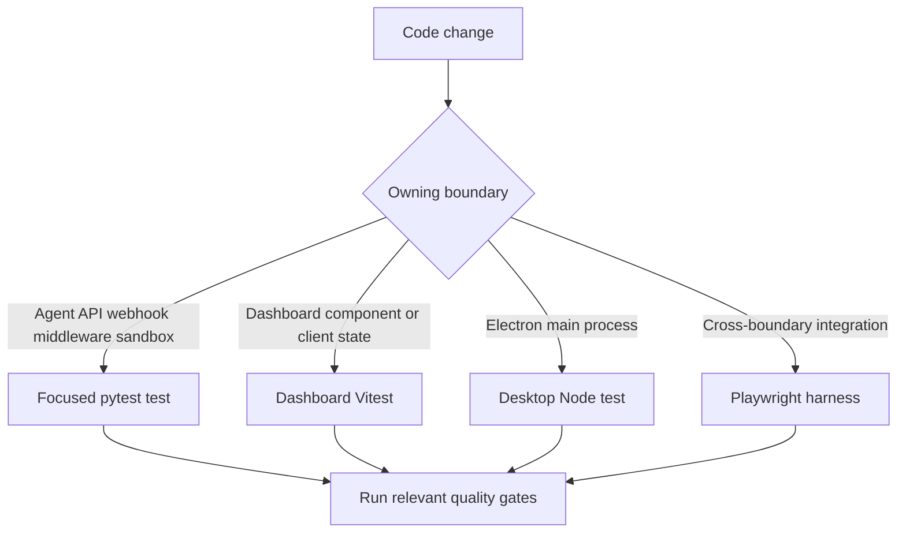
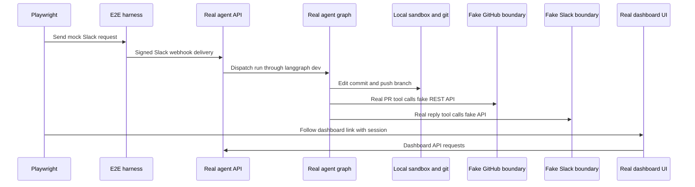

# Testing Guide

Choose the lowest-cost test layer that owns the changed contract. Put agent, API, webhook, middleware, and sandbox behavior in focused Python tests; dashboard client behavior in Vitest; and Electron main-process behavior in desktop Node tests. Use Playwright when the contract crosses a real webhook, authenticated dashboard, local git/sandbox, or Electron boundary—not as a substitute for the focused test.

## Test routing



This routes a change to the test layer that directly owns its observable behavior.

### Python contracts and isolation

Pytest collects from `tests/` and uses asyncio auto mode, so async tests and fixtures need no per-test asyncio marker. The suite is organized by production owner: agent behavior in `tests/agent/`, dashboard/auth in `tests/dashboard/` and `tests/auth/`, GitHub in `tests/github/`, middleware in `tests/middleware/`, reviewer behavior in `tests/reviewer/`, sandboxes in `tests/sandbox/`, Slack in `tests/slack/`, tools in `tests/tools/`, and webhooks in `tests/webhooks/`. `tests/e2e/` is Playwright infrastructure, despite sitting below that directory.

Keep the common isolation fixtures unless a test is explicitly about a boundary they replace:

- `fake_store` routes `agent.store` through an in-memory `FakeStore`, while preserving the production serialization/deserialization round trip. Seed it when stored state is relevant.
- The autouse TTL-cache reset prevents cached team settings from leaking between test cases.
- The autouse auto-review stub treats every repository as enabled because the no-live-store test environment otherwise has an empty opt-in list. Override it for a test of the opt-in gate.

#### Focused examples worth preserving

`tests/dashboard/test_dashboard_thread_api.py` owns server-side dashboard-thread rules: model and image validation, request/profile/team model precedence, run metadata enrichment, summary visibility, Slack-to-web handoff, unavailable-sandbox and recovery-patch failures, and command validation. Pair a change there with Vitest only for client presentation or state behavior; add browser coverage when auth, SSR, or the dashboard/server wire is itself part of the contract.

`tests/sandbox/test_sandbox_state.py` protects the lazy sandbox proxy. It must remain `BaseSandbox`-compatible for capture offload, delegate to an offload-capable backend or safely execute normally, coalesce concurrent reconnects, survive cancellation of a waiter, retry failed startup, and recover a sandbox ID from live thread metadata.

## Commands and quality gates

```bash
make install
make test
make test TEST_FILE=tests/dashboard/test_dashboard_thread_api.py
uv run pytest -vvv tests/dashboard/test_dashboard_thread_api.py::test_name
make lint
make typecheck
```

`make install` runs `uv sync --extra dev`. `make test` (also `make tests`) runs `uv run pytest -vvv $(TEST_FILE)` with `TEST_FILE` defaulting to `tests/`; a missing target prints a skip message rather than failing. Linting, formatting, and typing are separate checks: `make lint` runs Ruff checking plus a format diff, `make format` fixes both, and `make typecheck` runs basedpyright over `agent` and `tests`.

For workspace packages:

```bash
pnpm install --frozen-lockfile
pnpm --filter open-swe-dashboard run test
pnpm --dir desktop run test
pnpm test
```

The dashboard command is `vitest run`. Desktop builds its main bundle and then runs `node --test test/*.test.cjs`; root `pnpm test` delegates workspace test tasks to Turbo.

## Playwright harness

```bash
pnpm install --frozen-lockfile
pnpm run test:e2e:install
pnpm run test:e2e
pnpm run test:e2e:desktop
```

Install Chromium before the first run. The browser configuration runs one worker, excludes `desktop.spec.ts`, uses a 90-second test timeout, and starts `langgraph dev` with `tests/e2e/langgraph.e2e.json`. The desktop configuration selects only `desktop.spec.ts`, uses a 180-second test timeout and 120-second expectation timeout, and has a separate output/report directory.



The diagram shows the browser harness's production paths and its controlled external seams.

### What is real and what is faked

The harness mounts fake GitHub and Slack HTTP endpoints, mock UIs, and test control endpoints over the real agent API; it signs Slack event deliveries before posting them to the real webhook route. The fake stores are the shared source of truth for both the real tools and mock UI assertions. Git is real: each run operates against seeded local bare remotes, and PR file lists are calculated from the pushed branches.

Only the model and external SaaS/credential boundaries are replaced. `fake_llm.py` is a scripted `BaseChatModel` that drives the real deepagents loop and reads the generated PR URL before issuing the reply. The real agent graph, prompts, middleware, tools, local sandbox, and webhook code run unchanged. This makes the basic Slack scenario prove: a mention triggers an implementation in a temporary local sandbox, a branch is pushed, a PR is created, and its link returns to the same Slack thread. The same spec also covers an unmentioned DM request and breakout creation of a separate top-level Open SWE thread.

Browser coverage extends well beyond that happy path. It exercises Slack-to-web continuation and queued-message handoff, plan review and approval through to a PR, authorization and selection of environments, Slack redelivery deduplication and busy-thread follow-up queueing, authenticated and unauthenticated SSR, PR presentation and health actions, and agent thread tools reflected in the real threads UI. Keep an e2e scenario focused on an integration invariant and leave detailed policy/validation coverage to the subsystem tests.

### Real dashboard server and sessions

The dashboard is not a mock. Global setup builds `ui/` with `VITE_DASHBOARD_API_BASE_URL` and `DASHBOARD_API_URL` aimed at the harness, starts its Nitro server on `E2E_UI_PORT` (default `3100`), and waits for `/login`; the harness proxies page requests to that server. A signed `osw_session` minted at `/control/login` therefore exercises real server rendering, the session gate and redirect, hydration, and same-origin `/dashboard/api/*` calls. Set `E2E_FORCE_UI_BUILD=1` after a dashboard or port change; the normal setup reuses an existing build.

### Desktop scenario

The Electron spec resets the shared harness, clones the seeded bare remote into an isolated temporary project, and starts the real Electron executable in development mode. It isolates HOME, platform app-data/config paths, git configuration, Python path, and uv cache; it obtains a harness session and injects an HTTP-only `osw_session` cookie. The test then selects the local project, sends a local-agent request, verifies local navigation and completion, confirms the edited `greet.py`, and checks the fake-GitHub PR title, head/base branches, draft flag, and changed file. Temporary state is removed unless `E2E_KEEP_TMP` is set.

## Diagnostics and operations

Browser traces and videos are retained on failure locally and on the first retry in CI; screenshots are failure-only. Set `E2E_ARTIFACTS=1` to capture trace and video for every attempt. Artifacts are under `test-results/<test>/` and `playwright-report/`. The desktop config disables Playwright's automatic artifacts, but its spec explicitly records an Electron trace and attaches screenshots of the unified and completed local-agent views.

```bash
pnpm exec playwright show-report
pnpm exec playwright show-trace test-results/<test>/trace.zip
SLOW_MO=700 pnpm exec playwright test --headed
pnpm exec playwright test tests/full_flow.spec.ts
```

Prefer a warm server and a single spec while iterating. Inspect the trace, screenshot, and fake-boundary state before raising timeouts or weakening an assertion.

## Related pages

- [Agent graph](/openwiki/architecture/agent-graph.md)
- [Middleware stack](/openwiki/architecture/middleware-stack.md)
- [Sandbox lifecycle](/openwiki/architecture/sandbox-lifecycle.md)
- [Dashboard UI](/openwiki/integrations/dashboard-ui.md)
- [Invocation workflow](/openwiki/workflows/invocation.md)
- [PR creation](/openwiki/workflows/pr-creation.md)
