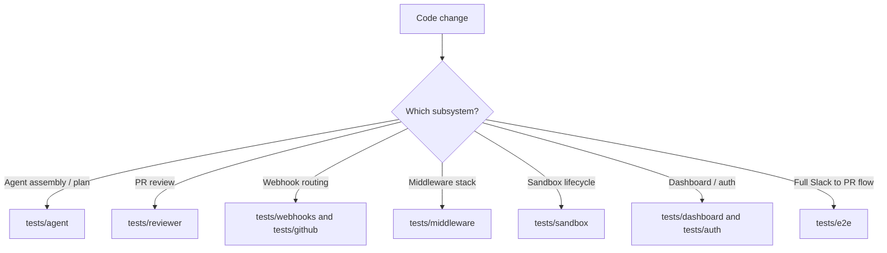
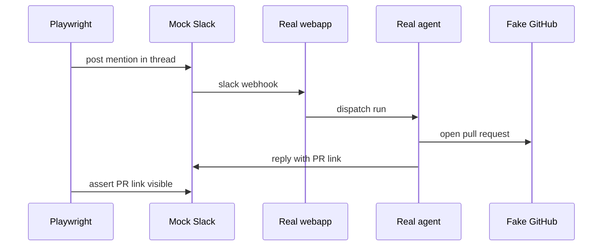

# Testing Guide

Open SWE ships two independent test layers: a Python **unit** suite driven by
`pytest`, and a browser/Electron **end-to-end** suite driven by Playwright. The
unit suite is the default gate for almost every change; the e2e suite drives the
whole Slack → implement → PR → reply happy path through mock external boundaries.
This page maps the suites to the parts of the system they exercise, states the
conventions that keep them fast and honest, and lists the exact run commands.

## pytest setup

Pytest configuration lives in `pyproject.toml` under `[tool.pytest.ini_options]`.
Two settings define the whole unit-test experience:

- `asyncio_mode = "auto"` — the app runs exclusively async, so async test
  functions and async fixtures are awaited without any per-test `@pytest.mark.asyncio`
  decorator. Just write `async def test_...`.
- `testpaths = ["tests"]` — collection is rooted at `tests/`, so a bare
  `uv run pytest` discovers the entire unit suite there.

Test dependencies (`pytest`, `pytest-asyncio`, `ruff`, `basedpyright`, `Pygments`)
are installed via the `dev` optional-dependency group. `make install` runs
`uv sync --extra dev` to provision them.

`tests/conftest.py` provides the shared fixtures every suite relies on. The most
important are `fake_store` (an in-memory stand-in for the LangGraph Store that
round-trips values through the real `agent.store` code path) and two autouse
fixtures: `_reset_ttl_cache` clears the process-global TTL cache so team settings
never leak between tests, and `_default_enable_auto_review` treats automatic PR
review as enabled for every repo (because the dashboard opt-in list is empty
without a live Store). Tests targeting the auto-review gate override the latter
with a stricter stub.

## Test directory map

Find the right suite by the subsystem you are changing. Each subdirectory under
`tests/` groups tests by the component they exercise:

| Directory | Exercises |
|---|---|
| `tests/agent/` | Main agent assembly, dispatch, plan mode/review, schedules, baby-sit, usage, skills, `AGENTS.md` handling |
| `tests/reviewer/` | Reviewer graph: findings lifecycle, publish, reconcile, diff, watches, auto-review, review chat |
| `tests/analyzer/` | Review-style analyzer (per-repo style learning) and its nightly cron |
| `tests/auth/` | GitHub/OpenAI/Notion/Slack OAuth, token TTL/refresh, encryption at rest, authorship |
| `tests/dashboard/` | FastAPI dashboard: OAuth redirect/CSRF, repos, reviews, thread API, environments, team settings |
| `tests/github/` | GitHub webhooks, PR creation, checks/CI, proxy refresh, comment prompts, repo extraction |
| `tests/middleware/` | Middleware stack: message queue, model timeout/fallback, tool sanitation, orphaned tool-call repair, tool ordering |
| `tests/models/` | Model + subagent selection, fallback resolution, per-request timeout, OpenAI OAuth |
| `tests/sandbox/` | Sandbox lifecycle, recovery, recreation, reset, proxy auth, provider integrations, git identity |
| `tests/slack/` | Slack tools, context, code channels, event dedupe, interactivity, webhook errors |
| `tests/tools/` | Curated agent tools: HTTP security, threads, schedules, MCP, browser, observability |
| `tests/utils/` | Small utility helpers: URL safety, thread participants, HTML artifacts, startup trace |
| `tests/webhooks/` | Completion webhook, Linear webhook author/trace routing |
| `tests/e2e/` | Playwright browser + Electron end-to-end flows (see below) |

A handful of top-level files (`tests/test_thread_title.py`,
`tests/test_tool_output_offloading.py`, `tests/test_openai_responses_replay.py`)
cover cross-cutting behaviors that do not belong to a single subsystem.



Route a change to the narrowest suite that covers the changed subsystem.

## Running unit tests

All commands come from `AGENTS.md` and the `Makefile`. Tests run under `uv`:

```bash
make test               # uv run pytest -vvv tests/
make test TEST_FILE=tests/github/test_open_pull_request.py    # single test file
uv run pytest -vvv tests/github/test_open_pull_request.py::test_name  # single test
```

`make test` (and its alias `make tests`) reads the `TEST_FILE` variable, which
defaults to `tests/`; it runs `uv run pytest -vvv $(TEST_FILE)` only when the path
exists and otherwise prints a skip message rather than failing. Prefer the
narrowest quiet validation that proves the changed behavior — a single test or
file over the whole suite — while preserving the complete failure output when
something breaks.

Lint and type checks are separate gates: `make lint` runs `ruff check` plus a
`ruff format --diff`, `make format` fixes in place, and `make typecheck` runs
`basedpyright` over `agent/` and `tests/`.

## Running e2e tests

The Playwright suite lives in `tests/e2e/` and is orchestrated from the root
`package.json` via pnpm. It drives the **whole happy path** — a user asks Open SWE
to implement something in a mock Slack thread, the **real agent** runs via
`langgraph dev`, implements the change in a local temp-dir sandbox, pushes a
branch, opens a PR against a fake GitHub, and posts the PR link back to the same
Slack thread.

```bash
pnpm install --frozen-lockfile
pnpm run test:e2e:install    # playwright install --with-deps chromium
pnpm run test:e2e            # browser suite
pnpm run test:e2e:desktop    # Electron + pinned uv dcode ACP flow
```

`test:e2e:install` must run before the first e2e run — it invokes
`playwright install --with-deps chromium` to download the browser. `test:e2e`
and `test:e2e:desktop` delegate to the `open-swe-e2e` package's own `playwright`
scripts.

Only the **LLM** and the **external SaaS HTTP boundaries** are faked; all agent
code runs for real. `fake_llm.py` is a scripted `BaseChatModel` emitting a fixed
tool sequence, `patches.py` monkeypatches the boundaries (LLM, GitHub/Slack URLs,
token mint), and `fakes.py` holds in-memory PR/Slack stores plus git seeding of a
local bare remote. The fake GitHub/Slack stores are the single source of truth the
mock UIs render, so Playwright asserts on exactly what the real agent produced.
The dashboard is **not** mocked — the harness serves the real built `ui/` app so
that server rendering, the session gate, and `/dashboard/api/*` calls are
exercised for real.



The e2e happy path: a mock Slack mention drives the real agent to open a PR on fake GitHub and reply.

Browser runs record a trace and video (and a screenshot on failure) under
`test-results/` and `playwright-report/`; replay them with
`pnpm exec playwright show-report` or `show-trace`.

## Conventions

- **Unit-only by default.** The `tests/` tree is unit tests. Integration tests
  would live under `tests/integration_tests/`, which is currently empty/absent —
  `make integration_tests` no-ops with a skip message when the path is missing,
  so it is safe to run in the default checkout.
- **Prompt tests must verify behavior, not text.** Do not add tests that only
  assert or restate static prompt text. Prompt tests must verify rendering,
  composition, precedence, or another meaningful behavioral contract — for
  example, `tests/github/test_github_comment_prompts.py` binds a capturing model
  and asserts what actually reaches the LLM rather than snapshotting the prompt
  string.
- **Async only.** Because `asyncio_mode = "auto"`, write async tests directly and
  target only the async code paths; the app never invokes sync counterparts.
- **Narrowest quiet validation.** Prove the changed behavior with the smallest
  target that covers it, and preserve complete failure output when a check fails.

## Related pages

The suites above are the behavioral contract for the architecture and workflows
documented elsewhere in this wiki: the middleware stack and agent factory
(`tests/middleware/`, `tests/agent/`), the sandbox lifecycle (`tests/sandbox/`),
the reviewer and analyzer graphs (`tests/reviewer/`, `tests/analyzer/`), and the
webhook routing that the e2e flow drives end to end (`tests/webhooks/`,
`tests/github/`, `tests/slack/`).
